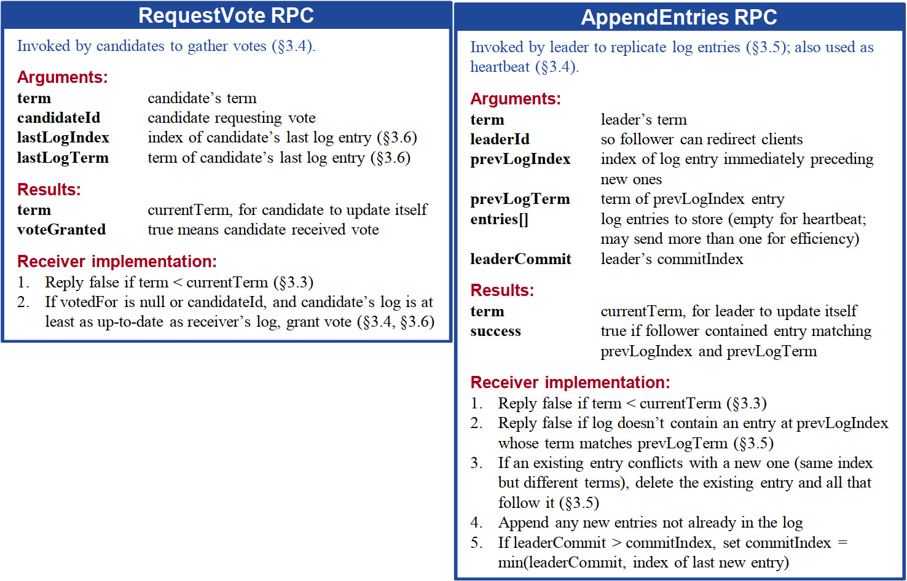
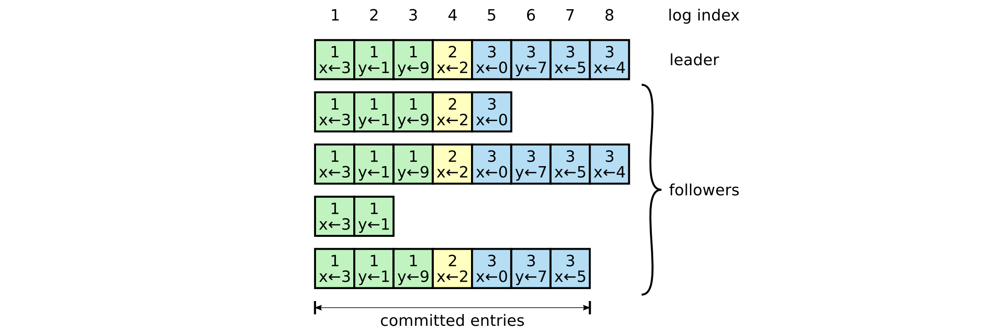
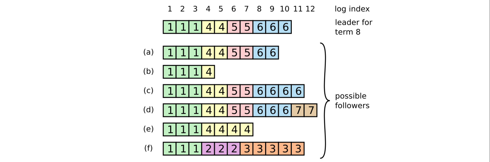
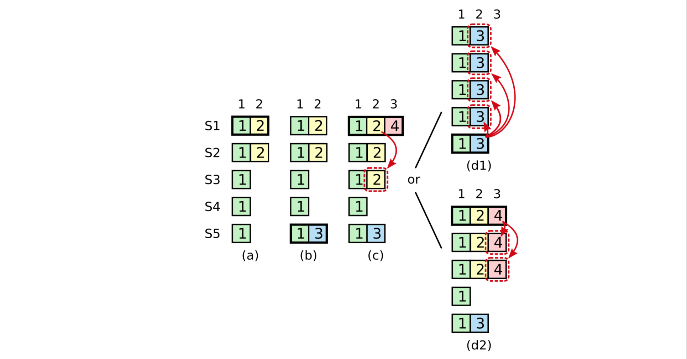
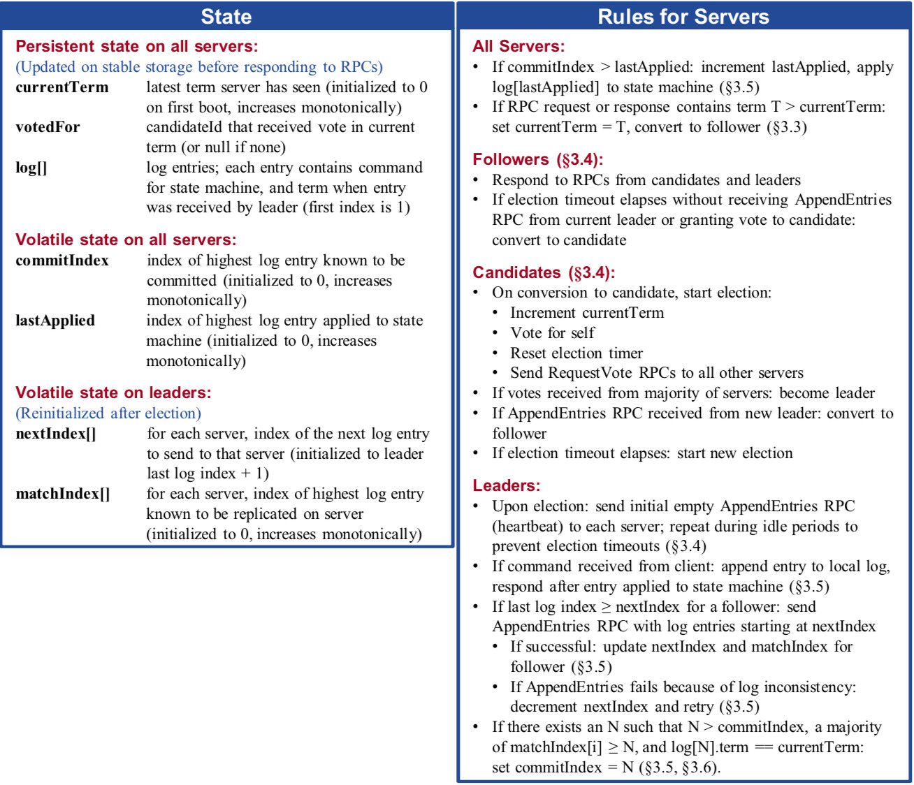
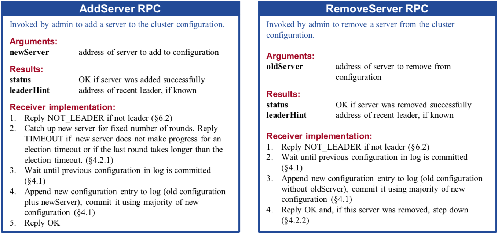
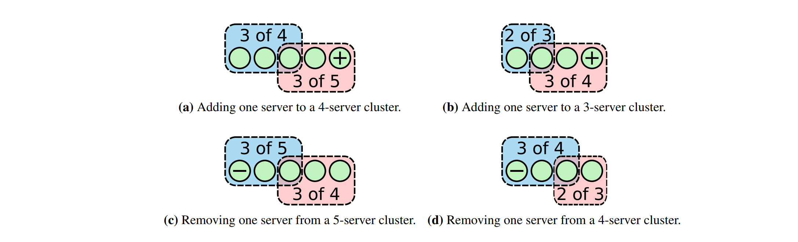
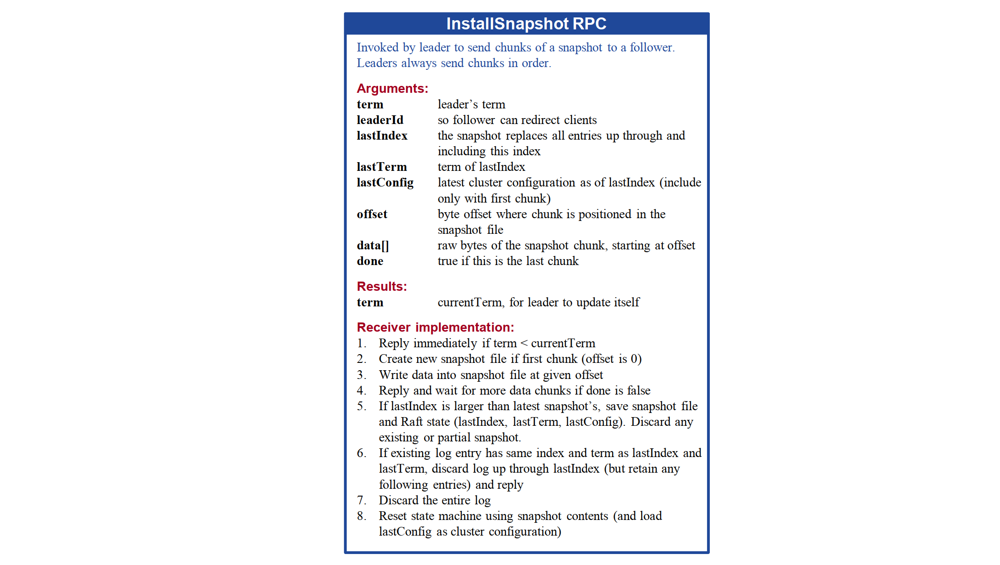
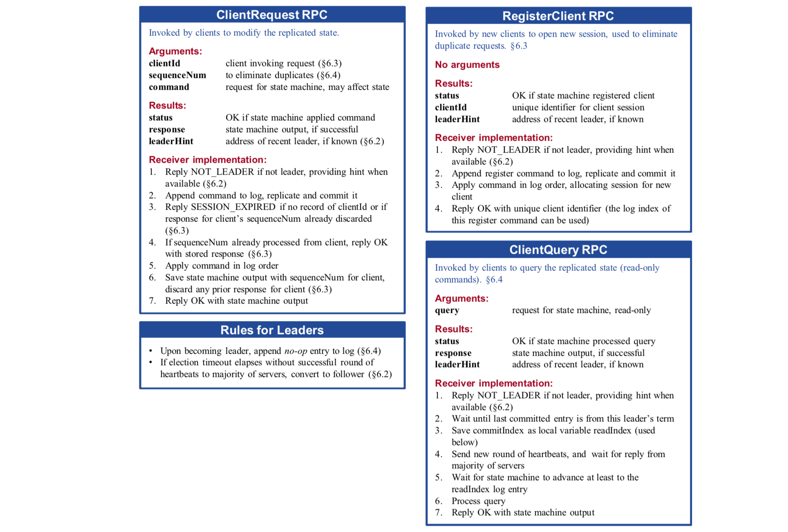

## -1.

**朴实无华，且枯燥。**

## 0.

拜读了 Diego Ongaro 的[博士论文](https://web.stanford.edu/~ouster/cgi-bin/papers/OngaroPhD.pdf)，顺便做个笔记。

## 1. 对 Paxos 的批判

#### Paxos  太难理解了

Paxos 的[论文](https://lamport.azurewebsites.net/pubs/lamport-paxos.pdf)重点描述是 single-decree 的算法，也就是确定一个 log entry 的共识算法，然后在此基础上构建 replicated state machine 使用的 Multi-Paxos 算法。single-decree 算法本身就很不直观难以理解，在此基础上构建 Multi-Paxos 又增加了复杂性。

实际上最终的问题是如何让 replicated state machine 的 log（一系列 entry）达成共识，对于这个**复杂问题**，Paxos 分解出的**小问题**是 single-decree，结果表明这个**抽象**很难理解，所以得寻找更好的抽象方式。

#### Paxos 难以实现

Lamport 重点描述的是 single-decree Paxos，对于更接近实际使用的 Multi-Paxos 算法只是轻描淡写提了几个方法，到目前为止存在许多不同的 Multi-Paxos 算法（很多人努力的结晶啊），但是没有一个是广泛接受的，所以没有一个好的算法让我们构建可用的系统。

这里的问题还是 single-decree，这个**问题分解**没有任何好处，还不如以 log 为中心设计算法；另外 Paxos 是以 peer-to-peer 的方式运行的，如果首先选出一个 leader，然后让 leader 协调共识过程，将会极大简化系统实现。

> 以上并不是说 Paxos 不对，而是 Lamport 选择了一种比较学术的方式（异步环境，peer-to-peer 方式运行），至于实现上的问题他不太关注。

## 2.  Raft 算法简述

针对 Paxos 的缺点，Raft 首要的目标是**可理解**。

为此 Raft 以 log 为中心将问题**分解**为：

1. **Leader 选举**: 当集群启动或者存在的 leader 故障是，必须选举出一个新的 leader。
2. **Log 复制**: leader 接收来自客户端的 log entries，并且复制到整个集群，使得其它实例的 log 与自己的一致。 
3. **安全性**:  Raft 的关键安全属性是 **State Machine Safety Property**：如果任一实例的状态机已经应用了某个 log entry，那么其它实例的 log 的相同位置应用的内容要一致。

总的来说 Raft 要保证下述属性：

1. **Election Safety**
    At most one leader can be elected in a given term. 
2. **Leader Append-Only**
    A leader never overwrites or deletes entries in its log; it only appends new entries. 
3. **Log Matching**
    If two logs contain an entry with the same index and term, then the logs are identical in all entries up through the given index.
4. **Leader Completeness**
    If a log entry is committed in a given term, then that entry will be present in the logs of the leaders for all higher-numbered terms.
5. **State Machine Safety**
    If a server has applied a log entry at a given index to its state machine, no other server will ever apply a different log entry for the same index.

#### 2.1. 概述

Raft 集群中的实例有 **Leader**、**Follower** 和 **Candidate** 三种状态，状态之间的转换如下图所示。

正常情况下集群中有且仅有一个 Leader，其它的实例都是 Followers，Follower 会将客户端的请求转发给 Leader 处理，本身不处理任何请求。如果 Follower 收不到 Leader 的消息，那么转为 Candidate 状态触发一轮选举，如果收到集群中大多数实例的投票那么转为 Leader 状态。

另外 Raft 将时间分割为一系列 **terms**，每个 **term** 以一轮选举开始，如果选举成功那么该 Leader 在该 term 时间内管理整个集群。

> term 在系统中的作用就是 Lamport 提出的 logical clock

集群中主要有两种 RPC：1. Candidate 发起的 **RequestVote**；2. Leader 发起的 **AppendEntries**。

Raft 假设 RPC 请求和响应可能在网络中丢包，发送方负责超时重试；另外 RPC 是并行的，网络并不能保证消息顺序。

#### 2.2 Leader 选举

首先是如何选举 Leader 这个子问题。

Raft 使用**心跳机制**触发 Leader 选举。集群中的实例启动后处于 Follower 状态。Follower 只要收到 Leader 或 Candidate 有效的 RPC 那么就保持 Follower 状态。Leader 周期性发送心跳消息（也就是没有数据的 AppendEntries）给所有的 Followers，用以维护自己的 Leader 状态。如果 Follower 超过 **election timeout** 周期没有收到消息，那么就假设 Leader 出问题了，开始一轮选举。

**选举过程**

Follower 自增当前的 term，转为 Candidate 状态，向集群中其它实例发送 RequestVote RPC。

接下来 Candidate 会出现三种情况：

1. 收到集群中大多数实例相同 term 的投票，那么该 Candidate 称为 Leader。对于同一个 term，实例基于先来先服务的原则最多只向一个 Candidate 投票，**大多数原则**可以保证最多只有一个 Candidate 称为 Leader；（保证 **Election Safety Property**）
2. 收到另外一个 Leader 发来的 AppendEntries，如果消息中的 term 比 Candidate 自身的大，那么承认该 Leader 的身份，自己变为 Follower 状态，如果消息中的 term 比 Candidate 自身的小，那就直接拒绝这个消息；
3. 如果超出 election timeout 没有出现上述两种情况，那么就再自增 term，再发起一轮新的选举。

对于选举过程有一个**活锁**的问题，如果许多 Follower 同时超过 election timeout 进入 Candidate 状态，那么投票将会被分割，最糟糕的情况将会导致一直在投票无法选出 Leader，这里也采用**随机的 election timeout** 来解决活锁的问题。

> 你可能也发现了，Leader election 就是 single-decree Paxos。

#### 2.3. Log 复制

选出 Leader 之后就可以接收处理客户端的请求了，Leader 收到命令之后首先追加到自己的 log 中，然后向其它实例发送 AppendEntries 复制该命令，当该命令被**安全的复制**了之后，Leader 通过自己的状态机执行该命令并且将结果返回给客户端。对于某些故障或者比较慢的 Follower，Leader 负责持续重传命令，使得所有的 Follower 的 log 最终会与 Leader 一致。

何为**安全的复制（safely replicated）**了呢？就像上图中的 index 7 就是安全的复制了，也就是大部分实例收到了命令。这样的 log entry 就被称为 **committed**，最终所有实例的 state machine 都会执行 committed 的命令。Leader 将会维护 **committed index**，并且通过 AppendEntries 传递给 Followers，Follower 收到 committed index 之后将会在 state machine 中执行。

对 log 来说要维护 **Log Matching Property**，该属性可以细分为两条：

* 如果不同 log 中的两个 entry 拥有相同的 index 和 term，那么这两个 entry 存储着相同的命令。
* 如果不同 log 中的两个 entry 拥有相同的 index 和 term，那该 entry 之前的部分 log 是一致的。

由于 Leader 在给定的 term 和 index 只能创建一个 entry，并且 entries 不能改变其在 log 中的位置，所以前一个属性是满足的。后一个属性通过 AppendEntries 执行的**一致性检查**来保证，在 AppendEntries 请求中包含新 entry 前一个的 index 和 term，如果 Follower 没有找到该 index 和 term 的 entry，那么拒绝接收这个新的 entry。

一致性检查充当 **induction step**：log 初始化为空的状态满足 Log Matching Property，当 log 扩展的时候，一致性检查保证 Log Matching Property，那么当 AppendEntries 返回成功时，Leader 可以确定 Follower 包含该 entry 之前的 log 与自己的一致。

正常情况下，Leader 与 Followers 的 log 将会保持一致，但是在 Leader 和 Followers 故障的时候，将会出现不一致的情况，比如下面的例子：

最上面新的 Leader 选出后，Followers 的状态可能是下面各种情况：a-b是没跟上之前 Leader 的 log；c-f 是有一些 uncommitted 的 log。以 f 为例，f 实例可能是在 term 2 是 Leader，收到了许多请求，追加到了 log，但是在 commit 之前故障了，然后又迅速恢复了成为 term 3 的 Leader，又追加了一些 log，然后又故障了，这次故障持续了很多个 term，等恢复后就是现在这个情况了。

对于这些复杂的情况，当前的 Leader 负责让所有的 Follower 与自己的 log 保持一致，Follower 与 Leader 不一致的 log 将会被 Leader 发过来的 entries 覆写。（下一节将会对 Leader 选举增加限制，以维护其他属性的安全）

Leader 要使得 Follower 与自己的 log 一致，首先得找到双方 log 达成一致的最后一个 entry，使得 Follower 删除该 entry 之后的 log，Leader 向 Follower 发送该 entry 之后的 log，使得 Follower 与自己的 log 一致。Leader 为每个 Follower 维护 **nextIndex** 信息，刚成为 Leader 时 nextIndex 都初始化为自身 log 的下一个，Leader 向 Follower 发送 AppendEntries RPC，如果通不过**一致性检查**，Follower 返回失败，那么 Leader 就递减 nextIndex 并且重新发送 AppendEntries 直到 Follower 返回成功，Leader 再将后续的 entry 同步给 Follower 使得 log 一致。

重试太多次 AppendEntries 会影响性能，这里可以优化一下。当 Follower 拒绝 AppendEntries 请求时，可以附加上冲突 entry 的 term 信息，以及该 term 第一个 index，通过这些信息 Leader 可以直接忽略该 term 所有冲突的 entries。或者 Leader 可以通过二分查找的方式寻找 Follower 与自身不同的的第一个 entry。

通过 AppendEntries 一致性检查机制，Leader 不需要覆写或删除自己 log 的 entries 就可以使集群中所有 logs 自动地收敛。（维护了 **Leader Append-Only Property**）

#### 2.4. Safety

为了维护 **Leader Completeness Property**，Raft 在投票过程中加了一个限制，使得没有完整 committed log 的 Candidate 不能成为 Leader。

当 Candidate 向其它实例发送 RequestVote 时会带上自身最后一个 log entry 的 term 和 index 信息，实例收到 RequestVote 后会与自己的最后一个 log entry 比较，如果 term 比 Candidate 的大那么拒绝投票请求，如果 term 相同但是 index 大那么也拒绝投票请求。

再考虑一个异常情况，如果某个 Leader 在将 entry 同步给大多数实例之后，但是在 committed 之前故障了，那么之后选出的 Leader 有可能又把这个 entry 覆盖了，以下图为例：

在 (a) S1 是 Leader，并且把  log index 2 同步给了 S2，然后在 (b) S1故障了，S5 被选为 Leader，并且收到了请求追加到了 log index 2，然后在 (c) S5 又故障了，S1 被选为 Leader，继续复制日志，此时 term 2 index 2 已经被复制到大多数，如果在 committed 之前 S1 又故障了，那么会出现 (d1) 的情况，如果 S1 正常工作那么会出现 (d2) 的情况。

现在的问题就是 Leader 无法判断以前 term 的 log entry 是否已经 committed 了，为了解决这个问题，Raft 限制不会通过计算副本的数量来 commit 之前 term 的命令，**只有 Leader 当前 term 的命令才会通过确认的实例数判定是否 committed**。一旦当前 term 的 entry committed，根据 Log Matching Property 那么前面的 entry 也被一致的 committed 了。

**Safety argument**

下面用反证法证明 **Leader Completeness Property**，假设 term T 的 Leader （leaderT）在该 term commit 了一个 log entry，但是该 log entry 没有存储在接下来 term 的 Leader 中，标记最小的 term U > T，此时 Leader 为 leaderU。

1. 由于 Leader 不会删除或覆写 log，所以在 leaderU 选举时就缺失了那个 committed log entry。
2. leaderT 将 committed log entry 复制到了集群中大多数实例，而 leaderU 也是收到大多数投票才被选举的，所以集群中至少有一个实例既接收了 leaderT 的 log entry，又为 leaderU 投票，我们称这个实例为 **voter**。
3. voter 在向 leaderU 投票前肯定接收了来自 leaderT 的 committed entry；否则 voter 会拒绝来自 leaderT 的 AppendEntries 请求（它的 term 大于 T）。
4. voter 向 leaderU 投票的时候应该仍然存储着上面的 committed entry，因为中间的 leader 都包含这个 entry，Leader 不会移除 entries，Followers 仅仅移除与 Leader 冲突的 entries。
5. voter 向 leaderU 投了票，那么 leaderU 的 log 至少跟 voter 的一样新。这就导致了矛盾。
6. 首先，如果 voter 与 leaderU 最后的 log term 相同，那么 leaderU 的 log 至少跟 voter 的一样长，所以 leaderU 的 log 应该包含 voter 所有的 entry，这就跟假设矛盾了。
7. 否则，leaderU 最后的 log term 比 voter 的大，创建 leaderU 最后的 log entry 的 Leader 肯定包含了 committed entry，根据 Log Matching Property，那么 leaderU 的 log 肯定也包含了 committed entry，这也是矛盾的。
8. 与假设矛盾，因此所有 term 大于 T 的 leader 包含 term T 时 committed 的所有 entries。
9. Log Matching Property 保证未来的 Leader 也会包含间接 committed 的 entries。

给定了 Leader Completeness Property，自然也就保证了 **State Machine Safety Property**，集群中所有实例将会以相同的顺序执行相同的 log entries。

#### 2.5. 需要持久化的状态

接下来总结一下需要持久化的状态。

**持久化 currentTerm 和 votedFor**
防止在同一个 term 投两次票；防止接收免职 leader 的数据。

**持久化收到的 log entries**
防止 committed entries 丢失。

其它都不需要持久化，甚至是 commitIndex，考虑最极端的情况所有实例都故障重启了，commitIndex 都初始化为 0，一旦 Leader 被选出来，commit 一个新的 entry，那么 commitIndex 就恢复了，并且能快速传播给所有 Followers。

state machine 可以持久化也可以不持久化，如果不持久化，结合 snapshot 在重启后并不需要重放所有日志。

如果某个实例丢失了持久化的状态，那么就不能用之前的身份加入集群了，不过它可以换个身份通过 cluster membership change 加入集群。如果集群中的大多数实例都丢失了持久化状态，那就会丢数据了，需要人工介入。

#### 2.6. Timing 与可用性

Raft 的 safety 不依赖 timing，但是对于客户端来说的可用性不可避免的依赖 timing。如果消息交互的时间比实例故障的间隔时间还长，那么 Candidate 基本上无法成功赢得一次选举，没有 Leader，Raft 就无法工作。

所以为了可用性，系统需要满足下述 timing 需求，这样才能选出 Leader，并且维持稳定的状态。

**broadcastTime << electionTimeout << MTBF**

广播消息的时间需要比选举超时小一个数量级，通常来说 0.5–20 ms；选举超时也需要比平均故障间隔时间小好几个数量级，通常来说 10–500 ms；而 MTBF 正常情况应该是几个月往上。

#### 2.7 扩展 leadership 转移特性

这部分扩展一下算法，使得现有的 Leader 可以主动将 leadership 转交给另外一个实例。

1. 当前的 Leader 停止接收新的客户端请求。
2. 当前的 Leader 将自己所有的 log 全部同步给目标实例，使得数据一致。
3. 当前的 Leader 向目标实例发送 **TimeoutNow** 请求。这个请求的作用与 election timeout 一样，触发目标实例开始一轮选举。

当前的 Leader 收到更高 term 的请求，就会转入 Follower 状态，目标实例完成选举后就称为了新的 Leader。

当然目标实例不一定选举成功，如果超出 election timeout 没有成功，那么之前的 Leader 继续接收处理客户端的请求；如果目标实例已经成为 Leader，但是之前的 Leader 没有感知到，那么最糟糕的情况也就是再选举一次。

## 3. 集群成员变更

上面的算法描述是基于固定集群配置的，本章将会加入动态添加移除实例的逻辑。

#### 3.1. Safety

在动态改变过程中不能违反 Election Safety Property，为了简化算法设计，在此限制每次只能添加或移除一个实例。

为什么要这样限制呢？首先考虑一下添加或移除实例，不可能同时让所有实例都改变配置，所以会造成两个配置共存的阶段，如果两个配置的集群的大多数没有交集，那么处理起来会异常复杂，所以加这样的限制，目的是让新旧两个集群的大多数有交集。如果下图所示：

集群配置也存储在 log 中，实例之间也是通过 log 复制同步配置信息，集群在添加或移除实例期间可以继续响应客户端的请求。将集群当前的配置称为 Cold，Leader 收到 AppendServer 或 RemoveServer 请求后新的配置为 Cnew，Leader 将该配置做为一个 entry 追加到 log 上，只要实例的 log 中追加了 Cnew，那么就使用新的配置，不需要等到 committed。

当 Cnew committed 之后配置更新就完成了。在此时 Leader 可以确定 Cnew 实例中的大多数已经采用了新的配置，没有采用 Cnew 配置的实例是少数，没有采用 Cnew 配置的实例不可能被选为 Leader。

在此之后：

1. Leader 可以响应配置更新成功了。
2. 如果更新的配置是移除一个实例，那么可以关闭该实例了。
3. 可以开始处理下一个配置更新请求了。

#### 3.2. Availability

这一节分析集群配置期间的可用性问题。

**赶上新实例**

对于新加入的实例 log 是空的，即便集群中实例数量增加了，但是集群的容错能力并没有增加，如果旧实例故障，新实例还在同步旧数据，那么集群照样不可用。

为了解决这个问题，**Raft 在配置更新之前多加了一个阶段，新实例做为 non-voting 成员加入集群，Leader 向新实例同步数据，但是不作为投票和提交的成员。**等同步完成，再执行上一节的配置更新逻辑。

这里还有个问题，Leader 应该首先判断新加的实例是否不可用，是否太慢以至于跟不上新的 log，如果把这种实例加进来，集群早晚不可用。

通常可以这样判断新加的实例是否有效，

将 log 同步分为很多轮，每一轮同步 Leader 当前位置之前的数据，这样执行固定的轮数（通常是 10 轮），如果最后一轮的同步时间小于 election timeout，那就走配置更新流程加入集群，否则直接拒绝该实例加入。

当新实例刚开始同步时 log 是空的，上一章提到的 AppendEntries 过程中一致性检查的逻辑在这种情况下会很低效，最简单的解决方法是让 Follower 在响应中增加自身 log 长度信息，Leader 根据此信息设置 nextIndex。

**移除当前的 Leader**

如果要移除当前的 Leader，可以首先将 leadership 转移给其它实例，然后再进行配置更新。

当然也可以不转移 leadership，当 Cnew committed 之后 Leader 才能下掉，此后 Cnew 中的某个实例  timeout 赢得选举成为新 Leader，对集群可用性的影响也是可以接受的。

这个方法可行，但是有两个比较奇怪的点：
1. 在 committing Cnew 期间，Leader 需要管理一个自己不在其中的集群；
2. 即使自己不属于 Cnew 也需要发起选举，直到 Cnew 被 committed。

**制造混乱的实例**

对于移除实例还有个异常情况，移除的实例由于收不到心跳，在超时之后就会开始一轮选举，进一步就收不到 Cnew entry，无法得知自己已经被移除了。待移除实例发送的 RequestVote 会导致 Leader 变为 Follower，虽然新的 Leader 最终会从 Cnew 中选出，但是待移除实例可能还会继续超时选举，这样会对集群的可用性造成显著影响。

Leader 通过向 Follower 发心跳来维持自己的位置，所以可以在这里解决这个问题。如果实例在最小 election timeout 时间内收到了当前 Leader 的心跳，那么对于其他实例的 RequestVote 请求既不更新 term 也不投票，实例可以忽略请求，或者返回拒绝，或者延迟请求，效果都一样。

这个修改跟 leadership 转移相冲突，这个很容易解决，对于 Leader 转移的 RequestVote 请求增加一个特殊标记即可。

## 4. Log 压缩

随着集群的运行，log 会一直增长，在某个时刻机器的磁盘会被用完；即便在磁盘耗尽之前，随着 log 增加，实例恢复重放 log 的时间也会越来越长。总而言之，如果不想办法压缩 log，那么集群的可用性将会遭受严峻考验。

对 log 进行的压缩的方法很多，不同的系统有不同的需求，并没有一个统一的方案。可行的方案有：
1. **Memory-Based Snapshots** 可能是最普遍的方案了，ZooKeeper 和 Chubby 也是采用该方案
2. **Disk-Based Snapshots**
3. **Log-Structured Merge Trees**
4. **Log Cleaning**
5. **Very Small Leader-Based Snapshots**

#### 4.1. Snapshotting memory-based state machines

该方案的场景是 state machine 存储在内存中，每个实例独立确定做快照的 log 位置，只是限制 log 必须是 committed。

除了存储 state machine，还需要保存快照最后一个 entry 的 term 和 index，已经对应的集群配置信息，等这些都持久化完成就可以丢弃对应的 log 了。

对于比较慢的实例或新加入的实例，Leader 需要与之同步数据，上文中已经定义了基于 log 的同步逻辑，现在加上了快照所以需要增加一个同步快照的 RPC。

Leader 在发现自己没有 Follower 需要同步的原始日志后发起 InstallSnapshot，Follower 收到快照加载到 state machine 后即可丢弃自己的日志。由于重传或者其他原因，Follower 收到的快照如果是在自身日志之前的，那么丢弃快照位置之前的日志，之后日志还是有效的。

逻辑很清晰明了，下面讨论几个实现上的细节。

**并发快照**

对 state machine 做快照可能会占用很长时间，所以不能阻塞 Raft 流程，需要并行执行。

有两种实现方式：
1. 使用支持 copy-on-write 的 immutable (functional) data structures 构建 state machine。
2. 使用操作系统支持的 copy-on-write，在 linux 上也就是 fork。

**何时做快照**

何时做快照呢？一个简单的方法是设置一个阈值，当 log 大小超过阈值时做快照，这里的问题是如何设置阈值，无论大了小了都不合适。

更好的方法是比较快照和 log 的大小，如果快照比 log 小很多，那么此时做快照很合适。但是实时的计算快照的大小，对于 state machine 来说是很大的负担，所以退而求其次可以使用上一个快照的大小来估计，如果当前 log 大小超过前一个快照乘以 *expansion factor* 那就开始做新的快照。

*expansion factor* 即是对磁盘带宽和空间占用的权衡，例如因子为 4 时，表示 20% 的磁盘带宽用于做快照（写 1 字节快照，就会写 4 字节 log），同时需要大约单个快照 6 倍的磁盘空间。

#### 4.2 Snapshotting disk-based state machines

该方案的场景与上一个类似，只是 state machine 存储在磁盘中。

文件系统的快照可以依赖 LVM 或 Btrfs。

#### 4.3. Incremental cleaning approaches

增量压缩的方法相对于做快照更复杂，但是也有显著的优点。

1. 由于每次只操作部分数据，所以压缩的负载分摊的更均匀。
2. 对磁盘的写操作更有效率。
3. 传输快照更简单。

**log cleaning 基础**

log cleaning 是在  log-structured file systems 引入的，最近在 RAMCloud 中有所应用。

在 log cleaning 使用的场景中也是以 log 的形式维护系统状态，这是对顺序写的优化，对于随机读操作需要依赖索引结构。

log 被分割为连续的区域，称为 segment，压缩的算法分为三步：

1. 首先选择积攒了大量*过时的数据*的 segments；
2. 然后从这些选出的 segments 中复制*存活的数据*到 log 的头部；
3. 最后释放这些 segments 的空间。

压缩操作和正常操作是可以并行执行的。

由于数据的在压缩过程中改变了在 log 中的顺序，所以在重放日志时需要附加的信息实现正确的顺序。

选择待清理 segments 的策略对性能影响很大，不仅需要考虑 live entries 的空间占用，而且需要考虑这些 entries 还能 live 多久。

**log-structured merge trees 基础**

LSM trees 是由 O'Neil 提出的，通过 BigTable 被大家普遍认知，目前比较成熟的类库就是 LevelDB，以及其变种 RocksDB 和 HyperLevelDB。

LSM trees 是一个存储有序 key-value 对的树形数据结构。总的来说 LSM trees 使用磁盘的方式与  log cleaning  类似：以顺序的方式写日志，不修改磁盘中的数据，然而所有的状态并不都维护在 log 中，LSM  trees 以更适合随机访问的方式组织状态。

通常来说 LSM trees 将最近写入的 keys 存储在以小段日志中，当这段日志达到设置的阈值，LSM trees 将 key 排序后写到一个称为 *run* 的文件中。*runs* 不会被修改，但是有个压缩进程会周期性合并多个 *runs*，生成一个新的，然后把旧的释放。合并的过程让人联想到 merge sort；当某个 key 出现在多个 *runs* 中时，只有最新版本的数据会被保存，所以生成的 *run* 会更紧凑。

在正常操作时，state machine 可以直接操作数据。对于读某个 key，LSM tree 首先检查该 key 是否在最近的日志中，然后检查各个 *run*。为了避免每次都检查所有的 *run*，可以创建布隆过滤器。

**在 Raft 中使用 log cleaning and log-structured merge trees**

在 Raft 中使用 LSM trees 是很自然的。由于 Raft 日志已经持久化在硬盘了，所以 LSM tree 可以在内存中维护树形格式的数据，这对查找更有效率，当 Raft 日志达到一定量，内存中的树形数据就排好序持久化到磁盘，做为一个新的 *run*。从 Leader 向 Follower 同步数据需要发送所有的 *runs*（不包括内存中的树形数据），由于 *run* 是不可变的，所以不需要考虑传输过程中数据有变化。

#### 4.4. 另外一种基于 Leader 的方法

以上的方法与 Raft 的 strong leader 原则相违背，由 Leader 来协调 log 压缩也是可以的，只是性能会比较差。

对于很小的 state machine 也是可以基于 Leader 来做 log 压缩的，Leader 的操作如下：

1. 停止接收客户端请求；
2. 等到日志中的所有 entries 都 committed 了，并且 state machine 应用了所有 entries 后；
3. 同步做快照；
4. 将快照追加到 log 后，做为一个新的 entry；
5. 继续接收客户端新的请求。

快照在实例之间的同步跟 log 同步走一样的逻辑。

## 5. 客户端交互

这部分讲解客户端与基于 Raft 的 replicated state machine 之间的交互。 Raft 除了做为一个独立的服务，也可以直接集成到应用程序中。

#### 5.1. 集群发现

客户端如何获取集群成员列表？由于支持成员变更，所以不能是简单的静态配置文件。总的来说有两种方式：

1. 客户端通过网络广播或多播获取集群成员。
2. 客户端通过一个外部的服务（比如 DNS）获取集群成员。

#### 5.2. 路由请求至 Leader

当客户端启动后会随机选一个实例发送请求，该实例很可能不是 Leader，就会拒绝掉客户端的请求。对于该问题有两种处理方式：

1. 实例如果明确 Leader 是哪个实例，那么在拒绝请求时向客户端返回 Leader 地址，之后客户端可以直接与 leader 建立连接发送请求。
2. 实例做为客户端与 Leader 之间的代理，转发请求。

另外还需要阻止过时的 Leader 信息无限期地延迟客户端请求。

1. 某个实例处于 Leader 状态，但是它可能已经不是当前的 Leader 了，这将会不必要地延迟客户端请求。当出现网络分区的时候，现在的 Leader 与其它成员隔离了，其它成员已经选出新的 Leader 了，而这个隔离的 Leader 还认为自己是 Leader，所以当 Leader 在 election timeout 内没有收到大多数心跳响应的时候，应该主动让出 Leader 身份，这样客户端才能尝试向其它实例重试请求。
2. Follower 需要维护当前 Leader 的信息，当开始新的选举或者 term 改变时，需要丢弃旧的 Leader 信息。
3. 如果客户端与 Leader（或者任意实例）断开连接，那么客户端需要随机选择一个实例重试，不能重连之前的节点。

#### 5.3. 实现可串行化语义

以上描述的 Raft 为客户端提供 at-least-once 语义，replicated state machine 可能会多次处理同一个命令。举例来说，某个客户端向 Leader 发送一个请求，其中的命令被追加到 log 并且 committed 了，但是在向客户端响应的时候故障了，所以客户端没有收到确认就会向新的 Leader 重试请求，该命令再一次追到到了 log，虽然客户端期望命令只执行一次，但是实际上执行了两次。

这个问题对于有状态的分布式系统都存在，但是对于 Raft 这种基于共识的系统，需要处理掉这些重复的命令。Raft 的目标是实现可串行化语义，实例必须过滤掉重复的请求，每个客户端需要被授予一个唯一的标识符，客户端为每个命令分配唯一的序列号。实例为每个客户端维护一个 session，记录对应客户端的序列号，对于已经处理的命令直接返回。

由于资源是有限的，所以需要处理 session 过期的问题。

所有的实例必须对客户端 session 过期的时机达成一致。可以设置 session 的上限，然后以 LRU 策略移除；也可以基于达成一致的时机来过期 session。

如何处理已经过期 session 的客户端请求。实例需要能够分辨来自过期 session 客户端的新客户端，当客户端启动时会发送 RegisterClient PRC，注册 session 获取标识符，当实例收到的请求找不到对应的 session，那么向客户端返回错误。

#### 5.4. 更有效率的处理 read-only 查询

对于只读的请求，可以不进行 log 操作，只查询 state machine 即可，这可以用于改善系统性能。但是这也有读取到过期数据的风险，比如出现网络分区的情况，这就违反可串行化了。

要保持可串行化，需要 Leader 做下述操作：

1. 如果 Leader 当前 term 的还没有 entry committed，那么等到有 entry committed。Leader Completeness Property 保证 Leader 拥有所有 committed entries，但是当 term 刚开始的时候并不确定，所以在 Leader 开始新的 term 后 commit 一个空白的 no-op entry，当该 entry committed 了，那么 Leader 当前term 的日志索引至少比其他实例的大。
2. Leader 将当前的 commit 索引保存在局部变量 **readIndex** 中。这将做为查询操作的状态版本的下限。
3. Leader 需要确保自己没有被新的 Leader 取代。这可以通过一轮心跳来完成。如果收到大多数确认，那么 readIndex 曾经是集群中所有实例最大的 commit 索引。
4. Leader 等待 state machine 至少执行到 readIndex 位置；此时就满足可串行化了。
5. 最后 Leader 根据当前 state machine 的查询返回结果。

Follower 也可以分担部分负载，首先向 Leader 发送请求获取当前的 readIndex，Leader 执行上述 1-3 步，Follower 收到 readIndex 后执行 4-5 步。
