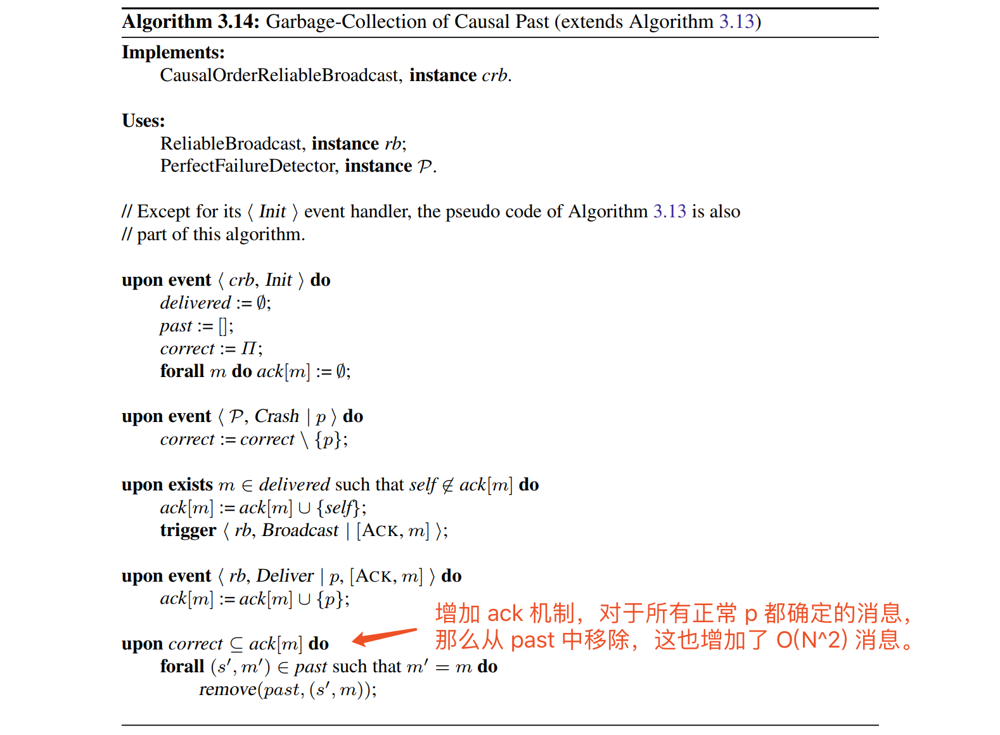
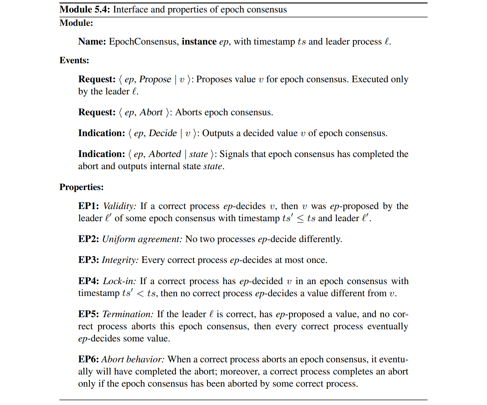
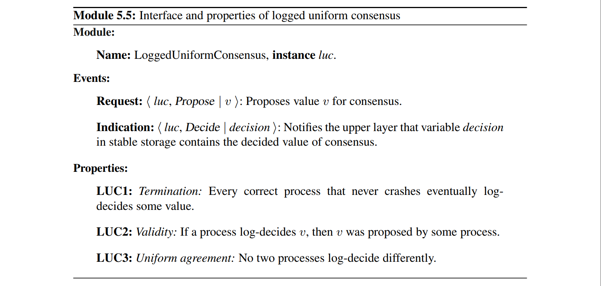

## -1.

**朴实无华，且枯燥。**

## 0.

感觉 [KTHx -  ID2203.1x](https://courses.edx.org/courses/course-v1:KTHx+ID2203.1x+2016T3/course/) 和 [KTHx - ID2203.2x](https://courses.edx.org/courses/course-v1:KTHx+ID2203.2x+2016T4/course/) Reliable Distributed Algorithms 的公开课蛮有意思，无奈实在受不了老师的口音，只是把教材[《Introduction to Reliable and Secure Distributed Programming》](https://www.distributedprogramming.net/)看了一遍，所以简单记个笔记。

>注意：这本书的核心内容，并不是教你实现分布式系统，而是抽象分布式系统，给你一套分析、构建分布式系统的方法。

## 1. 基本的抽象

分布式系统可以抽象为两部分：1. process：执行计算的模块；2. link：支持 process 之间通信的网络。

为了描述分布式算法，本书定义了一种 asynchronous event-based composition 模型，每个 process 运行一组软件组件，这里称之为 modules。

本地软件栈中的组件以 event 异步通信，保证 FIFO 顺序；不同 process 之间的组件也是以 event 通信，信道属性依赖 link 抽象。

组件之间传递的 event 分为两类：Request 和 Indication。

设计的分布式算法最终可以细化为一个个 module，每个 module 需要定义接收的 Request 事件和发出的 Indication 事件，声明需要满足的 Properties，这些属性分为两类：1. Safety 不能违反的属性；2. Liveness 最终会达成的属性。通俗来说也就是坏事不会发生，好事最终会发生。

比较复杂的分布式算法需要组合多个 module，你可能会说这样在性能上会有折扣，不如端到端整体设计算法，但是优秀的抽象可以帮助你分析问题，避免问题过于复杂带来的 bug。如果最终需要做性能优化，那么现有的抽象也有助于正确的优化逻辑。

#### 1.1. 对 Process 进行抽象

对 process 最重要的抽象是定义故障：

1. 对故障最严格的定义就是 *Crash*，process 停止工作，不再恢复。
2. 相对更一般的故障是 *Omission*，也就是丢消息。
3. 相对更一般的故障是 *Crash with Recovery*，也就是假设一个可靠存储，process crash 之后可以从可靠存储恢复状态。该故障更一般体现在：a. 通常来说 process 无法完整保存所有的状态；b. 当 process 恢复之后无法判断发送给上层 module 的事件是否已经处理了。
4. 相对更一般的故障是 *Eavesdropping*，这就进入不可信的环境了，消息有可能被窃取重放，通常来说可以用密码学解决这些问题。
5. 最一般的故障是 *Arbitrary*，故障的 process 会发送异常的消息，该故障也被称为 *Byzantine* 问题。

*由于笔者能力有限，对本书中基于Arbitrary故障的讲述基本忽略。*

#### 1.2. 对 Communication 进行抽象

上面提到本书用 link 抽象分布式系统中的通信组件，信道肯定会丢消息，所以首先定义一个最弱的 link 抽象 —— *FairLossPointToPointLinks*

也就是大家普遍认知的信道，相比 *FairLossPointToPointLinks* 更可靠的信道抽象为 *StubbornPointToPointLinks*，简单来说就是接收方会收到消息，但是收到消息的次数没有限制。

对于 crash-stop process 抽象，很容易基于 *FairLossPointToPointLinks* 设计实现 *StubbornPointToPointLinks* 的算法。

>这里有点儿绕，为什么设计 link 抽象的算法要假设 process 抽象？因为这部分算法是 process 执行的逻辑，所以本书中所有算法都得提前假设 process 抽象，有些 module 只是针对某种 process 抽象定义的，也有些 module 在某些 process 抽象下是无法实现的。

下面定义一个更理想化的抽象 *PerfectPointToPointLinks*

消息可以可靠的传输，并且不会重复，也不会无中生有。

*PerfectPointToPointLinks* 也是基于 crash-stop process 抽象定义的，下面再基于 crash-recovery process  抽象定义一个理想化的 link 抽象：*LoggedPerfectPointToPointLinks*

属性要求基本一样，我们把两个算法放在一起看，就能很直观的理解到：process 抽象假设不同，算法设计也会差别很大。

在本书中对于 crash-stop process 抽象默认假设 *PerfectPointToPointLinks*，对于 crash-recovery process 抽象默认假设 *LoggedPerfectPointToPointLinks*，当然有些算法会基于比较接近实际通信信道的 *FairLossPointToPointLinks* 设计，原因是上层也需要重传与去重的逻辑，所以不需要在下层重复实现。

#### 1.3. 对 Time 进行抽象

接下来还需要对 Time 进行抽象，假设 link 的通信延迟和 process 的处理速度，在本书中将 Time 抽象为 *failure-detector*。

基于时间假设可以将分布式分为三类：
1. Asynchronous System：异步系统对 process 和 link 不做任何时间假设，该系统使用 logical clock 测量时间。
    > 顺便提一下，经典的 [FLP Impossibility]([https://www.the-paper-trail.org/post/2008-08-13-a-brief-tour-of-flp-impossibility/](https://www.the-paper-trail.org/post/2008-08-13-a-brief-tour-of-flp-impossibility/)
) 定理就是基于异步系统假设得出的结论。
2. Synchronous System：同步系统明确给出 a. 处理延迟假设，b. 消息传输延迟上限，c. 本地物理时钟与 global real-time clock 偏差上限。
3. Partial System：通常来说分布式系统大部分时间是同步的，但是偶尔也会是异步的，这个接近现实的系统称为 *partially synchronous* 的。可以这样理解 partial synchrony：时间假设最终是可以满足的，但是无法确定确切的时间。

所以在  synchronous system 中，对于 crash-stop process 抽象，可以基于 *timeout* 精确检测故障，这可以抽象为 *PerfectFailureDetector*

在 partial system 中，属性限制需要放宽一些： *EventuallyPerfectFailureDetector*

再对比着看一下两者在 crash-stop process 抽象中的实现。

通常来说，在分布式系统中需要的不仅仅是识别出故障的 process，而是选出一个没有故障的 process，这个 process 可以做为 leader 协调整个系统。

在此同样定义 synchronous 和 partial system 两个版本。

基于对应的 *FailureDetector* 很容易实现 crash-stop process 抽象中的 *LeaderDetector*

对于 *EventualLeaderDetector*，也可以在  crash-recovery process 抽象中实现。

#### 1.4. Distributed-System Models

以上定义了三个基本抽象：1. process 抽象，2. link 抽象，3. failure-detector 抽象。组合这三个基本抽象定义分布式系统模型。

|系统模型|process抽象|link抽象|failure-detector抽象|
|-|-|-|-|
|fail-stop|crash-stop|PerfectPointToPointLinks|PerfectFailureDetector|
|fail-noisy|crash-stop|PerfectPointToPointLinks|EventuallyPerfectFailureDetector/EventualLeaderDetector|
|fail-silent|crash-stop|PerfectPointToPointLinks|X|
|fail-recovery|crash-recovery|StubbornPointToPointLinks|EventualLeaderDetector|
|fail-arbitrary|fail-arbitrary|AuthPerfectPointToPointLinks|X|

另外还有一个比较特别的系统模式——Randomized，该模型下的算法不需要确定性，只是实现某种概率抽象，这可以理解为确定性算法的补充。

设计容错算法有一个常用的工具—— *quorum*，指的是系统中 N 个 process 的大多数，也就是超过 N/2 个 process，如果故障的数量 f < N/2，那么至少有一个 quorum 里都是正常的 process。

对于 arbitrary-fault 进程抽象情况稍微复杂一点儿，可以容忍 f 个故障的 *Byzantine quorum* 需要超过 (N+f)/2，如何理解这个不等式呢？两个 Byzantine quorum 加起来得超过 N+f，其中重叠的数量才能大于 f 个，也就是会重叠一个正常的 process。另外需要正常的数量 N-f 超过 quorum 数量 (N+f)/2，也就是 N > 3f，所以容忍 Byzantine 故障需要故障数 f < N/3，结合上面两个不等式得出 quorum 数量大于 2f，也就是Byzantine quorum 中的大多数都是正常 process。

本书也使用 *Big-O Notation* 定义算法的时间复杂度 —— O(g(N))，其中N指的是系统中 process 的数量，另外这里数的不再是指令，而是消息、通信步骤和持久化存储访问。

## 2. Reliable Broadcast

上一章对分布式系统进行了抽象和定义，有了这个基础就很容易开始具体算法之旅啦~

#### 2.1 crash-stop process 抽象下的算法

首先从最基础的广播开始，最弱的尽最大努力广播—— *BestEffortBroadcast*

在 fail-silent 模型中很容易实现，只需要一个通信步骤，交换 O(N) 消息。

下面定义一个可靠的广播，如果某些正常的 process 收到了消息 m，那么最终所有正常的 process 都会收到消息 m。

这个 module 可以在 fail-stop 和 fail-silent 模型中分别实现。

下面定义一个更可靠的广播，无论正常还是故障的 process 收到消息 m，最终都会可靠广播给所有正常 process —— *UniformReliableBroadcast*

#### 2.2 crash-recovery process 抽象下的算法

对于 crash-recovery process 抽象，首先需要定义一个比较弱的广播 —— *StubbornBestEffortBroadcast*

在 fail-recovery 模型中的实现。

 fail-recovery 模型中对应的尽最大努力广播 —— *LoggedBestEffortBroadcast*

 fail-recovery 模型中对应的可靠广播 —— *LoggedUniformReliableBroadcast*

#### 2.3 randomized 模型下的算法

上述算法有个很大的问题，由于消息量是 O(N^2) 级别的，一旦系统规模扩大，系统性能将会急速下降。

传统的解决思路可以将系统设计为等级体系的模式，但是带来的问题将会超过获得的收益，所以可以另辟蹊径试一下随机性的方法。

这个算法的缺点是耗费了大量无效的消息传输，实际上可以优化为两个阶段：首先传染性的 push-style 传播，当大部分 process 都被感染之后改为 pulling 机制。

#### 2.4 有顺序的广播

以上的广播算法都是没有顺序关系的，下面定义更高级的有顺序关系的广播。

首先是 FIFO 顺序的广播 —— *FIFOReliableBroadcast*

增加一个序列号很容易在 fail-silent 模型中实现。

causal-order 要实现的更复杂，整个系统中每个 process 收到的消息要具有同样的 happened-before 关系。

一个实现思路是将所有有序的消息在每次广播的时候都附带上。

在 fail-stop 模型中可以对消息列表进行垃圾回收。

另外还有一种不需要存储、传递所有消息列表的方法，这用到了一个巧妙的数据结构 —— *vector clock*

> 顺便提一下这个算法的理论基础是 Leslie Lamport 奠定的，可以膜拜一下大师在 1978 年的论文 [Time, Clocks, and  the Ordering of Events in a  Distributed System](https://amturing.acm.org/p558-lamport.pdf)

简单来说就是每个消息附加一个向量时钟，根据时钟就能建立偏序关系。

## 3. Shared Memory

这一章更深入一些，定义分布式“共享内存”。

首先定义一个最简单的，只有一个 process 可以执行写操作。

该 module 可以在 fail-stop 和 fail-silent 模型分别实现。

下面给写操作加上原子性，简单来说就是一旦某个 process 读到了新的数据，那么其他 process 不能再读到旧数据。

可以基于 ONRR 实现 ONAR，分两步：1. 基于 ONRR 实现 OOAR，2. 基于 OOAR 实现 ONAR。

第一次遇到这种多实例的，配个图就好理解了。

这个算法的问题就是性能比较差，每次写操作需要 N 个 OOAR，每次读操作也需要 N 个 OOAR。

实际上上面的算法既迂回有性能低，还不如直接设计算法。

以上都是一个 process 执行写操作，下面放宽限制允许 N 个 process 执行写操作。

首先想到的也是基于 ONAR 来实现。

缺点也是性能低，所以再来直接设计。

最后看一下 fail-recovery 模型中的 ONRR。

这一章的 Register 抽象，感觉遇到的比较少，所以笔记也比较省略。

## 4. Consensus

接下来就是重点问题 —— Consensus。

#### 4.1. Regular Consensus

首先在 fail-stop 模型下实现。

Flooding Consensus 的缺点就是消息量太大，可以通过级联的模式优化消息量。

#### 4.2. Uniform Consensus

接下来加强一下 Consensus 中的 Agreement 属性，无论 process 正常与否，都决定相同的数据。

可以使用上一节中相同的思路在 fail-stop 模型中实现。

#### 4.3 在 Fail-Noisy 模型中实现 Uniform Consensus

上述都是在 fail-stop 模型中的实现，离现实中的分布式系统相去较远，这一小节尝试在 fail-noisy 模型中实现。

需要假设故障数 f < N/2，由于没有 Synchronous System 假设，无法精确的确定一个 leader 协调 consensus 过程，所以这里引入一个 *epochs* 的概念，在每个 epoch 中选出一个可能的 leader 协调 Consensus 过程。

首先定义 *epoch-change* 抽象，为整个系统触发 epoch 序列。

可以基于 *EventualLeaderDetector* 来实现。

然后定义 *epoch consensus* 抽象，在一个 epoch 中协调 Consensus 过程。

组合 EpochChange 和 EpochConsensus 就可以实现 UniformConsensus

可以结合下面的例子进行理解，每个 epoch 会确定一个 leader 进行 propose，每次 consensus 的过程就是 EpochConsensus，如果开始新的 epoch 那就 abort 当前的 Consensus 过程，再开始新的一轮 EpocConsensus。

> 顺便提一下，Leader-Driven Consensus 算法就是 Paxos 算法形式化的表述，可以对照着 Lamport 故事化的表述再看一下。[《The Part-Time Parliament》](http://lamport.azurewebsites.net/pubs/lamport-paxos.pdf)

#### 4.4 Logged Consensus

基于 fail-noisy 模型实现 fail-recovery 模型下的 Consensus 还是比较简单的。

相对于 UniformConsensus 少了 *Integrity*，原因是恢复的过程中上层 module 可能会 propose 多次，所以也会 log-decide 多次。

同样的需要 *LoggedEpochChange* 和 *LoggedEpochConsensus*

## 5. Consensus Variants

这一章介绍几个 Consensus 的变种，原因是 Consensus 抽象层次比较高，所以再定义几个比较贴近实际使用的抽象。

#### 5.1. Total-Order Broadcast

前面介绍过 FIFO-order 和 causal-order 的广播，这里再定义一个 total-order 的广播。

基于 Consensus 抽象来实现，逻辑很直观。

将 Consensus 改为 UniformConsensus 就是 UniformTotalOrderBroadcast 的实现。

#### 5.2. Fast Consensus

对 Consensus 的一个小优化，对于大部分 p 拥有相同 proposal value 的情况，许多通信是可以省略的。

#### 5.3  Nonblocking Atomic Commit

分布式事务的原子性提交也需要依赖 Consensus 实现

## 读后感

这本书还是很博大精深，方方面面都介绍到了。坦白说，看完一遍具体的算法细节可能没有完全掌握，但是本书一以贯之的方法论发人深省，帮助很大。
