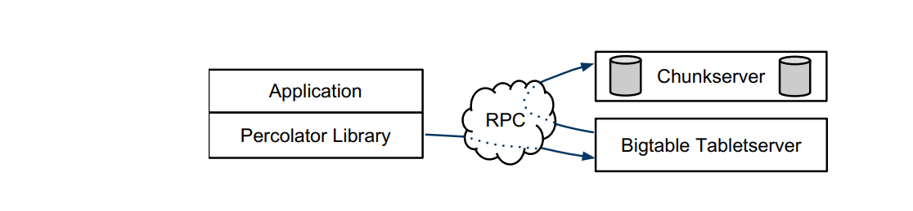
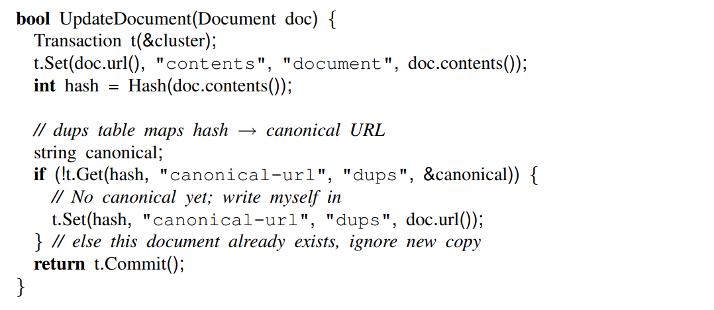
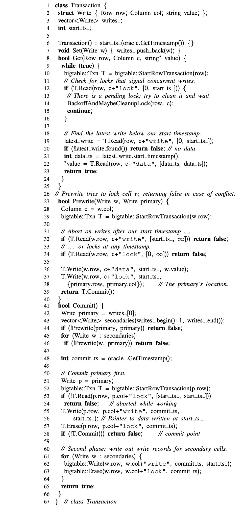

## -1.

**朴实无华，且枯燥。**

## 0.

TiKV 的分布式事务算法来源于 Google 的 Percolator，拜读了[原始论文](https://ai.google/research/pubs/pub36726)，做个笔记。

## 1. 背景

Google 构建 Percolator 的初衷是减少更新 Web 索引的时间，之前都是用 MapReduce 批处理，只能全量更新。如果能使用 DBMS 保存索引信息，那么可以通过事务控制进行增量更新，但是 PB 级的数据装不下。

怎么办？在 Bigtable 上构建分布式事务，再实现增量更新。

## 2. 整体架构

Percolator 由三部分组成 —— Percolator worker、Bigtable tablet 和 GFS chunkserver。业务层代码以 observer 的形式链接到 Percolator worker，扫描 Bigtable 被修改的 columns（"notifications"），然后调用相应的业务逻辑。

另外还依赖两个服务：时间戳 oracle 和轻量级锁服务。时间戳 oracle 提供严格递增的时间戳。轻量级锁服务可以使 worker 更有效地搜索脏 notifications。

简单介绍一下 Bigtable，详细内容看[原始论文](https://research.google/pubs/pub27898/)。

Bigtable 为用户提供 multi-dimensional sorted map：key 是 (row, column, timestamp) 元组。Bigtable 提供行粒度的查找和更新操作，行粒度的事务保证原子性 read-modify-write 操作。Bigtable 包含一组 table servers，每个 server 负责一组 tablets（也即是连续的 keys 的 regions）。有一个 master 协调 tablet servers 的操作。

Percolator 在 Bigtable 基础上提供的新特性是：**多行事务（multirow transactions）**和**观察者框架（observer framework）**。

## 3. 事务

Percolator 提供 ACID **快照隔离**语义的**跨行跨表**的**事务**。

这是一个按照文档 hash 聚合的例子，其中 Get 和 Commit 操作是阻塞的，Commit 成功返回 true，失败返回 false，失败的原因是相同 hash 的文档在同时处理，也就是事务冲突了。

Percolator 使用 Bigtable 的 timestamp 维度存储多个版本的数据。快照隔离可以阻止 write-write 冲突：如果事务 A、B 同时写同一个数据，那么至多一个事务可以 commit。但是快照隔离并不提供可串行化（serializability）；快照隔离下的事务容易出现写倾斜（write skew）。**快照隔离的优势在于读操作更有效率**。因为 timestamp 表征一致性快照，那么读操作仅仅是某 timestamp 下的 Bigtable 查找，并不需要获取锁。

Percolator 将锁存储在 Bigtable 的一个特殊的 columns 中，读取或者修改锁信息与数据访问放在一个 Bigtable 行事务中。

总结一下 Percolator 用到的 columns：

|Column| Use|
|-|-|
|c:lock| An uncommitted transaction is writing this cell; contains the location of primary lock|
|c:write| Committed data present; stores the Bigtable timestamp of the data|
|c:data| Stores the data itself|
|c:notify| Hint: observers may need to run|
|c:ack_O| Observer “O” has run ; stores start timestamp of successful last run|

Percolator 事务的伪代码如下所示：

开始事务的时候，首先从 oracle 获取开始时间戳 `start_ts_`（Line 6）。
对于 `Set(Write w)` 操作先进入本地缓存，等到 `Commit()` 时再处理（Line 7）。

`Commit()` 操作是有客户端协调的**两段提交（tow-phase commit）**：
    1. 第一阶段是 `Prewrite(Write w, Write primary)`（从写中选一个 primary 的作用是，处理客户端故障）。这里需要检查两个元数据是否冲突：如果看到 c:write 在 `start_ts_` 之后有另外的写记录，那么 abort（Line 32），这是 write-write 冲突；如果看到 c:lock 有锁记录，那么也 abort（Line 34）。如果没有以上的冲突，那么将数据写到 c:data，锁信息写到 c:lock（Line 36-38），如果没有冲突就进入下阶段。
    2. 在第二阶段再从 oracle 获取时间戳 `commit_ts`（Line 48），然后客户端释放锁并且使写对读可见。在 c:write 中写入 `start_ts_`，也就是指向提交数据的指针，然后擦除 c:lock，一旦 primary 的写操作可见了（Line 58），那么事务必须提交。 

> 在 Commit 过程中客户端故障了怎么办？岂不是会有脏数据，脏的 lock 信息岂不是会 hang 住其他事务。

对于 `Get` 操作，首先检查事务快照可见的的锁（Line 12），如果 c:lock 有信息，代表有事务在执行写操作，那么需要等待锁释放或者主动 cleanup。等到锁释放了，从 c:write 中获取最近的时间戳（Line 19），如果有数据那么再从 c:data 中读取数据（Line 22）。

#### 客户端故障

事务的主要流程如上所示，回过头来再看“客户端故障”的疑问。Percolator 使用了一种懒策略来 cleanup 异常数据：当事务 A 遇到事务 B 留下的相冲突的锁，那么 A 尝试断定 B 已经故障了，并且擦除锁信息。

事务 A 很难准确的断定事务 B 是否已经故障了，Percolator 设计了一个 primary lock 来协调 commit 和 cleanup 操作。事务 A 和 B 都能从 c:lock 中获取 primary 的位置，commit 和 cleanup 操作都需要修改 primary 锁，由于该修改操作在 Bigtable 行事务保护下，所以只有一个操作会成功。举例来说，在 B 提交之前，它需要检查自己是否仍然持有 primary lock，并且用一个写记录来替换它。在 A 擦除 B 的锁之前，A 也需要检查 primary lock 以确保 B 没有 committed。

如果客户端在 commit 的第二阶段故障了，事务已经执行过了 commit point，但是仍然还有未处理的锁，此时需要 roll-forward 这些事务。可以通过检查 primary lock 来区分：如果 primary lock 已经被替换为一个 write record，那么事务已经提交了，所以需要 roll forward；否则就应该 roll back。

为了 roll forward，事务将 stranded lock 替换为一个 write record。

因为 cleanup 由 primary lock 协调，所以清除锁是安全的。但是由于 rollback 将会导致性能下降，所以只有在怀疑 worker 故障的时候才会尝试 cleanup。Percolator 使用一个很简单的机制判断其它事务存活与否。运行中的 worker 向 Chubby 锁服务写一个 token，以表示它属于这个系统，其它 worker 可以通过该token 存在与否判断存活。为了处理 worker 存活但是不工作的情况，再将 wall time 写到锁中，如果某个 lock 的 wall time 太旧，即使 token 有效也会 cleanup。为了处理 longrunning commit 操作，客户端会周期性更新 wall time。  

## 4. 时间戳

oracle 生成的时间戳必须是 strictly increasing order。

这个服务对系统的性能影响很大，实际上有很多优化的方法：
* oracle 周期性获取一批时间戳，只持久化最大的时间戳，那么该范围内获取时间戳请求都仅限内存操作，如果 oracle 重启了，那么也仅是跳到了分配最大的时间戳，并不会回退。
* 为了减少 RPC 的成本，Percolator worker 可以批量发送发送多个事务的获取时间戳请求。

Google 的 oracle 单机可以达到每秒两百万个时间戳。

## 5. 总结

其它部分就不记了。

看完之后还是有个疑问：Percolator 这种乐观锁的策略，以及懒清理异常锁的策略会造成很高的事务提交延迟，感觉上不适合做 OLTP 任务，接下来再仔细看看 TiKV 是如何解决的。
