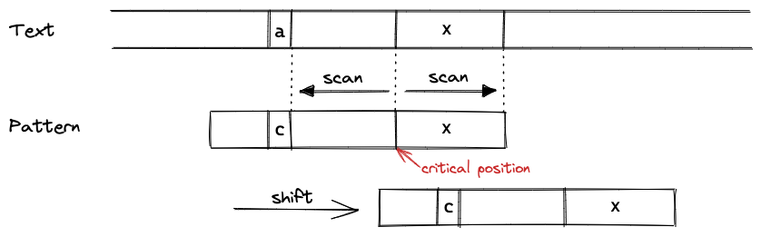
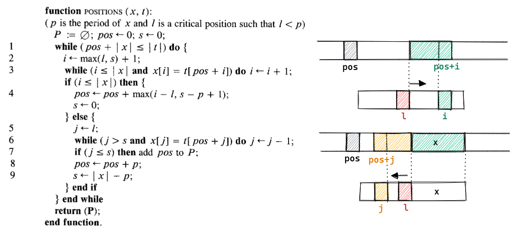
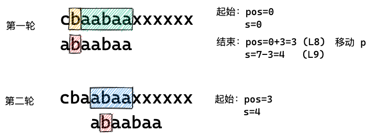
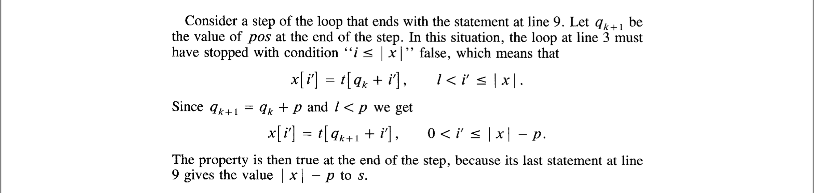
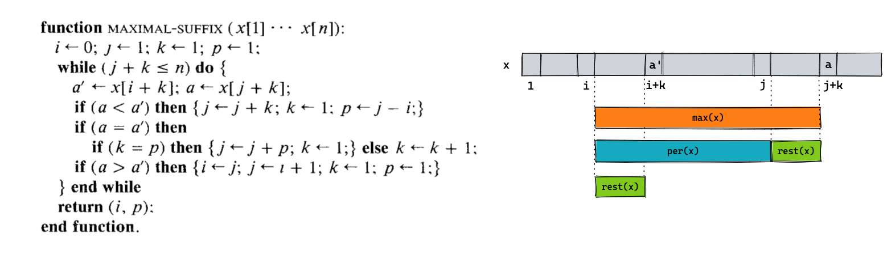
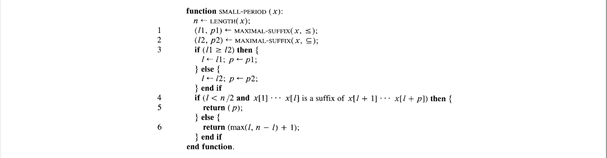
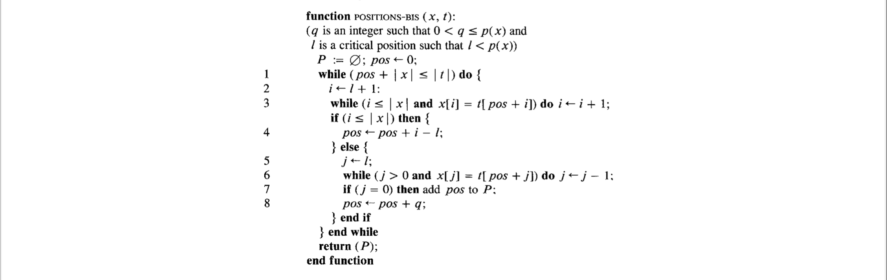
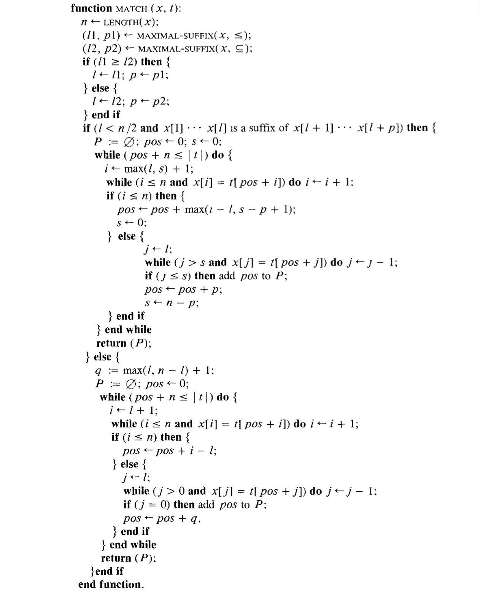

## 0.

最近给 Netty 提了个 [issue](https://github.com/netty/netty/issues/11963)，了解到一个字符串查找算法 —— [Two-Way String-Matching](http://monge.univ-mlv.fr/~mac/Articles-PDF/CP-1991-jacm.pdf)，学习了一下，简单做个笔记。

## 1.

在摘要中作者将 Two-Way 称之为 KMP 与 BM 之间的“中间体”，笔者感觉关联不大，实际上这个“对比”主要体现在扫描方向上，KMP 是从左向右扫描模式字符串，BM 是从右向左扫描模式字符串，而 Two-Way 既有从左向右扫描又有从右向左扫描。

理解 Two-Way 的关键不在于理解 KMP 和 BM，而是理解 *Critical Factorization Theorem*。

## 2. Critical Factorization Theorem

### 2.1 *period* 是什么？

如果字符串 *x* 中所有 *x[i] = x[i+p]*，那么 *p* 就是 *x* 的一个 *period*，在这里 *p* 是一个严格的正整数。

直观理解 *period* 就是字符串中重复模式的周期，举几个例子：

- "abaabaa" 的 *period* 可以是 3 或者 6；
- "abcdefg" 的 period 可以是 7。

### 2.2 *the period* 是什么？

字符串 *x* 最小的 *period* 称之为 *the period*，表示为 *p(x)*，满足不等式  *0 < p(x) <= |x|*。

上面例子中，"abaabaa" 的 *p(x) = 3*。

### 2.3 *local period* 是什么？

既然是 *local* 的那肯定得先设定个位置 *l* （*0 <= l <= |x|*，字符串起始索引为 1），如果对于所有索引 *i*（*l-r+1 <= i <= l*）都满足 *x[i] = x[i+r]* 那么 *r* （*r >= 1*）称为 *x* 在位置 *l* 的一个 *local period*。

字符串 *x* 在位置 *l* 的 *the local period* 也就是在位置 *l* 处最小的 *local period* 表示为 *r(x, l)*，满足 *1 <= r(x, l) <= p(x)*。

上面例子，"abaabaa" 在位置 *l=3* 处的 *local period* 可以 1 或者 3，那么 *r(x, 3) = 1*。

### 2.4 Critical Factorization Theorem


上面的例子，"abaabaa" 的 *p(x)* = 3，有三个 critical position，也就是 2、4、5.

```
ab|aabaa
abaa|baa
abaab|aa
```

存在一个 *0 <= l < p(x)* 的位置，也就是 2。

## 3. 初识 Two-Way

Two-Way 算法的整体流程就是以 pattern 字符串的 critical position 分界，右侧（不包含 critical position）从左向右扫描匹配，左侧（包含 critical position）从右向左扫描匹配。如果扫描到不匹配的字符，那么就向右移动 pattern 字符串，再按照上述逻辑扫描匹配。



假设已知 pattern 字符串的 *the period* (*p*) 和 *critical position* (*l*)，并且 *l < p*，那么可以这样描述 Two-Way 算法。



变量 `pos` 记录 text 中每一轮 pattern 匹配的起始位置，第 3 行是从左向右扫描的逻辑，变量 `i` 记录字符匹配的位置，第 6 行是从右向左扫描的逻辑，变量 `j` 记录字符匹配的位置。

在这里多了一个变量 `s`，记录的是从当前 `pos` 开始，text 与 pattern 相同的字符长度。为什么在扫描之前可以预先知道相同的前缀呢？这个场景出现在上一轮 *critical positon* 右侧全部匹配的情况。

这里还比较好理解，先看个例子：



直观理解一下，在第一轮结束时，就已知了当前 text 与 pattern 的 critical position 右侧完全一致，将 pattern 向右移动 `p`，也就是使索引加 `p`，根据 *the period* 的性质，也就是把 pattern 的左侧子串与 text 中已知的 pattern 右侧子串根据 critical position 对齐，所以是相同的。

形式化的证明为：


### 3.1 算法正确性

根据第 3 行和第 6 行的循环比较逻辑，以及 `s` 是相同前缀的前置条件，可见函数 `POSITIONS(x, t)` 计算得出的位置必然是匹配的位置。

这里不容易理解的部分是 `pos` 移动的步长，是否移动太多了？是否会漏掉匹配的位置？这个点是该算法是否正确的关键。

作者基于 *Critical Factorization Theorem* 进行了详细的证明，首先可以得出一个 Lemma：在 *critical position* 的 *local period* 肯定是 *p* 的倍数。


`pos` 移动分为两种情况：

1. critical position 左侧，代码第 8 行的情况：
   设定当前的 `pos` 为 *q<sub>k</sub>*，移动后正好匹配的位置为 *q*，那么 *q-q<sub>k</sub>* 是 `l` 的 local period，根据 LEMMA 2.1，可以得出 *q-q<sub>k</sub> >= `p`*，也就是 *q >= q<sub>k</sub>+`p`*，可以安全的移动 *`p`* 。
2. critical position 右侧，代码第 4 行的情况：
   论文中用了反证法，稍微复杂一些，就不展开了。

### 3.2 算法复杂度

很容易分析出函数 `POSITIONS(x, t)`的最大时间复杂度是 O(m)，m 是输入字符串 `t` 的长度，空间复杂度是 O(1)。

可见 Two-Way 算法在空间复杂度上有很大优势。

## 4 如何计算 *critical position*？

接下来的关键就是计算 *critical position* 了，如果这一步复杂度很高的话，会大大影响 Two-Way 算法整体的性能。

作者天才般的将 *critical position* 计算转换为了 *maximal suffix* 计算。


### 4.1 计算 *maximal suffix*



一个很精巧的算法，O(n) 时间复杂度里计算了 *maximal suffix*，以及它的 *period*。（注意这里计算出的是 *maximal suffix* 的 *period*，而不是字符串 *x* 的）

## 5. 需要计算 *the period* 么？

实际上可以用 KMP 算法计算 *the period*，但是这样会增加算法整体的空间复杂度，这一点是作者不能接受的，所以作者又天才般的设计出了一个不需要知道*精确 the period* 的算法。



如果 *critical position* `l` 小于 `n/2`，并且 *maximal suffix* 的 *period* `p` 也是 `x` 的 *the period*；否则函数 `SMALL-PERIOD(x)` 返回 *p(x)* 的下界。

那么对于不知道*精确 the period* 的情况下可以这样进行匹配：



简而言之就是缩小了不匹配时移动的距离，毕竟现在不知道精确的 *the period*，但是移动它的下界总是安全的。

## 6. 再探 Two-Way

以上信息组合起来就得出了最终的算法：



看了一下 glibc 中 `strstr` 函数的实现，在当前最新版（[2.34](https://sourceware.org/pipermail/libc-alpha/2021-August/129718.html)）中已经将默认算法调整为了 [a novel modified Horspool algorithm](https://sourceware.org/pipermail/glibc-cvs/2019q3/067623.html)，但是当 pattern 字符串长度大于 256 时，用的还是之前的 Two-Way 算法。

glibc 中的 Two-Way 实现与论文中的描述主要有两点不同：

1. 增加了一个 BM 中的 shift_table；
2. 函数 `SMALL-PERIOD(x)` 中的第 4 行改为了 `CMP_FUNC (needle, needle + period, suffix)`。

这逻辑调整应该是参看了 [《Text Algorithms》](http://www-igm.univ-mlv.fr/~mac/REC/text-algorithms.pdf)，这本书的作者也就是本篇论文的作者 M. Crochemore。


