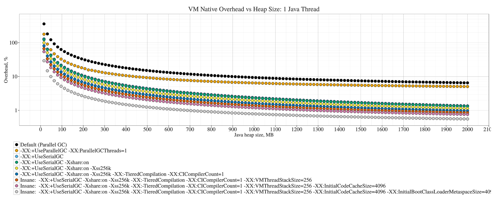

原文地址：[JVM Anatomy Park #12: Native Memory Tracking](https://shipilev.net/jvm-anatomy-park/12-native-memory-tracking/)

## 问题

我有 512 MB 可用内存，所以我设置 `-Xms512m -Xmx512m`，然后 VM 抛出“内存不足”就停止了。为什么？

## 理论

JVM 是本地应用程序，所以它也需要内存空间来维护内部的数据结构，用以表示程序代码、生成的机器码、内存元数据、类元数据、内部分析等。这些内存并没有计算在 Java 堆内，因为其中大部分内存是本地的，分配在 C 堆中，或者 mmap 的内存。JVM 也准备了一些资源，以备长期运行的程序加载一些类，生成一些代码等。对于某些内存受限的短期程序，上述默认的设置可能会浪费一些内存。

OpenJDK8 有一个非常棒的 VM 特性，称为[“本地内存追踪” (NMT)](https://docs.oracle.com/javase/8/docs/technotes/guides/troubleshoot/tooldescr007.html)：这个特性记录所有的 VM 内部分配，并且将它们分类，了解它们来自哪里等。这个特性对于理解 VM 如何使用内存是非常宝贵的。

可以通过 `-XX:NativeMemoryTracking=summary` 启动 NMT。你可以使用 jcmd 转储当前的 NMT 数据，也可以通过 `-XX:+PrintNMTStatistics` 在 JVM 停止时转储数据。通过 `-XX:NativeMemoryTracking=detail` 可以输出 mmap 的内存映射和 malloc 的调用栈。

大部分情况下，“summary” 可以满足了解概况的需求。但是我们也可以阅读 “detail” 日志，了解内存分配来自何处，用处又是什么，阅读 VM 源代码，或者调整 VM 参数看看相互的影响。以简单的 “Hello World” 程序为例：

```
public class Hello {
  public static void main(String... args) {
    System.out.println("Hello");
  }
}
```

很明显分配的内存主要是 Java 堆，我们设置 `-Xmx16m -Xms16m` 做为基准线：

```
Native Memory Tracking:

Total: reserved=1373921KB, committed=74953KB
-                 Java Heap (reserved=16384KB, committed=16384KB)
                            (mmap: reserved=16384KB, committed=16384KB)

-                     Class (reserved=1066093KB, committed=14189KB)
                            (classes #391)
                            (malloc=9325KB #148)
                            (mmap: reserved=1056768KB, committed=4864KB)

-                    Thread (reserved=19614KB, committed=19614KB)
                            (thread #19)
                            (stack: reserved=19532KB, committed=19532KB)
                            (malloc=59KB #105)
                            (arena=22KB #38)

-                      Code (reserved=249632KB, committed=2568KB)
                            (malloc=32KB #297)
                            (mmap: reserved=249600KB, committed=2536KB)

-                        GC (reserved=10991KB, committed=10991KB)
                            (malloc=10383KB #129)
                            (mmap: reserved=608KB, committed=608KB)

-                  Compiler (reserved=132KB, committed=132KB)
                            (malloc=2KB #23)
                            (arena=131KB #3)

-                  Internal (reserved=9444KB, committed=9444KB)
                            (malloc=9412KB #1373)
                            (mmap: reserved=32KB, committed=32KB)

-                    Symbol (reserved=1356KB, committed=1356KB)
                            (malloc=900KB #65)
                            (arena=456KB #1)

-    Native Memory Tracking (reserved=38KB, committed=38KB)
                            (malloc=3KB #41)
                            (tracking overhead=35KB)

-               Arena Chunk (reserved=237KB, committed=237KB)
                            (malloc=237KB)
```

好吧。设置 16 MB Java 堆，实际占用 75 MB 确实出人意料。

## 瘦身：理智的部分

让我们翻看 NMT 输出看看有哪部分可以优化一下。

从熟悉的部分开始：

```
-                        GC (reserved=10991KB, committed=10991KB)
                            (malloc=10383KB #129)
                            (mmap: reserved=608KB, committed=608KB)
```

这部分表示 GC 本地数据结构。日志显示 GC malloc 了近 10MB，mmap 了近 0.6MB。如果这部分内存描述堆的结构（例如，marking bitmaps、card tables、remembered sets 等），那么随着堆的增长，这部分内存也会增长。确实如此：

```
# Xms/Xmx = 512 MB
-                        GC (reserved=29543KB, committed=29543KB)
                            (malloc=10383KB #129)
                            (mmap: reserved=19160KB, committed=19160KB)

# Xms/Xmx = 4 GB
-                        GC (reserved=163627KB, committed=163627KB)
                            (malloc=10383KB #129)
                            (mmap: reserved=153244KB, committed=153244KB)

# Xms/Xmx = 16 GB
-                        GC (reserved=623339KB, committed=623339KB)
                            (malloc=10383KB #129)
                            (mmap: reserved=612956KB, committed=612956KB)
```

malloc 部分很可能是用于并行 GC 的任务队列的 C 堆分配，mmap 部分很可能是位图。并不出人意料，它们随着堆内存增长，占用配置堆内存的 3-4%。这就引出了部署的问题，就像问题中那样：**将所有可用的物理内存配置为堆内存的大小，将会超出内存的限制**，可能导致内存交换，也可能唤起 OOM killer。

但是这部分成本**也**依赖使用的GC，因为不同的 GC 使用不同的数据结构描述 Java 堆。例如，换回 OpenJDK 中最轻量级的 GC，`-XX:+UseSerialGC`，实验的结果将发生戏剧性的变化：

```
-Total: reserved=1374184KB, committed=75216KB
+Total: reserved=1336541KB, committed=37573KB

--                     Class (reserved=1066093KB, committed=14189KB)
+-                     Class (reserved=1056877KB, committed=4973KB)
                             (classes #391)
-                            (malloc=9325KB #148)
+                            (malloc=109KB #127)
                             (mmap: reserved=1056768KB, committed=4864KB)

--                    Thread (reserved=19614KB, committed=19614KB)
-                            (thread #19)
-                            (stack: reserved=19532KB, committed=19532KB)
-                            (malloc=59KB #105)
-                            (arena=22KB #38)
+-                    Thread (reserved=11357KB, committed=11357KB)
+                            (thread #11)
+                            (stack: reserved=11308KB, committed=11308KB)
+                            (malloc=36KB #57)
+                            (arena=13KB #22)

--                        GC (reserved=10991KB, committed=10991KB)
-                            (malloc=10383KB #129)
-                            (mmap: reserved=608KB, committed=608KB)
+-                        GC (reserved=67KB, committed=67KB)
+                            (malloc=7KB #79)
+                            (mmap: reserved=60KB, committed=60KB)

--                  Internal (reserved=9444KB, committed=9444KB)
-                            (malloc=9412KB #1373)
+-                  Internal (reserved=204KB, committed=204KB)
+                            (malloc=172KB #1229)
                             (mmap: reserved=32KB, committed=32KB)
```

这改善了 “GC” 部分，因为这需要分配更少的元数据，**同时也**改善了 “Thread” 部分，因为从并行改为串行 GC，需要的 GC 线程数也少了。这意味着我们可以通过调低 Parallel、G1、CMS、Shenandoah等的 GC 线程数，局部改善内存占用。稍微我们看一下线程栈。**需要注意的是，修改 GC 或者 GC 线程数将会造成性能影响** —— 通过这个修改，你在倾向时间空间权衡中的另外一方。

这也改善了 “Class” 部分，因为元数据的表示也有些许不同。我们能进一步压缩 ”Class“ 占用的内存么？让我们试一下[类数据共享(CDS)](https://docs.oracle.com/javase/8/docs/technotes/guides/vm/class-data-sharing.html)，通过 `-Xshare:on` 启动：

```
-Total: reserved=1336279KB, committed=37311KB
+Total: reserved=1372715KB, committed=36763KB

--                    Symbol (reserved=1356KB, committed=1356KB)
-                            (malloc=900KB #65)
-                            (arena=456KB #1)
-
+-                    Symbol (reserved=503KB, committed=503KB)
+                            (malloc=502KB #12)
+                            (arena=1KB #1)
```

不错，通过从共享档案中加装预解析的描述，内部符号表又节约了 0.5 MB。

现在让我们关注线程部分。日志是这样的：

```
-                    Thread (reserved=11357KB, committed=11357KB)
                            (thread #11)
                            (stack: reserved=11308KB, committed=11308KB)
                            (malloc=36KB #57)
                            (arena=13KB #22)
```

你会看到线程占用的大部分空间是线程栈。你可以通过 `-Xss` 降低栈空间大小（默认为 1M）。**注意这将会增加 `StackOverflowException` 的风险**，所以如果你想要修改这个配置，那么需要测试所有可能的配置，以防不良作用。姑且通过 `-Xss256k` 设置为 256KB：

```
-Total: reserved=1372715KB, committed=36763KB
+Total: reserved=1368842KB, committed=32890KB

--                    Thread (reserved=11357KB, committed=11357KB)
+-                    Thread (reserved=7517KB, committed=7517KB)
                             (thread #11)
-                            (stack: reserved=11308KB, committed=11308KB)
+                            (stack: reserved=7468KB, committed=7468KB)
                             (malloc=36KB #57)
                             (arena=13KB #22)
```

还不错，又省了 4 MB。当然，如果程序有更多线程，那么改善将更明显，这部分很可能是仅次于 Java 堆的第二大内存消耗者。

继续分析线程，JIT 编译器自身也有线程。这部分解释了为什么我们设置栈大小为 256KB，但是从数据上来看平均的栈大小仍然是 `7517 / 11 = 683 KB`。通过 `-XX:CICompilerCount=1` 调低编译器的线程数，**并且**通过 `-XX:-TieredCompilation` 仅仅启动最低一层编译：

```
-Total: reserved=1368612KB, committed=32660KB
+Total: reserved=1165843KB, committed=29571KB

--                    Thread (reserved=7517KB, committed=7517KB)
-                            (thread #11)
-                            (stack: reserved=7468KB, committed=7468KB)
-                            (malloc=36KB #57)
-                            (arena=13KB #22)
+-                    Thread (reserved=4419KB, committed=4419KB)
+                            (thread #8)
+                            (stack: reserved=4384KB, committed=4384KB)
+                            (malloc=26KB #42)
+                            (arena=9KB #16)
```

还不错，减少了三个线程，线程栈也没有了！**注意，这样会造成性能影响：更少的编译器线程意味着更慢的预热**。

降低 Java 堆大小，选择合适的 GC，减少 VM 线程数，降低 Java 线程栈大小和线程数，这些是内存受限场景下降低 VM 内存占用的通用技术。完成这些设置之后，我们将 16MB 测试用例的内存占用降低为： 

```
-Total: reserved=1373922KB, committed=74954KB
+Total: reserved=1165843KB, committed=29571KB
```

## 瘦身：疯狂的部分

> 注：这部分的建议都比较疯狂。一切风险由你自己承担。不要在家里尝试。

这部分涉及调低内部 VM 设置。这里不保证有效，并且可能会造成意外事故。例如，我们可以通过仔细编码控制所需的栈大小。但是我们不知道 JVM 内部的情况，所以调低 VM 线程的栈大小是很危险的。尝试设置 `-XX:VMThreadStackSize=256`：

```
-Total: reserved=1165843KB, committed=29571KB
+Total: reserved=1163539KB, committed=27267KB

--                    Thread (reserved=4419KB, committed=4419KB)
+-                    Thread (reserved=2115KB, committed=2115KB)
                             (thread #8)
-                            (stack: reserved=4384KB, committed=4384KB)
+                            (stack: reserved=2080KB, committed=2080KB)
                             (malloc=26KB #42)
                             (arena=9KB #16)
```

是的，又降低了编译器和 GC 线程栈的 2MB 内存。

让我们继续滥用编译器代码：为什么我们不降低初始代码缓存大小（生成代码的区域大小）呢？设置 `-XX:InitialCodeCacheSize=4096`（单位是字节！）：

```
-Total: reserved=1163539KB, committed=27267KB
+Total: reserved=1163506KB, committed=25226KB

--                      Code (reserved=49941KB, committed=2557KB)
+-                      Code (reserved=49941KB, committed=549KB)
                             (malloc=21KB #257)
-                            (mmap: reserved=49920KB, committed=2536KB)
+                            (mmap: reserved=49920KB, committed=528KB)

 -                        GC (reserved=67KB, committed=67KB)
                             (malloc=7KB #78)
```

哈哈！一旦遇到大量编译的情况，内存就不够用了，但是到目前还好。

再仔细观察 ”Class“ 部分，我们可以看到 Hello World 程序中初始元数据存储最大为 4MB。我们可以调低 `-XX:InitialBootClassLoaderMetaspaceSize=4096` （单位是字节）：

```
-Total: reserved=1163506KB, committed=25226KB
+Total: reserved=1157404KB, committed=21172KB

--                     Class (reserved=1056890KB, committed=4986KB)
+-                     Class (reserved=1050754KB, committed=898KB)
                             (classes #4)
-                            (malloc=122KB #83)
-                            (mmap: reserved=1056768KB, committed=4864KB)
+                            (malloc=122KB #84)
+                            (mmap: reserved=1050632KB, committed=776KB)

 -                    Thread (reserved=2115KB, committed=2115KB)
                             (thread #8)
```

总的来说，经过所有这些疯狂的设置，我们更接近 16MB 的堆内存大小了，仅仅浪费了 8.5 MB：

```
-Total: reserved=1165843KB, committed=29571KB
+Total: reserved=1157404KB, committed=21172KB
```

如果我们尝试在定制构建中裁剪 JVM，那么我们可以更接近。

## 将所有内容放在一起

为了消遣，我们可以看看测试用例中本地内存成本如何随着堆大小变化：




这证实了我们的直觉，GC 成本是 Java 堆大小的常数因子，仅仅在堆很小的情况下，本地 VM 的成本才重要，因为此时 VM 成本的绝对值占全部内存的大部分。**这张图忽略了第二重要的事情：线程栈。**

## 观察

默认的 JVM 配置是为长期运行的服务器类应用程序准备的，所以 GC的选择，内部数据结构的初始大小，栈大小等可能不合适短期运行、内存受限的应用程序。理解当前 JVM 配置中主要的内存占用部分可以帮忙我们降低 JVM 内存占用。

使用 NMT 探索 VM 内存占用通常来说是一个很有启发性的工作。它几乎可以直接让我们找到改善内存占用的地方。当运行实际的生产应用程序时，将实时的 NMT 监控连接到性能管理系统可以帮助我们调整 JVM 参数。这比解析 `/proc/$pid/maps` 中不透明的内存映射简单多了。

也可以看一下 Christine Flood 的[《OpenJDK 与容器》](https://developers.redhat.com/blog/2017/04/04/openjdk-and-containers/)。
