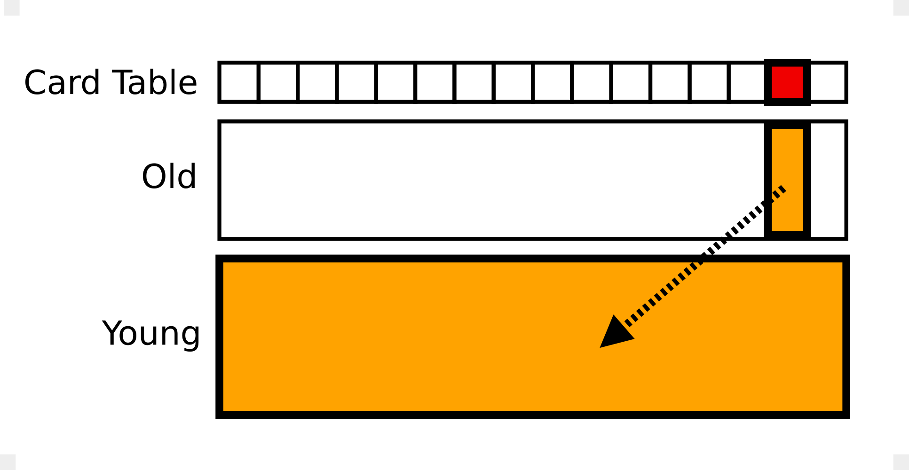

原文地址：[JVM Anatomy Park #13: Intergenerational Barriers](https://shipilev.net/jvm-anatomy-park/13-intergenerational-barriers/)

## 问题

[Epsilon GC JEP](http://openjdk.java.net/jeps/8174901) 在”动机“部分提到，除了别的以外：

> ”最后一项性能改善：即使对于没有内存分配的工作负载，选择 GC 也意味着选择工作负载使用的 GC 屏障，尽管没有实际发生 GC。OpenJDK 中大部分 GC 是分代的，它们至少产生一个引用写屏障。避免这个屏障将会带了最后一点儿性能改善。“

什么意思？

## 理论

如果垃圾收集器想要仅仅收集部分管理的内存，而不涉及整个堆，那么它必须知道指向这部分内存全部的引用。否则，它无法可靠地识别收集部分中哪个对象是可达的，因此必须谨慎的假设所有对象都是可达的。此时没有一个对象可以被判定为垃圾，这从根本上否定了这个想法。另外，当垃圾收集器移动收集部分中的对象时，它必须知道哪些引用需要更新 —— 主要得考虑对收集部分不可见的”外部“引用如何处理。

最简单（也是很有效）的分割堆内存的方式是*通过年龄*隔离对象，也就是引入[*年代*](https://en.wikipedia.org/wiki/Tracing_garbage_collection#Generational_GC_.28ephemeral_GC.29)。核心的想法是[*弱年代假设*](http://www.memorymanagement.org/glossary/g.html#term-generational-hypothesis)，也就是”新对象早夭“。弱年代假设实践上的重点是，*标记*收集器的性能依赖存活对象的数量。这意味着，我们可以设置一个*新生代*，其中大部分对象都早夭，我们可以频繁快速的处理，同时*老年代*维护没有早夭的对象。

然后，可能存在*老年代*指向*新生代*的引用，所以在收集新生代的时候需要处理这些引用。老年代通常与整个堆一起收集，所以新生代指向老年代的引用可以不追踪。对于新生代和老年代内部的引用，同样可以不追踪，因为这些引用在收集集合中是可访问的。



以 OpenJDK 中的 Parallel GC 为例，收集器通过*卡表（Card Table）* 记录老年代指向新生代的引用，卡表也就是整个老年代粗粒度的位图。当发生存储操作时，收集器将会翻转卡表中对应的比特。这个比特表示，*这个卡片*对应的老年代区域可能存在指向新生代的指针，当进行新生代收集的时候需要扫描这部分。为了使这一切正常工作，引用存储必须增加*写屏障*，这小部分代码实现了卡表的管理。

## 实践

写屏障在实践中真的重要么？有时候确实重要！以下述工作负载为例：

```
@State(Scope.Benchmark)
@BenchmarkMode(Mode.AverageTime)
@OutputTimeUnit(TimeUnit.MICROSECONDS)
@Warmup(iterations = 5, time = 1, timeUnit = TimeUnit.SECONDS)
@Measurement(iterations = 5, time = 1, timeUnit = TimeUnit.SECONDS)
@Fork(value = 3, jvmArgsAppend = {"-Xms4g", "-Xmx4g", "-Xmn2g"})
@Threads(Threads.MAX)
public class HashWalkBench {

    @Param({"16", "256", "4096", "65536", "1048576", "16777216"})
    int size;

    Map<String, String> map;

    @Setup
    public void setup() throws Exception {
        create();
        System.gc();
    }

    private void create() {
        String[] keys = new String[size];
        String[] values = new String[size];
        for (int c = 0; c < size; c++) {
            keys[c] = "Key" + c;
            values[c] = "Value" + c;
        }
        map = new HashMap<>(size);
        for (int c = 0; c < size; c++) {
            String key = keys[c];
            String val = values[c];
            map.put(key, val);
        }
    }

    @Benchmark
    public void walk(Blackhole bh) {
        for (Map.Entry<String, String> e : map.entrySet()) {
            bh.consume(e.getKey());
            bh.consume(e.getValue());
        }
    }
}
```

创建一个 `HashMap`，执行很多轮 GC，然后遍历它。使用 Epsilon 和 Parallel 分别执行：

```
Benchmark             (size)  Mode  Cnt       Score      Error  Units

# Epsilon
HashWalkBench.walk        16  avgt   15       0.238 ±    0.005  us/op
HashWalkBench.walk       256  avgt   15       3.638 ±    0.072  us/op
HashWalkBench.walk      4096  avgt   15      59.222 ±    1.974  us/op
HashWalkBench.walk     65536  avgt   15    1102.590 ±    4.331  us/op
HashWalkBench.walk   1048576  avgt   15   19683.680 ±  195.086  us/op
HashWalkBench.walk  16777216  avgt   15  328319.596 ± 7137.066  us/op

# Parallel
HashWalkBench.walk        16  avgt   15       0.240 ±    0.001  us/op
HashWalkBench.walk       256  avgt   15       3.679 ±    0.078  us/op
HashWalkBench.walk      4096  avgt   15      64.778 ±    0.275  us/op
HashWalkBench.walk     65536  avgt   15    1377.634 ±   28.132  us/op
HashWalkBench.walk   1048576  avgt   15   25223.994 ±  853.601  us/op
HashWalkBench.walk  16777216  avgt   15  400679.042 ± 8155.414  us/op
```

等一下，我们讨论的不是*写入*么？写操作在哪里？除了 JMH 自身处理的基础设施写入，其它的写入发生在 for-each 循环内部。在其中隐式实例化了 `HashMap.EntrySetIterator`，将当前的字典条目*保存*在它的字段中。（如果逃逸分析不是这么脆弱，那么这段代码可能已经标量化了）

我们可以在生成的代码中清晰的看到写入，以及相关的屏障：

```
1.58%    0.91%   ...a4e2c: mov    %edi,0x18(%r9)       ; %r9 = iterator, 0x18(%r9) = field
0.27%    0.33%   ...a4e30: mov    %r9,%r11             ; r11 = &iterator
0.26%    0.38%   ...a4e33: shr    $0x9,%r11            ; r11 = r11 >> 9
0.13%    0.20%   ...a4e37: movabs $0x7f2c535aa000,%rbx ; rbx = card table base
0.58%    0.57%   ...a4e41: mov    %r12b,(%rbx,%r11,1)  ; put 0 to (rbx+r11)
```

这里观察到一些事情：

1. 卡表标记设置整个字节，而不仅仅是一个比特。这可以避免同步：大部分硬件可以实现原子性字节写入，而不会触及周围的数据。这使得卡表的大小比理论值大，但是仍然很密集：每512字节的堆内存需要1字节的卡表，注意位操作移动了9位。

2. 虽然我们只需要记录老年代指向新生代的引用，但是实际上却是无差别地产生屏障。这看起来是合理的：我们在热路径上没用额外的分支，我们交换整个堆范围内的的卡表，而不仅仅是老年代的。因为卡表很密集，所以我们只需要增加很少一点儿内存。这也有助于收集器自己优化新生代与老年代之间的临时边界，而不必插入代码。

3. 卡表的地址编码在生成的代码中，这也是很实用的，因为卡表是一个本地固定的数据结构。这节约了内存加载的时间，否则我们需要从别的地方获取卡表地址。

4. 卡表的标记被编码为 0。这也是很实用的，因为我们可以重用零寄存器 —— 特别是显式拥有零寄存器的架构 —— 获取源操作数。卡表的初始化值不重要，可以在本地 GC 代码中决定。

性能分析结果可以进一步用硬件计数器证实（标准化到操作，然后除以 1M）：

```
Benchmark                                  (size)  Mode  Cnt    Score    Error  Units

# Epsilon
HashWalkBench.walk                        1048576  avgt   15    0.019 ±  0.001  us/op
HashWalkBench.walk:L1-dcache-load-misses  1048576  avgt    3    0.389 ±  0.495   #/op
HashWalkBench.walk:L1-dcache-loads        1048576  avgt    3   25.439 ±  2.411   #/op
HashWalkBench.walk:L1-dcache-stores       1048576  avgt    3   20.090 ±  1.184   #/op
HashWalkBench.walk:cycles                 1048576  avgt    3   75.230 ± 11.333   #/op
HashWalkBench.walk:instructions           1048576  avgt    3   90.075 ± 10.484   #/op

# Parallel
HashWalkBench.walk                        1048576  avgt   15    0.024 ±  0.001  us/op
HashWalkBench.walk:L1-dcache-load-misses  1048576  avgt    3    1.156 ±  0.360   #/op
HashWalkBench.walk:L1-dcache-loads        1048576  avgt    3   25.417 ±  1.711   #/op
HashWalkBench.walk:L1-dcache-stores       1048576  avgt    3   23.265 ±  3.552   #/op
HashWalkBench.walk:cycles                 1048576  avgt    3   97.435 ± 69.688   #/op
HashWalkBench.walk:instructions           1048576  avgt    3  102.477 ± 12.689   #/op
```

所以 Parallel 执行的加载操作数量与 Epsilon 一样多（这多亏了编码的卡表地址），但是 Parallel 多执行了 3 次写入，多执行了约 22 个时钟周期和3个指令。这些附加的成本看起来对应三次写屏障。注意 L1 缓存不命中也很高：因为写入卡表弄脏了缓存，降低了程序有效缓存的容量。

## 观察

即使在没有发生 GC 的时候，GC 带有的屏障也会影响程序的性能。即使像 Serial/Parallel 这种非常简单的分代收集器，至少也会存在一个用于记录代间屏障的引用写入屏障。像 G1 这种更高级的收集器甚至有更复杂的屏障来追踪内存块之间的引用。在某些情况下，这些成本是很难避免的，包括 Epsilon 这种空操作 GC。
