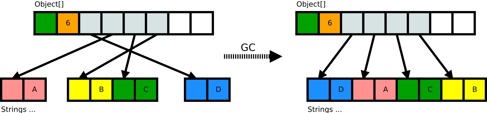

原文地址：[JVM Anatomy Park #11: Moving GC and Locality](https://shipilev.net/jvm-anatomy-park/11-moving-gc-locality/)

## 问题

我很早就听说过非移动的垃圾收集器也是不错的，因为就是不错。我不关心分配变慢，也不关心内存碎片。那么还有其它的影响么？

## 理论

如果你打开[《GC 手册》](http://gchandbook.org/)，你会看到一个关于“整理是否必要？”的小章节。其中提到的最后一个点是：

> 标记整理收集器可以维护对象的分配顺序，也可以任意地重新排列。虽然任意顺序收集器可能会比其它标记整理收集器快，并且没有额外的空间成本，但是分配器的局部性可能会受到对象顺序不规则性的影响。
> —— 《GC 手册》 3.5. 需要考虑的问题. 局部性

这真那么重要么？

## 实验

我们可以构建简单的实验来探究内部的工作原理。我们可以想到的最简单的测试用例是使用对象数组，或者搅乱数组，或者维持原有顺序，然后遍历数组。使用 [JMH](http://openjdk.java.net/projects/code-tools/jmh/) 编写测试用例：

```
import org.openjdk.jmh.annotations.*;
import org.openjdk.jmh.infra.*;

@State(Scope.Thread)
@BenchmarkMode(Mode.AverageTime)
@OutputTimeUnit(TimeUnit.MICROSECONDS)
@Warmup(iterations = 5, time = 1, timeUnit = TimeUnit.SECONDS)
@Measurement(iterations = 5, time = 1, timeUnit = TimeUnit.SECONDS)
@Fork(value = 1, jvmArgsAppend = {"-Xms8g", "-Xmx8g", "-Xmn7g" })
public class ArrayWalkBench {

    @Param({"16", "256", "4096", "65536", "1048576", "16777216"})
    int size;

    @Param({"false", "true"})
    boolean shuffle;

    @Param({"false", "true"})
    boolean gc;

    String[] arr;

    @Setup
    public void setup() throws IOException, InterruptedException {
        arr = new String[size];
        for (int c = 0; c < size; c++) {
            arr[c] = "Value" + c;
        }
        if (shuffle) {
            Collections.shuffle(Arrays.asList(arr), new Random(0xBAD_BEE));
        }
        if (gc) {
            for (int c = 0; c < 5; c++) {
                System.gc();
                TimeUnit.SECONDS.sleep(1);
            }
        }
    }

    @Benchmark
    public void walk(Blackhole bh) {
        for (String val : arr) {
            bh.consume(val.hashCode());
        }
    }
}
```

这个实验有三个自由度：

1. 数组的`size` —— 尝试不同的长度通常来说是个好主意，因为这会影响到内存体系中不同的缓存，从而可以避免测试结果仅仅是一个意外的最优情况。
2. `shuffle` 标识遍历数组前是否需要搅乱数组。搅乱数组模拟的场景是：插入不是有序的，或者随着时间的推移插入不同的索引。
3. `gc` 标识在准备好数据集合后是否强制 GC。因为有效负荷代码中的工作负载不会分配对象，所以我们需要显式强制 GC，否则 GC 不会执行。

不同的设置会有什么影响呢？让我们使用 `-XX:+UseParallelGC` 执行：

```
Benchmark             (gc)  (shuffle)    (size)  Mode  Cnt       Score      Error  Units

ArrayWalkBench.walk  false      false        16  avgt    5       0.051 ±    0.001  us/op
ArrayWalkBench.walk  false      false       256  avgt    5       0.821 ±    0.001  us/op
ArrayWalkBench.walk  false      false      4096  avgt    5      14.516 ±    0.026  us/op
ArrayWalkBench.walk  false      false     65536  avgt    5     307.210 ±    4.789  us/op
ArrayWalkBench.walk  false      false   1048576  avgt    5    4306.660 ±    7.950  us/op
ArrayWalkBench.walk  false      false  16777216  avgt    5   60561.476 ±  925.685  us/op

ArrayWalkBench.walk  false       true        16  avgt    5       0.051 ±    0.001  us/op
ArrayWalkBench.walk  false       true       256  avgt    5       0.823 ±    0.003  us/op
ArrayWalkBench.walk  false       true      4096  avgt    5      18.646 ±    0.044  us/op
ArrayWalkBench.walk  false       true     65536  avgt    5     461.187 ±   31.183  us/op
ArrayWalkBench.walk  false       true   1048576  avgt    5   16350.706 ±   75.757  us/op
ArrayWalkBench.walk  false       true  16777216  avgt    5  312296.960 ±  632.552  us/op

ArrayWalkBench.walk   true      false        16  avgt    5       0.051 ±    0.001  us/op
ArrayWalkBench.walk   true      false       256  avgt    5       0.820 ±    0.004  us/op
ArrayWalkBench.walk   true      false      4096  avgt    5      13.639 ±    0.063  us/op
ArrayWalkBench.walk   true      false     65536  avgt    5     174.475 ±    0.771  us/op
ArrayWalkBench.walk   true      false   1048576  avgt    5    4345.980 ±   15.230  us/op
ArrayWalkBench.walk   true      false  16777216  avgt    5   68687.192 ± 1375.171  us/op

ArrayWalkBench.walk   true       true        16  avgt    5       0.051 ±    0.001  us/op
ArrayWalkBench.walk   true       true       256  avgt    5       0.828 ±    0.010  us/op
ArrayWalkBench.walk   true       true      4096  avgt    5      13.749 ±    0.088  us/op
ArrayWalkBench.walk   true       true     65536  avgt    5     174.230 ±    0.655  us/op
ArrayWalkBench.walk   true       true   1048576  avgt    5    4365.162 ±   88.927  us/op
ArrayWalkBench.walk   true       true  16777216  avgt    5   70631.288 ± 1144.980  us/op
```

我们看到了什么？

可以看到遍历搅乱的数组比较耗时，相比于遍历初始顺序的数组，慢了接近4倍！所以这里的结论是：**对象图的内存布局很重要！**在初始化的时候你可以通过代码控制，但是当运行时根据（可能是随机的）索引写数据就完全不可控了。

另外可以看到在 GC 发生之后，两个测试场景的性能都改善了，这是因为 GC 整理了数组中对象占用的空间，尽可能移动对象使得它们在内存中保持*数组顺序*的布局。搅乱与不搅乱的性能差别基本上没有了。所以我们可以得出另外一个结论：GC 并不是只会引入更多成本，它也**通过整理对象改善了局部性**，就像这样：



如果你使用非移动的收集器，那么你只能负担 GC 
的成本，而得不到这个好处！确实，这也是  [Epsilon](http://openjdk.java.net/jeps/8174901) 这类空操作 GC 使得程序执行更慢的一个原因。这是 Epsilon 的执行结果（`gc = true` 实际上没用）：

```
Benchmark             (gc)  (shuffle)    (size)  Mode  Cnt       Score      Error  Units

ArrayWalkBench.walk  false      false        16  avgt    5       0.051 ±    0.001  us/op
ArrayWalkBench.walk  false      false       256  avgt    5       0.826 ±    0.006  us/op
ArrayWalkBench.walk  false      false      4096  avgt    5      14.556 ±    0.049  us/op
ArrayWalkBench.walk  false      false     65536  avgt    5     274.073 ±   37.163  us/op
ArrayWalkBench.walk  false      false   1048576  avgt    5    4383.223 ±  997.953  us/op
ArrayWalkBench.walk  false      false  16777216  avgt    5   60322.171 ±  266.683  us/op

ArrayWalkBench.walk  false       true        16  avgt    5       0.051 ±    0.001  us/op
ArrayWalkBench.walk  false       true       256  avgt    5       0.826 ±    0.007  us/op
ArrayWalkBench.walk  false       true      4096  avgt    5      18.169 ±    0.165  us/op
ArrayWalkBench.walk  false       true     65536  avgt    5     312.345 ±   26.149  us/op
ArrayWalkBench.walk  false       true   1048576  avgt    5   16445.739 ±   54.241  us/op
ArrayWalkBench.walk  false       true  16777216  avgt    5  311573.643 ± 3650.280  us/op
```

是的，你没有看错，Epsilon 比 Parallel 慢。做为一个空操作 GC，它确实没有 GC 的成本，但是也无法带来相应的好处。

性能差别的原因非常简单，使用 `-prof perfnorm` 参数就能展示出原因（我们使用`-opi 1048576`除以元素的个数）：

```
Benchmark                    (gc)  (shuffle)   (size)  Mode  Cnt   Score    Error  Units

walk                         true       true  1048576  avgt   25   4.247 ±  0.090  ns/op
walk:CPI                     true       true  1048576  avgt    5   0.498 ±  0.050   #/op
walk:L1-dcache-load-misses   true       true  1048576  avgt    5   0.955 ±  0.025   #/op
walk:L1-dcache-loads         true       true  1048576  avgt    5  12.149 ±  0.432   #/op
walk:L1-dcache-stores        true       true  1048576  avgt    5   7.027 ±  0.176   #/op
walk:LLC-load-misses         true       true  1048576  avgt    5   0.156 ±  0.029   #/op
walk:LLC-loads               true       true  1048576  avgt    5   0.514 ±  0.014   #/op
walk:cycles                  true       true  1048576  avgt    5  17.056 ±  1.673   #/op
walk:instructions            true       true  1048576  avgt    5  34.223 ±  0.860   #/op

walk                        false       true  1048576  avgt   25  16.155 ±  0.101  ns/op
walk:CPI                    false       true  1048576  avgt    5   1.885 ±  0.069   #/op
walk:L1-dcache-load-misses  false       true  1048576  avgt    5   1.922 ±  0.076   #/op
walk:L1-dcache-loads        false       true  1048576  avgt    5  12.128 ±  0.326   #/op
walk:L1-dcache-stores       false       true  1048576  avgt    5   7.032 ±  0.212   #/op
walk:LLC-load-misses        false       true  1048576  avgt    5   1.031 ±  0.032   #/op
walk:LLC-loads              false       true  1048576  avgt    5   1.365 ±  0.101   #/op
walk:cycles                 false       true  1048576  avgt    5  64.700 ±  2.613   #/op
walk:instructions           false       true  1048576  avgt    5  34.335 ±  1.564   #/op
```

在搅乱的情况下，每个指令大约两个时钟周期，基本上每次末级缓存都不命中。难怪运行的这么慢了：随机地访问内存将会耗费不少时间。

在 [JOL](http://openjdk.java.net/projects/code-tools/jol/) 例子中也有几个关于移动 GC 的有趣的可视化。例如 [JOLSample_22_Compaction](http://hg.openjdk.java.net/code-tools/jol/file/018c0e12f70f/jol-samples/src/main/java/org/openjdk/jol/samples/JOLSample_22_Compaction.java)、[JOLSample_23_Defragmentation](http://hg.openjdk.java.net/code-tools/jol/file/018c0e12f70f/jol-samples/src/main/java/org/openjdk/jol/samples/JOLSample_23_Defragmentation.java) 和 [JOLSample_24_Colocation](http://hg.openjdk.java.net/code-tools/jol/file/018c0e12f70f/jol-samples/src/main/java/org/openjdk/jol/samples/JOLSample_24_Colocation.java)。

## 观察

讽刺的是，所有关于 GC 的讨论都是**拥有 GC 挺痛苦，但是没有 GC 也挺痛苦！**

非移动 GC 的局部性影响很容易被低估。

虽然 CMS 不会整理“老年”代的对象，但是为什么 CMS 有效的一个原因是“新生代”是复制收集的，至少在进入老年代之前是会尝试整理的。像 Serial 和 Parallel(Old) 这种 STW 收集器几乎每次收集都会获得这个好处。像 G1 和 Shenandoah 这种分块的收集器可以、应该、也将会获得这个好处 —— 虽然这需要更多的工作，因为堆遍历从收集解绑了。声称局部性不重要是很鲁莽的。Enter NUMA, where locality penalties skyrocket, and be prepared to get royally screwed.

局部性关于对象*图*，并不是对象布局。即使某种语言提供控制对象内存布局的能力，但是我们知道的所有情况都是关心对象*内部*，而不是任意的对象图。一旦你将对象存储到内存的特定位置 —— 例如，不是稠密数组，而是链表、队列、并发跳表、链式哈希表 —— 你就无法摆脱内存中对象图的影响，除非你有一个移动内存管理器。

局部性是*动态的* —— 也就是说这依赖程序的执行状态，因为程序运行时对象图也在*改变*。你可以让你的程序主动做出合适的调整。但是最终你会发现你自己实现了一个自动的内存管理器——或者说是一个移动的 GC。

它与分配速率也没有关系 —— 注意上述测试用例中几乎是纯静态的工作负载 —— 通常来说这是一个真实的案例，代表适度修改数据的内存块。让 GC 适用新的布局，然后运行一会儿，直到再次适用布局。寄希望于程序维护合适的顺序是不切实际的，除非基于这种方法仔细的设计。

当有人向你推销非移动 GC 或者不要 GC 的解决方案，并且声称一切都不错时，请保持警惕的态度。因为他们可能将局部性的问题（如果没有其它内存管理问题）转嫁到你的代码来处理。处理这个问题是需要成本的。可能这是合适的，收益会超过已知的成本？或者你只是遗忘了成本，推销员将会圆滑的绕开这个话题？
