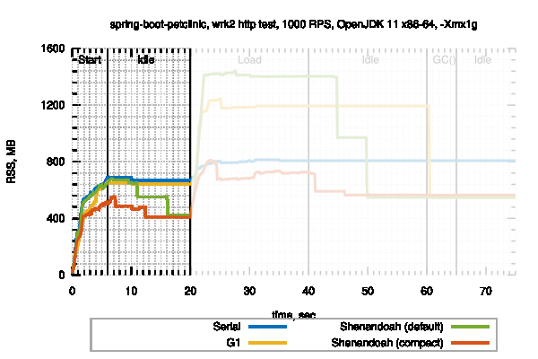
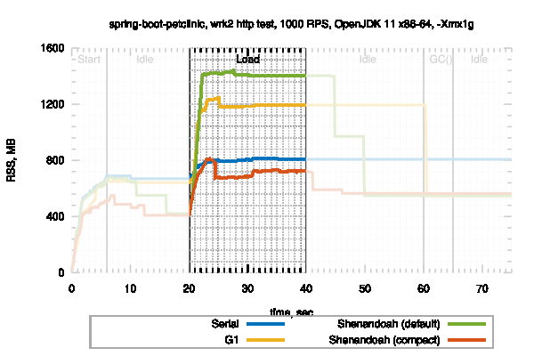
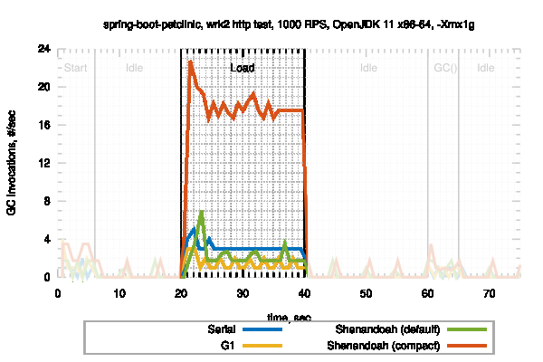
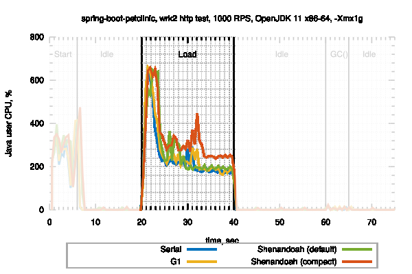
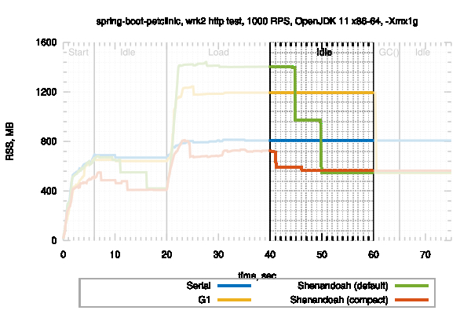
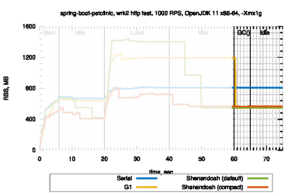

原文地址：[JVM Anatomy Park #21: Heap Uncommit](https://shipilev.net/jvm-anatomy-park/21-heap-uncommit/)

## 问题

我想要回我的内存。这不是问题。

## 理论

JVM 有很多使用内存的地方，存储内部 VM 状态在本地内存，为 Java 对象提供存储空间（“Java Heap”）。我们在[《本地内存追踪》](https://shipilev.net/jvm-anatomy-park/12-native-memory-tracking/)中已经了解了本地内存，但是很多程序主要的内存使用还是 Java 堆。

Java 堆通常由自动内存管理器管理，有时被称为*垃圾回收器*。[1] GC 会从底层 OS 内存管理器中分配大块的内存，并且将它们分块以便接受分配。这意味着即使在堆内存中仅有几个 Java 对象，但是从 OS 的角度，JVM 进程已经获取了 Java 堆所需的内存。[2]

因此，如果我们想要将 Java 堆未使用的部分还给 OS，那么我们需要 GC 协助。

有两种方式实现协助：执行更频繁的 GC，而不是“扩大” Java 堆至 `-Xmx`；或者显式的归还未使用的 Java 堆，即使在 Java 堆扩大到 `-Xmx` 之后。第一种方式只能提供有限的帮助，而且通常只在程序生命周期的早期阶段有效 —— 最终，应用程序将会分配很多。在本文中，我们将会关注第二种方式，当堆已经扩大了该怎么办。

现代 GCs 在这方面做了什么？

## 实验设置

内存占用测量比较麻烦，因为我们需要定义“占用”。由于我们讨论的是 OS 层面的内存占用，所以可以测量 JVM 进程的 RSS，这包含本地 VM 内存和 Java 堆。

另一个重要的问题是何时测量内存占用。应用程序生命周期不同阶段的数据量是不同的，这是显而易见的。当应用程序故意优化内存占用的时候*尤其*如此，比如当实际操作发生时才触发的懒（延迟）加载。最常见的错误就是启动这种程序，立即对内存占用进行快照，然后实际开始工作了就超出了之前的内存评估。

自动内存管理器通常会对应用程序的状态做出反应：基于分配压力触发 GC，释放可用空间，空闲等。仅仅测量活跃阶段也可能不太准确。通过观察可以进一步证实这一点儿，大多数应用程序（高负载服务器除外）大部分时间都是空闲的，或者运行在低负载状态。

所有这一切意味着我们需要测量程序生命周期不同阶段的内存占用，这样才能得出全面的结论。让我们以 [spring-boot-petclinic 项目](https://github.com/spring-projects/spring-petclinic)为例，使用不同的 GC 执行程序。下面是我们使用的配置：

* Serial GC：小堆应用程序的首选 GC。具有很低的本地开销，更积极的 GC 策略，等；
* G1 GC：OpenJDK 的主力，从 JDK 9 开始成为默认 GC；
* [Shenandoah GC](https://wiki.openjdk.java.net/display/shenandoah/Main)：来自 Red Hat 的并发 GC。通过它可以展示 footprint-savvy GC 的一些行为。[3]为了这个实验的目的，Shenandoah 以两种模式运行：**default**模式，以及将内存占用降至最低的**compact**模式。[4]

这个实验由这个[简单的脚本](https://shipilev.net/jvm-anatomy-park/21-heap-uncommit/run.sh)驱动。我们使用最新发布的 OpenJDK 11，但是使用 OpenJDK 8 也一样，因为在 8 和 11 中测试用例中的 GC 行为没有明显变化。

## 结果与讨论

### Start+Idle

让我们看一下 RSS 图。我们能看到什么？

在启动阶段，所有的 GC 都尝试处理很小的初始堆内存，很多将会执行频繁的 GC。这将保持堆内存不会扩展很大。在初始启动阶段之后，工作负载稳定在某个特定的内存占用级别。由于缺少 GC 触发的条件，在启动阶段**内存占用量基本上是由触发 GC 的启发式算法决定的**，即使存储的数据量是一样的。当启发式算法从一百多个 GC 配置组合猜测用户的期望时，这将会变得特别奇怪。

### Load

与上图相同：

当负载来了之后，GC 启发式算法又需要决定一些事情。依赖 GC 的实现和配置，**需要决定扩展堆内存，或者执行更频繁的 GC 循环**。

Serial GC 决定执行更频繁的 GC。G1 扩大内存到了最大堆内存的 3/4，开始执行比较频繁的 GC 以应对分配压力。default 模式下的 Shenandoah，在密集的堆内存中执行并发 GC，它选择尽可能的扩展内存，在不频繁 GC 的情况下维持应用程序的并发性。compact 模式下的 Shenandoah，被要求维护比较低的内存占用，它选执行更频繁的 GC。

实际的 GC 频率日志证实了这一点：

更频繁的 GC 也意味着更多的 CPU 占用：

虽然图中有很多毛刺，但是我们可以清晰的看到“Shenandoah (compact)”耗费了更多时间。这是维持密集内存占用而必须付出的代价。或者换句话说，**这是吞吐量-延迟-内存占用**的权衡。当然有一些可调的配置可以控制不同的权衡需求，这个实验仅仅展示了两者在默认配置下的不同点：倾向于吞吐量，或者倾向于内存占用。因为 Shenandoah 是并发 GC，即使连续执行 GC 也不会让程序停顿太久。

### Idle

与上图相同：

当应用程序开始空闲了，GC 可以决定归还某些资源。**最明显的做法是*归还*堆中空闲的部分。**如果堆已经被分割成独立的内存块，那么就相对简单了，例如像 G1 和 Shenandoah 这种分块的收集器。尽管如此，GC 需要决定是否、何时执行归还。

许多 OpenJDK GC 仅仅在 GC 周期中执行 GC 相关的操作。但有趣的事情发生了。大部分 OpenJDK GC 是*基于分配触发的*，这意味着只有堆占用达到某个条件才会启动 GC 周期。如果应用程序突然进入空闲状态，这意味着分配也停止了，所以无论当前的占用水平如何，都将一直持续下去。这对*万物静止 GC* 是有意义的，因为我们并不想随便开始长时间的停顿。

实际上没有必要将内存归还与 GC 周期关联。在 Shenandoah 中有一个**异步周期性归还逻辑**，我们将会看到这触发了空闲阶段第一次较大的内存下降。在本实验中，我们特意将回收延迟设置为 5 秒，我们可以看到它确实是在空闲几秒钟后发生的。这对上一个 GC 周期清空的（但是现在还没分配的）内存块进行了回收。

但是还有一个需要注意的地方：由于应用程序突然进入空闲阶段，所以还会存在一些未回收的垃圾。**这提供了一个实现周期性 GC 的动机，清除遗留的垃圾。**周期性 GC 是空闲阶段第二次内存回收的原因。周期性 GC 释放了新的内存块，稍后会被周期性归还。

如果 GC 周期已经足够频繁了（参见“Shenandoah (compact)”），这些操作无关紧要，因为内存占用已经很低了，没有额外占用的内存。

### Full GC

与上图相同：

在并发 GC 实现中执行周期性 GC 不那么麻烦：如果负载在 GC 周期期间恢复，也不会造成不好的影响。STW GC 就不同了，它不确定执行 major  GC 是否是个好主意。在最坏的情况下，我们需要显式地让 JVM 执行 GC，至少 G1 会可靠地响应这个请求。注意在 Full GC 之后，大部分收集器的内存占用降至了同一水平，在没有用户干预的情况下，周期性 GC 和周期性归还更早回到最低水平。

## 结论

**周期性 GC。**执行周期性 GC 有助于清除遗留的垃圾。并发 GC 通常会执行周期性 GC：Shenandoah 和 ZGC 都这样做。G1 将通过 [JEP 346](http://openjdk.java.net/jeps/346) 在 JDK 12 中获得这一特性。否则，可以使用外部或内部的代理在合适的时间点周期性调用 GC，最困难的是如何定义合适的时间点。请参见[Jelastic GC Agent](https://docs.jelastic.com/garbage-collector-agent)。

**堆内存归还。**许多 GC 已经实现了在合适的时机归还堆内存：Shenandoah 异步执行堆内存归还，即使没有 GC 请求；G1 在显式 GC 请求中执行堆内存归还；Serial 和 Parallel 在某些条件下也会执行。ZGC 也准备[这样做](http://mail.openjdk.java.net/pipermail/zgc-dev/2018-October/000489.html)，让我们期待 JDK 12。G1 通过 [JEP 346](http://openjdk.java.net/jeps/346) 实现周期性 GC 来处理同步性。当然这里有一个权衡：归还内存[可能会耗费一些时间](http://mail.openjdk.java.net/pipermail/hotspot-gc-dev/2018-June/022206.html)，所以实际的实现会在归还内存之前会增加一个超时时间。

**以内存占用为目标的 GC。**许多 GC 提供了灵活的配置项，可以使 GC 执行更频繁，从而优化内存占用。即使是增加周期性 GC 频率这样的操作，也有助于尽早清楚垃圾。某些 GC 可能会提供预先封装的配置包，使得 GC 可以做出有利于内存占用的选择，其中包括配置更频繁的 GC 周期，以及更频繁的内存归还周期，比如 Shenandoah 的 “compact” 模式。

每次你换了一个 GC 实现，而且满足内存占用预期的时候，请务必理解为什么会这样，这是怎么做到的。这有助于清楚地了解付出的成本，以及是否可以在不改变 GC 实现的情况下实现同样的效果。

* * *

[1] “垃圾收集器”这个词不太恰当，因为 GC 通常也会负责分配内存。参见 [Epsilon GC](https://openjdk.java.net/jeps/318)

[2] 这里有点儿复杂。例如，Linux 在第一次使用的时候才会分配实际的内存，即使程序认为内存是可用的，并且由进程占用。

[3] 完全披露：我在 Shenandoah 中实现了大部分堆内存归还逻辑，本文基本上是之前实验的重演。如果本文看起来像 Shenandoah 的广告，这是因为它就是广告。

[4] 通过 `-XX:ShenandoahGCHeuristics=compact` 启用
