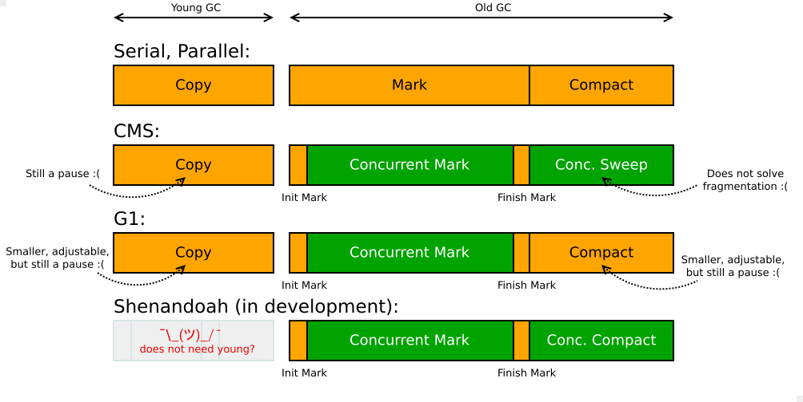

原文地址：[JVM Anatomy Park #3: GC Design and Pauses](https://shipilev.net/jvm-anatomy-park/3-gc-design-and-pauses/)

## 问题

垃圾回收是恶魔。但是我绝不能恐惧。恐惧是思维杀手。恐惧是带来彻底毁灭的小小死神……等一下，问题是什么来着？实际的问题是讨论**“在数组列表中分配 100M 个对象就可以让 Java 卡顿数秒钟”**。这是真的吗？

## 背景

通用 GC 很容易被当做性能低下的替罪羊，虽然根本问题是 GC *实现*不契合工作负载。在很多案例中，这些工作负载本身就是不确定的，也有很多工作负载选用了不合适的 GC！让我们总览一下 OpenJDK 中 GC 相关的部分：


注意一下，在通常的 GC 周期中大部分垃圾收集器都会停顿。

## 实验

虽然我们可以拒绝做 “100M 个对象写入 ArrayList” 的测试，因为这种测试不切实际，但是我们还是可以执行一下看看情况。迅速写个例子：

```
import java.util.*;

public class AL {
    static List<Object> l;
    public static void main(String... args) {
        l = new ArrayList<>();
        for (int c = 0; c < 100_000_000; c++) {
            l.add(new Object());
        }
    }
}
```

牛都知道的事情：

```
$ cowsay ...
 ________________________________________
/ 顺便说一下，这是一个蹩脚的 GC 测试用例。     \
| 虽然我是一头牛，但是我明白这一点             |
\                                        /
 ----------------------------------------
        \   ^__^
         \  (oo)\_______
            (__)\       )\/\
                ||----w |
                ||     ||
```

尽管这样，即使是蹩脚的测试用例也能测出一些东西。你需要仔细推敲测试结果背后的*原因*。事实证明，上述代码的工作负载放大了 OpenJDK 中不同垃圾收集器的设计取舍。

让我们用最新的 JDK 9 和 Shenandoah 执行测试用例。至于硬件方面我们改变一下，选用低级的 1.7 GHz i5 超极本，操作系统是 Linux x86_64。因为我们要分配 100M 个 16 字节的对象，所以设置 4G 大小的堆内存是合适的，这样也能消除不同垃圾收集器之间的某些自由度。

### G1 (default in JDK 9)

```
$ time java -Xms4G -Xmx4G -Xlog:gc AL
[0.030s][info][gc] Using G1
[1.525s][info][gc] GC(0) Pause Young (G1 Evacuation Pause) 370M->367M(4096M) 991.610ms
[2.808s][info][gc] GC(1) Pause Young (G1 Evacuation Pause) 745M->747M(4096M) 928.510ms
[3.918s][info][gc] GC(2) Pause Young (G1 Evacuation Pause) 1105M->1107M(4096M) 764.967ms
[5.061s][info][gc] GC(3) Pause Young (G1 Evacuation Pause) 1553M->1555M(4096M) 601.680ms
[5.835s][info][gc] GC(4) Pause Young (G1 Evacuation Pause) 1733M->1735M(4096M) 465.216ms
[6.459s][info][gc] GC(5) Pause Initial Mark (G1 Humongous Allocation) 1894M->1897M(4096M) 398.453ms
[6.459s][info][gc] GC(6) Concurrent Cycle
[7.790s][info][gc] GC(7) Pause Young (G1 Evacuation Pause) 2477M->2478M(4096M) 472.079ms
[8.524s][info][gc] GC(8) Pause Young (G1 Evacuation Pause) 2656M->2659M(4096M) 434.435ms
[11.104s][info][gc] GC(6) Pause Remark 2761M->2761M(4096M) 1.020ms
[11.979s][info][gc] GC(6) Pause Cleanup 2761M->2215M(4096M) 2.446ms
[11.988s][info][gc] GC(6) Concurrent Cycle 5529.427ms

real  0m12.016s
user  0m34.588s
sys   0m0.964s
```

我们看一下 G1 的情况。young 停顿大约需要 500 毫秒至 1000 毫秒。一旦达到稳态，停顿就变小了，启发式算法将会控制停顿时间达到预期。一段时间之后，并发 GC 周期开始了，一直持续到程序结束。（注意 Young 收集与并发阶段是重叠的）在并发 GC 之后将会执行 “mixed” GC，但是虚拟机在这之前就退出了。对这个一次性的任务来说，这些非稳态的停顿占据了大量的时间。

另外注意一下“user”时间大于“real”（wallclock）时间。这是因为 GC 是*并行*执行的，虽然程序是单线程执行的，但是 GC 却是尽可能并行的执行使得收集过程更快。

### Parallel

```
$ time java -XX:+UseParallelOldGC -Xms4G -Xmx4G -Xlog:gc AL
[0.023s][info][gc] Using Parallel
[1.579s][info][gc] GC(0) Pause Young (Allocation Failure) 878M->714M(3925M) 1144.518ms
[3.619s][info][gc] GC(1) Pause Young (Allocation Failure) 1738M->1442M(3925M) 1739.009ms

real  0m3.882s
user  0m11.032s
sys   0m1.516s
```

在 Parallel 收集器下，我们看到了类似的 Young 停顿，这可能是在调整 Eden/Survivors 区域的大小来接受更多临时分配。因此只发生了两次较大的停顿，然后工作负载迅速结束了。在稳定状态，该收集器也可能发生较大的停顿。“user” 时间也远大于 “real” 时间，所以一些性能成本被隐藏在了并发 GC 阶段。

### Concurrent Mark Sweep

```
$ time java -XX:+UseConcMarkSweepGC -Xms4G -Xmx4G -Xlog:gc AL
[0.012s][info][gc] Using Concurrent Mark Sweep
[1.984s][info][gc] GC(0) Pause Young (Allocation Failure) 259M->231M(4062M) 1788.983ms
[2.938s][info][gc] GC(1) Pause Young (Allocation Failure) 497M->511M(4062M) 871.435ms
[3.970s][info][gc] GC(2) Pause Young (Allocation Failure) 777M->850M(4062M) 949.590ms
[4.779s][info][gc] GC(3) Pause Young (Allocation Failure) 1117M->1161M(4062M) 732.888ms
[6.604s][info][gc] GC(4) Pause Young (Allocation Failure) 1694M->1964M(4062M) 1662.255ms
[6.619s][info][gc] GC(5) Pause Initial Mark 1969M->1969M(4062M) 14.831ms
[6.619s][info][gc] GC(5) Concurrent Mark
[8.373s][info][gc] GC(6) Pause Young (Allocation Failure) 2230M->2365M(4062M) 1656.866ms
[10.397s][info][gc] GC(7) Pause Young (Allocation Failure) 3032M->3167M(4062M) 1761.868ms
[16.323s][info][gc] GC(5) Concurrent Mark 9704.075ms
[16.323s][info][gc] GC(5) Concurrent Preclean
[16.365s][info][gc] GC(5) Concurrent Preclean 41.998ms
[16.365s][info][gc] GC(5) Concurrent Abortable Preclean
[16.365s][info][gc] GC(5) Concurrent Abortable Preclean 0.022ms
[16.478s][info][gc] GC(5) Pause Remark 3390M->3390M(4062M) 113.598ms
[16.479s][info][gc] GC(5) Concurrent Sweep
[17.696s][info][gc] GC(5) Concurrent Sweep 1217.415ms
[17.696s][info][gc] GC(5) Concurrent Reset
[17.701s][info][gc] GC(5) Concurrent Reset 5.439ms

real  0m17.719s
user  0m45.692s
sys   0m0.588s
```

与普遍的认知相反，CMS 中的“并发”指的是对老年代的并发收集。对新生代的收集仍然是万物静止的，就像我们看到的一样。从 GC 日志来看，CMS 的执行阶段跟 G1 很像：young 停顿，并发周期。不同的是“并发清除”可以并行的清理老年代，这与 G1 的 Mixed 阶段不同。不管怎样，对这个快速结束的小程序来说，更长的 Young GC 停顿造成了更长的耗时。

### Shenandoah

```
$ time java -XX:+UseShenandoahGC -Xms4G -Xmx4G -Xlog:gc AL
[0.026s][info][gc] Using Shenandoah
[0.808s][info][gc] GC(0) Pause Init Mark 0.839ms
[1.883s][info][gc] GC(0) Concurrent marking 2076M->3326M(4096M) 1074.924ms
[1.893s][info][gc] GC(0) Pause Final Mark 3326M->2784M(4096M) 10.240ms
[1.894s][info][gc] GC(0) Concurrent evacuation  2786M->2792M(4096M) 0.759ms
[1.894s][info][gc] GC(0) Concurrent reset bitmaps 0.153ms
[1.895s][info][gc] GC(1) Pause Init Mark 0.920ms
[1.998s][info][gc] Cancelling concurrent GC: Stopping VM
[2.000s][info][gc] GC(1) Concurrent marking 2794M->2982M(4096M) 104.697ms

real  0m2.021s
user  0m5.172s
sys   0m0.420s
```
在 [Shenandoah](https://wiki.openjdk.java.net/display/shenandoah/Main) 中没有新生代。（至少目前还没有，有不少不分代而快速收集部分的算法——而且不会万物静止）。并发 GC 周期开始，与程序一起运行，其中有两个停止程序的小停顿：开始并发标记和结束并发标记。并发复制不会产生停顿，因为所有对象都是存活的，还没有产生碎片。由于虚拟机终止，第二个 GC 周期早早结束了。由于没有其它收集器那样的停顿，所以程序很快就执行完了。

### Epsilon

```
$ time java -XX:+UnlockExperimentalVMOptions -XX:+UseEpsilonGC -Xms4G -Xmx4G  -Xlog:gc AL
[0.031s][info][gc] Initialized with 4096M non-resizable heap.
[0.031s][info][gc] Using Epsilon GC
[1.361s][info][gc] Total allocated: 2834042 KB.
[1.361s][info][gc] Average allocation rate: 2081990 KB/sec

real  0m1.415s
user  0m1.240s
sys   0m0.304s
```

通过实验性的“无操作”[Epsilon GC](http://openjdk.java.net/jeps/318)可以帮助我们评估 GC 的成本。这里我们预先初始化了 4GB 的堆内存，程序在没有停顿的情况下运行。虽然是在如此高效的分配对象，但是最终都不会存活。注意 “real”时间与“user"+“sys”时间基本一致，这也证实了程序确实是单线程执行的。


## 观察

不同的 GC 实现有不同的权衡。简单的把 GC 说成“馊主意”是不合适的。综合考虑工作负载、GC实现和性能需求，才能选出合适的垃圾收集器。即使你选择了没有 GC 的平台，你仍然需要理解（并且选择！）本地内存分配器。当你运行实验性工作负载的时候，请尝试去理解实验结果，尝试去挖掘其中的原因。保持平和的心态。

---

**译者注**
1. 第一段原文 “I must not fear. Fear is the mind-killer. Fear is the little-death that brings total obliteration” 出在 Frank Herbert 的小说 Dune，这里直接采用了潘振华的翻译。
