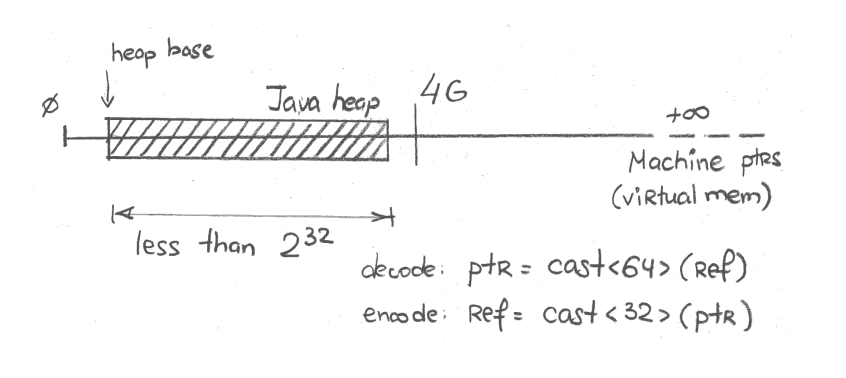
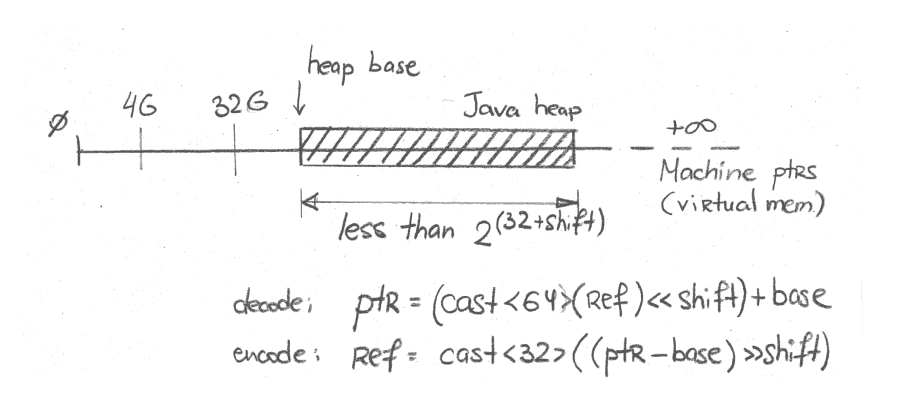

原文地址：[JVM Anatomy Quark #23: Compressed References](https://shipilev.net/jvm/anatomy-quarks/23-compressed-references/)

## 问题

* 总之 Java 引用占用多大的空间？
* 压缩普通对象指针（oops）或引用是什么？
* 压缩引用有什么问题？

## 朴素的方法

Java 规范没有规定数据类型的存储大小。即使是基本类型，规范仅仅规定了[需要支持](https://docs.oracle.com/javase/specs/jls/se11/html/jls-4.html#jls-4.2.1)的类型以及操作，但是没有规定实际的存储大小。举例来说，这允许 `boolean` 字段在不同的实现中占用 1、2、4 字节。

Java 引用占用多大空间的问题更不清楚，因为规范也没有对 Java 引用*是*什么做出规定，留给 JVM 实现自行决定。大部分 JVM 实现将 Java 引用转换为机器指针，没有额外的迂回，这简化了性能问题。

例如，对于这样简单的 JMH 基准测试：

```
@Measurement(iterations = 5, time = 1, timeUnit = TimeUnit.SECONDS)
@Fork(3)
@BenchmarkMode(Mode.AverageTime)
@OutputTimeUnit(TimeUnit.NANOSECONDS)
@State(Scope.Benchmark)
public class CompressedRefs {

    static class MyClass {
        int x;
        public MyClass(int x) { this.x = x; }
        public int x() { return x; }
    }

    private MyClass o = new MyClass(42);

    @Benchmark
    @CompilerControl(CompilerControl.Mode.DONT_INLINE)
    public int access() {
        return o.x();
    }

}
```

...对于字段的访问像这样：<sup>[1]</sup>

```
....[Hottest Region 3]....................................................
c2, level 4, org.openjdk.CompressedRefs::access, version 712 (35 bytes)
         [Verified Entry Point]
  1.10%    ...b0: mov    %eax,-0x14000(%rsp) ; prolog
  6.82%    ...b7: push   %rbp                ;
  0.33%    ...b8: sub    $0x10,%rsp          ;
  1.20%    ...bc: mov    0x10(%rsi),%r10     ; get field "o" to %r10
  5.60%    ...c0: mov    0x10(%r10),%eax     ; get field "o.x" to %eax
  7.21%    ...c4: add    $0x10,%rsp          ; epilog
  0.50%    ...c8: pop    %rbp
  0.54%    ...c9: mov    0x108(%r15),%r10    ; thread-local handshake
  0.60%    ...d0: test   %eax,(%r10)
  6.63%    ...d3: retq                       ; return %eax
```

注意对于字段的访问，无论是读取 `CompressedRefs.o` 引用字段，还是基本类型字段`MyClass.x`，都仅仅是解引用普通的机器指针。该字段位于偏移对象起始位置 16 位的位置，所以读取`0x10`。我们可以通过查看 `CompressedRefs` 实例的内存表示来验证这个推测。我们可以看到引用字段在 64-bit VM 上占用了 8 字节，并且位于偏移 16 位的位置：<sup>[2]</sup>

```
$ java ... -jar ~/utils/jol-cli.jar internals -cp target/bench.jar org.openjdk.CompressedRefs
...
# Running 64-bit HotSpot VM.
# Objects are 8 bytes aligned.
# Field sizes by type: 8, 1, 1, 2, 2, 4, 4, 8, 8 [bytes]
# Array element sizes: 8, 1, 1, 2, 2, 4, 4, 8, 8 [bytes]

Instantiated the sample instance via default constructor.

org.openjdk.CompressedRefs object internals:
 OFFSET  SIZE     TYPE DESCRIPTION        VALUE
      0     4          (object header)    01 00 00 00
      4     4          (object header)    00 00 00 00
      8     4          (object header)    f0 e8 1f 57
     12     4          (object header)    34 7f 00 00
     16     8  MyClass CompressedRefs.o   (object)
Instance size: 24 bytes
```

## 压缩引用

但是这就意味着 Java 引用的大小与机器指针宽度一致么？未必。Java 对象通常来说具有大量的引用，这迫使运行时系统采取优化措施使得引用小一点儿。最常用的技巧是*压缩引用*：使得引用的表示比机器指针的宽度小。实际上，上述例子是在显式禁用优化的条件下执行的。

由于 Java 运行时环境完全掌控内部的表示，所以可以在不改动用户程序的情况下完成此操作。在其它环境也可以这样做，但是你需要通过 ABIs 处理泄漏，例如 [x86_32 ABI](https://en.wikipedia.org/wiki/X32_ABI)。

在 Hotspot 中，由于历史原因，引用的内部名称已经泄漏到了控制优化的 VM 参数中。Hotspot 中 Java 对象的引用被称为 *“普通对象指针”*或者*“oops”*，这就是 Hotspot VM 参数具有这些古怪的名字的原因：`-XX:+UseCompressedOops`、 `-XX:+PrintCompressedOopsMode`、 `-Xlog:gc+heap+coops`。在本文中我们将尽可能使用合适的术语。

### "32-bit" 模式

On most heap sizes, the higher bits of 64-bit machine pointer are usually zero. On the heap that can be mapped over the first 4 GB of virtual memory, higher 32 bits are definitely zero. In that case, we can just use the lower 32-bit to store the reference in 32-bit machine pointer. In Hotspot, this is called "32-bit" mode, as can be seen with logging:

对于大部分堆内存设置，64-bit 机器指针的高位通常都是零。对于可以映射前 4GB 虚拟内存的堆来说，高 32 位都是零。在这种场景下，我们可以只使用低 32 位将引用存储在 32-bit 机器指针中。在 Hotspot 中，这被称为“32-bit”模式，从日志中可以看出：

```
$ java -Xmx2g -Xlog:gc+heap+coops ...
[0.016s][info][gc,heap,coops] Heap address: 0x0000000080000000, size: 2048 MB, Compressed Oops mode: 32-bit
```

当堆内存小于 4GB（或者2<sup>32</sup>字节），这一切显然是可能的。从技术上讲，堆内存的起始位置可能远离零地址，所以实际的限制小于 4 GB。请看上述日志中的 "Heap Address"，堆内存从 0x0000000080000000 开始，大约 2GB。

画图描述，大致是这样：



现在，引用字段只需要 4 字节，*同时*实例大小减少至16字节：<sup>[3]</sup>

```
$ java -Xmx1g -jar ~/utils/jol-cli.jar internals -cp target/bench.jar org.openjdk.CompressedRefs
# Running 64-bit HotSpot VM.
# Using compressed oop with 0-bit shift.
# Using compressed klass with 3-bit shift.
# Objects are 8 bytes aligned.
# Field sizes by type: 4, 1, 1, 2, 2, 4, 4, 8, 8 [bytes]
# Array element sizes: 4, 1, 1, 2, 2, 4, 4, 8, 8 [bytes]

Instantiated the sample instance via default constructor.

org.openjdk.CompressedRefs object internals:
 OFFSET  SIZE      TYPE DESCRIPTION        VALUE
      0     4           (object header)    01 00 00 00
      4     4           (object header)    00 00 00 00
      8     4           (object header)    85 fd 01 f8
     12     4   MyClass CompressedRefs.o   (object)
Instance size: 16 bytes
```

在生成的机器码中，访问指令变成了这样：

```
....[Hottest Region 2]...................................................
c2, level 4, org.openjdk.CompressedRefs::access, version 714 (35 bytes)
         [Verified Entry Point]
  0.87%    ...c0: mov    %eax,-0x14000(%rsp)  ; prolog
  6.90%    ...c7: push   %rbp
  0.35%    ...c8: sub    $0x10,%rsp
  1.74%    ...cc: mov    0xc(%rsi),%r11d      ; get field "o" to %r11
  5.86%    ...d0: mov    0xc(%r11),%eax       ; get field "o.x" to %eax
  7.43%    ...d4: add    $0x10,%rsp           ; epilog
  0.08%    ...d8: pop    %rbp
  0.54%    ...d9: mov    0x108(%r15),%r10     ; thread-local handshake
  0.98%    ...e0: test   %eax,(%r10)
  6.79%    ...e3: retq                        ; return %eax
```

可以看到访问指令仍然是相同的形式，这是因为硬件本身只是接受 32-bit 指针，并且在访问时将其扩展为 64 bit。我们几乎没有成本就获得了这个优化。

### “基于零”的模式

但是如果我们无法将未处理的引用放入 32 比特，那么该怎么办？还有一个办法，利用对象*对齐*这一事实：对象的起始位置总是以对齐的倍数。所以未处理引用的低位总是零。这为存储大于 32 比特的*有效*位提供了途径。最简单的方式是引用*比特右移*，这使得我们可以将 2<sup>(32+shift)</sup> 字节堆内存编码为 32 比特。

画图描述，大致是这样：


对象默认以 8 字节对齐，移动3位（2<sup>3</sup> = 8），因此我们可以表示 2<sup>35</sup> = 32 GB 堆内存。由于堆内存的起始位置也不是从零开始，所以实际的可以编码的地址空间会小一些。

在 Hotspot 中，这种模式称为“基于零的压缩普通对象指针”，例如：

```
$ java -Xmx20g -Xlog:gc+heap+coops ...
[0.010s][info][gc,heap,coops] Heap address: 0x0000000300000000, size: 20480 MB, Compressed Oops mode: Zero based, Oop shift amount: 3
```

通过引用的访问操作现在变得更复杂了：

```
....[Hottest Region 3].....................................................
c2, level 4, org.openjdk.CompressedRefs::access, version 715 (36 bytes)
         [Verified Entry Point]
  0.94%    ...40: mov    %eax,-0x14000(%rsp)    ; prolog
  7.43%    ...47: push   %rbp
  0.52%    ...48: sub    $0x10,%rsp
  1.26%    ...4c: mov    0xc(%rsi),%r11d        ; get field "o"
  6.08%    ...50: mov    0xc(%r12,%r11,8),%eax  ; get field "o.x"
  6.94%    ...55: add    $0x10,%rsp             ; epilog
  0.54%    ...59: pop    %rbp
  0.27%    ...5a: mov    0x108(%r15),%r10       ; thread-local handshake
  0.57%    ...61: test   %eax,(%r10)
  6.50%    ...64: retq
```

通过执行 `mov 0xc(%r12,%r11,8),%eax` 获取 `o.x` 字段：从 %r11 获取引用，将引用乘以 8，然后加上从 %r12 获取的基准地址，现在读取偏移 `0xc` 的数据，将数据存储到 `%eax`。换句话说，这条指令组合了压缩引用解码和访问数据。在基于零的模式下 `%r12` 是零，

为了简化内部实现，Hotspot 通常在寄存器中存储未压缩的引用，这就是访问字段 `o` 只是访问 `this`（在 `%rsi` 中）偏移 `0xc` 的原因。

### “基于非零”的模式

但是基于零的压缩引用仍然依赖堆内存映射在较低地址的假设。如果不是，我们可以使用非零的堆内存起始地址来解码。这基本与基于零的模式一样，但是现在堆内存的起始地址非零，并且参与实际的编码和解码。

在 Hotspot 中，这种模式称为“基于非零”的模式，你可以从这样的日志中看到：<sup>[4]</sup>

```
$ java -Xmx20g -XX:HeapBaseMinAddress=100G -Xlog:gc+heap+coops
[0.015s][info][gc,heap,coops] Heap address: 0x0000001900400000, size: 20480 MB, Compressed Oops mode: Non-zero based: 0x0000001900000000, Oop shift amount: 3
```

画图描述，大致是这样：




正如之前猜测的，访问指令与基于零的模式相同：

```
....[Hottest Region 1].....................................................
c2, level 4, org.openjdk.CompressedRefs::access, version 706 (36 bytes)
         [Verified Entry Point]
  0.08%    ...50: mov    %eax,-0x14000(%rsp)    ; prolog
  5.99%    ...57: push   %rbp
  0.02%    ...58: sub    $0x10,%rsp
  0.82%    ...5c: mov    0xc(%rsi),%r11d        ; get field "o"
  5.14%    ...60: mov    0xc(%r12,%r11,8),%eax  ; get field "o.x"
 28.05%    ...65: add    $0x10,%rsp             ; epilog
           ...69: pop    %rbp
  0.02%    ...6a: mov    0x108(%r15),%r10       ; thread-local handshake
  0.63%    ...71: test   %eax,(%r10)
  5.91%    ...74: retq                          ; return %eax
```

请看，都一样。唯一的不同是 `%r12` 现在存储堆内存的非零基准地址。

## 限制

明显的限制是堆内存大小。一旦堆内存大小超过压缩引用的阈值，就会发生令人惊讶的事情：引用变成未压缩的，占用原来两倍内存。根据堆中有多少引用，堆内存占用将会显著增加。

为了说明这一点，让我们分配一些对象来评估实际占用了多少堆内存，例如这个例子：

```
import java.util.stream.IntStream;

public class RandomAllocate {
    static Object[] arr;

    public static void main(String... args) {
        int size = Integer.parseInt(args[0]);
        arr = new Object[size];
        IntStream.range(0, size).parallel().forEach(x -> arr[x] = new byte[(x % 20) + 1]);
        System.out.println("All done.");
    }
}
```

使用 [Epsilon GC](https://openjdk.java.net/jeps/318) 执行更方便，这将会内存耗尽退出，而不是尝试 GC。这个例子 GC 没有意义，因为所有对象都是可达的。Epsilon 也会打印堆内存占用统计数据。<sup>[5]</sup>

让我们设定合适的小对象数量。8亿个对象应该足够？执行：

```
$ java -XX:+UseEpsilonGC -Xlog:gc -Xlog:gc+heap+coops -Xmx31g RandomAllocate 800000000
[0.004s][info][gc] Using Epsilon
[0.004s][info][gc,heap,coops] Heap address: 0x0000001000001000, size: 31744 MB, Compressed Oops mode: Non-zero disjoint base: 0x0000001000000000, Oop shift amount: 3
All done.
[2.380s][info][gc] Heap: 31744M reserved, 26322M (82.92%) committed, 26277M (82.78%) used
```

我们使用了 26GB 存储这些对象。压缩引用启动了，所以现在这些 `byte[]` 数组的引用比较小。但是假如我们的运维朋友认为：“嗨，我们还有一、二吉字节可以分给 Java 程序”，所以将`-Xmx31g` 增加至 `-Xmx33g`。然后就：

```
$ java -XX:+UseEpsilonGC -Xlog:gc -Xlog:gc+heap+coops -Xmx33g RandomAllocate 800000000
[0.004s][info][gc] Using Epsilon
Terminating due to java.lang.OutOfMemoryError: Java heap space
```

糟糕。压缩引用关闭了，因为堆内存设置太大了。引用变得更大，数据集合装不下了。我再说一遍：*相同的数据集合*再也装不下了，*仅仅是因为*我们请求了过大的堆内存，即使*我们不使用*。

如果我们想要知道超过 32GB 之后所需的最小堆内存，那么是这样：

```
$ java -XX:+UseEpsilonGC -Xlog:gc -Xlog:gc+heap+coops -Xmx36g RandomAllocate 800000000
[0.004s][info][gc] Using Epsilon
All done.
[3.527s][info][gc] Heap: 36864M reserved, 35515M (96.34%) committed, 35439M (96.13%) used
```

原来我们需要大约 26GB，现在我们需要大约 35GB，增加了近40%！

## 结论

压缩引用是一个很好的优化，对于大量引用的工作负载，它可以控制内存占用。这个优化的收益非常显著。但是当由于堆内存大小或其它环境原因导致默认启动的优化停止工作时，结果是非常令人惊讶的。

知道优化如果工作，何时会失效以及如何处理失效的情况很重要。通过调整对象对齐可以缓解优化失效的问题，我们将在 ["Object Alignment" quark](https://shipilev.net/jvm/anatomy-quarks/24-object-alignment/) 了解这些内容。

但是有一个结论是明确的：有时候为应用程序分配过多的堆内存是合适的（例如使得 GC 更容易），但是这也应该仔细操作，因为*较小的堆内存可能意味着更多可用的空闲空间*。

* * *

1. 这个和其它反汇编代码的例子是通过 [JMH](https://openjdk.java.net/projects/code-tools/jmh/) `-prof perfasm` 生成的。
2. 这个和下面的内存表述是通过 [JOL](https://openjdk.java.net/projects/code-tools/jol/) 生成的。
3. 从技术上讲，实例也减小了，因为对象头部的类字段也压缩了。对此进行深入研究超出本文的范围。
4. 该模式还有另外一种有趣的“不相交”变种，当堆内存基准位置具有有用的对齐时就会启动，但是这部分内容超出了本文的范围。你可以研究源代码，从[ narrow oop mode](http://hg.openjdk.java.net/jdk/jdk/file/f3fd73c3a077/src/hotspot/share/memory/universe.hpp#l374) 开始。
5. 你在本文看到的 Epsilon 输出在即将发布的11.0.3、12.0.2和head JDK中提供。
