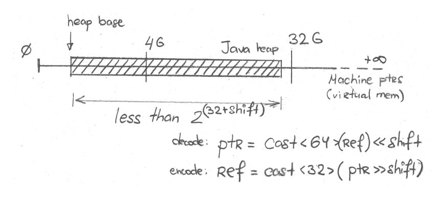
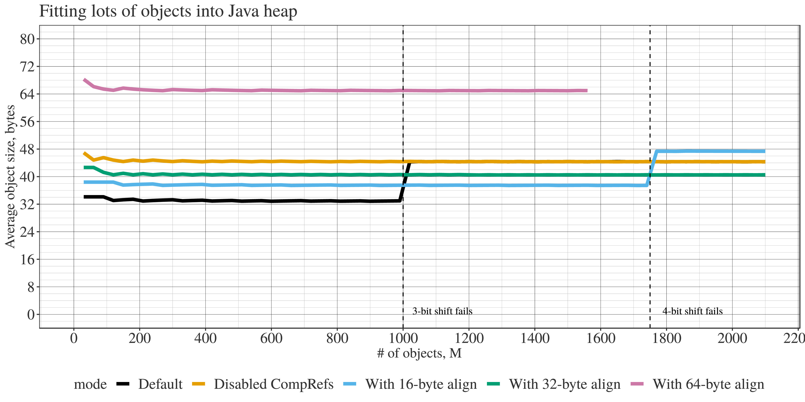

原文地址：[JVM Anatomy Quark #24: Object Alignment](https://shipilev.net/jvm/anatomy-quarks/24-object-alignment/)

## 问题

* Java 对象有对齐的限制么？
* 我听说 Java 对象是 8 字节对齐的，是这样么？
* 我可以通过调整对齐来改善压缩引用的性能么？


## 理论

许多硬件实现要求对数据的访问是*对齐*的，这使得 N 字节宽度数据的访问地址总是 N 的倍数。即使对数据的普通访问没用特殊要求，特殊操作（特别是原子操作）通常也有对齐约束。

举例来说，x86 平台通常接受未对齐的读写操作，跨越两个缓存行的未对齐 CAS 操作也可以工作，但是对齐可以提高吞吐量。其它平台可能会直接拒绝这样的原子操作，产生一个 `SIGBUS` 信号或者另外一种硬件异常。对于跨越多个缓存行的数据，x86 平台也不会保证访问的原子性，这可能发生在未对齐的情况下。另外对于大部分类型和明确声明 `volatile` 的访问，Java 规范要求保证访问的原子性。

所以对于 Java 对象中的 `long` 字段，这占用 8 字节内存，基于性能因素，我们需要保证 8 字节对齐。如果该字段是 `volatile` 的，那么基于正确性的因素，我们也需要 8 字节对齐。在一个简单的方法中<sup>[1]</sup>，为了实现这一点，需要做两件事：对象内部字段的偏移应该 8 字节对齐，**以及**对象本身应该 8 字节对齐。`java.lang.Long` 实例就是这样的：<sup>[2]</sup>

```
$ java -jar jol-cli.jar internals java.lang.Long
# Running 64-bit HotSpot VM.
# Using compressed oop with 3-bit shift.
# Using compressed klass with 3-bit shift.
# Objects are 8 bytes aligned.
# Field sizes by type: 4, 1, 1, 2, 2, 4, 4, 8, 8 [bytes]
# Array element sizes: 4, 1, 1, 2, 2, 4, 4, 8, 8 [bytes]

java.lang.Long object internals:
 OFFSET  SIZE   TYPE DESCRIPTION              VALUE
      0     4        (object header)          01 00 00 00
      4     4        (object header)          00 00 00 00
      8     4        (object header)          ce 21 00 f8
     12     4        (alignment/padding gap)
     16     8   long Long.value               0
Instance size: 24 bytes
Space losses: 4 bytes internal + 0 bytes external = 4 bytes total
```

`value` 字段位于偏移 16 字节（这是 8 的倍数）的位置，并且对象 8 字节对齐。

即使没有字段需要被特殊对待，但是对象头部仍然需要原子性访问。从技术上讲，大部分 Java 对象可以 4 字节对齐，而不是 8 字节，然而实现这一目标所需的运行时工作[非常巨大](https://bugs.openjdk.java.net/browse/JDK-8025677)。

所以在 Hotspot 中最小的对象对齐是 8 字节。不过，对齐可以更大吗？当然可以，有一个对应的 VM 参数：`-XX:ObjectAlignmentInBytes`。这带来两个后果，一个负面的，一个正面的。

### 实例大小变大

当然一旦对齐变大，就意味着每个对象平均的内存空间浪费将会增加。例如将对象对齐从 16 字节增加至 128 字节：

```
$ java -XX:ObjectAlignmentInBytes=16 -jar jol-cli.jar internals java.lang.Long

java.lang.Long object internals:
 OFFSET  SIZE   TYPE DESCRIPTION                               VALUE
      0     4        (object header)                           01 00 00 00
      4     4        (object header)                           00 00 00 00
      8     4        (object header)                           c8 10 01 00
     12     4        (alignment/padding gap)
     16     8   long Long.value                                0
     24     8        (loss due to the next object alignment)
Instance size: 32 bytes
Space losses: 4 bytes internal + 8 bytes external = 12 bytes total
```

```
$ java -XX:ObjectAlignmentInBytes=128 -jar jol-cli.jar internals java.lang.Long

java.lang.Long object internals:
 OFFSET  SIZE   TYPE DESCRIPTION                               VALUE
      0     4        (object header)                           01 00 00 00
      4     4        (object header)                           00 00 00 00
      8     4        (object header)                           a8 24 01 00
     12     4        (alignment/padding gap)
     16     8   long Long.value                                0
     24   104        (loss due to the next object alignment)
Instance size: 128 bytes
Space losses: 4 bytes internal + 104 bytes external = 108 bytes total
```

见鬼，每个实例 128 字节，而只有 8 字节有用数据，这太浪费了。为什么有人会这么做？

### 压缩引用阈值被移动

*（一语双关）*

还记得[《压缩引用》](https://shipilev.net/jvm/anatomy-quarks/23-compressed-references/)中的这张图吗？



我们可以通过引用移位对大于 4GB 的堆内存启用压缩引用。移位的大小依赖引用中有多少低位比特是零。也就是，对象是如何对齐的！默认 8 字节对齐，那么最低 3 位是零，所以移动 3 位，那么就有 2<sup>(32+3)</sup>字节 = 32 GB 压缩引用空间。如果 16 字节对齐，那么就有 2<sup>(32+4)</sup>字节 = 64 GB *压缩引用*堆空间！

## 实验

所以对象对齐增加了实例大小，这增加了堆内存占用；但是可以在大堆内存上启用引用压缩，这减少了堆内存占用！依赖堆内存的结构。我们可以使用之前的测试用例，但是稍微自动化一下。

这个测试用例尝试识别容纳给定数量对象的最小堆内存：

```
import java.io.*;
import java.util.*;

public class CompressedOopsAllocate {

  static final int MIN_HEAP = 0 * 1024;
  static final int MAX_HEAP = 100 * 1024;
  static final int HEAP_INCREMENT = 128;

  static Object[] arr;

  public static void main(String... args) throws Exception {
    if (args.length >= 1) {
      int size = Integer.parseInt(args[0]);
      arr = new Object[size];
      IntStream.range(0, size).parallel().forEach(x -> arr[x] = new byte[(x % 20) + 1]);
      return;
    }

    String[] opts = new String[]{
      "",
      "-XX:-UseCompressedOops",
      "-XX:ObjectAlignmentInBytes=16",
      "-XX:ObjectAlignmentInBytes=32",
      "-XX:ObjectAlignmentInBytes=64",
    };

    int[] lastPasses = new int[opts.length];
    int[] passes = new int[opts.length];
    Arrays.fill(lastPasses, MIN_HEAP);

    for (int size = 0; size < 3000; size += 30) {
      for (int o = 0; o < opts.length; o++) {
        passes[o] = 0;
        for (int heap = lastPasses[o]; heap < MAX_HEAP; heap += HEAP_INCREMENT) {
          if (tryWith(size * 1000 * 1000, heap, opts[o])) {
            passes[o] = heap;
            lastPasses[o] = heap;
            break;
          }
        }
      }

      System.out.println(size + ", " + Arrays.toString(passes).replaceAll("[\\[\\]]",""));
    }
  }

  private static boolean tryWith(int size, int heap, String... opts) throws Exception {
    List<String> command = new ArrayList<>();
    command.add("java");
    command.add("-XX:+UnlockExperimentalVMOptions");
    command.add("-XX:+UseEpsilonGC");
    command.add("-XX:+UseTransparentHugePages"); // faster this way
    command.add("-XX:+AlwaysPreTouch");          // even faster this way
    command.add("-Xmx" + heap + "m");
    Arrays.stream(opts).filter(x -> !x.isEmpty()).forEach(command::add);
    command.add(CompressedOopsAllocate.class.getName());
    command.add(Integer.toString(size));

    Process p = new ProcessBuilder().command(command).start();
    return p.waitFor() == 0;
  }
}
```

在可以分配 100+ GB 堆的大内存机器上执行这个测试用例，这将会得出预期的结果。让我们从平均对象大小开始讨论。注意这些是*特定测试中的*平均对象大小，也就是分配的一些小 `byte[]` 数组。结果如下：



意料之中，增大对齐增加了平均对象大小：16 字节和 32 字节对齐“稍微”增加了对象大小，但是 64 字节大幅增加了平均对象大小。注意对象对齐基本上表示对象的*最小*大小，一旦最小值增加了，平均值也会增加。

正如我们在[《压缩引用》](https://shipilev.net/jvm/anatomy-quarks/23-compressed-references/)中看到的，堆内存达到 32 GB 压缩引用将会失效。但是注意**更大的对齐将会延迟这一限制，对齐越大，内存空间越大**。例如，16 字节对齐，将会在压缩引用中移动 4 位，也就是 64GB 空间。32 字节对齐移动5 位，也就是 128GB 空间。<sup>[3]</sup>在这个测试中，某些情况下对齐变大导致的对象变大将会与压缩引用减少的空间占用相抵消。当然，当压缩引用最后被关闭时，对齐的成本就表现出来了。

在“最小堆大小”图中可以很清楚看到这种现象：


Here, we clearly see the 32 GB and 64 GB failure thresholds. Notice how 16-byte and 32-byte alignment took *less heap* in some configurations, piggybacking on more efficient reference encoding. That improvement is not universal: when 8-byte alignment is enough or when compressed references fail, higher alignments waste memory.

在这里我们可以清楚看到 32 GB 和 64 GB 这两个阈值。注意 16 字节和 32 字节对齐在某些情况下如何占用*更少堆内存*，也就是借助更有效的引用编码。这个改善并不是普遍的：当 8 字节对齐足够或者压缩引用失败的情况下，更大的对齐将会浪费内存。

## 结论

对象对齐是一件很有趣的事情。虽然它会显著增加对象大小，但是一旦启用压缩引用，这又会降低整体的内存占用。有时候为了减少内存占用，增加一点儿对齐是有意义的 [原来如此！]。然而在许多情况下，这将会增加整体内存占用。需要对给定应用程序和给定数据集进行仔细研究，以确定调整对齐是否有好处。**利器当慎用。**

* * *

1. 比较麻烦的方法是让内存管理器在不同的起始地址分配对象。这需要检查分配路径上的对象，从性能角度来看这很*有趣*。
2. 这个以及之后的内存表示都是用  [JOL](https://openjdk.java.net/projects/code-tools/jol/) 生成的。
3. 粗略计算：因为在 Hotspot 中 `-XX:ObjectAlignmentInBytes` 最大接受 256，这意味着最多移动 8 位，也就是 1024 GB 内存。
