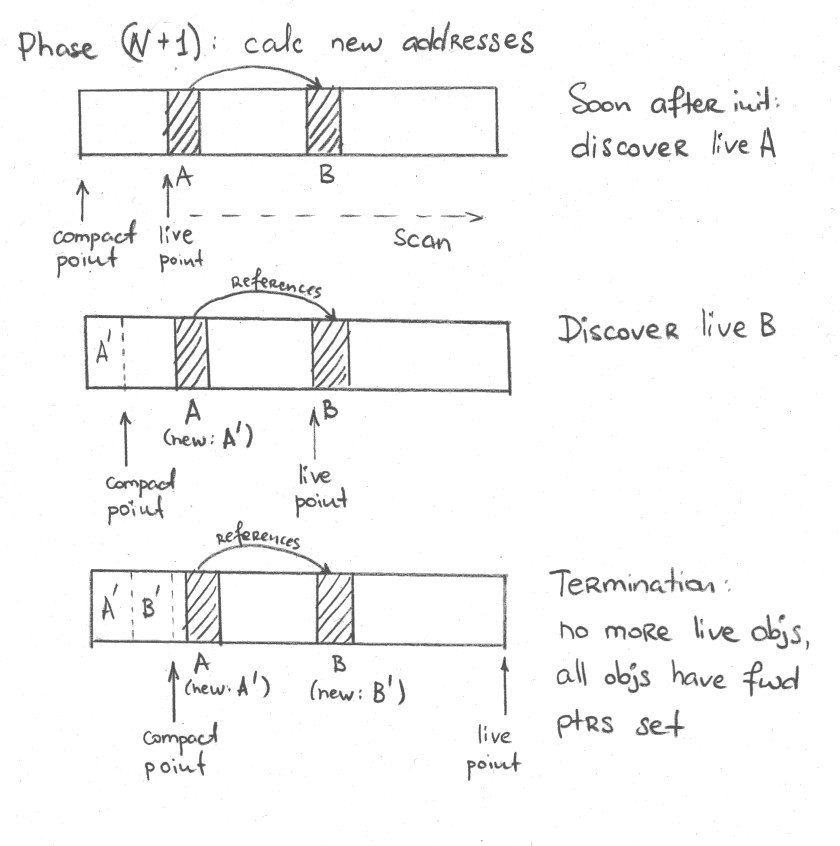
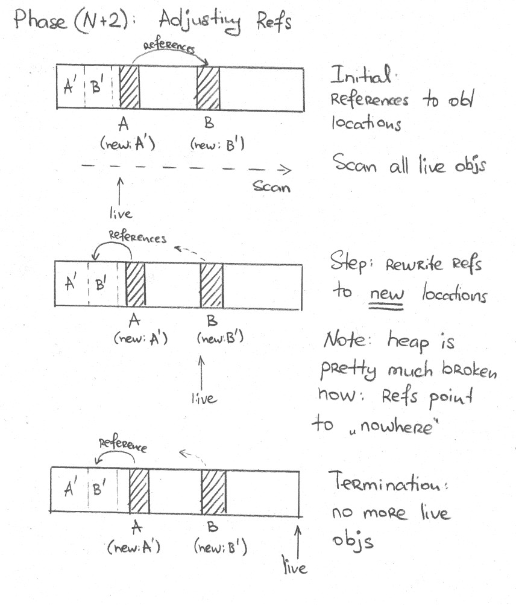
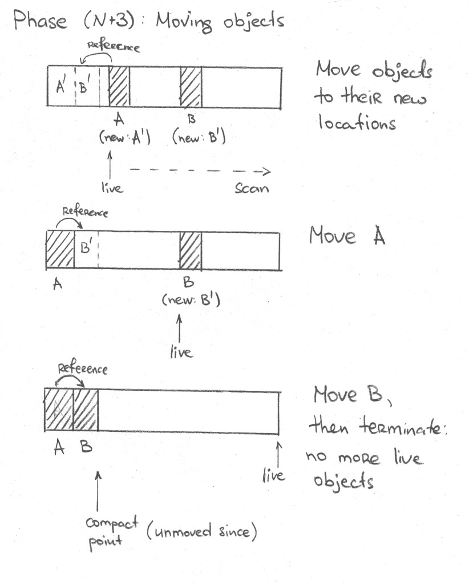

原文地址：[Do It Yourself (OpenJDK) Garbage Collector](https://shipilev.net/jvm/diy-gc/)

## 序言

构建语言运行时系统的任一部分都是一个有趣的练习。至少构建第一个 hacky 版本是这样的！但是构建一个可靠、高性能、可观察、可调试、故障可预测的运行时子系统是非常非常难的。

构建一个简单的垃圾收集器看起来很容易，我们在这里就是要实现一个简单的垃圾收集器。Roman Kennke 在 FOSDEM 2019 上使用了这个补丁的早期版本讲解演示了[“20分钟构建 GC”](https://shipilev.net/jvm/diy-gc/kennke-fosdem-2019.webm)。虽然实现的代码中包含丰富的注释，但是相关的概括性讲解还是有必要的，所以我写了这篇文章。

了解垃圾收集器基本的工作原理将会极大改善阅读体验。本文有很多关于基本思想与 Hotspot 实现的讨论，但是本文并不是关于 GC 构建的速成课程。请捡起[《GC 手册》](http://gchandbook.org)阅读关于基本 GC 的第一章，或者快速阅读[维基百科的文章](https://en.wikipedia.org/wiki/Tracing_garbage_collection)。

## 1. 构件

在许多已经实现的 GCs 基础上实现一个新的 GC 相对容易很多，因为有许多存在的经过验证和测试的构件可以重用。

### 1.1. Epsilon GC

[JEP 318: "Epsilon: A No-Op Garbage Collector (Experimental)"](https://openjdk.java.net/jeps/318) 是在 OpenJDK 11 中引入的。目的是提供内存不需要回收或者禁止回收时的最小实现。阅读 JEP 可以获取更多有用的信息。

从实现角度来看，“垃圾收集器”是一个不恰当的术语，恰当的术语是[“自动内存管理”](https://en.wikipedia.org/wiki/Category:Automatic_memory_management)，既负责分配内存又负责回收内存。由于 Epsilon GC 只实现了“分配”内存，并没有实现“回收”内存，所以这是一个很好的白板，可以在其基础上实现真正的 GC 算法。

#### 1.1.1. 分配

Epsilon GC 主要实现了[分配逻辑](http://hg.openjdk.java.net/jdk/jdk/file/6c96d42ec3e7/src/hotspot/share/gc/epsilon/epsilonHeap.cpp#l173)。响应分配任意大小内存和分配给定大小[线程本地分配缓冲区(TLAB)](https://shipilev.net/jvm-anatomy-park/4-tlab-allocation/)的外部请求。该实现不会尝试将 TLABs 扩张很大，因为没有回收的逻辑，浪费的字节永远不会被回收。

#### 1.1.2. 屏障

某些垃圾收集器通过强制运行时系统和应用程序访问堆内存时执行*GC 屏障*，以维护与应用程序交互的 GC 不变式。所有并行收集器都需要屏障，[某些分代的万物静止收集器也需要屏障](https://shipilev.net/jvm-anatomy-park/13-intergenerational-barriers/)。

Epsilon 不需要屏障，但是运行时系统和编译器仍然需要*知道*屏障是空操作。到处关联这些信息将会非常令人厌烦。幸运的是 OpenJDK 11 中的 [JEP-304: "Garbage Collection Interface"](https://openjdk.java.net/jeps/304) 使得插入屏障非常整洁。尤其是 Epsilon 的屏障集合[是空的](http://hg.openjdk.java.net/jdk/jdk/file/tip/src/hotspot/share/gc/epsilon/epsilonBarrierSet.hpp)，所以将所有琐碎的工作 —— 加载、存储、CAS 和数组拷贝 —— 委托给基本的屏障集合即可。如果我们构建的 GC 仍然不需要屏障，那么简单地重用 Epsilon 的实现即可。

#### 1.1.3. 监控钩子

实现 GC 最后一块麻烦的部分是关联监控设施到 JVM：MX beans 需要可以工作，诊断命名也需要可以工作，等。Epsilon [已经为我们处理了这个问题](http://hg.openjdk.java.net/jdk/jdk/file/tip/src/hotspot/share/gc/epsilon/epsilonMonitoringSupport.cpp)。

### 1.2. 运行时系统与 GC

#### 1.2.1. 根

通常来说垃圾收集器需要知道 Java 运行时系统的哪些部分持有 Java 堆的引用。这些位置，[*GC 根*](https://en.wikipedia.org/wiki/Tracing_garbage_collection)，包含线程栈和局部变量（包含 JIT编译后的代码中的局部变量！），本地类和类加载器，JNI 句柄，等。知道根集合是很困难的。但是在 Hotspot 中，这些位置由每个 VM 子系统跟踪，我们可以仔细研究现有的 GC 实现如何处理它们。你将会在下面的实现章节看到这些内容。

#### 1.2.2. 对象遍历

垃圾收集器也需要遍历 Java 对象向外的引用。因为这是一个普遍存在的操作，所以共享的运行时系统已经为 GCs 提供了对象遍历器，不需要我们自己去实现。例如你在下面的实现章节将会看到 `obj→oop_iterate` 调用。

#### 1.2.3. 移动信息（Forwarding Data）

移动的垃圾收集器需要记录被移动对象的新位置。有许多位置可以用于记录*移动信息*：

1. [重用对象中的“标记字段”](http://hg.openjdk.java.net/jdk/jdk/file/6c96d42ec3e7/src/hotspot/share/oops/oop.inline.hpp#l341)（Serial、Parallel 等）。当万物静止时，所有对象字段的访问都是可控的，Java 线程看不到存储在对象字段中的临时数据。我们可以重用这些字段存储移动信息。
2. 维护单独的本地移动表（[ZGC](http://openjdk.java.net/jeps/333)、C4 等）。这将会完全隔离 GC 与运行时系统和应用程序其它部分，因为只有 GC 知道移动表的存在。这就是并行 GC 通常采用这种方式的原因：避免互相干扰。
3. 在对象中添加额外的字段（[Shenandoah](http://openjdk.java.net/jeps/189)等）。这组合了上述两种方法，既让运行时系统和应用程序使用存在的头部字段工作，又保存了移动信息。

#### 1.2.4. 标记信息（Marking Data）

Garbage collectors need to record the reachability (marking) data somewhere. Again, there are several ways where to store it:

垃圾收集器需要记录可达性（标记）信息。这些信息也有不同的方式存储：

1. 重用对象的“标记字段（mark word）”（Serial、Parallel等）。在万物静止模式，我们可以使用标记字段编码“标记”属性。如果我们需要遍历所有存活的对象，我们可以利用 [堆可解析性](https://shipilev.net/jvm-anatomy-park/5-tlabs-and-heap-parsability/)一个对象一个对象遍历堆内存。
2. 维护单独的标记信息数据结构（G1, [Shenandoah](http://openjdk.java.net/jeps/189)等）。通常来说这是一个[单独的位图](http://hg.openjdk.java.net/jdk/jdk/file/6c96d42ec3e7/src/hotspot/share/gc/shared/markBitMap.hpp)，将 Java 堆内存的 N 字节映射到标记位图的 1 比特。通常 Java 对象是 8 字节对齐的，所以标记位图将 64 比特映射到 1 比特，占用堆大小 1/64 的本地内存。与扫描整个堆寻找存活对象相比，这点儿成本将换来可观的收益，特别是在存活对象比较稀疏的情况下：遍历位图通常来说比遍历可解析的堆内存快很多。
3. 将标记信息编码在引用本身（[ZGC](http://openjdk.java.net/jeps/333)、C4 等）。这需要协调应用程序从引用中剔除标记信息，或者通过其它技巧维护正确性。换句话说，这需要 GC 屏障或更多 GC 工作。

## 2. 大计划

毫无疑问基于 Epsilon 可以实现的最简单的 GC 是 LISP2 那样的标记-整理（Mark-Compact）算法。你可以从[相关的维基百科条目](https://en.wikipedia.org/wiki/Mark-compact_algorithm#LISP2_algorithm)或[《GC 手册》 的 3.2 章](http://gchandbook.org)了解该 GC 的基本思想。虽然你可以通过下述实现章节了解算法的执行，但是建议你阅读一下上述参考材料。

这里讨论的算法是*滑动* GC：通过将对象滑动到堆的起始位置来移动对象。它具有下述优点和缺点：

* 可以保持分配顺序。这对于控制内存布局非常有用，如果你确实很介意的话（控制狂，欢呼吧！），但是相应的缺点是失去了[自动访问局部性](https://shipilev.net/jvm-anatomy-park/11-moving-gc-locality/)（booo!）。
* 相对于对象数量的时间复杂度是 O(N)。然而这个线性复杂度是有成本的，每个 GC 周期需要遍历堆内存4次。
* 不需要任何额外 Java 堆内存！不需要预留疏散存活对象的堆内存，即使使用了 99.(9)% 的堆内存也可以正常工作。如果我们选择其它简单的 GC，例如半空间清扫器（semi-space scavenger），那么我们需要重新构建堆的表示方式，为疏散预留一些空间，这些超出了本文的范围。
* GC 未启动时不会产生空间和时间开销。分配区域处于任意状态都可以启动，结束时处于密集压缩的状态。这非常适合 Epsilon 实现：从压缩后的状态继续分配。这也是它的缺点：如果堆内存起始位置有很多死亡对象，那么将会导致大量的对象移动。
* 不需要任何新的屏障，也就是说不需要修改 `EpsilonBarrierSet`。

简单起见，该 GC 实现将会是万物静止的，而且不分代，单线程执行。在这种情况下可以使用标记位图存储标记信息，重用标记字段存储移动信息。

## 3. 实现 GC 核心

一下子阅读[完整的实现](https://shipilev.net/jvm/diy-gc/webrev/)可能是比较困难的，所以本章将会逐一介绍。

### 3.1. Prologue

GC 通常需要做一些准备工作。阅读下述注释即可，不需要额外说明了。

```
{
  GCTraceTime(Info, gc) time("Step 0: Prologue", NULL);

  // Commit marking bitmap memory. There are several upsides of doing this
  // before the cycle: no memory is taken if GC is not happening, the memory
  // is "cleared" on first touch, and untouched parts of bitmap are mapped
  // to zero page, boosting performance on sparse heaps.
  if (!os::commit_memory((char*)_bitmap_region.start(), _bitmap_region.byte_size(), false)) {
    log_warning(gc)("Could not commit native memory for marking bitmap, GC failed");
    return;
  }

  // We do not need parsable heap for this algorithm to work, but we want
  // threads to give up their TLABs.
  ensure_parsability(true);

  // Tell various parts of runtime we are doing GC.
  CodeCache::gc_prologue();
  BiasedLocking::preserve_marks();

  // Derived pointers would be re-discovered during the mark.
  // Clear and activate the table for them.
  DerivedPointerTable::clear();
}
```

由于我们使用标记位图跟踪对象是否可达，所以在使用之前需要清理位图。或者，由于我们的目的是在 GC 周期到来之前不占用资源，所以我们需要首先[申请位图的内存](https://www.codeproject.com/Articles/1255908/Allocating-Memory-on-Linux-and-Windows)。这带来一些有趣的优势，至少对于 Linux 是这样，位图的大部分将会映射到零页，特别是对于稀疏堆的情况。

线程需要放弃当前的 TLAB，在 GC 结束之后申请新的。<sup>[1]</sup>

运行时系统的某些部分，特别是需要处理 Java 堆引用的部分，会被 GC 破坏，所以我们需要通知它们 GC 将要开始工作了。这将使得这些子系统准备或者保存 GC 移动之前的状态。

### 3.2. 标记

一旦所有的模块都准备好，进行万物静止的标记就相对简单了。标记过程非常通用，这通常是 GC 实现的第一步。

```
{
  GCTraceTime(Info, gc) time("Step 1: Mark", NULL);

  // Marking stack and the closure that does most of the work. The closure
  // would scan the outgoing references, mark them, and push newly-marked
  // objects to stack for further processing.
  EpsilonMarkStack stack;
  EpsilonScanOopClosure cl(&stack, &_bitmap);

  // Seed the marking with roots.
  process_roots(&cl);
  stat_reachable_roots = stack.size();

  // Scan the rest of the heap until we run out of objects. Termination is
  // guaranteed, because all reachable objects would be marked eventually.
  while (!stack.is_empty()) {
    oop obj = stack.pop();
    obj->oop_iterate(&cl);
    stat_reachable_heap++;
  }

  // No more derived pointers discovered after marking is done.
  DerivedPointerTable::set_active(false);
}
```

就像其它的图遍历问题一样：从初始的可达节点集合开始，遍历所有出边，记录所有访问到的节点，重复这样操作，直到遍历完未访问节点为止。在 GC 的问题中，“节点”就是对象，“边”是对象之间的引用。

从技术上讲，我们可以用递归遍历对象图，但是这不是一个好主意，因为图可能很大。设想一下遍历十亿个节点的路径。所以为了限制递归的深度，我们可以使用标记栈来记录发现的对象。

可达对象的初始集合来自 GC 根。现在不需要纠结 `process_roots` 的内部细节，稍后我们会介绍。到目前为止只需要假设该方法遍历 VM 中所有可达对象。

The marking bitmap serves both as the thing that tracks the *marking wavefront* (the set of already visited objects), and in the end gives us the desired output: the set of all reachable objects. The actual work in done in the `EpsilonScanOopClosure`,<sup>[[2](https://shipilev.net/jvm/diy-gc/#_footnote_2 "View footnote.")]</sup> that would be applied to all interesting objects, and which iterates all references in a given object, and here it is:

标记位图既可以追踪*标记波前（marking wavefront）*（已经访问的对象集合），也能最后给出所需的输出：可达对象的集合。`EpsilonScanOopClosure`<sup>[2]</sup> 完成了实际的工作，应用于所有相关的对象，迭代给定对象的所有引用：

```
class EpsilonScanOopClosure : public BasicOopIterateClosure {
private:
  EpsilonMarkStack* const _stack;
  MarkBitMap* const _bitmap;

  template <class T>
  void do_oop_work(T* p) {
    // p is the pointer to memory location where oop is, load the value
    // from it, unpack the compressed reference, if needed:
    T o = RawAccess<>::oop_load(p);
    if (!CompressedOops::is_null(o)) {
      oop obj = CompressedOops::decode_not_null(o);

      // Object is discovered. See if it is marked already. If not,
      // mark and push it on mark stack for further traversal.
      if (_bitmap->par_mark(obj)) {
         _stack->push(obj);
      }
    }
  }
};
```

这步完成以后，`_bitmap` 包含了所有存活对象位置的比特集合。我们可以这样遍历所有存活对象：

```
// Walk the marking bitmap and call object closure on every marked object.
// This is much faster that walking a (very sparse) parsable heap, but it
// takes up to 1/64-th of heap size for the bitmap.
void EpsilonHeap::walk_bitmap(ObjectClosure* cl) {
   HeapWord* limit = _space->top();
   HeapWord* addr = _bitmap.get_next_marked_addr(_space->bottom(), limit);
   while (addr < limit) {
     oop obj = oop(addr);
     assert(_bitmap.is_marked(obj), "sanity");
     cl->do_object(obj);
     addr += 1;
     if (addr < limit) {
       addr = _bitmap.get_next_marked_addr(addr, limit);
     }
   }
}
```

### 3.3. 计算新位置

这部分也很简单，主要是算法的实现。

 

```
// We are going to store forwarding information (where the new copy resides)
// in mark words. Some of those mark words need to be carefully preserved.
// This is an utility that maintains the list of those special mark words.
PreservedMarks preserved_marks;

// New top of the allocated space.
HeapWord* new_top;

{
  GCTraceTime(Info, gc) time("Step 2: Calculate new locations", NULL);

  // Walk all alive objects, compute their new addresses and store those
  // addresses in mark words. Optionally preserve some marks.
  EpsilonCalcNewLocationObjectClosure cl(_space->bottom(), &preserved_marks);
  walk_bitmap(&cl);

  // After addresses are calculated, we know the new top for the allocated
  // space. We cannot set it just yet, because some asserts check that objects
  // are "in heap" based on current "top".
  new_top = cl.compact_point();

  stat_preserved_marks = preserved_marks.size();
}
```

 这里唯一的问题是我们将新的地址存储在 Java 对象的标记字段中，这些标记字段可能处于其他用途，比如保存锁信息。幸运的是，这些有意义的标记字段很少，如果有需要，我们可以单独存储，这就是 `PreservedMarks` 的作用。

`EpsilonCalcNewLocationObjectClosure` 实际上执行了算法的步骤：

```
class EpsilonCalcNewLocationObjectClosure : public ObjectClosure {
private:
  HeapWord* _compact_point;
  PreservedMarks* const _preserved_marks;

public:
  EpsilonCalcNewLocationObjectClosure(HeapWord* start, PreservedMarks* pm) :
                                      _compact_point(start),
                                      _preserved_marks(pm) {}

  void do_object(oop obj) {
    // Record the new location of the object: it is current compaction point.
    // If object stays at the same location (which is true for objects in
    // dense prefix, that we would normally get), do not bother recording the
    // move, letting downstream code ignore it.
    if ((HeapWord*)obj != _compact_point) {
      markOop mark = obj->mark_raw();
      if (mark->must_be_preserved(obj)) {
        _preserved_marks->push(obj, mark);
      }
      obj->forward_to(oop(_compact_point));
    }
    _compact_point += obj->size();
  }

  HeapWord* compact_point() {
    return _compact_point;
  }
};
```

`forward_to` 是这里的关键部分：将“移动地址”存储在对象的标记字段中。下一步需要这些信息。

### 3.4. 调整指针

再次遍历堆内存，将所有引用重写到新的位置：

 

```
{
  GCTraceTime(Info, gc) time("Step 3: Adjust pointers", NULL);

  // Walk all alive objects _and their reference fields_, and put "new
  // addresses" there. We know the new addresses from the forwarding data
  // in mark words. Take care of the heap objects first.
  EpsilonAdjustPointersObjectClosure cl;
  walk_bitmap(&cl);

  // Now do the same, but for all VM roots, which reference the objects on
  // their own: their references should also be updated.
  EpsilonAdjustPointersOopClosure cli;
  process_roots(&cli);

  // Finally, make sure preserved marks know the objects are about to move.
  preserved_marks.adjust_during_full_gc();
}
```

有两类移动对象的引用；来自 GC 根的和来自堆内存其它对象的。我们都需要更新。某些保存的标记字段也会记录对象的引用，所以我们也需要更新。`PreservedMarks` 知道如何操作，因为“移动信息”就存储在它原来存储的位置。

这里的闭包有两种类型：一种接受对象，并且遍历其内容，另一种更新位置。这里有一点儿性能优化：如果对象没有被移动，那就不需要改写位置，所以可以节省相当多的堆内存写操作。

```
class EpsilonAdjustPointersOopClosure : public BasicOopIterateClosure {
private:
  template <class T>
  void do_oop_work(T* p) {
    // p is the pointer to memory location where oop is, load the value
    // from it, unpack the compressed reference, if needed:
    T o = RawAccess<>::oop_load(p);
    if (!CompressedOops::is_null(o)) {
      oop obj = CompressedOops::decode_not_null(o);

      // Rewrite the current pointer to the object with its forwardee.
      // Skip the write if update is not needed.
      if (obj->is_forwarded()) {
        oop fwd = obj->forwardee();
        assert(fwd != NULL, "just checking");
        RawAccess<>::oop_store(p, fwd);
      }
    }
  }
};

class EpsilonAdjustPointersObjectClosure : public ObjectClosure {
private:
  EpsilonAdjustPointersOopClosure _cl;
public:
  void do_object(oop obj) {
    // Apply the updates to all references reachable from current object:
    obj->oop_iterate(&_cl);
  }
};
```

这步完成之后，堆内存基本上毁坏了：引用指向了“错误”的位置，因为对象还没有移动。让我们修正这个问题吧！

### 3.5. 移动对象

是时候将对象移到新位置了，算法的步骤如下：

 

再次遍历堆内存，将闭包 `EpsilonMoveObjects` 应用到所有存活对象：

```
{
  GCTraceTime(Info, gc) time("Step 4: Move objects", NULL);

  // Move all alive objects to their new locations. All the references are
  // already adjusted at previous step.
  EpsilonMoveObjects cl;
  walk_bitmap(&cl);
  stat_moved = cl.moved();

  // Now we moved all objects to their relevant locations, we can retract
  // the "top" of the allocation space to the end of the compacted prefix.
  _space->set_top(new_top);
}
```

这步完成之后，我们可以将分配的空间收缩到压缩点，GC 周期结束之后内存分配逻辑就可以从这里开始分配。

Note that sliding GC means we can *overwrite* the contents of existing objects, but since we are scanning in one direction, that means the object we are overwriting is already copied out to its proper location. <sup>[[3](https://shipilev.net/jvm/diy-gc/#_footnote_3 "View footnote.")]</sup> So, the closure itself just moves the forwarded objects to their new locations:

注意滑动 GC 意味着我们会*覆写*存在对象的内容，但是因为我们是一个方向扫描，所以覆写的对象已经复制到了合适的位置。<sup>[3]</sup>所以这个闭包的逻辑仅仅是将对象移动到新的位置：

```
class EpsilonMoveObjects : public ObjectClosure {
public:
  void do_object(oop obj) {
    // Copy the object to its new location, if needed. This is final step,
    // so we have to re-initialize its new mark word, dropping the forwardee
    // data from it.
    if (obj->is_forwarded()) {
      oop fwd = obj->forwardee();
      assert(fwd != NULL, "just checking");
      Copy::aligned_conjoint_words((HeapWord*)obj, (HeapWord*)fwd, obj->size());
      fwd->init_mark_raw();
    }
  }
};
```

### 3.6. Epilogue

GC 结束了，现在堆内存再一次一致了，我们还需要做一些收尾工作：

```
{
  GCTraceTime(Info, gc) time("Step 5: Epilogue", NULL);

  // Restore all special mark words.
  preserved_marks.restore();

  // Tell the rest of runtime we have finished the GC.
  DerivedPointerTable::update_pointers();
  BiasedLocking::restore_marks();
  CodeCache::gc_epilogue();
  JvmtiExport::gc_epilogue();

  // Marking bitmap is not needed anymore
  if (!os::uncommit_memory((char*)_bitmap_region.start(), _bitmap_region.byte_size())) {
    log_warning(gc)("Could not uncommit native memory for marking bitmap");
  }

  // Return all memory back if so requested. On large heaps, this would
  // take a while.
  if (EpsilonUncommit) {
    _virtual_space.shrink_by((_space->end() - new_top) * HeapWordSize);
    _space->set_end((HeapWord*)_virtual_space.high());
  }
}
```

通知运行时系统的其他部分执行 GC 后的清理、修正工作。恢复我们之前保存的特殊的标记字段。跟标记位图说再见吧，我们不需要它了。

如果我们愿意，我们可以将提交的空间收缩到新的分配点，将多余的内存还给 OS！

## 4. 将 GC 连接到 VM

### 4.1. 根遍历

还记得需要遍历 VM 中特殊的隐含可达的引用么？这是通过查询相关的 VM 子系统完成的，相关的子系统会遍历对其它 Java 对象隐藏的引用。当前 Hotspot 中根的详尽列表如下：

```
void EpsilonHeap::do_roots(OopClosure* cl) {
  // Need to tell runtime we are about to walk the roots with 1 thread
  StrongRootsScope scope(1);

  // Need to adapt oop closure for some special root types.
  CLDToOopClosure clds(cl, ClassLoaderData::_claim_none);
  MarkingCodeBlobClosure blobs(cl, CodeBlobToOopClosure::FixRelocations);

  // Walk all these different parts of runtime roots. Some roots require
  // holding the lock when walking them.
  {
    MutexLockerEx lock(CodeCache_lock, Mutex::_no_safepoint_check_flag);
    CodeCache::blobs_do(&blobs);
  }
  {
    MutexLockerEx lock(ClassLoaderDataGraph_lock);
    ClassLoaderDataGraph::cld_do(&clds);
  }
  Universe::oops_do(cl);
  Management::oops_do(cl);
  JvmtiExport::oops_do(cl);
  JNIHandles::oops_do(cl);
  WeakProcessor::oops_do(cl);
  ObjectSynchronizer::oops_do(cl);
  SystemDictionary::oops_do(cl);
  Threads::possibly_parallel_oops_do(false, cl, &blobs);
}
```

可以并行遍历根。对于我们单线程 GC 的场景，简单的遍历就可以了。

### 4.2. 安全点与万物静止

因为我们的 GC 是万物静止的，所以我们需要请求 VM 执行实际的万物静止停顿。在 Hotspot 中，这是通过实现一个新的 `VM_Operation` 达成的，它会调用我们的 GC 代码，并且要求 VM 线程执行它：

```
// VM operation that executes collection cycle under safepoint
class VM_EpsilonCollect: public VM_Operation {
private:
  const GCCause::Cause _cause;
  EpsilonHeap* const _heap;
  static size_t _last_used;
public:
  VM_EpsilonCollect(GCCause::Cause cause) : VM_Operation(),
                                            _cause(cause),
                                            _heap(EpsilonHeap::heap()) {};

  VM_Operation::VMOp_Type type() const { return VMOp_EpsilonCollect; }
  const char* name()             const { return "Epsilon Collection"; }

  virtual bool doit_prologue() {
    // Need to take the Heap lock before managing backing storage.
    // This also naturally serializes GC requests, and allows us to coalesce
    // back-to-back allocation failure requests from many threads. There is no
    // need to handle allocation failure that comes without allocations since
    // last complete GC. Waiting for 1% of heap allocated before starting next
    // GC seems to resolve most races.
    Heap_lock->lock();
    size_t used = _heap->used();
    size_t capacity = _heap->capacity();
    size_t allocated = used > _last_used ? used - _last_used : 0;
    if (_cause != GCCause::_allocation_failure || allocated > capacity / 100) {
      return true;
    } else {
      Heap_lock->unlock();
      return false;
    }
  }

  virtual void doit() {
    _heap->entry_collect(_cause);
  }

  virtual void doit_epilogue() {
    _last_used = _heap->used();
    Heap_lock->unlock();
  }
};

size_t VM_EpsilonCollect::_last_used = 0;

void EpsilonHeap::vmentry_collect(GCCause::Cause cause) {
  VM_EpsilonCollect vmop(cause);
  VMThread::execute(&vmop);
}
```

当所有线程都想要执行 GC 时（通常在内存耗尽时发生），这也有助于解决性能敏感的争用。

### 4.3. 分配失败

虽然显式执行 GC 很好，但是我们也希望 GC 对堆内存耗尽做出反应。将 `allocate_work` 调用替换成这个包装了分配失败执行 GC 的方法即可：

```
HeapWord* EpsilonHeap::allocate_or_collect_work(size_t size) {
  HeapWord* res = allocate_work(size);
  if (res == NULL && EpsilonSlidingGC) {
    vmentry_collect(GCCause::_allocation_failure);
    res = allocate_work(size);
  }
  return res;
}
```

到这里！全部完成了。

## 5. 构建

[这个补丁](https://shipilev.net/jvm/diy-gc/webrev/)可以毫无问题的应用于 OpenJDK。

```
$ hg clone https://hg.openjdk.java.net/jdk/jdk/ jdk-jdk
$ cd jdk-jdk
$ curl https://shipilev.net/jvm/diy-gc/webrev/jdk-jdk-epsilon.changeset | patch -p1
```

然后像往常一样构建 OpenJDK：

```
$ ./configure --with-debug-level=fastdebug
$ make images
```

然后像往常一样执行：

```
$ build/linux-x86_64-server-fastdebug/images/jdk/bin/java -XX:+UnlockExperimentalVMOptions -XX:+UseEpsilonGC -XX:+EpsilonSlidingGC -version
openjdk version "13-internal" 2019-09-17
OpenJDK Runtime Environment (build 13-internal+0-adhoc.shade.jdk-jdk-epsilon)
OpenJDK 64-Bit Server VM (build 13-internal+0-adhoc.shade.jdk-jdk-epsilon, mixed mode, sharing)
```

## 6. 测试

如何确保 GC 实现没有问题呢？好吧，这里有一些方便的方法：

1. 断言。许多断言。Hotspot 代码中有许多断言，*fastdebug* 构建的版本会在 GC 有问题时抛出一些相关的错误。
2. 内部的验证。该实现在 GC 的最后一步会遍历所有存活对象，验证它们是正常的。在暴露给运行时和应用程序之前捕获严重的错误。
3. 测试。如果代码没有实际运行，断言和验证是无用的。可以尽早进行单元测试和集成测试，这通常是很方便的。

例如，可以这样验证这个补丁没有太严重的问题：

```
$ CONF=linux-x86_64-server-fastdebug make images run-test TEST=gc/epsilon/
Building targets 'images run-test' in configuration 'linux-x86_64-server-fastdebug'
Test selection 'gc/epsilon/', will run:
* jtreg:test/hotspot/jtreg/gc/epsilon

Running test 'jtreg:test/hotspot/jtreg/gc/epsilon'
Passed: gc/epsilon/TestAlwaysPretouch.java
Passed: gc/epsilon/TestAlignment.java
Passed: gc/epsilon/TestElasticTLAB.java
Passed: gc/epsilon/TestEpsilonEnabled.java
Passed: gc/epsilon/TestHelloWorld.java
Passed: gc/epsilon/TestLogTrace.java
Passed: gc/epsilon/TestDieDefault.java
Passed: gc/epsilon/TestDieWithOnError.java
Passed: gc/epsilon/TestMemoryPools.java
Passed: gc/epsilon/TestMaxTLAB.java
Passed: gc/epsilon/TestPrintHeapSteps.java
Passed: gc/epsilon/TestArraycopyCheckcast.java
Passed: gc/epsilon/TestClasses.java
Passed: gc/epsilon/TestUpdateCountersSteps.java
Passed: gc/epsilon/TestDieWithHeapDump.java
Passed: gc/epsilon/TestByteArrays.java
Passed: gc/epsilon/TestManyThreads.java
Passed: gc/epsilon/TestRefArrays.java
Passed: gc/epsilon/TestObjects.java
Passed: gc/epsilon/TestElasticTLABDecay.java
Passed: gc/epsilon/TestSlidingGC.java
Test results: passed: 21
TEST SUCCESS
```

对这满意么？现在使用启用验证功能的 `fastdebug` 构建版本执行实际的应用程序。没有崩溃吧？在这一点上，我们得抱有希望。

## 7. 性能

让我们用 [spring-petclinic](https://github.com/spring-projects/spring-petclinic) 运行在我们的玩具 GC 上，并且使用 Apache Bench 制造一些负载！因为工作负载几乎没有存活数据，所以分代和非分代 GCs 都合适。

使用 `-Xlog:gc -XX:+UnlockExperimentalVMOptions -XX:+UseEpsilonGC -XX:+EpsilonSlidingGC` 执行：

```
Heap: 20480M reserved, 20480M (100.00%) committed, 19497M (95.20%) used
GC(2) Step 0: Prologue 2.085ms
GC(2) Step 1: Mark 51.005ms
GC(2) Step 2: Calculate new locations 71.207ms
GC(2) Step 3: Adjust pointers 49.671ms
GC(2) Step 4: Move objects 22.839ms
GC(2) Step 5: Epilogue 1.008ms
GC(2) GC Stats: 70561 (8.63%) reachable from roots, 746676 (91.37%) reachable from heap, 91055 (11.14%) moved, 2237 (0.27%) markwords preserved
GC(2) Heap: 20480M reserved, 20480M (100.00%) committed, 37056K (0.18%) used
GC(2) Lisp2-style Mark-Compact (Allocation Failure) 20479M->36M(20480M) 197.940ms
```

200 ms？对于一个我们刚刚构建的单线程 GC 来说还不错！你可以看到四个主要阶段耗费了相同量级的时间。实际上，如果你尝试不同的堆内存占用和堆内存大小，那么就能看出一些规律：更多的存活数据意味着明显缓慢的 GC（当数据很多时，遍历存活对象并不是很容易），更大的堆内存大小意味着稍微缓慢的 GC（在稀疏堆上进行长距离遍历也会影响吞吐量）。

相对而言，分代 GC 和清除器可以轻松取胜。例如， `-Xlog:gc -XX:+UseSerialGC` 主要进行年轻代收集：

```
GC(46) Pause Young (Allocation Failure) 575M->39M(1943M) 2.603ms
GC(47) Pause Young (Allocation Failure) 575M->39M(1943M) 2.606ms
GC(48) Pause Young (Allocation Failure) 575M->39M(1943M) 2.747ms
GC(49) Pause Young (Allocation Failure) 575M->39M(1943M) 2.578ms
```

哇！2 ms。这是因为大部分对象在年轻代都死掉了，所以几乎没有 GC 工作要做。如果我们关闭 
`-Xlog:gc -XX:+UseSerialGC` 中的分代扩展，只执行 Full GC，那么结果就不太好了：
```
GC(3) Pause Full (Allocation Failure) 16385M->34M(18432M) 1969.694ms
GC(4) Pause Full (Allocation Failure) 16385M->34M(18432M) 2261.405ms
GC(5) Pause Full (Allocation Failure) 16385M->34M(18432M) 2327.577ms
GC(6) Pause Full (Allocation Failure) 16385M->34M(18432M) 2328.976ms
```

There are plenty of other metrics and scenarios one can play with. This is left as an exercise for the reader.

还有许多度量标准和测试场景。这就留给读者做练习了。

## 8. 下一步

 在这个实现的基础上还可以做很多事情。但是现有的 OpenJDK GCs 已经实现（并且测试！）了这些，所以这只是教学练习。

可以改进之处：

1. 实现引用处理。当前的实现忽略了软引用、弱引用、虚引用的存在。也忽略了 finalizeable 对象的存在。从性能角度来看，这并不理想，但是从正确性的角度来看，这很安全，因为共享的代码“只是”将所有这些引用视为总是可达的<sup>[4]</sup>，因此会像其它常规引用一样被移动和更新。正确的实现应该将共享的 `ReferenceProcessor` 连接到标记逻辑中，在标记结束之后标记和清除存活或死亡的引用。
2. 实现类卸载以及其它 VM 清理。当前的实现不会卸载类，也不会清理内部 VM 数据结构，这些数据结构可能持有不可达的对象，因此可能是冗余的。实现这部分逻辑需要处理*弱*和*强*根，默认只标记*强*根，然后查看是否存在*弱*根仍然被标记，清理死亡的根。
3. 并行化<sup>[5]</sup>。并行化最简单的方法是将堆内存划分为各个线程的区域，各个线程在各自的区域执行相同的顺序压缩。这将会在区域之间留下空隙，所以分配逻辑也需要修改以知道存在多个空闲区域。
4. 实现[密集前缀处理](https://shipilev.net/jvm/diy-gc/epsilon-dense-prefix.patch)。通常来说，正常的堆内存会形成总是可达对象的“沉淀”层，如果我们将堆内存的某些前缀指定为不能移动的，那么可以节省不少时间。然后我们可以避免计算地址，移动对象。但是我们仍然需要标记引用，调整指针。
5. 扩展密集前缀为分代。结合某些 GC 屏障的工作，我们可以分辨哪些密集前缀是需要处理的，因此节省了标记和调整指针的时间。最终，这就成了“分代的”，前缀之外执行“young”收集，有时执行压缩前缀的“full”收集。
6. 从 GC 手册中选择任意 GC 算法，尝试实现。

## 结论

这里可以得出什么结论呢？实现一个玩具 GCs 很有意思，也具有教学作用，很适合大学的 GC 课程。

产品化这个实现将是一个乏味耗时的过程，所以选择存在的收集器，进行一下调优更容易。值得注意的是，如果进一步开发，这个实现最终会变为 Serial 或 Parallel GC，这使得开发工作多少是徒劳的。

* * *

1. 不要混淆 TLAB 与 `java.lang.ThreadLocal`。从 GC 的角度来看，ThreadLocals 仍然是普通的对象，除非 Java 代码特殊处理，否则不会被清除。

2. 看，Java 在此之前就使用[闭包](https://en.wikipedia.org/wiki/Closure_(computer_programming))很酷！

3. 但是某些对象的新位置和旧位置可能重叠。例如，你可以将一个100字节的对象滑动8字节。复制例程将会保证重叠的数据正确复制，注意 `Copy::aligned_*conjoint*_words`。

4. 从 GC 角度来看， `java.lang.ref.Reference.referent` 仅仅是另一个 Java 字段，除非在遍历堆内存时特殊处理，否则这就是强可达的。Finalizable 对象拥有持有自身的 `FinalReference` 对象。

5. 标记整理的并行版本是 Shenandoah（OpenJDK 8 之后） 和 G1（OpenJDK 10 之后， [JEP 307: "Parallel Full GC for G1"](https://openjdk.java.net/jeps/307)） 的 Full GC 预设机制。
