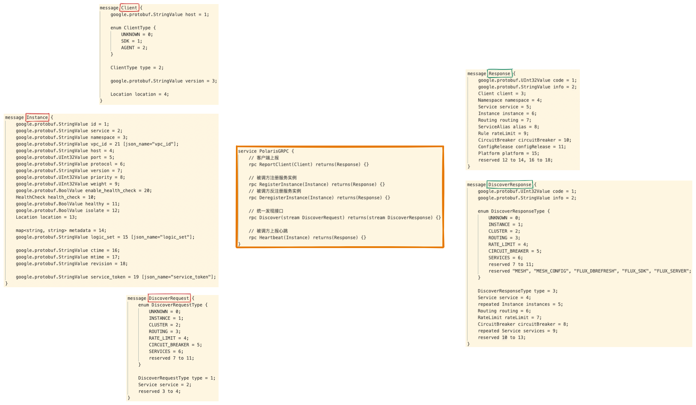
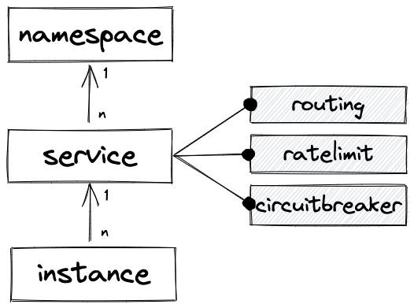

PolarisMesh 控制面的接口是如何设计的？

## 1.

PolarisMesh 控制面的接口大致可以划分为四类：
1. client，也就是各个微服务实例使用的接口；
2. console，也就是服务治理管理台使用的接口；
3. admin，也就是运维人员使用的接口；
4. config，配置相关的接口。

此外 PolarisMesh 控制面还提供了一系列兼容性包装接口，例如兼容 Istio 的 `xdsserverv3` 和兼容 Eureka 的 `eurekaserver`，以及兼容。（这部分兼容性包装接口不是本文的重点）


## 2. client 接口

PolarisMesh 控制面提供了 HTTP 协议和 GRPC 协议的 client 接口，分别实现在 `apiserver/httpserver/` 和 `apiserver/grpcserver/` 目录下。

看了一下三个主要的客户端SDK（[polaris-java](https://github.com/polarismesh/polaris-java)、[polaris-go](https://github.com/polarismesh/polaris-go)、[polaris-cpp](https://github.com/polarismesh/polaris-cpp)）都是用的 GRPC 协议，看起来 HTTP 协议更多的是用于调试。

### 2.1 client GRPC 接口

client GRPC 接口定义在 `common/api/v1/grpcapi.proto` 中：


1. ReportClient
    * 这个接口的名字有歧义，看代码逻辑是查询 client 的 location 信息，而不是字面意思的上报信息。
    * 至于该接口的功能，这里暂且存个疑，后面再解开这个疑团。
2. RegisterInstance/DeregisterInstance
    * 这个是基本功能，实例注册与注销。
3. Discover
    * 这个是统一的发现接口，INSTANCE、CLUSTER、ROUTING、RATE_LIMIT、CIRCUIT_BREAKER 和 SERVICES 这些信息的查询都是走这个接口。（可以理解为 Istio 的 xDS）
4. Heartbeat
    * 上报心跳，控制面会根据心跳时间判断实例是否健康。
    
请求和响应的参数有复用，不同的接口使用其中不同的字段，这样定义不是很清晰。

实现在 `apiserver/grpcserver/client_access.go` 中。

### 2.2 client HTTP 接口

client HTTP 接口的定义和实现在 `apiserver/httpserver/naming_client_access.go` 中：
```plain
POST /v1/ReportClient
POST /v1/Discover
POST /v1/RegisterInstance
POST /v1/DeregisterInstance
POST /v1/Heartbeat
```

HTTP 接口与 GRPC 接口一一对应，功能也是一样的。

## 3. console 接口

PolarisMesh 控制面只提供了 HTTP 协议的 console 接口，实现在 `apiserver/httpserver/` 目录下。

管理台的接口那可就多了，主要就是各种 restful 风格的增删改查。

```plain
GET /naming/v1/namespaces
...

GET /naming/v1/services
GET /naming/v1/service/circuitbreaker
...

GET /naming/v1/instances
...

GET /naming/v1/routings
...

GET /naming/v1/ratelimits
...

GET /naming/v1/circuitbreaker
...

GET /naming/v1/platforms
...
```

总体来看服务模型是这样：



一个 namespace 下有多个 service，一个 service 下有多个 instance。

每个 service 可以配置多个 routing、ratelimit 和 circuitbreaker 规则。

以 [polaris-go](https://github.com/polarismesh/polaris-go) 中的 examples 为例：

```
// 获取服务 EchoServerGolang 的信息
❯ curl -X GET 'http://127.0.0.1:8090/naming/v1/services?name=EchoServerJava'

{
 "code": 200000,
 "info": "execute success",
 "amount": 1,
 "size": 1,
 "namespaces": [
 ],
 "services": [
  {
   "name": "EchoServerJava",
   "namespace": "default",
   "metadata": {
   },
   "ports": "",
   "business": "",
   "department": "",
   "cmdb_mod1": "",
   "cmdb_mod2": "",
   "cmdb_mod3": "",
   "comment": "",
   "owners": "Polaris",
   "token": null,
   "ctime": "2022-01-25 16:48:09",
   "mtime": "2022-01-25 16:48:09",
   "revision": "9cbb710785a347739ce570019b55fbcc",
   "platform_id": "",
   "total_instance_count": 0,
   "healthy_instance_count": 0
  }
 ],
 "instances": [
 ],
 "routings": [
 ],
 "aliases": [
 ],
 "rateLimits": [
 ],
 "configWithServices": [
 ],
 "platforms": [
 ]
}%
```

```
// 获取服务 polaris_go_provider 的限流规则
❯ curl -X GET 'http://127.0.0.1:8090/naming/v1/ratelimits?service=polaris_go_provider'

{
 "code": 200000,
 "info": "execute success",
 "amount": 1,
 "size": 1,
 "namespaces": [
 ],
 "services": [
 ],
 "instances": [
 ],
 "routings": [
 ],
 "aliases": [
 ],
 "rateLimits": [
  {
   "id": "cdebc23c017340c79a53622874222a10",
   "service": "polaris_go_provider",
   "namespace": "default",
   "subset": {
   },
   "priority": 0,
   "resource": "QPS",
   "type": "LOCAL",
   "labels": {
    "env": {
     "type": "EXACT",
     "value": "test",
     "valueType": "TEXT"
    },
    "method": {
     "type": "EXACT",
     "value": "GetUser",
     "valueType": "TEXT"
    }
   },
   "amounts": [
    {
     "maxAmount": 3,
     "validDuration": "1s",
     "precision": null,
     "startAmount": null,
     "minAmount": null
    }
   ],
   "action": "REJECT",
   "disable": false,
   "report": null,
   "ctime": "2022-01-26 11:19:50",
   "mtime": "2022-01-26 11:20:04",
   "revision": "191f15ddcc5249c99d82d3ccf683ad21",
   "service_token": null,
   "adjuster": null,
   "regexCombine": null,
   "amountMode": "GLOBAL_TOTAL",
   "failover": "FAILOVER_LOCAL",
   "cluster": null,
   "method": null
  }
 ],
 "configWithServices": [
 ],
 "platforms": [
 ]
}%
```

```
// 获取服务 polaris_go_provider 的路由规则
❯ curl -X GET 'http://127.0.0.1:8090/naming/v1/routings?service=polaris_go_provider'

{
 "code": 200000,
 "info": "execute success",
 "amount": 1,
 "size": 1,
 "namespaces": [
 ],
 "services": [
 ],
 "instances": [
 ],
 "routings": [
  {
   "service": "polaris_go_provider",
   "namespace": "default",
   "inbounds": [
    {
     "sources": [
      {
       "service": "*",
       "namespace": "*",
       "metadata": {
        "env": {
         "type": "EXACT",
         "value": "dev",
         "valueType": "TEXT"
        }
       }
      }
     ],
     "destinations": [
      {
       "service": "polaris_go_provider",
       "namespace": "default",
       "metadata": {
        "env": {
         "type": "EXACT",
         "value": "test",
         "valueType": "TEXT"
        }
       },
       "priority": 0,
       "weight": 100,
       "transfer": null,
       "isolate": true
      }
     ]
    }
   ],
   "outbounds": [
   ],
   "ctime": "2022-01-26 12:26:53",
   "mtime": "2022-01-26 12:26:53",
   "revision": "",
   "service_token": null
  }
 ],
 "aliases": [
 ],
 "rateLimits": [
 ],
 "configWithServices": [
 ],
 "platforms": [
 ]
}%
```

