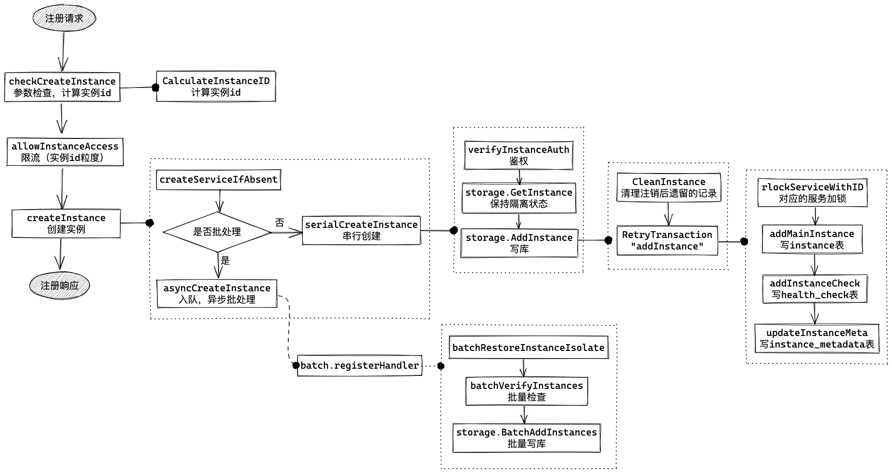

PolarisMesh 的注册发现与健康检查是如何实现的？

## 0. SDK 的封装

在分析控制面逻辑之前，我们先看一下客户端 SDK 的逻辑，以 [polaris-go](https://github.com/polarismesh/polaris-go) 为例：针对 RPC 调用关系中的两个角色，Golang SDK 分别提供的了 `ProviderAPI` 和 `ConsumerAPI` 两个 interface，这两个接口的实现逻辑只是薄薄的一层，与控制面的交互以及核心的处理逻辑都是封装在了 model 包中，其中最重要的一个 interface 就是 `Engine`。

 

本文主要关注图中标红的几个方法：注册、注销和发现的逻辑比较直观，就是与控制面进行一次 GRPC 交互；发现的逻辑稍微复杂一些，其中多了一个本地缓存。

## 1. 注册注销

### 1.1 注册

注册调的 GRPC 方法是 `rpc RegisterInstance(Instance) returns(Response)`。

请求参数 `Instance` 的字段很多，对于注册这个场景，
```
#必填字段
namespace //命名空间
service //服务名
host //实例ip
port //实例端口

#开启健康检查，必填字段
health_check //目前只支持HEARTBEAT，需要设置一个 TTL

# 重要的可选字段
metadata //实例标签，examples 中规则匹配的“标签”就是这里设置的
service_token // 认证信息，需要鉴权时设置
```

控制面收到注册请求后，处理逻辑位于 `service/instance.go` 中的 `CreateInstance` 方法。



本质上就是写三张表：instance 实例信息表，health_check 健康检查配置表和 instance_metadata 实例标签信息表。

因为写库的成本比较高，为了提高吞吐量加了一个批处理逻辑，这部分逻辑用 Golang 写很简洁，核心逻辑位于 `service/batch/instance.go` 的 `mainLoop` 中。


### 1.2 注销

## 2. 监控检查

## 3. 服务发现