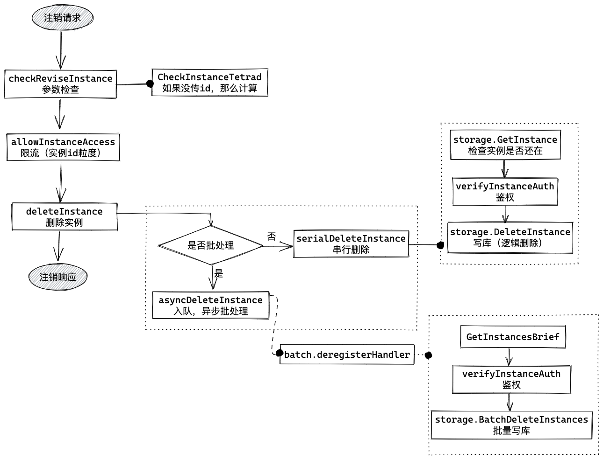

PolarisMesh 的注册发现与健康检查是如何实现的？

## 0. SDK 的封装

在分析控制面逻辑之前，我们先看一下客户端 SDK 的逻辑，以 [polaris-go](https://github.com/polarismesh/polaris-go) 为例：针对 RPC 调用关系中的两个角色，Golang SDK 分别提供的了 `ProviderAPI` 和 `ConsumerAPI` 两个 interface，这两个接口的实现逻辑只是薄薄的一层，与控制面的交互以及核心的处理逻辑都是封装在了 model 包中，其中最重要的一个 interface 就是 `Engine`。

 

本文主要关注图中标红的几个方法：注册、注销和发现的逻辑比较直观，就是与控制面进行一次 GRPC 交互；发现的逻辑稍微复杂一些，其中多了一个本地缓存。

## 1. 注册注销

### 1.1 注册

注册调的 GRPC 方法是 `rpc RegisterInstance(Instance) returns(Response)`。

请求参数 `Instance` 的字段很多，对于注册这个场景，
```
#必填字段
namespace //命名空间
service //服务名
host //实例ip
port //实例端口

#开启健康检查，必填字段
health_check //目前只支持HEARTBEAT，需要设置一个 TTL

# 重要的可选字段
metadata //实例标签，examples 中规则匹配的“标签”就是这里设置的
service_token // 认证信息，需要鉴权时设置
```

控制面收到注册请求后，处理逻辑位于 `service/instance.go` 中的 `CreateInstance` 方法。


实例id的计算方式为 `hex(sha1(${namespace}##${service}##${host}##${port}))`。

本质上就是写三张表：instance 实例信息表，health_check 健康检查配置表和 instance_metadata 实例标签信息表。

因为写库的成本比较高，为了提高吞吐量加了一个批处理逻辑，这部分逻辑用 Golang 写很简洁，核心逻辑位于 `service/batch/instance.go` 的 `mainLoop` 中。


在批处理的 `batch.registerHandler` 处理逻辑中有个小 BUG，没有在事务中对服务加共享锁（对应串行处理中的 `rlockServiceWithID`），极端情况下会有产生脏数据的风险。


>**关于隔离的问题**
>
>在数据表 instance 中是通过 isolate 字段标识实例是否隔离，所以在注册流程中首先会通过 instance id 查询实例是否存在，如果已存在并且是隔离状态，那么需要继续保持隔离状态。管理台是通过 /instances/isolate/host 这个 http 接口进行隔离相关的操作，每次对实例进行操作都会更新 revision 字段，实现方式是 UUID，表示 instance 信息（包含 instance、health_check 和 instance_metadata 这三张表）的版本。


返回的消息是 `Response`，字段很多，对于注册这个场景使用这三个字段，

```
code //六位状态码，前三位参照 HTTP Status，后三位业务自定义
info
instance // 实例信息（带上了id）
```

### 1.2 注销

注册调的 GRPC 方法是 `rpc DeregisterInstance(Instance) returns(Response)`。

请求参数是也是 `Instance`，对于注销这个场景，
```plain
#必填字段
namespace //命名空间
service //服务名
host //实例ip
port //实例端口

# 重要的可选字段
id //实例id
service_token // 认证信息，需要鉴权时设置
```

控制面收到注册请求后，处理逻辑位于 `service/instance.go` 中的 `DeleteInstance` 方法。



主干流程与注册一直，只是数据库操作比较简单，因为这里只是逻辑删除。

```sql
update instance set flag = 1, mtime = sysdate() where `id` = ?
```

没有注册那样复杂的事务，只写 instance 这一张表，更新一下 flag 这个标识位。


> **关于实例数据删除的问题**
>
> 上面可见注销流程中并没有真正删除数据库中 instance、health_check 和 instance_metadata 这三张表的相关数据，触发数据清理的时机有两个：1. 注册流程；2. 通过运维接口 /maintain/v1/instance/clean。


返回的消息是 `Response`，信息与注册一样。


## 2. 健康检查

从 1.1 节可见在实例注册时可以通过 `health_check` 字段设置实例粒度的健康检查策略，另外通过 console 也可以修改设置。

目前 PolarisMesh 仅支持基于心跳的监控检查，可以设置实例粒度的 TTL，这里涉及两部分逻辑：1. 服务 provider 周期性上报心跳；2. polaris 控制面检查心跳是否过期。

### 2.1 心跳上报

服务 provider 实例以 TTL 周期上报心跳请求，调用的 GRPC 方法是 `rpc Heartbeat(Instance) returns(Response)`。

```
#必填字段
namespace //命名空间
service //服务名
host //实例ip
port //实例端口

# 重要的可选字段
id //实例id
service_token // 认证信息，需要鉴权时设置
```

### 2.2 心跳接收

控制面收到心跳请求后，处理逻辑在 `service/healthcheck/server.go` 中的 `Report` 方法中。


这里并没有实例的检测逻辑，只是根据配置的 `checkes.name` 存储到本地内存或者 redis 中。

healthcheck 配置与`healthcheck.Server` 数据结构的对应关系不太清晰，其中通过 type 获取 checker 实体的逻辑容易产生混淆。


`Server` 中 `checkers` 的 key 并不是配置中的 checkers.name，而是代码中 `plugin.HealthChecker` 的 type 变量，`MemoryHealthChecker` 和 `RedisHealthChecker` 的 type 都是 `HealthCheckerHeartbeat`，也就是说将图中配置的 heartbeatRedis 打开，并不会在 map 中多生成一个 checker，而是覆盖前面的 checker。

#### 2.2.1 cacheProvider

经过参数检查后从缓存中查询实例信息，跟注册注销流程不同，心跳不需要也不应该从数据库查询实例信息。（但是这里有个小问题就是注册后立即上报的心跳，可能从缓存从查询不到数据，因为从上面的注册流程可见数据落库后并没有写缓存的逻辑）

这里我们看一下缓存更新的逻辑，这部分代码在 `service/healthcheck/cache.go` 中。


## 3. 服务发现