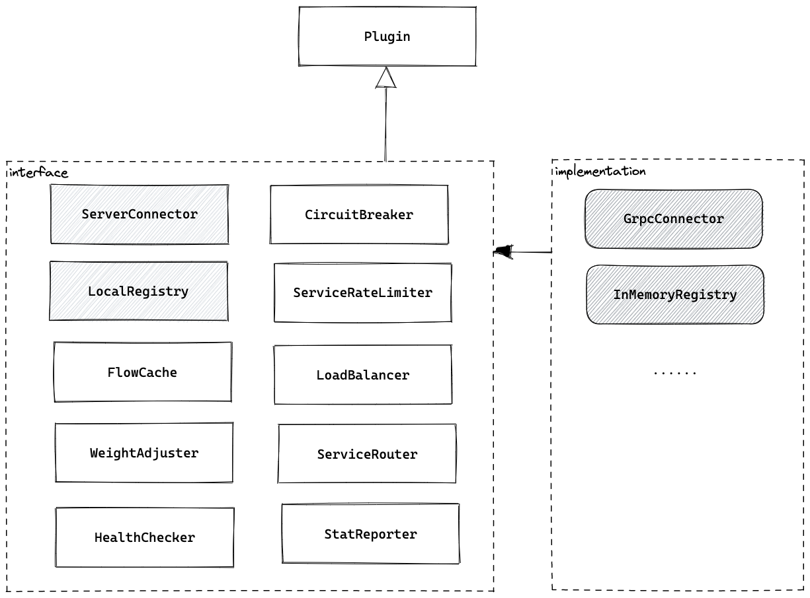
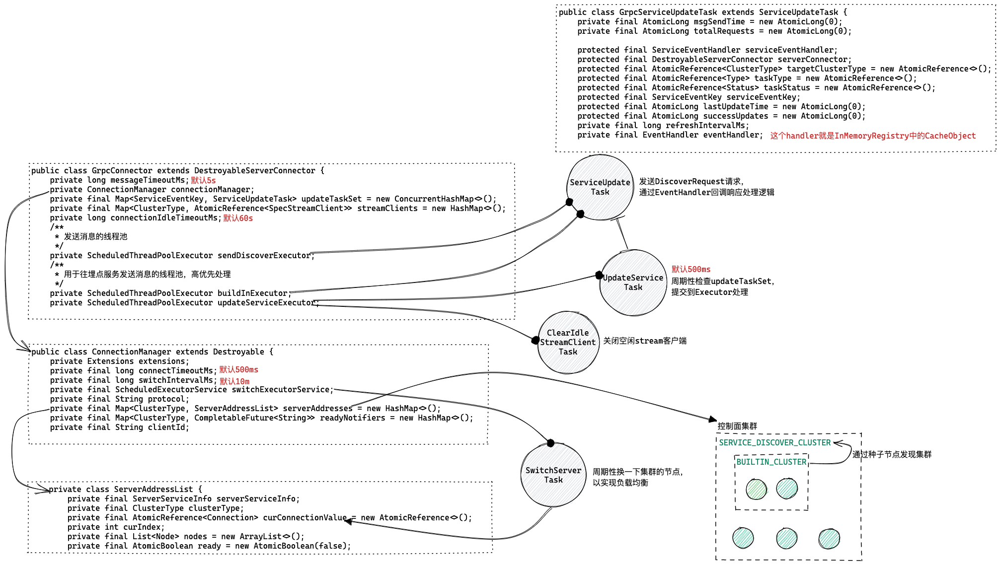
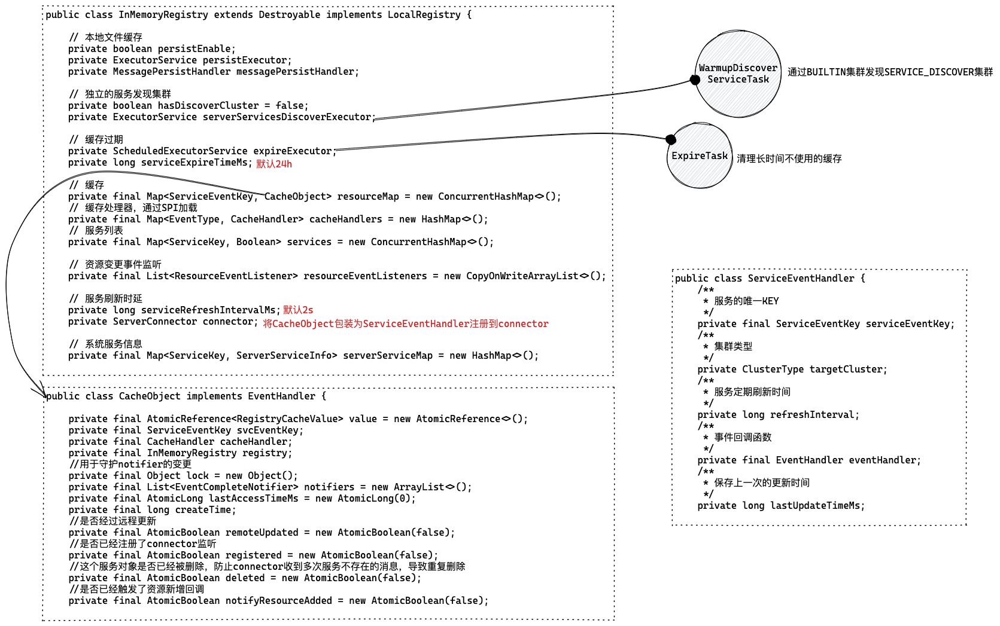
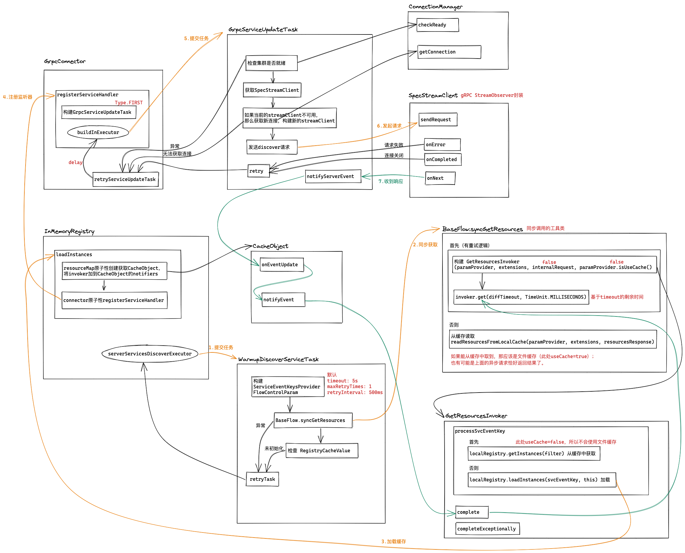

PolarisMesh 的服务发现是如何实现的？

## 0. SDK 的封装

前文分析了“实例注册注销与健康检查”的逻辑，客户端 SDK 看的是 Golang 版的，本文主要分析“服务发现”的逻辑，客户端 SDK 咱们看一下 Java 版的，两个语言版本的客户端 SDK 接口定义基本一致，相对于前文那种简单的 gRPC 同步调用，服务发现的逻辑相对来说就复杂多了。

首先看一下 gRPC 方法定义 —— 双向流式 RPC。

```protobuf
// 统一发现接口
rpc Discover(stream DiscoverRequest) returns(stream DiscoverResponse) {}
```

通信模式就比较复杂，客户端逻辑涉及 `ServerConnector` 和 `LocalRegistry` 这两个 plugin。

需要说明一下，本文仅分析服务发现的逻辑，而 PolarisMesh 将所有资源的定义都统一到了 Discover 这一个接口，其中资源还包含路由、熔断等这些规则。

下面先从这两个 plugin 谈起。


### 0.1 ServerConnector & LocalRegistry

PolarisMesh Java SDK 以 plugin 的形式管理 SDK 的各种功能。



其中  `ServerConnector` 的默认实现类是 `GrpcConnector`，主要提供了与控制面的连接维护以及交互逻辑；`LocalRegistry` 的默认实现类是 `InMemoryRegistry` 封装了资源的本地缓存逻辑，上面已经提到服务、实例和规则等在这里都抽象为资源。

在构建 `SDKContext` 会通过 SPI 机制构建 plugins，然后在上下文初始化时调用 plugin 实现的 `postContextInit` 方法进行初始化。


#### a. GrpcConnector




在 SDK 使用时会配置一批种子节点，也就是 `BUILTIN_CLUSTER`，然后通过这些种子节点发现控制面的其它节点（这部分逻辑在`LocalRegistry`中），在测试时可以设置 sameAsBuiltin 省略该步骤 。

`ConnectionManager` 管理着与控制面的连接，实例列表维护在 `serverAddresses` 中，在一个时间窗内会选择其中的一个节点建立 gRPC 长连接，为了实现控制面节点负载尽可能均衡，这里还加了一个周期性重新选择节点的逻辑，默认的重新选择算法是 round-robin，另外还可以配置动态的路由规则。


#### b. InMemoryRegistry



`InMemoryRegistry`的主要逻辑就是维护“资源”的本地缓存，也就是 `resourceMap` 这个数据结构。与 `GrpcConnector` 之间的职责划分很明确，`GrpcConnector`负责与控制面交互，如果有资源变更那么通过注册的 `ServiceEventHandler`回调处理相应的`CacheObject`。

除此之外，`InMemoryRegistry`还负责触发 SERVICE_DISCOVER_CLUSTER 发现的任务，以及缓存持久化到本地文件和清理过期缓存的任务。


### 0.2 SERVICE_DISCOVER_CLUSTER 发现流程

在demo的时候通常不需要配置 discoverCluster，但是线上不一样，需要考虑到扩容的问题，所以 PolarisMesh 提供了这样一种方式。

如果要启用 SERVICE_DISCOVER_CLUSTER 发现模式，那么需要配置好 global.system.discoverCluster，其中必须包含 namespace 和 service，并且 sameAsBuiltin 为 false。




### 0.3 服务实例 DiscoverRequest 发起流程


