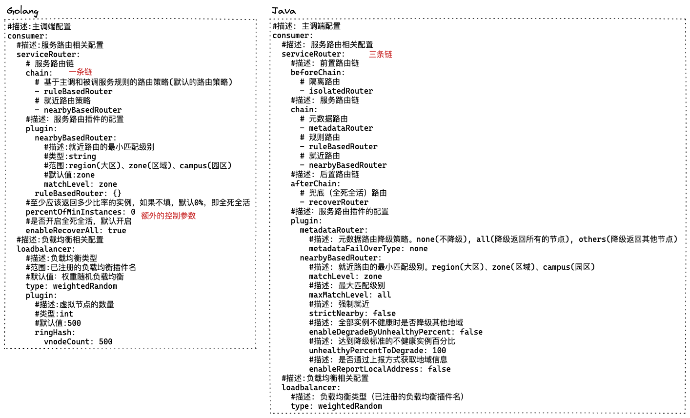
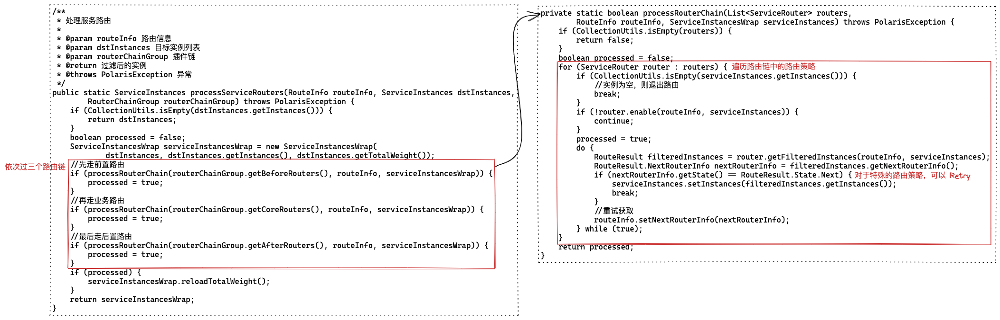

PolarisMesh 的路由是如何实现的？


## 0. 路由

Java SDK 和 Golang SDK 在路由这部分的设计上略有区别，通过配置文件就能看出来：



感觉 Java SDK 的设计更好一些（也能是对 Golang 语言不熟悉造成的错觉），下来就以 Java SDK 为例看一下 PolarisMesh 在路由上的设计。

上文在学习服务发现的逻辑时，我们看的方法是 `getAllInstance`，这个方法发现所以的实例（无论是否隔离健康与否），本文分析的路由逻辑在其之后，简而言之就是对全量实例列表过滤路由规则，再走一下 loadBalancer。（loadBalancer 的逻辑比较简单，本文就忽略了）



主干逻辑的代码写的不能再清晰。（每次请求都得过一遍这套逻辑，性能可能会有些影响，Golang SDK 在代码不是那么清晰，但是性能应该更好一些）


下面以此看一下默认配置中的路由策略，重点是 ruleBasedRouter。


## 1. beforeChain

默认只有一个 isolatedRouter。

这个策略很简单，就是过滤掉权重为0和已隔离的实例。

## 2. chain

这里有三个 router， 有两个比较硬核。

### 2.1 metadataRouter

目标实例的 metadata 需要包含请求中设置的 metadata。

如果没配匹配的实例，还有个 failover 策略，这个策略配置有三个等级，依次是 1. 请求粒度，2. 目标服务粒度设（'internal-metadata-failover-type'标签），3. 本地默认配置。

failover策略也有三个：1. none，不降级，直接抛异常；2. others，匹配不包含的；3. all，返回所有实例。

### 2.2 ruleBasedRouter

这是最核心的，也就是在 console 中配置的“路由规则”对应的 router。

路由规则的下发与上文中“服务发现”的逻辑是一样的，这里就不再展开了。

#### a. 规则

每个服务可以配置两个规则：被调规则和主调规则，存储在 **routing_config** 表中。

以 polaris-go 中的 example 为例，设置了一个“被调规则”：

```shell
mysql> select * from routing_config \G
*************************** 1. row ***************************
        id: 82c9f27067da4827849f66286d480e32
 in_bounds: [{"sources":[{...
out_bounds: null
  revision: e0b0ab3239bd47f1b0856205e818fa93
      flag: 0
     ctime: 2022-03-17 18:07:56
     mtime: 2022-03-17 18:07:56
1 row in set (0.00 sec)
```

“被调”也就是 in_bounds 入口流量，具体的一系列规则存储为一个 json 数组：

```json
[
  {
    "sources": [
      {
        "service": {
          "value": "*"
        },
        "namespace": {
          "value": "*"
        },
        "metadata": {
          "env": {
            "value": {
              "value": "dev"
            }
          }
        }
      }
    ],
    "destinations": [
      {
        "service": {
          "value": "polaris_go_provider"
        },
        "namespace": {
          "value": "default"
        },
        "metadata": {
          "env": {
            "value": {
              "value": "test"
            }
          }
        },
        "priority": {},
        "weight": {
          "value": 100
        },
        "isolate": {
          "value": true
        }
      }
    ]
  }
]
```

“主调” out_bounds 的规则格式是一样的。区别主要在于 in_bounds 的 destinations.service 是确定的，out_bounds 的 sources.service 也是确定的，也就是服务自身，简而言之就是视角不一样。

对于上面这条“被调”规则，翻译成中文就是：对于任意来源（通分配星号），如果请求中带有 env:dev 标签，那么 100% 路由到我的带 env:test 标签的实例。


#### b. 规则匹配 

当某个服务调用另一个服务时，应该匹配两个规则：1. 源服务的 out_bounds 规则；2. 目标服务的 in_bounds 规则。后者的优先级高于前者。


看起来 Java SDK 没有实现“是否隔离（isolate）”的逻辑，而且 Golang SDK 也没看到相关逻辑。


### 2.3 nearbyBasedRouter

就近路由是这里最复杂的一个策略。

在默认配置中：

> 1. 默认就近区域：默认城市 matchLevel: zone
> 2. 最大就近区域，默认为空（全匹配） maxMatchLevel: all
> 3. 假如开启了严格就近，插件的初始化会等待地域信息获取成功才返回，假如获取失败（server获取失败或者IP地域信息缺失），则会初始化失败，而且必须按照 strictNearby: false
> 4. 是否启用按服务不健康实例比例进行降级 enableDegradeByUnhealthyPercent: true，假如不启用，则不会降级
> 4. 需要进行降级的实例比例，不健康实例达到百分之多少才进行降级。值(0, 100]。 # 默认100，即全部不健康才进行切换。

这个策略由于参数较多，而且不像 ruleBasedRouter 那么具有通用性，所以在代码实现上较复杂，但是核心逻辑很清晰，就是选择 matchLevel 内的实例，如果其中不健康的实例比例超过阈值，那么扩大一个 matchLevel 再选择。

## 3. afterChain

最后是一个 recoverRouter。

这个策略也很简单，过滤掉不健康和熔断的实例，如果全部都不符合条件，那么返回原始实例列表。
