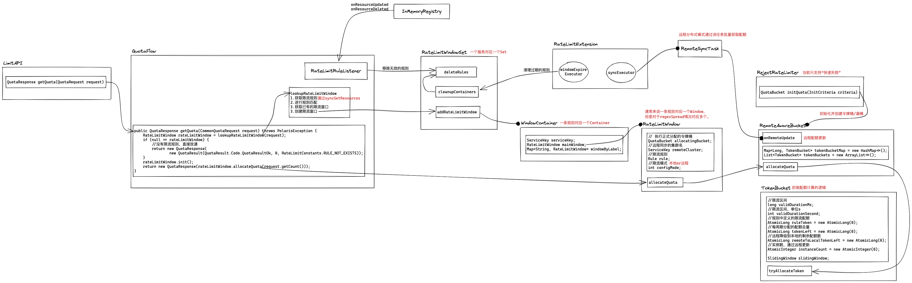
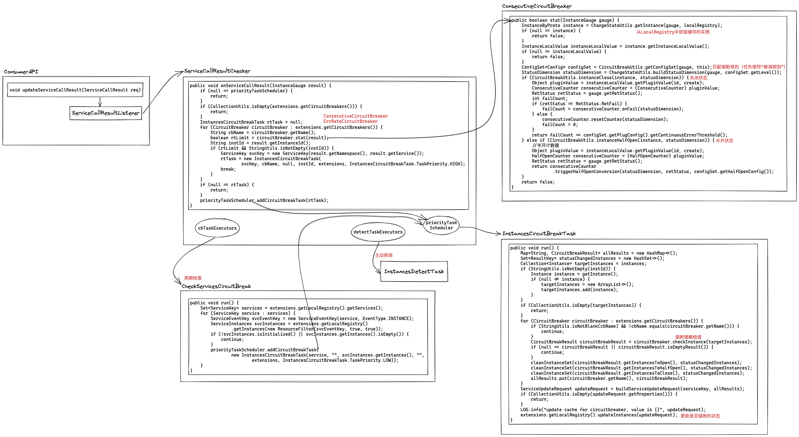

PolarisMesh 的限流熔断是如何实现的？


## 1. 限流

从 console 中提供的配置项来看，PolarisMesh 在限流方面提供的功能还是比较简单，主要是对“统计时长”内的请求数进行限制。

限流规则的下发与上文中“服务发现”的逻辑也是一样的，这里也不再展开了。

### 1.1 规则

以 polaris-go 中的 example 为例，设置了一个“限流规则”：

```shell
mysql> select * from ratelimit_config \G
*************************** 1. row ***************************
        id: a7c74b0c1c0f40e882151cce941b4d2b
service_id: 82c9f27067da4827849f66286d480e32
cluster_id:
    labels: {"env":{"value":{"value":"test"}},"method":{"value":{"value":"GetUser"}}}
  priority: 0
      rule: {"type":1,"amounts":[{"maxAmount":{"value":3},"validDuration":{"seconds":1}}],"action":{"value":"REJECT"},"disable":{}}
  revision: cdb2a62fa1de4fc99efc4e706f0a9787
      flag: 0
     ctime: 2022-03-21 11:21:13
     mtime: 2022-03-21 11:21:55
1 row in set (0.00 sec)

mysql> select * from ratelimit_revision \G
*************************** 1. row ***************************
   service_id: 82c9f27067da4827849f66286d480e32
last_revision: cdb2a62fa1de4fc99efc4e706f0a9787
        mtime: 2022-03-21 11:21:55
1 row in set (0.00 sec)
```

ratelimit 数据库表设计与上文 routing 的有所不同，这里**ratelimit_config**表中的每一行对应一条规则，而 **routing_config** 是将所有规则放在一行里，所以 ratelimit 这里额外增加了**ratelimit_revision**标记整个服务粒度的 revision。

### 1.2 SDK



Java SDK 的逻辑封装也很清晰，目前只实现了“快速失败”（“匀速排队”实际使用的场景确实不多）。

对于“分布式限流”，SDK 提供了异步更新的配额的实现，但是还没有服务端的实现。

总的来说，这个实现要比 [alibaba/Sentinel](https://github.com/alibaba/Sentinel) 更可用。


## 2. 熔断

熔断规则的下发与上文中“服务发现”的逻辑也是一样的，这里也不再展开了。

### 2.1 规则

熔断的规则可以在 console 配置，另外在本地配置文件也有个默认配置。

```yaml
consumer:
  circuitBreaker:
    #描述: 是否启用本地节点熔断功能
    enable: true
    #描述: 故障检测周期，根据周期内故障进行熔断
    checkPeriod: 1m
    #描述: 首次熔断时间，后续熔断时间=重试次数*sleepWindow
    sleepWindow: 30s
    #描述: 熔断器半开后最大允许的请求数
    requestCountAfterHalfOpen: 3
    #描述: 熔断器半开到关闭所必须的最少成功请求数
    successCountAfterHalfOpen: 3
    #描述:熔断策略，SDK会根据策略名称加载对应的熔断器插件（已注册的熔断器插件名）
    chain:
      - errorCount
      - errorRate
    #描述: 熔断插件配置
    plugin:
      #描述:基于周期连续错误数熔断策略配置
      errorCount:
        #描述: 触发连续错误熔断的阈值
        continuousErrorThreshold: 10
      #描述:基于周期错误率的熔断策略配置
      errorRate:
        #描述:触发错误率熔断的阈值百分比
        errorRateThreshold: 50
        #描述: 错误率熔断的滑窗数量
        metricNumBuckets: 5
        #描述: 触发错误率熔断的最低请求阈值
        requestVolumeThreshold: 10
  #描述:主动探测相关配置
  outlierDetection:
    #描述：何时开启主动探测。never（永不开启）,on_recover（恢复时才开启主动探测）,always（一直开启主动探测）
    when: never
    #描述：主动探测周期
    checkPeriod: 30s
    #描述：主动探测插件链
    chain:
      - http
      - tcp
      - udp
```

console 的配置主要是对不同源和方法进行参数定制。

这里数据库表的设计又是不太一样，分了**circuitbreaker_rule**和**circuitbreaker_rule_relation**，看名字以为是一个多对多的关系，实际上是一对一的关系，更新配置时对应的交互逻辑是先写 **circuitbreaker_rule** 更新 version，然后再写 **circuitbreaker_rule_relation** 关联最新的版本的配置。


（感觉应该是与 routing、ratelimit 一样的逻辑，却做了三种不同的设计。。。）

### 2.2 SDK

在学习“路由”时已经了解到熔断实例的过滤是在 recoverRouter 这里，判断的依据是 instance 中的 `CircuitBreakerStatus` 信息。

由熔断的基本逻辑可知，这个 status 的更新应该是在 rpc 请求之后，向熔断模块通知 rpc 的结果，我们从这个入口看一下熔断模块的设计。



这部分逻辑也很清晰，达到断路器状态变化的条件，就提交一个 `InstancesCircuitBreakTask` 进行断路器状态切换，切换的核心逻辑封装为 StateMachine。

总体看下来，PolarisMesh 在熔断方面真是做到顶级的了，虽然只是一个错误数和错误率，但是各种场景的支持很丰富。而且从配置的 protobuf 定义来看，闭源版本应该还有更多场景支持，例如分布式决策。
