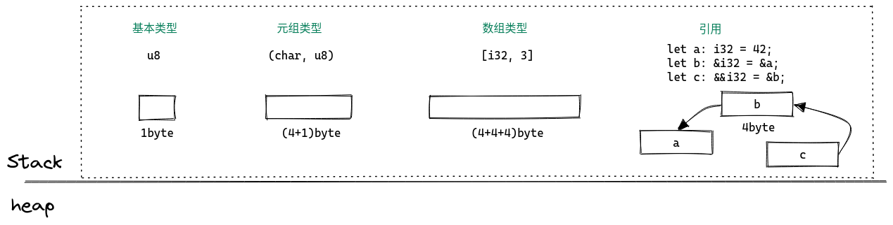

《Rust for Rustaceans》读书笔记

—— 为什么说 Rust 是面向编译器编程？


# 1. 内存分配

由于 Rust 是没有 Runtime 的，所以编译器首先要解决的一个事情就是：如何为 value 分配内存空间。


## 1.1 value

从高级语言的层面来看，Rust 中的 *value* 包含两部分：

1. 类型，例如 `u8`；

2. 该类型值域中的一个元素，例如`6`。

从内存层面来看，Rust 中的 *value* 就是一串字节，内存大致可以分为 stack 和 heap，Rust 中的 *value* 又有很多类型。

如何分配内存？这是编译器要解决的第一个问题。


## 1.2 心智模型



基本类型和引用都是长度固定的，在编译期就能确定分配的空间，所以通常都是分配在 stack 上。


`Vec` 和 `String` 是标准库中的两个结构体，内存分配的逻辑也是一样的，可以在编译器确定长度的分配在 stack 上，编译器无法确定长度的，那么只在 stack 上分配一个指向 heap 中实际数据的指针。

对于数组引用，在 stack 上除了分配指针空间，还会多分配一个长度字段。


枚举类型也是类似。


与 slice 类似， trait object 也是 DTS（dynamically sized type），所以只能通过指针类型使用。


# 2. 内存释放

Rust 没有 Java 那种运行时 GC，而不像 C/C++ 那样让你自己去释放内存，所以“内存释放”这个活儿也是交给编译器了，但是编译器也不是神仙，得加上一些限制才能推理出何时该释放内存。

### 2.1 所有权

首先第一个限制就是——所有权。

简而言之，一个 *value* 只能被一个变量所有，当该变量离开作用域，该 *value* 占用的内存就会被释放。

当然在写代码时 *value* 可能是会传递的，例如方法调用传参，这里就加了一个 move 语义，*value* 的所有权从一个变量转移到另一个变量，旧的变量不能再使用。

这里还有个例外的情况，就是对于实现了 Copy trait 的类型，其行为是按位拷贝，而不是 move。实现了 Copy trait 的类型有：

1. 原生类型，包括函数、不可变引用和裸指针；
2. 数组和元组，如果其内部的数据实现了 Copy，那么它们也实现了 Copy。

简而言之，只有完全在 stack 上的类型才能实现 Copy trait。


### 2.1 借用

所有权只能转义，但是值是可以“借用“的，”“借用”的意思就是说，所有权还是一个，但是我先借出去用一下，为了保证可以安全释放内存，那么编译器得检查“借用”的作用域不能超过本体的作用域，这就是“借用检查”。当然“借用检查”还要检查“可变引用”和“共享引用”之间的限制，主要有两条：

1. 在一个作用域内，仅允许一个活跃的可变借用；
2. 在一个作用域内，活跃的可变引用和共享引用是互斥的，不能同时存在。

这这两条规则与并发场景下的读写访问规则一致，但是这里主要解决的是内存安全问题。

举个例子：

```rust
fn main() {
    let mut data = vec![1, 2, 3];
    let a1 = &data[0];
    println!("data[0]: {:p}", &data[0]);

    for i in 0..1000 {
        data.push(i);
    }

    println!("data[0]: {:p}", &data[0]);
    println!("boxed: {:p}", a1);
}
```

`a1` 是一个共享引用，指向 `data` 当前的第一个元素；

`data.push(i)` 时会产生可变借用，这里可能会重新构建 heap 上存放的数组，那么此时 `a1` 这个引用就不安全了。

在借用检查这里有个容易混淆的词 —— 生命周期参数，这个词本身有误导性，容易让人理解为指定引用生命周期的参数，实际上生命周期并不能指定，编译器检测的规则就是一个——借用的作用域不能超过本体的作用域。这个“生命周期参数”的作用只是帮助编译器判断引用的生命周期，说白了就是个借用检查辅助参数。随着编译器发展的越来越强大，需要用户标注的辅助参数会越来越少。
