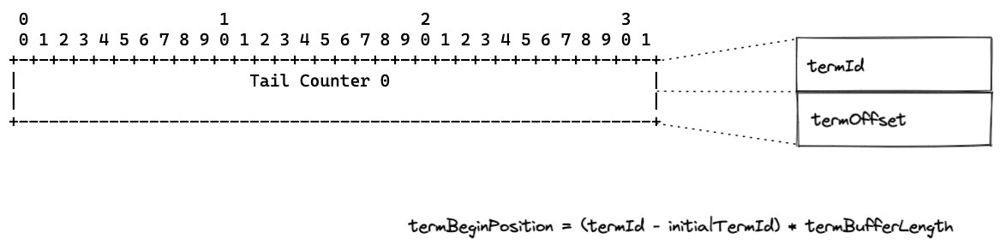

## 0.

最近玩了一下 [Aeron](https://github.com/real-logic/aeron)，主要用了其中的 IPC 通信功能，总的感觉封装的很好，用起来很方便，所以花了点儿时间研究了一下内部实现，简单做个笔记。

*至于 UDP 通信和 archive、cluster 高级特性没有尝试，本文不涉及。*

## 1. 简介

在[《Aeron Cookbook》](https://aeroncookbook.com/aeron/overview/)中有一个很清晰的架构图：


这张图画的很好，但是对应的是 UDP 通信的场景，至于 IPC 通信的场景实际上没那么复杂，所以我简化了一下：


在 IPC 通信的场景下：
1. Media Driver 的主要功能是管理 IPC 共享内存实体 logbuffer，维护发布和订阅关系，具体的功能都封装在 Driver Conductor 中；
2. Client 与 Driver Conductor 交互的逻辑封装在 Client Conductor 中，主要是向 Media Driver 声明发布关系和订阅关系；（两者也是通过共享内存 IPC 通信）
3. Client 中 Publication 封装了发布消息的功能，Subscription 封装了订阅消息的功能，两者直接操作共享内存实体 logbuffer。

## 2. Conductor

要理解两个 Conductor 之间的交互实现，首先得理解 cnc.dat 文件。

cnc 全称是 command and control（命令与控制），顾名思义通过这个文件实现管理操作。


这里需要关注两个部分： [to-driver Buffer] 和 [to-clients Buffer]。

Client 通过 [to-driver Buffer] 这个“通道”向 Driver 发送命令；Driver 通过 [to-clients Buffer] 这个“通道”向 Client 回复命令或者通知。

[to-driver Buffer] 这个“通道”的封装是 ManyToOneRingBuffer，也就是一个环形缓冲区。Many To One，也就是多个 Client 可以并发写入，但是只有一个 Driver 读取。

[to-clients Buffer] 这个“通道”是个广播的“通道”，所以在 Driver 这里的封装是 BroadcastTransmitter，在 Client 这里的封装是 BroadcastReceiver。

这个 BroadcastTransmitter 并不保证消息可靠交付，但是 [to-driver Buffer] 与 [to-clients Buffer] 一问一答，偶尔附加些通知的用法，基本也不会丢数据。

至于这个“一问一答”如何关联，实际上很简单，每一个命令里都一个唯一的 correlationId，对应的回复里也会有这个信息，所以通过这个唯一的 id 就能匹配请求与响应。


correlationId 通过 RingBuffer 尾部的 CORRELATION_COUNTER 生成，保证唯一性。

Driver Conductor 在处理完命令后，会更新 RingBuffer 尾部的 CONSUMER_HEARTBEAT，客户端可以通过这个心跳时间判断 Media Driver 是否正常。

#### 2.1 to-driver Buffer 实现上的几个小细节
**第一个：并发写入**

写入时用了 tryClaim + commit 这个组合，tryClaim 声明一定长度的空间，以供命令写入，对并发问题的解决也在 tryClaim 方法中。

```java
do {
...
} while (!buffer.compareAndSetLong(tailPositionIndex, tail, newTail));
```

简单来说就是 cas 更新 TAIL_POSITION 字段。

**第二个：读取命令**
由上面可知，不能简单的通过 TAIL_POSITION 读取命令，实际上 Driver Conductor 是通过 Length 字段是否大于 0 判断的。
这个行为是在 commit 操作时保证的，首先在 Length 字段写入负的长度，然后再写入接下来的 Type 和 Encoded Message，最后再在 Length 字段写入正的长度，此时就能保证读取到完整的命令。

**第三个：写入线程异常**
有上面可知，命令的写入不是原子性的，存在命令写了一半，写入线程异常的可能性，如果 Length 字段一直是负值，那么将会持续阻塞 Driver Conductor 的读取。

解决这个问题的方法也很简单：Driver Conductor 会在超时时间后主动 unblock，也就是识别跳过异常的区域。


[to-clients Buffer] 这个广播的逻辑就更简单了，因为写入是单线程的，所以没有并发的场景需要处理。

#### 2.2 to-clients Buffer 实现上的几个小细节

**第一个：识别消息是否被覆盖**
Driver Conductor 在写入消息（以及更新 TAIL_COUNTER 和 LATEST_COUNTER）之前会首先更新 TAIL_INTENT_COUNTER。Client Conductor 在消费之前首先会校验当前读的 cursor（本地缓存）是否落后于 TAIL_INTENT_COUNTER。当然这里没有加锁，是个乐观的策略。

## 3. 发布订阅关系

上面两张图已经展示了 addPublication 和 addSubscription 的交互过程，下面看一下具体的发布订阅关系。


1. 每个 Client 在 Media Driver 中对应一个 AeronClient，在 cnc.dat 的 Counters 中有个对应的心跳字段，Client Conductor 会周期性更新这个心跳时间，Driver Conductor 会根据这个时间判断 Client 是否存活。
2. 发布关系对应一个 PublicationLink，如果是 ExclusivePublication，那么 PublicationLink 与 IpcPublication 是一对一的；如果是 ConcurrentPublication，那么 PublicationLink 与 IpcPublication 是多对一的。
3. 订阅关系对应一个 SubscriptionLink，SubscriptionLink 与 IpcPublication 是多对一的关系，各个订阅端都维护着自己的消费位置 sub-pos。
4. 每个共享内存实体包装为 IpcPublication，文件名为 {correlationId}，也就是发起 ADD_PUBLICATION 命令的唯一消息 id。Driver Conductor 会根据所有的 sub-pos 维护 pub-lmt，以控制发布端的最大写入位置。

#### 3.1 logbuffer 结构
在进入具体的发布订阅逻辑之前，我们先看一下 logbuffer 的结构：


整个用于数据传输的共享内存分为了三个 Term，三个 Term 轮换使用，分为 active、dirty 和 clean 三个状态。（[AeronCookbook 中有个动画演示](https://aeroncookbook.com/aeron/log-buffers-images/)）

具体到实现中，Term 的轮换是通过 Log Meta Data 中的 Active Term Count 完成的，active 的 Term 索引是 （Active Term Count % 3），轮换就是个自增操作。

另外 Log Meta Data 中的 Tail Counter # 指示当前的写入位置。



这个 Counter 分为两部分，高 32 位是 termId，通过 termId 可以计算出本 Term 的起始位置，低 32 为是 Term 中的最对偏移量。

由于 termId 是 32 位的，可想而知是可能溢出的，这就限制了单个 logbuffer 写“过”的最大数据量为 termBufferLength * (1L << 31)。

## 4. IpcPublication

具体到发表的逻辑，Aeron 提供了支持并发的 ConcurrentPublication 封装，也提供了单线程的 ExclusivePublication 封装，可想而知支持并发会有一些性能损失。

跟第 2 节的 ManyToOneRingBuffer 一样，Publication 也提供了 offer 和 tryClaim+commit 两套 API，只是 Client Conductor 仅用了 tryClaim+commit，所以上面没有介绍 offer，在这里也不看 offer，原因是通过 tryClaim+commit 更容易理解其本质。

先看一下 ExclusivePublication 的实现，先理解主干逻辑，再理解并发控制比较容易。


这里有个背压的阈值，也就是 pub-lmt，这个值是在 Driver Conductor 中维护的，简而言之就是消费的位置加上 termWindowLength。这个 logbuffer 可以理解为 ManyToManyRingBuffer，所以在控制写入位置上会更复杂，需要一个独立的协调者（也就是 Driver Conductor），这跟第 2 节 ManyToOneRingBuffer 的处理方式是不同的。

接下来的主干逻辑就很直观了，首先找到待写的 term，然后调用 ExclusiveTermAppender 的 claim 方法。这里的逻辑与 ManyToOneRingBuffer 一脉相承，更新 Tail Counter，然后写入 header，并且 length 字段先写入一个负值，等到 commit 时再写入正值。

但是也有本 Term 剩余空间不够的情况，此时填充一个 PADDING_FRAME，然后返回 -1。

最后就是更新本地位置变量，如果返回 -1，那就是需要轮换 Term 了，具体操作就是更新 Active Term Count，以及对应的 Tail Counter #。

对于并发的 ConcurrentPublication 场景，主干逻辑的是一样的，需要保证线程安全的地方有两个：
1. claim 内存区域时，原子性 getAndAdd(Tail Counter #)
2. 轮换 Term 时，compareAndSet(Tail Counter #) 以及 compareAndSet(Active Term Count)

#### 4.1 写入时的几个异常情况

**第一个：写入线程异常**

跟 2.1 节的情况一样，logbuffer 也存在写入一半，线程异常的可能性。此时依赖 Driver Conductor 这个协调者根据超时时间来做 unblock 操作。

## 5. IpcSubscription

由第 2 节的图可知，在消费之前，Conductor 的交互上有两步：
1.  ON_SUBSCRIPTION_READY 只是声明了订阅，但是此时可能还没有对应的 IpcPublication
2. 直到 ON_AVAILABLE_IMAGE 才会将具体的共享内存主体传给订阅客户端

也就是说，订阅客户端的 Image 对应着具体的共享内存主体 IpcPublication，核心的读取逻辑也在 Image 中。


通过 position 就能计算出 term index，以及该 term 中的位置偏移，有了这两个信息就可以读取数据了。


读取的逻辑与 ManyToOneRingBuffer 也是一脉相承，通过 Length 字段是否大于 0 判断是否有消息。

