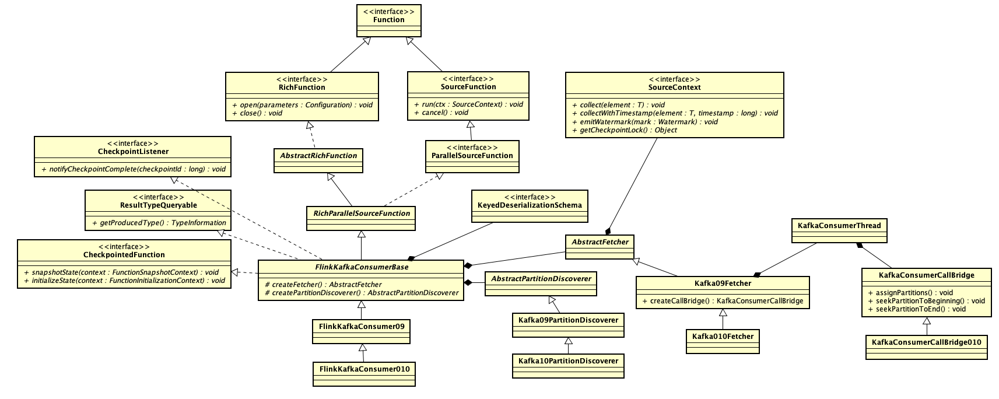

# 0. 

FlinkKafkaConsumer010 是 flink 1.6.1 提供的 Kafka 数据源接入实现，在 flink 框架中数据源需要实现 SourceFunction 接口。

```java
@Public
public interface SourceFunction<T> extends Function, Serializable {

	void run(SourceContext<T> ctx) throws Exception;

	void cancel();

	@Public
	interface SourceContext<T> {

		void collect(T element);

		@PublicEvolving
		void collectWithTimestamp(T element, long timestamp);

		@PublicEvolving
		void emitWatermark(Watermark mark);

		@PublicEvolving
		void markAsTemporarilyIdle();

		Object getCheckpointLock();

		void close();
	}
}
```

### SourceFunction
SourceFunction 声明了两个接口方法：
1. run：启动一个 source，输出 element 产生数据流；
2. cancel：取消 source，也就是将 run 方法的执行逻辑中止。

### SourceContext

flink 通过 SourceContext 提供 element 输出的接口：

1. collect : 输出一个 element，该 element 的时间戳被自动设置为本地时间；
2. collectWithTimestamp : 根据用户提供的自定义的时间戳输出一个元素；
3. emitWatermark : 手动设置一个Watermark。

至于各种 Time 与 Watermark 之间的关系可以参考[官方文档](https://ci.apache.org/projects/flink/flink-docs-release-1.6/dev/event_time.html)，这里就不赘述了。

## 1. FlinkKafkaConsumer010

首先通过类图对 FlinkKafkaConsumer010 进行整体的认识。



ParallelSourceFunction 是 SourceFunction 的子类，实际上该类是一个标签，用于通知系统该 source 可以并行执行。

RichFunction 提供了 open 和 close 两个钩子方法，用于开始前和结束后回调执行；另外还提供了 RuntimeContext 的设置获取方法。

## 2. FlinkKafkaConsumer010 构建

先来看 FlinkKafkaConsumer010 的构建逻辑，重点在 FlinkKafkaConsumer09 中：

```java
	private FlinkKafkaConsumer09(
			List<String> topics,
			Pattern subscriptionPattern,
			KeyedDeserializationSchema<T> deserializer,
			Properties props) {

		super(
				topics,
				subscriptionPattern,
				deserializer,
				getLong(
					checkNotNull(props, "props"),
					KEY_PARTITION_DISCOVERY_INTERVAL_MILLIS, PARTITION_DISCOVERY_DISABLED),
				!getBoolean(props, KEY_DISABLE_METRICS, false));

		this.properties = props;
		setDeserializer(this.properties);

		// configure the polling timeout
		try {
			if (properties.containsKey(KEY_POLL_TIMEOUT)) {
				this.pollTimeout = Long.parseLong(properties.getProperty(KEY_POLL_TIMEOUT));
			} else {
				this.pollTimeout = DEFAULT_POLL_TIMEOUT;
			}
		}
		catch (Exception e) {
			throw new IllegalArgumentException("Cannot parse poll timeout for '" + KEY_POLL_TIMEOUT + '\'', e);
		}
	}
```

1. 忽略用户配置的 deserializer，对于官方 KafkaConsumer 的 deserializer 配置为 ByteArrayDeserializer，至于 FlinkKafkaConsumer 层面的反序列化通过 KeyedDeserializationSchema 接口实现。
2. 如果用户没有 flink.poll-timeout，那么默认 100ms，用于设置 poll kafka 数据的等待时间。

顺着看父类 FlinkKafkaConsumerBase 的构造方法：

```java
	public FlinkKafkaConsumerBase(
			List<String> topics,
			Pattern topicPattern,
			KeyedDeserializationSchema<T> deserializer,
			long discoveryIntervalMillis,
			boolean useMetrics) {
		this.topicsDescriptor = new KafkaTopicsDescriptor(topics, topicPattern);
		this.deserializer = checkNotNull(deserializer, "valueDeserializer");

		checkArgument(
			discoveryIntervalMillis == PARTITION_DISCOVERY_DISABLED || discoveryIntervalMillis >= 0,
			"Cannot define a negative value for the topic / partition discovery interval.");
		this.discoveryIntervalMillis = discoveryIntervalMillis;

		this.useMetrics = useMetrics;
	}
```

1. KafkaTopicsDescriptor 封装了 topic 的获取逻辑；
2. discoveryIntervalMillis 设置 partition 自动更新的周期，默认为 Long.MIN_VALUE，也就是不要自动发现。


### 3. FlinkKafkaConsumer010 初始化

初始化的流程主要包含两部分：CheckpointedFunction.initializeState 和RichFunction.open。

### a.  CheckpointedFunction.initializeState

在FlinkKafkaConsumerBase 中：

```java
	public final void initializeState(FunctionInitializationContext context) throws Exception {

		OperatorStateStore stateStore = context.getOperatorStateStore();

		ListState<Tuple2<KafkaTopicPartition, Long>> oldRoundRobinListState =
			stateStore.getSerializableListState(DefaultOperatorStateBackend.DEFAULT_OPERATOR_STATE_NAME);

		this.unionOffsetStates = stateStore.getUnionListState(new ListStateDescriptor<>(
				OFFSETS_STATE_NAME,
				TypeInformation.of(new TypeHint<Tuple2<KafkaTopicPartition, Long>>() {})));

		if (context.isRestored() && !restoredFromOldState) {
			restoredState = new TreeMap<>(new KafkaTopicPartition.Comparator());

			// migrate from 1.2 state, if there is any
			for (Tuple2<KafkaTopicPartition, Long> kafkaOffset : oldRoundRobinListState.get()) {
				restoredFromOldState = true;
				unionOffsetStates.add(kafkaOffset);
			}
			oldRoundRobinListState.clear();

			if (restoredFromOldState && discoveryIntervalMillis != PARTITION_DISCOVERY_DISABLED) {
				throw new IllegalArgumentException(
					"Topic / partition discovery cannot be enabled if the job is restored from a savepoint from Flink 1.2.x.");
			}

			// populate actual holder for restored state
			for (Tuple2<KafkaTopicPartition, Long> kafkaOffset : unionOffsetStates.get()) {
				restoredState.put(kafkaOffset.f0, kafkaOffset.f1);
			}

			LOG.info("Setting restore state in the FlinkKafkaConsumer: {}", restoredState);
		} else {
			LOG.info("No restore state for FlinkKafkaConsumer.");
		}
	}
```

从检查点中恢复 offset 到 restoredState 中。

其中对于 1.2  版本的状态也做了兼容，这里的细节就不看了。


### b. RichFunction.open

在FlinkKafkaConsumerBase 中：

```java
	public void open(Configuration configuration) throws Exception {
		// determine the offset commit mode
		this.offsetCommitMode = OffsetCommitModes.fromConfiguration(
				getIsAutoCommitEnabled(),
				enableCommitOnCheckpoints,
				((StreamingRuntimeContext) getRuntimeContext()).isCheckpointingEnabled());

		// create the partition discoverer
		this.partitionDiscoverer = createPartitionDiscoverer(
				topicsDescriptor,
				getRuntimeContext().getIndexOfThisSubtask(),
				getRuntimeContext().getNumberOfParallelSubtasks());
		this.partitionDiscoverer.open();

		subscribedPartitionsToStartOffsets = new HashMap<>();

		List<KafkaTopicPartition> allPartitions = partitionDiscoverer.discoverPartitions();

		if (restoredState != null) {
			for (KafkaTopicPartition partition : allPartitions) {
				if (!restoredState.containsKey(partition)) {
					restoredState.put(partition, KafkaTopicPartitionStateSentinel.EARLIEST_OFFSET);
				}
			}

			for (Map.Entry<KafkaTopicPartition, Long> restoredStateEntry : restoredState.entrySet()) {
				if (!restoredFromOldState) {
					// seed the partition discoverer with the union state while filtering out
					// restored partitions that should not be subscribed by this subtask
					if (KafkaTopicPartitionAssigner.assign(
						restoredStateEntry.getKey(), getRuntimeContext().getNumberOfParallelSubtasks())
							== getRuntimeContext().getIndexOfThisSubtask()){
						subscribedPartitionsToStartOffsets.put(restoredStateEntry.getKey(), restoredStateEntry.getValue());
					}
				} else {
					// when restoring from older 1.1 / 1.2 state, the restored state would not be the union state;
					// in this case, just use the restored state as the subscribed partitions
					subscribedPartitionsToStartOffsets.put(restoredStateEntry.getKey(), restoredStateEntry.getValue());
				}
			}

			LOG.info("Consumer subtask {} will start reading {} partitions with offsets in restored state: {}",
				getRuntimeContext().getIndexOfThisSubtask(), subscribedPartitionsToStartOffsets.size(), subscribedPartitionsToStartOffsets);
		} else {
			// use the partition discoverer to fetch the initial seed partitions,
			// and set their initial offsets depending on the startup mode.
			// for SPECIFIC_OFFSETS and TIMESTAMP modes, we set the specific offsets now;
			// for other modes (EARLIEST, LATEST, and GROUP_OFFSETS), the offset is lazily determined
			// when the partition is actually read.
			switch (startupMode) {
				case SPECIFIC_OFFSETS:
					if (specificStartupOffsets == null) {
						throw new IllegalStateException(
							"Startup mode for the consumer set to " + StartupMode.SPECIFIC_OFFSETS +
								", but no specific offsets were specified.");
					}

					for (KafkaTopicPartition seedPartition : allPartitions) {
						Long specificOffset = specificStartupOffsets.get(seedPartition);
						if (specificOffset != null) {
							// since the specified offsets represent the next record to read, we subtract
							// it by one so that the initial state of the consumer will be correct
							subscribedPartitionsToStartOffsets.put(seedPartition, specificOffset - 1);
						} else {
							// default to group offset behaviour if the user-provided specific offsets
							// do not contain a value for this partition
							subscribedPartitionsToStartOffsets.put(seedPartition, KafkaTopicPartitionStateSentinel.GROUP_OFFSET);
						}
					}

					break;
				case TIMESTAMP:
					if (startupOffsetsTimestamp == null) {
						throw new IllegalStateException(
							"Startup mode for the consumer set to " + StartupMode.TIMESTAMP +
								", but no startup timestamp was specified.");
					}

					for (Map.Entry<KafkaTopicPartition, Long> partitionToOffset
							: fetchOffsetsWithTimestamp(allPartitions, startupOffsetsTimestamp).entrySet()) {
						subscribedPartitionsToStartOffsets.put(
							partitionToOffset.getKey(),
							(partitionToOffset.getValue() == null)
									// if an offset cannot be retrieved for a partition with the given timestamp,
									// we default to using the latest offset for the partition
									? KafkaTopicPartitionStateSentinel.LATEST_OFFSET
									// since the specified offsets represent the next record to read, we subtract
									// it by one so that the initial state of the consumer will be correct
									: partitionToOffset.getValue() - 1);
					}

					break;
				default:
					for (KafkaTopicPartition seedPartition : allPartitions) {
						subscribedPartitionsToStartOffsets.put(seedPartition, startupMode.getStateSentinel());
					}
			}

			if (!subscribedPartitionsToStartOffsets.isEmpty()) {
				switch (startupMode) {
					case EARLIEST:
						LOG.info("Consumer subtask {} will start reading the following {} partitions from the earliest offsets: {}",
							getRuntimeContext().getIndexOfThisSubtask(),
							subscribedPartitionsToStartOffsets.size(),
							subscribedPartitionsToStartOffsets.keySet());
						break;
					case LATEST:
						LOG.info("Consumer subtask {} will start reading the following {} partitions from the latest offsets: {}",
							getRuntimeContext().getIndexOfThisSubtask(),
							subscribedPartitionsToStartOffsets.size(),
							subscribedPartitionsToStartOffsets.keySet());
						break;
					case TIMESTAMP:
						LOG.info("Consumer subtask {} will start reading the following {} partitions from timestamp {}: {}",
							getRuntimeContext().getIndexOfThisSubtask(),
							subscribedPartitionsToStartOffsets.size(),
							startupOffsetsTimestamp,
							subscribedPartitionsToStartOffsets.keySet());
						break;
					case SPECIFIC_OFFSETS:
						LOG.info("Consumer subtask {} will start reading the following {} partitions from the specified startup offsets {}: {}",
							getRuntimeContext().getIndexOfThisSubtask(),
							subscribedPartitionsToStartOffsets.size(),
							specificStartupOffsets,
							subscribedPartitionsToStartOffsets.keySet());

						List<KafkaTopicPartition> partitionsDefaultedToGroupOffsets = new ArrayList<>(subscribedPartitionsToStartOffsets.size());
						for (Map.Entry<KafkaTopicPartition, Long> subscribedPartition : subscribedPartitionsToStartOffsets.entrySet()) {
							if (subscribedPartition.getValue() == KafkaTopicPartitionStateSentinel.GROUP_OFFSET) {
								partitionsDefaultedToGroupOffsets.add(subscribedPartition.getKey());
							}
						}

						if (partitionsDefaultedToGroupOffsets.size() > 0) {
							LOG.warn("Consumer subtask {} cannot find offsets for the following {} partitions in the specified startup offsets: {}" +
									"; their startup offsets will be defaulted to their committed group offsets in Kafka.",
								getRuntimeContext().getIndexOfThisSubtask(),
								partitionsDefaultedToGroupOffsets.size(),
								partitionsDefaultedToGroupOffsets);
						}
						break;
					default:
					case GROUP_OFFSETS:
						LOG.info("Consumer subtask {} will start reading the following {} partitions from the committed group offsets in Kafka: {}",
							getRuntimeContext().getIndexOfThisSubtask(),
							subscribedPartitionsToStartOffsets.size(),
							subscribedPartitionsToStartOffsets.keySet());
				}
			} else {
				LOG.info("Consumer subtask {} initially has no partitions to read from.",
					getRuntimeContext().getIndexOfThisSubtask());
			}
		}
	}
```

#### OffsetCommitMode

1. 如果 getRuntimeContext().isCheckpointingEnabled() 并且 enableCommitOnCheckpoints 那么设置为 ON_CHECKPOINTS，也就是当 flink 的检查点完成后提交 offset；
2. 如果 isCheckpointingEnabled 为 false，而 enableAutoCommit 为 true，那么设置为 KAFKA_PERIODIC，也就是使用官方 KafkaConsumer 的周期性自动提交 offset 的机制；
3. 否则设置为 DISABLED，也就是关闭 offset 提交。

#### Kafka010PartitionDiscoverer

1. 根据 KafkaTopicsDescriptor 调用 Kafka 的接口获取需要消费的 TopicPartition；
2. 根据 numParallelSubtasks 和 indexOfThisSubtask 选择当前 task 需要消费的 TopicPartition。

```java
	public boolean setAndCheckDiscoveredPartition(KafkaTopicPartition partition) {
		if (isUndiscoveredPartition(partition)) {
			discoveredPartitions.add(partition);

			return KafkaTopicPartitionAssigner.assign(partition, numParallelSubtasks) == indexOfThisSubtask;
		}

		return false;
	}
```

**回想一下，这个是 ParallelSourceFunction，也就是说会有多个实例并行执行，所以不同的实例需要分配一下 TopicPartition。**


#### StartOffsets

如果从检查点恢复了状态，那么依据检查点的内容设置 subscribedPartitionsToStartOffsets，对于新增的 partition 设置为 EARLIEST_OFFSET；

如果没有从检查点恢复状态，那么根据 startupMode 设置 subscribedPartitionsToStartOffsets。

startupMode 默认为 GROUP_OFFSETS，也就是依据 Kafka 消费组提交的 offset 继续消费。

## 4. FlinkKafkaConsumer010 执行

执行逻辑的接口方法是 SourceFunction 的 run。

具体实现在 FlinkKafkaConsumerBase 中：

```java
	public void run(SourceContext<T> sourceContext) throws Exception {
		if (subscribedPartitionsToStartOffsets == null) {
			throw new Exception("The partitions were not set for the consumer");
		}

		// initialize commit metrics and default offset callback method
		this.successfulCommits = this.getRuntimeContext().getMetricGroup().counter(COMMITS_SUCCEEDED_METRICS_COUNTER);
		this.failedCommits =  this.getRuntimeContext().getMetricGroup().counter(COMMITS_FAILED_METRICS_COUNTER);

		this.offsetCommitCallback = new KafkaCommitCallback() {
			@Override
			public void onSuccess() {
				successfulCommits.inc();
			}

			@Override
			public void onException(Throwable cause) {
				LOG.warn("Async Kafka commit failed.", cause);
				failedCommits.inc();
			}
		};

		// mark the subtask as temporarily idle if there are no initial seed partitions;
		// once this subtask discovers some partitions and starts collecting records, the subtask's
		// status will automatically be triggered back to be active.
		if (subscribedPartitionsToStartOffsets.isEmpty()) {
			sourceContext.markAsTemporarilyIdle();
		}

		// from this point forward:
		//   - 'snapshotState' will draw offsets from the fetcher,
		//     instead of being built from `subscribedPartitionsToStartOffsets`
		//   - 'notifyCheckpointComplete' will start to do work (i.e. commit offsets to
		//     Kafka through the fetcher, if configured to do so)
		this.kafkaFetcher = createFetcher(
				sourceContext,
				subscribedPartitionsToStartOffsets,
				periodicWatermarkAssigner,
				punctuatedWatermarkAssigner,
				(StreamingRuntimeContext) getRuntimeContext(),
				offsetCommitMode,
				getRuntimeContext().getMetricGroup().addGroup(KAFKA_CONSUMER_METRICS_GROUP),
				useMetrics);

		if (!running) {
			return;
		}

		// depending on whether we were restored with the current state version (1.3),
		// remaining logic branches off into 2 paths:
		//  1) New state - partition discovery loop executed as separate thread, with this
		//                 thread running the main fetcher loop
		//  2) Old state - partition discovery is disabled and only the main fetcher loop is executed

		if (discoveryIntervalMillis != PARTITION_DISCOVERY_DISABLED) {
			final AtomicReference<Exception> discoveryLoopErrorRef = new AtomicReference<>();
			this.discoveryLoopThread = new Thread(new Runnable() {
				@Override
				public void run() {
					try {
						// --------------------- partition discovery loop ---------------------

						List<KafkaTopicPartition> discoveredPartitions;

						// throughout the loop, we always eagerly check if we are still running before
						// performing the next operation, so that we can escape the loop as soon as possible

						while (running) {
							if (LOG.isDebugEnabled()) {
								LOG.debug("Consumer subtask {} is trying to discover new partitions ...", getRuntimeContext().getIndexOfThisSubtask());
							}

							try {
								discoveredPartitions = partitionDiscoverer.discoverPartitions();
							} catch (AbstractPartitionDiscoverer.WakeupException | AbstractPartitionDiscoverer.ClosedException e) {
								// the partition discoverer may have been closed or woken up before or during the discovery;
								// this would only happen if the consumer was canceled; simply escape the loop
								break;
							}

							// no need to add the discovered partitions if we were closed during the meantime
							if (running && !discoveredPartitions.isEmpty()) {
								kafkaFetcher.addDiscoveredPartitions(discoveredPartitions);
							}

							// do not waste any time sleeping if we're not running anymore
							if (running && discoveryIntervalMillis != 0) {
								try {
									Thread.sleep(discoveryIntervalMillis);
								} catch (InterruptedException iex) {
									// may be interrupted if the consumer was canceled midway; simply escape the loop
									break;
								}
							}
						}
					} catch (Exception e) {
						discoveryLoopErrorRef.set(e);
					} finally {
						// calling cancel will also let the fetcher loop escape
						// (if not running, cancel() was already called)
						if (running) {
							cancel();
						}
					}
				}
			}, "Kafka Partition Discovery for " + getRuntimeContext().getTaskNameWithSubtasks());

			discoveryLoopThread.start();
			kafkaFetcher.runFetchLoop();

			// --------------------------------------------------------------------

			// make sure that the partition discoverer is properly closed
			partitionDiscoverer.close();
			discoveryLoopThread.join();

			// rethrow any fetcher errors
			final Exception discoveryLoopError = discoveryLoopErrorRef.get();
			if (discoveryLoopError != null) {
				throw new RuntimeException(discoveryLoopError);
			}
		} else {
			// won't be using the discoverer
			partitionDiscoverer.close();

			kafkaFetcher.runFetchLoop();
		}
	}
```

### a. Kafka010Fetcher 构建

通过抽象方法 createFetcher 方法创建 AbstractFetcher，具体的实现在子类 FlinkKafkaConsumer010 中。

关键有三个模块：unassignedPartitionsQueue、Handover 和 consumerThread。

#### unassignedPartitionsQueue

这是一个 ClosableBlockingQueue<KafkaTopicPartitionState<KPH>> 队列，当初始化时会把需要消费的 TopicPartition 加入这个队列；如果启动了 TopicPartition 周期性自动发现，那么后续新发现 TopicPartition 也会加入这个队列。

#### Handover

可以理解为一个长度为一的阻塞队列，将 consumerThread 获取的消息或者抛出的异常，传递给 flink 执行的线程。

#### KafkaConsumerThread

1. 封装了 Kafka 消费的逻辑，另外依靠 unassignedPartitionsQueue，可以动态添加新的 TopicPartition。
2. 封装了 offset 提交的逻辑，如果提交策略是 OffsetCommitMode.ON_CHECKPOINTS，那么利用 CheckpointListener 的回调执行 offset 提交，其中线程间通信使用了 nextOffsetsToCommit 这个数据结构。

### b. Kafka010Fetcher 执行

执行 runFetchLoop 方法

```java
	public void runFetchLoop() throws Exception {
		try {
			final Handover handover = this.handover;

			// kick off the actual Kafka consumer
			consumerThread.start();

			while (running) {
				// this blocks until we get the next records
				// it automatically re-throws exceptions encountered in the consumer thread
				final ConsumerRecords<byte[], byte[]> records = handover.pollNext();

				// get the records for each topic partition
				for (KafkaTopicPartitionState<TopicPartition> partition : subscribedPartitionStates()) {

					List<ConsumerRecord<byte[], byte[]>> partitionRecords =
							records.records(partition.getKafkaPartitionHandle());

					for (ConsumerRecord<byte[], byte[]> record : partitionRecords) {
						final T value = deserializer.deserialize(
								record.key(), record.value(),
								record.topic(), record.partition(), record.offset());

						if (deserializer.isEndOfStream(value)) {
							// end of stream signaled
							running = false;
							break;
						}

						// emit the actual record. this also updates offset state atomically
						// and deals with timestamps and watermark generation
						emitRecord(value, partition, record.offset(), record);
					}
				}
			}
		}
		finally {
			// this signals the consumer thread that no more work is to be done
			consumerThread.shutdown();
		}

		// on a clean exit, wait for the runner thread
		try {
			consumerThread.join();
		}
		catch (InterruptedException e) {
			// may be the result of a wake-up interruption after an exception.
			// we ignore this here and only restore the interruption state
			Thread.currentThread().interrupt();
		}
	}
```

从 handover 中获取 ConsumerRecords，经过 deserializer 反序列化后 emit 出去。


