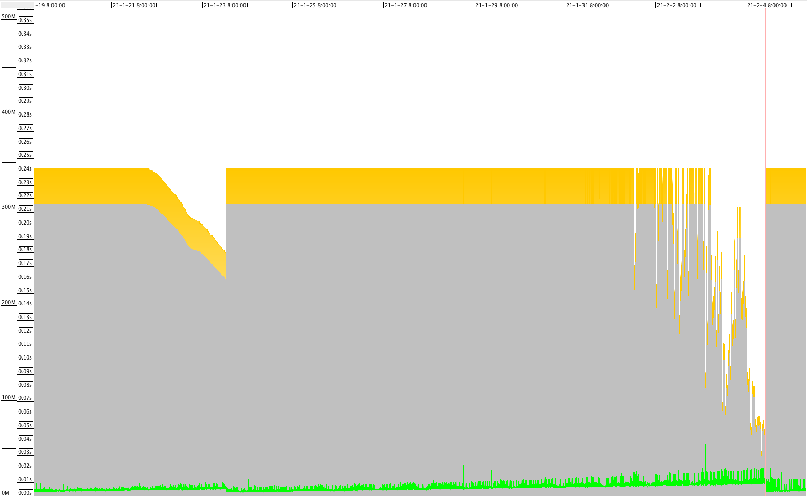
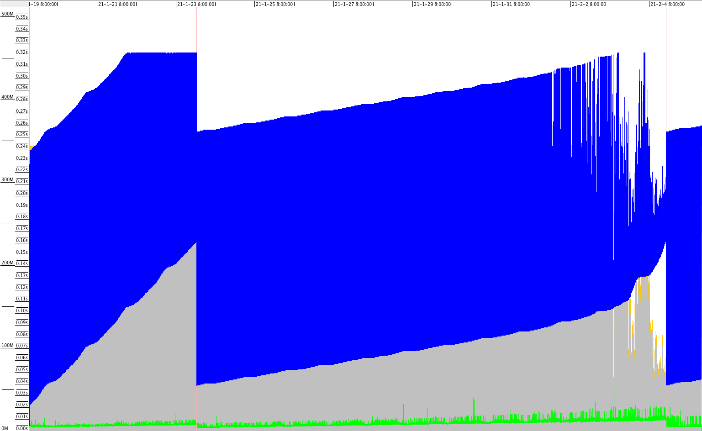
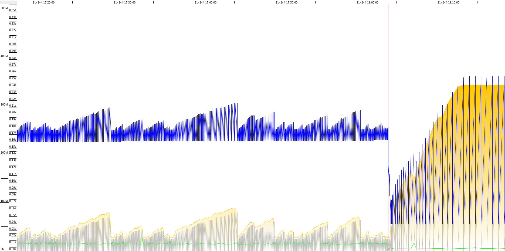

## 0.

最近发现有个 Java 写的 sidecar 程序本来运行很平稳，忽然 Young GC 的频率就开始升高，新生代大小频繁的调整，最终是在一轮 Mixed GC 之后才恢复平稳。

根据以往学习的理论知识可知 G1 有一个特性就是自适应调整新生代的大小，避免停顿时间超过阈值，以实现 MaxGCPauseMillis 的软实时目标。

但是出现这种频繁调整的情况是很不正常的，k8s 容器的稳定性会差一些，偶尔会遇到一些很诡异的 cpu throttle，而这个 sidecar 的 MaxGCPauseMillis 设置的过小（10ms），运行环境稍有波动，G1 就会进行不必要的动态调整，甚至进入下图中的异常震荡状态。

在不稳定环境中，MaxGCPauseMillis 这种阈值不能设置的调小。或者可以通过设置 Xmn 关闭自适应调整策略。







G1 的源码之前[囫囵吞枣看过一遍](https://www.jianshu.com/nb/25639075)，其中大部分细节都忽略没看。

这次准备把新生代自适应调整的代码仔细看看，顺便做个笔记。

代码的版本为 [openjdk/jdk11u](https://github.com/openjdk/jdk11u)

## 1. MMU target violated

在 GC 日志中有很多这样的信息：
```
[info ][gc,mmu        ] GC(50870) MMU target violated: 11.0ms (10.0ms/11.0ms)
```

何为 MMU target？又是如何 violated 的呢？

根据 GC 日志的信息来看，好像指得是该次 GC 的停顿时间超过了 MaxGCPauseMillis，这个理解也对，但是并不准确。

该行日志是在 `G1MMUTrackerQueue::add_pause` 方法中打印的，对于 Pause Young (Normal)，其调用栈为：
```
--> G1CollectedHeap::do_collection_pause_at_safepoint(double target_pause_time_ms)
  --> void G1Policy::record_collection_pause_end(double pause_time_ms, size_t cards_scanned, size_t heap_used_bytes_before_gc)
    --> void G1Policy::record_pause(PauseKind kind, double start, double end)
      --> void G1MMUTrackerQueue::add_pause(double start, double end)
```

另外对于 Remark 和 Cleanup 等也会调用 `G1MMUTrackerQueue::add_pause` 方法，换句话说 FullGC 除外的所有 STW 停顿都会记录在这个队列中。

```
// share/gc/g1/g1MMUTracker.cpp
 78 void G1MMUTrackerQueue::add_pause(double start, double end) {
 79   double duration = end - start;
 80
 81   remove_expired_entries(end);
 82   if (_no_entries == QueueLength) {
.....
 97     _head_index = trim_index(_head_index + 1);
 98     assert(_head_index == _tail_index, "Because we have a full circular buffer");
 99     _tail_index = trim_index(_tail_index + 1);
100   } else {
101     _head_index = trim_index(_head_index + 1);
102     ++_no_entries;
103   }
104   _array[_head_index] = G1MMUTrackerQueueElem(start, end);
105
......
107   double slice_time = calculate_gc_time(end);
108   G1MMUTracer::report_mmu(_time_slice, slice_time, _max_gc_time);
109
110   if (slice_time >= _max_gc_time) {
111     log_info(gc, mmu)("MMU target violated: %.1lfms (%.1lfms/%.1lfms)", slice_time * 1000.0, _max_gc_time * 1000.0, _time_slice * 1000);
112   }
113 }
```

* `start` 和 `end` 分别表示该次 STW 停顿的起始和结束时间
* `_max_gc_time` 就是设置的 MaxGCPauseMillis
* `_time_slice` 就是 GCPauseIntervalMillis，默认值为 MaxGCPauseMillis+1

了解了这些信息就很容易理解 g1MMUTracker.hpp 中对 MMU 的注释了：
> Mutator Utilisation：给定一个时间片 ts，mutator utilisation = non_gc_time / ts，也就是非 GC 时间的比例。
> Minimum Mutator Utilisation (MMU)： mutator utilisation 的最差情况。

**MMU 设定的目标就是: 1 - MaxGCPauseMillis/GCPauseIntervalMillis**


L104 行里的 `_array` 保存的就是历次 STW 停顿的时间信息；L107 行的  `calculate_gc_time(end)` 方法计算的 `slice_time` 即为从现在开始向前推一个时间片里停顿时间的总和。

```
// share/gc/g1/g1MMUTracker.cpp
 62 double G1MMUTrackerQueue::calculate_gc_time(double current_time) {
 63   double gc_time = 0.0;
 64   double limit = current_time - _time_slice;
 65   for (int i = 0; i < _no_entries; ++i) {
 66     int index = trim_index(_tail_index + i);
 67     G1MMUTrackerQueueElem *elem = &_array[index];
 68     if (elem->end_time() > limit) {
 69       if (elem->start_time() > limit)
 70         gc_time += elem->duration();
 71       else
 72         gc_time += elem->end_time() - limit;
 73     }
 74   }
 75   return gc_time;
 76 }
```

套用上面 MMU 的公式，如果过去一个时间片的 `gc_time` 大于等于 `_max_gc_time` 那么就是 violate 了设定的 MMU 目标。

在没有设置 GCPauseIntervalMillis 的情况下，时间片为 MaxGCPauseMillis+1，所以出现 MMU target violated 的情况基本就是该次 GC 停顿时间超过了 MaxGCPauseMillis。

**通常情况下，新生代自适应调整会保证 GC 停顿不会超过 MaxGCPauseMillis，如果出现 MMU target violated 这行日志一般就是容器环境有波动，或者是之前的波动影响了预测的准确性。**

## 2. 新生代自适应调整

```
[info ][gc,heap       ] GC(50870) Eden regions: 53->0(24)
[info ][gc,heap       ] GC(50870) Survivor regions: 1->1(7)
```

从这两行日志可以辨别新生代的调整，先看一下这些数字的含义，该日志是在 `G1HeapTransition::print()` 方法中打印的。

```
 81 void G1HeapTransition::print() {
 82   Data after(_g1_heap);
 83
 84   size_t eden_capacity_length_after_gc = _g1_heap->g1_policy()->young_list_target_length() - after._survivor_length;
 85   size_t survivor_capacity_length_after_gc = _g1_heap->g1_policy()->max_survivor_regions();
 86
......
100
101   log_info(gc, heap)("Eden regions: " SIZE_FORMAT "->" SIZE_FORMAT "("  SIZE_FORMAT ")",
102                      _before._eden_length, after._eden_length, eden_capacity_length_after_gc);
103   log_trace(gc, heap)(" Used: 0K, Waste: 0K");
104
105   log_info(gc, heap)("Survivor regions: " SIZE_FORMAT "->" SIZE_FORMAT "("  SIZE_FORMAT ")",
106                      _before._survivor_length, after._survivor_length, survivor_capacity_length_after_gc);
......
121 }
```

**Eden regions: GC 前 eden 大小 -> GC 后 eden 大小 (新设定的新生代大小 - GC 后 survivor 大小)**
**Survivor regions: GC 前 survivor 大小 -> GC 后 survivor 大小 (新设定的 survivor 最大值)**

G1 的配置和策略基本都封装在 `G1Policy` 这个类中，其中的 `_young_list_target_length` 变量表示新生代的大小，该变量更新的逻辑在 ` G1Policy::update_young_list_target_length` 方法中。

自适应调整新生代的地方比较多：
```
--> void G1Policy::init(G1CollectedHeap* g1h, G1CollectionSet* collection_set)
--> void G1Policy::record_full_collection_end()
--> void G1Policy::record_collection_pause_end(double pause_time_ms, size_t cards_scanned, size_t heap_used_bytes_before_gc)
  --> uint G1Policy::update_young_list_max_and_target_length()
    --> uint G1Policy::update_young_list_max_and_target_length(size_t rs_lengths)
      --> uint G1Policy::update_young_list_target_length(size_t rs_lengths)
```

```
--> void G1YoungRemSetSamplingThread::run_service()
  --> void G1YoungRemSetSamplingThread::sample_young_list_rs_lengths()
    --> void G1Policy::revise_young_list_target_length_if_necessary(size_t rs_lengths)
      --> uint G1Policy::update_young_list_max_and_target_length(size_t rs_lengths)
        --> uint G1Policy::update_young_list_target_length(size_t rs_lengths)
```

总结一下，可以分三类：
1. 初始化
    严格说这不算调整，只是计算个初始值
1. GC 结束后
    a. 处于 `in_young_only_phase` （也就说 Pause Young (Prepare Mixed) 结束后不调整）
    b. FullGC 结束后
2. G1YoungRemSetSamplingThread 并发调整
     处于 `in_young_only_phase`，在 GC 停顿之间尝试调整

这个 `in_young_only_phase` 看图理解比较清楚：


该图来源于官方文档 [HotSpot Virtual Machine Garbage Collection Tuning Guide](https://docs.oracle.com/en/java/javase/11/gctuning/garbage-first-garbage-collector.html#GUID-F1BE86FA-3EDC-4D4F-BDB4-4B044AD83180)

### 2.1. rs_length

在看具体逻辑之前，先了解一下传入的参数 `rs_length`

#### 2.1.1. update_young_list_max_and_target_length

在 `G1Policy::update_young_list_max_and_target_length()` 方法中是通过 `_analytics->predict_rs_lengths()` 获取的：

```
// share/gc/g1/g1Analytics.cpp
313 size_t G1Analytics::predict_rs_lengths() const {
314   return get_new_size_prediction(_rs_lengths_seq);
315 }
```

这个预测的方法在 G1 中是通用的，具体逻辑在 g1Predictions.hpp 中，简而言之就是通过计算历史数据的均值和标准差预测，另外这里多了一个时间衰减。

`_rs_lengths_seq` 这个队列的长度为 `TruncatedSeqLength = 10`，存储的是 Young GC 时 RSet 的长度。

```
// share/gc/g1/g1Policy.cpp
 556 void G1Policy::record_collection_pause_end(double pause_time_ms, size_t cards_scanned, size_t heap_used_bytes_before_gc) {
......
 689     // Do not update RS lengths and the number of pending cards with information from mixed gc:
 690     // these are is wildly different to during young only gc and mess up young gen sizing right
 691     // after the mixed gc phase.
 692     // During mixed gc we do not use them for young gen sizing.
 693     if (this_pause_was_young_only) {
 694       _analytics->report_pending_cards((double) _pending_cards);
 695       _analytics->report_rs_lengths((double) _max_rs_lengths);
 696     }
......
 710   size_t last_unrestrained_young_length = update_young_list_max_and_target_length();
 711   update_rs_lengths_prediction();
......
 738 }
```

计算 `_max_rs_lengths` 的逻辑在 `G1FreeCollectionSetTask` 中，也就是 `G1CollectedHeap::free_collection_set` 阶段。

```
// share/gc/g1/g1CollectedHeap.cpp
4302   void do_parallel_work_for_region(uint region_idx, bool is_young, bool evacuation_failed) {
4303     G1CollectedHeap* g1h = G1CollectedHeap::heap();
4304
4305     HeapRegion* r = g1h->region_at(region_idx);
4306     assert(!g1h->is_on_master_free_list(r), "sanity");
4307
4308     Atomic::add(r->rem_set()->occupied_locked(), &_rs_lengths);
4309
4310     if (!is_young) {
4311       g1h->_hot_card_cache->reset_card_counts(r);
4312     }
4313
4314     if (!evacuation_failed) {
4315       r->rem_set()->clear_locked();
4316     }
4317   }
```

累加 CSet 的 RSet 中的 card 数量。

（G1 这个 PointIn 方式的 RSet 实现较复杂，大致看了一下用了三层数据结构，这里也先忽略细节了）

#### 2.1.2. sample_young_list_rs_lengths

在 `G1YoungRemSetSamplingThread::sample_young_list_rs_lengths()` 方法中是通过 `G1YoungRemSetSamplingClosure` 的 `cl.sampled_rs_lengths()` 获取的。

```
// share/gc/g1/g1YoungRemSetSamplingThread.cpp
106 void G1YoungRemSetSamplingThread::sample_young_list_rs_lengths() {
107   SuspendibleThreadSetJoiner sts;
108   G1CollectedHeap* g1h = G1CollectedHeap::heap();
109   G1Policy* g1p = g1h->g1_policy();
110
111   if (g1p->adaptive_young_list_length()) {
112     G1YoungRemSetSamplingClosure cl(&sts);
113
114     G1CollectionSet* g1cs = g1h->collection_set();
115     g1cs->iterate(&cl);
116
117     if (cl.is_complete()) {
118       g1p->revise_young_list_target_length_if_necessary(cl.sampled_rs_lengths());
119     }
120   }
121 }
```

`G1YoungRemSetSamplingThread` 是一个并发执行的线程，在 GC 停顿之间循环执行，迭代统计 CSet 当前的 RSet 长度。

```
// share/gc/g1/g1Policy.cpp
 392 void G1Policy::revise_young_list_target_length_if_necessary(size_t rs_lengths) {
 393   guarantee( adaptive_young_list_length(), "should not call this otherwise" );
 394
 395   if (rs_lengths > _rs_lengths_prediction) {
 396     // add 10% to avoid having to recalculate often
 397     size_t rs_lengths_prediction = rs_lengths * 1100 / 1000;
 398     update_rs_lengths_prediction(rs_lengths_prediction);
 399
 400     update_young_list_max_and_target_length(rs_lengths_prediction);
 401   }
 402 }
```

如果当前 CSet 的 RSet 长度大于上次的预测值，那么就重新调整新生代大小。

**这里的逻辑是，因为处理 RSet 的相关逻辑比较耗时，所以如果上次预测的 RSet 长度小了，那么下次 GC 耗时很可能超过 MaxGCPauseMillis，因此立即再调整一下。**

### 2.2 adaptive_young_list_length

判断是否开启自适应策略的方法是 `G1Policy::adaptive_young_list_length() `，其中的标识变量是在 `G1YoungGenSizer` 初始化时赋值的。

```
// share/gc/g1/g1YoungGenSizer.cpp
 30 G1YoungGenSizer::G1YoungGenSizer() : _sizer_kind(SizerDefaults), _adaptive_size(true),
 31         _min_desired_young_length(0), _max_desired_young_length(0) {
 32   if (FLAG_IS_CMDLINE(NewRatio)) {
 33     if (FLAG_IS_CMDLINE(NewSize) || FLAG_IS_CMDLINE(MaxNewSize)) {
 34       log_warning(gc, ergo)("-XX:NewSize and -XX:MaxNewSize override -XX:NewRatio");
 35     } else {
 36       _sizer_kind = SizerNewRatio;
 37       _adaptive_size = false;
 38       return;
 39     }
 40   }
......
 51   if (FLAG_IS_CMDLINE(NewSize)) {
 52     _min_desired_young_length = MAX2((uint) (NewSize / HeapRegion::GrainBytes),
 53                                      1U);
 54     if (FLAG_IS_CMDLINE(MaxNewSize)) {
 55       _max_desired_young_length =
 56                              MAX2((uint) (MaxNewSize / HeapRegion::GrainBytes),
 57                                   1U);
 58       _sizer_kind = SizerMaxAndNewSize;
 59       _adaptive_size = _min_desired_young_length != _max_desired_young_length;
 60     } else {
 61       _sizer_kind = SizerNewSizeOnly;
 62     }
......
 69 }
```

默认开启自适应策略，但是有两种情况会关闭：
1. 设置了 NewRatio（但是未设置 NewSize 和 MaxNewSize）
2. 设置了 NewSize 和 MaxNewSize，并且数值一致（也就是设置 Xmn）

### 2.3 新生代大小自适应算法

```
// share/gc/g1/g1Policy.cpp
 213 G1Policy::YoungTargetLengths G1Policy::young_list_target_lengths(size_t rs_lengths) const {
 214   YoungTargetLengths result;
 215
 216   // Calculate the absolute and desired min bounds first.
 217
 218   // This is how many young regions we already have (currently: the survivors).
 219   const uint base_min_length = _g1h->survivor_regions_count();
 220   uint desired_min_length = calculate_young_list_desired_min_length(base_min_length);
 221   // This is the absolute minimum young length. Ensure that we
 222   // will at least have one eden region available for allocation.
 223   uint absolute_min_length = base_min_length + MAX2(_g1h->eden_regions_count(), (uint)1);
 224   // If we shrank the young list target it should not shrink below the current size.
 225   desired_min_length = MAX2(desired_min_length, absolute_min_length);
 226   // Calculate the absolute and desired max bounds.
 227
 228   uint desired_max_length = calculate_young_list_desired_max_length();
 229
 230   uint young_list_target_length = 0;
 231   if (adaptive_young_list_length()) {
 232     if (collector_state()->in_young_only_phase()) {
 233       young_list_target_length =
 234                         calculate_young_list_target_length(rs_lengths,
 235                                                            base_min_length,
 236                                                            desired_min_length,
 237                                                            desired_max_length);
 238     } else {
 239       // Don't calculate anything and let the code below bound it to
 240       // the desired_min_length, i.e., do the next GC as soon as
 241       // possible to maximize how many old regions we can add to it.
 242     }
 243   } else {
 244     // The user asked for a fixed young gen so we'll fix the young gen
 245     // whether the next GC is young or mixed.
 246     young_list_target_length = _young_list_fixed_length;
 247   }
 248
 249   result.second = young_list_target_length;
 250
 251   // We will try our best not to "eat" into the reserve.
 252   uint absolute_max_length = 0;
 253   if (_free_regions_at_end_of_collection > _reserve_regions) {
 254     absolute_max_length = _free_regions_at_end_of_collection - _reserve_regions;
 255   }
 256   if (desired_max_length > absolute_max_length) {
 257     desired_max_length = absolute_max_length;
 258   }
 259
 260   // Make sure we don't go over the desired max length, nor under the
 261   // desired min length. In case they clash, desired_min_length wins
 262   // which is why that test is second.
 263   if (young_list_target_length > desired_max_length) {
 264     young_list_target_length = desired_max_length;
 265   }
 266   if (young_list_target_length < desired_min_length) {
 267     young_list_target_length = desired_min_length;
 268   }
 269
 270   assert(young_list_target_length > base_min_length,
 271          "we should be able to allocate at least one eden region");
 272   assert(young_list_target_length >= absolute_min_length, "post-condition");
 273
 274   result.first = young_list_target_length;
 275   return result;
 276 }
```

该方法返回的 `result` 包含两个值，其中 `result.first` 是新生代调整后的大小，在 `result.second` 的基础上又增加了最大最小阈值限制。

（`result.second` 用于自适应 IHOP 计算，这部分逻辑也挺复杂，之后再单独开一篇）

自适应算法在 `calculate_young_list_target_length` 方法中，先了解一下参数：

1. `rs_lengths` 上面已经解释。
2. `base_min_length` 当前 survivor 的大小，设置的新生代大小不能小于本次 GC 后的 survivor。
3. `desired_min_length` 这个下限值的计算用到了上面介绍的 MMU，下面再详细看。`absolute_min_length` 保证至少有一个可分配的 eden region。
4. `desired_max_length` 新生代的上限值，在未配置的情况下为堆大小的 60% （其余情况暂且忽略）。

```
// share/gc/g1/g1Policy.cpp
 173 uint G1Policy::calculate_young_list_desired_min_length(uint base_min_length) const {
 174   uint desired_min_length = 0;
 175   if (adaptive_young_list_length()) {
 176     if (_analytics->num_alloc_rate_ms() > 3) {
 177       double now_sec = os::elapsedTime();
 178       double when_ms = _mmu_tracker->when_max_gc_sec(now_sec) * 1000.0;
 179       double alloc_rate_ms = _analytics->predict_alloc_rate_ms();
 180       desired_min_length = (uint) ceil(alloc_rate_ms * when_ms);
 181     } else {
 182       // otherwise we don't have enough info to make the prediction
 183     }
 184   }
 185   desired_min_length += base_min_length;
 186   // make sure we don't go below any user-defined minimum bound
 187   return MAX2(_young_gen_sizer.min_desired_young_length(), desired_min_length);
 188 }
```

这里的 `_alloc_rate_ms_seq` 与 `_rs_lengths_seq` 一样，用于预测分配速率，在 GC 回收之后记录历史数据。

`alloc_rate_ms` 是预测的分配速率，`when_ms` 是满足 MMU 目标的最短非停顿时间，两者的乘积就表示：**要实现 MMU 的目标，至少需要给出这么多 region 用于接下来的内存分配。**在 GCPauseIntervalMillis 默认值的情况下，这个值应该变化不大，与分配速率成正比。

`_young_gen_sizer.min_desired_young_length()` 在未配置的情况下为堆大小的 5%（其余情况暂且忽略）。

接下来就进入最复杂的 `calculate_young_list_target_length` 方法：
```
// share/gc/g1/g1Policy.cpp
 278 uint
 279 G1Policy::calculate_young_list_target_length(size_t rs_lengths,
 280                                                     uint base_min_length,
 281                                                     uint desired_min_length,
 282                                                     uint desired_max_length) const {
 283   assert(adaptive_young_list_length(), "pre-condition");
 284   assert(collector_state()->in_young_only_phase(), "only call this for young GCs");
 285
 286   // In case some edge-condition makes the desired max length too small...
 287   if (desired_max_length <= desired_min_length) {
 288     return desired_min_length;
 289   }
 290
 291   // We'll adjust min_young_length and max_young_length not to include
 292   // the already allocated young regions (i.e., so they reflect the
 293   // min and max eden regions we'll allocate). The base_min_length
 294   // will be reflected in the predictions by the
 295   // survivor_regions_evac_time prediction.
 296   assert(desired_min_length > base_min_length, "invariant");
 297   uint min_young_length = desired_min_length - base_min_length;
 298   assert(desired_max_length > base_min_length, "invariant");
 299   uint max_young_length = desired_max_length - base_min_length;
 300
 301   const double target_pause_time_ms = _mmu_tracker->max_gc_time() * 1000.0;
 302   const double survivor_regions_evac_time = predict_survivor_regions_evac_time();
 303   const size_t pending_cards = _analytics->predict_pending_cards();
 304   const size_t adj_rs_lengths = rs_lengths + _analytics->predict_rs_length_diff();
 305   const size_t scanned_cards = _analytics->predict_card_num(adj_rs_lengths, true /* for_young_gc */);
 306   const double base_time_ms =
 307     predict_base_elapsed_time_ms(pending_cards, scanned_cards) +
 308     survivor_regions_evac_time;
 309   const uint available_free_regions = _free_regions_at_end_of_collection;
 310   const uint base_free_regions =
 311     available_free_regions > _reserve_regions ? available_free_regions - _reserve_regions : 0;
 312
 313   // Here, we will make sure that the shortest young length that
 314   // makes sense fits within the target pause time.
 315
 316   G1YoungLengthPredictor p(collector_state()->mark_or_rebuild_in_progress(),
 317                            base_time_ms,
 318                            base_free_regions,
 319                            target_pause_time_ms,
 320                            this);
 321   if (p.will_fit(min_young_length)) {
 322     // The shortest young length will fit into the target pause time;
 323     // we'll now check whether the absolute maximum number of young
 324     // regions will fit in the target pause time. If not, we'll do
 325     // a binary search between min_young_length and max_young_length.
 326     if (p.will_fit(max_young_length)) {
 327       // The maximum young length will fit into the target pause time.
 328       // We are done so set min young length to the maximum length (as
 329       // the result is assumed to be returned in min_young_length).
 330       min_young_length = max_young_length;
 331     } else {
 332       // The maximum possible number of young regions will not fit within
 333       // the target pause time so we'll search for the optimal
 334       // length. The loop invariants are:
 335       //
 336       // min_young_length < max_young_length
 337       // min_young_length is known to fit into the target pause time
 338       // max_young_length is known not to fit into the target pause time
 339       //
 340       // Going into the loop we know the above hold as we've just
 341       // checked them. Every time around the loop we check whether
 342       // the middle value between min_young_length and
 343       // max_young_length fits into the target pause time. If it
 344       // does, it becomes the new min. If it doesn't, it becomes
 345       // the new max. This way we maintain the loop invariants.
 346
 347       assert(min_young_length < max_young_length, "invariant");
 348       uint diff = (max_young_length - min_young_length) / 2;
 349       while (diff > 0) {
 350         uint young_length = min_young_length + diff;
 351         if (p.will_fit(young_length)) {
 352           min_young_length = young_length;
 353         } else {
 354           max_young_length = young_length;
 355         }
 356         assert(min_young_length <  max_young_length, "invariant");
 357         diff = (max_young_length - min_young_length) / 2;
 358       }
 359       // The results is min_young_length which, according to the
 360       // loop invariants, should fit within the target pause time.
 361
 362       // These are the post-conditions of the binary search above:
 363       assert(min_young_length < max_young_length,
 364              "otherwise we should have discovered that max_young_length "
 365              "fits into the pause target and not done the binary search");
 366       assert(p.will_fit(min_young_length),
 367              "min_young_length, the result of the binary search, should "
 368              "fit into the pause target");
 369       assert(!p.will_fit(min_young_length + 1),
 370              "min_young_length, the result of the binary search, should be "
 371              "optimal, so no larger length should fit into the pause target");
 372     }
 373   } else {
 374     // Even the minimum length doesn't fit into the pause time
 375     // target, return it as the result nevertheless.
 376   }
 377   return base_min_length + min_young_length;
 378 }
```

前半部分也有很多预测的代码，原理与 `_alloc_rate_ms_seq` 一样。

`base_time_ms` 基本耗时包含两部分：
1. L302 `survivor_regions_evac_time` 预测 survivor evac 的时间
   a. 预测 rs 扫描的时间
   b. 预测对象拷贝的时间
   c. 预测 other 时间
2. L307 处理 cards 的时间（基于前面的 `rs_lengths`预测）
   a. 预测处理 pending_cards 更新 rs 的时间
   b. 预测扫描 rs 的时间
   c. 预测 other 时间

`base_free_regions` 是扣除 `_reserve_regions` 之外的当前可用空间。


**到此先简单总结一下：**
1. `min_young_length` 是满足 MMU 目标需要分配的最少内存
2. `max_young_length` 是设置的最大新生代限制
3. 预测下一次 GC 的基本耗时 `base_time_ms`
4. 当前可用的空闲空间 `base_free_regions`
5. 接下来就是综合以上信息从 [min, max] 中找到一个满足 MaxGCPauseMillis 的最大值

判断是否满足条件的逻辑封装在 `G1YoungLengthPredictor` 的 `will_fit` 方法中：
```
// share/gc/g1/g1Policy.cpp
 121   bool will_fit(uint young_length) const {
 122     if (young_length >= _base_free_regions) {
 123       // end condition 1: not enough space for the young regions
 124       return false;
 125     }
 126
 127     const double accum_surv_rate = _policy->accum_yg_surv_rate_pred((int) young_length - 1);
 128     const size_t bytes_to_copy =
 129                  (size_t) (accum_surv_rate * (double) HeapRegion::GrainBytes);
 130     const double copy_time_ms =
 131       _policy->analytics()->predict_object_copy_time_ms(bytes_to_copy, _during_cm);
 132     const double young_other_time_ms = _policy->analytics()->predict_young_other_time_ms(young_length);
 133     const double pause_time_ms = _base_time_ms + copy_time_ms + young_other_time_ms;
 134     if (pause_time_ms > _target_pause_time_ms) {
 135       // end condition 2: prediction is over the target pause time
 136       return false;
 137     }
 138
 139     const size_t free_bytes = (_base_free_regions - young_length) * HeapRegion::GrainBytes;
 140
 141     // When copying, we will likely need more bytes free than is live in the region.
 142     // Add some safety margin to factor in the confidence of our guess, and the
 143     // natural expected waste.
 144     // (100.0 / G1ConfidencePercent) is a scale factor that expresses the uncertainty
 145     // of the calculation: the lower the confidence, the more headroom.
 146     // (100 + TargetPLABWastePct) represents the increase in expected bytes during
 147     // copying due to anticipated waste in the PLABs.
 148     const double safety_factor = (100.0 / G1ConfidencePercent) * (100 + TargetPLABWastePct) / 100.0;
 149     const size_t expected_bytes_to_copy = (size_t)(safety_factor * bytes_to_copy);
 150
 151     if (expected_bytes_to_copy > free_bytes) {
 152       // end condition 3: out-of-space
 153       return false;
 154     }
 155
 156     // success!
 157     return true;
 158   }
```

依次检查三个条件：
1. 超过了当前最大可用空间
2. 如果预估的停顿时间大于 MaxGCPauseMillis。此处预估 `pause_time_ms` 在基本耗时的基础上加上了下次 GC 时 eden 区的处理时间，给定的新生代越大，预估耗时也会越大。
3. 为了避免 To-space exhausted 的情况，如果 `expected_bytes_to_copy` 大于剩余可用空间那么也不合适。这里对预估的 `bytes_to_copy` 还乘了个安全系数。TargetPLABWastePct 默认值 10，G1ConfidencePercent 默认值 50，该系数默认为 2.2。

以上，就是 G1 新生代自适应的主干逻辑。

## 3. 最后

最后还有一个小问题：`G1Policy::init(G1CollectedHeap* g1h, G1CollectionSet* collection_set)` 时，新生代设置的大小是多少呢？

根据 GC 日志来看，新生代初始值为 `min_young_length`，也就是默认情况下堆大小的 5%。 但是根据上面的逻辑算下来，如果初始的预测值都是 0 的话，那么新生代初始值应该是 `max_young_length`，其中的原因是有些预测值有默认初始值，比如 `_constant_other_time_ms_seq`、 `_young_other_cost_per_region_ms_seq`、 `_cost_per_byte_ms_seq`、 `_short_lived_surv_rate_group`等，大多数情况下只有最小值合适。


