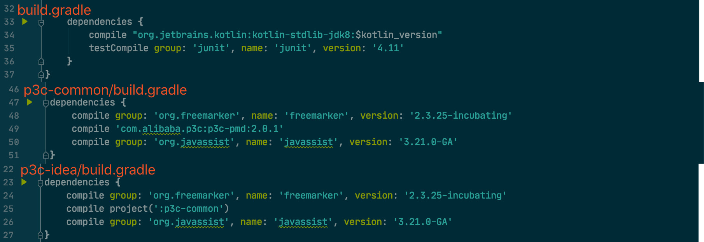
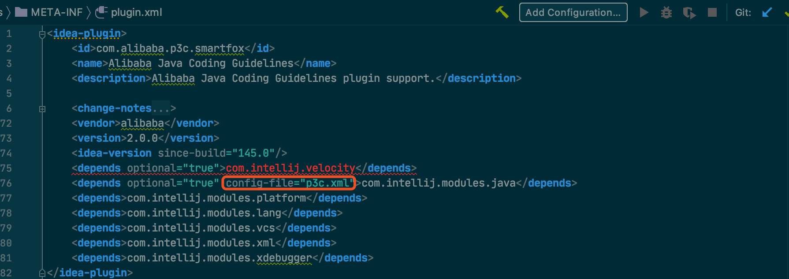
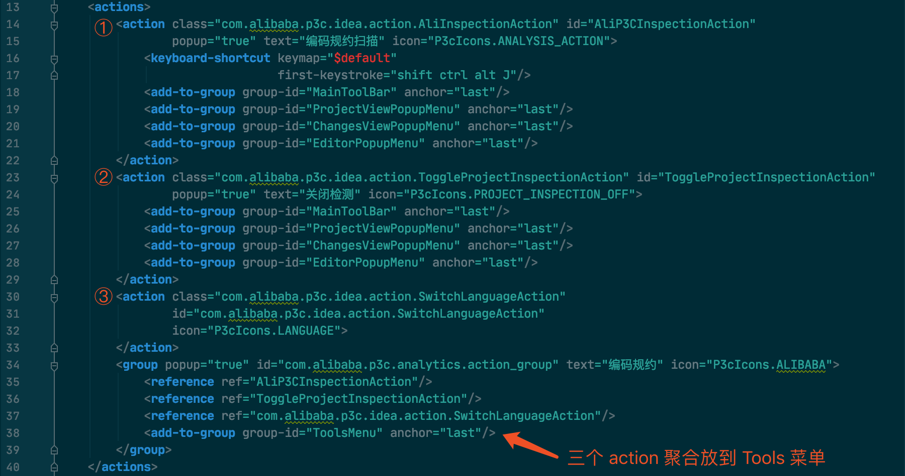
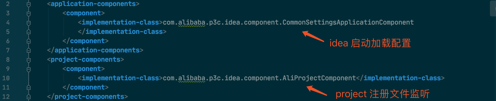
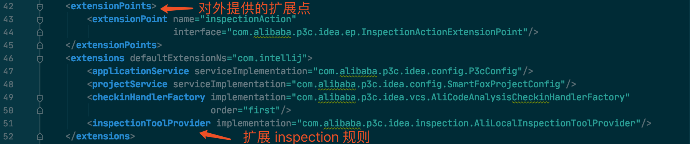

## 0. 

[p3c](https://github.com/alibaba/p3c) 是阿里基于《阿里巴巴Java开发手册》开发的代码分析插件，其中包括 PMD、IntelliJ IDEA plugin 和 Eclipse plugin 三个实现。

最近看了一下 IntelliJ IDEA plugin 的实现，顺便记个笔记。

## 1. IntelliJ IDEA plugin 的基本结构

IntelliJ IDEA plugin 项目默认是以 Gradle 管理的，IDEA 可以帮忙生成项目的模板，最重要的是两个文件 —— `build.gradle` 和 `META-INF/plugin.xml`。

`build.gradle` 主要用来管理依赖和编译发布，由于 p3c idea-plugin 分了两个模块，所以项目中有三个 `build.gradle`，主要的依赖有：

具体的静态代码分析规则实现在 p3c-pmd 中，这个项目简单说就是个“壳”。

`META-INF/plugin.xml` 就是重点了，定义一些 action 声明插件的接口位置和实现类。p3c idea-plugin 稍微复杂一些，在 `plugin.xml` 只声明 depends，具体的 action 声明在 `p3c.xml` 中。

`p3c.xml` 定义的 action 有三个：

另外还定义了一些 component，application-components 是 idea 维度的组件，project-components 是 project 维度的组件：

最后还定义了一些 extension，也就是基于现有的框架“加塞”一些功能：

这个代码检查的功能很自然地可以加到 IDEA 的 Inspection 框架中。

## 2. 了解一下 Inspection

这里用了两个代码分析框架：
1. IDEA 内建
2. PMD

加载 Inspection 的逻辑封装在 AliLocalInspectionToolProvider 中。

关于代码静态分析另起一篇文章来记录。

## 3. 进一步

[IntelliJ Platform SDK DevGuide](https://www.jetbrains.org/intellij/sdk/docs/welcome.html)
