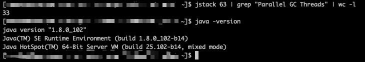
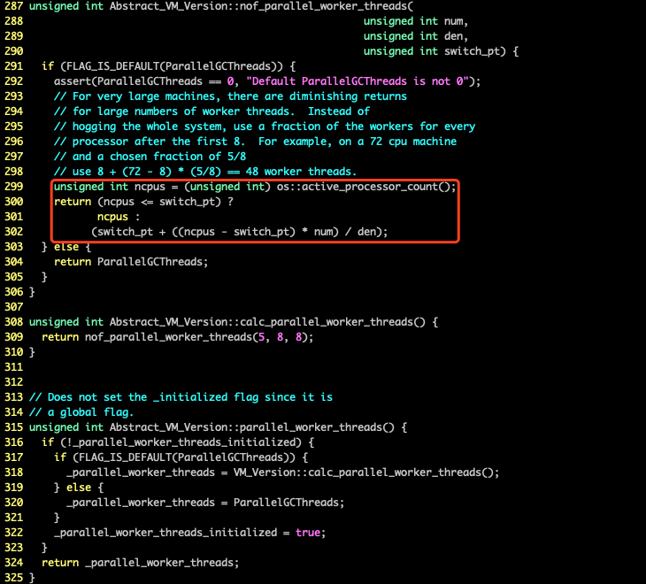
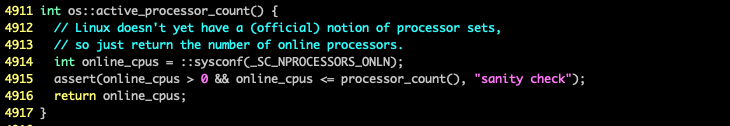
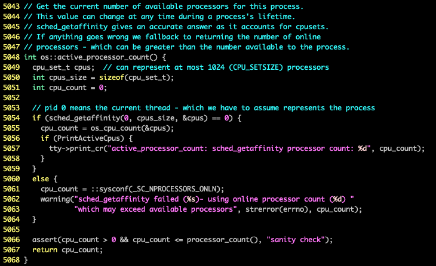
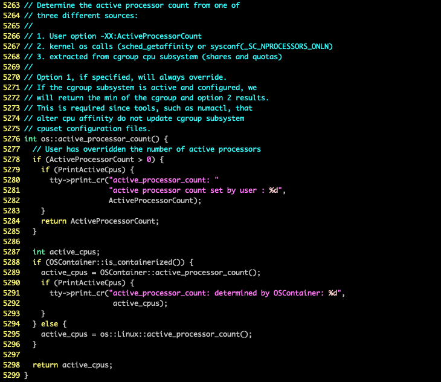
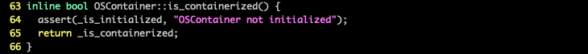
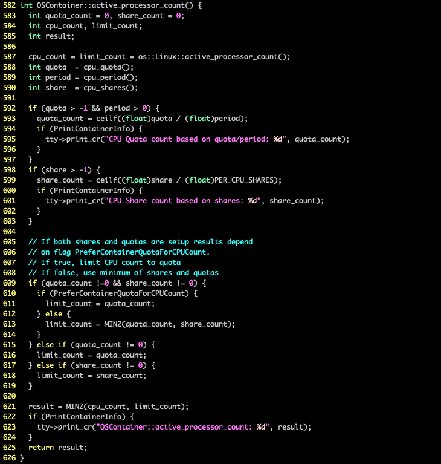
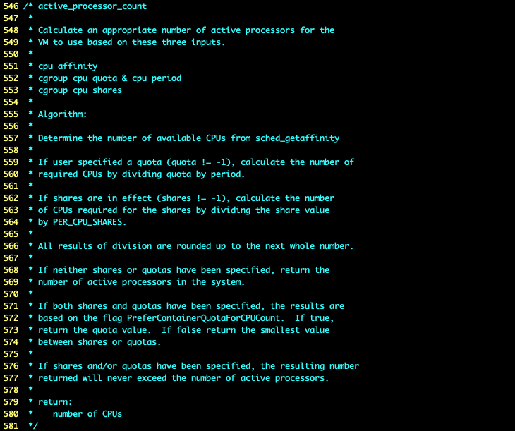
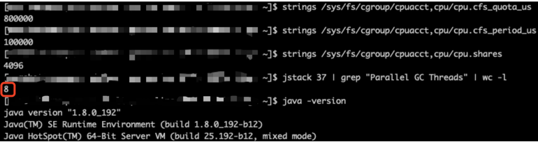

# 0. 问题

原本部署在物理机上服务迁移至 docker 容器之后，发现 “Parallel GC Threads” 和 “C* CompilerThread” 的数量不正常。

由于这些线程的数量与 CPU 的核心数是正相关的，所以在 docker 容器设置了 CPU 限制之后，应该比在物理机上少一些才对。

以一个 CPU 设置为 4 的 docker 容器为例：

“Parallel GC Threads” 线程数的计算公式在 `vm_version.cpp` 中：

如果 `os::active_processor_count()` 返回 4，那么线程数应该是 4；但是实际的线程数为 33，可以反推 JVM 获取到的 CPU 核心数为 48，与物理机的核心数一致。

现在的问题是：JVM 无法感知 docker 容器设置的 CPU 限制，至少在 Java HotSpot(TM) 64-Bit Server VM (build 25.102-b14, mixed mode) 版本是这样。

## 1. active_processor_count 的实现

我们先看一下 jdk8u102-b14 中 `active_processor_count()` 方法的实现，在 `os_linux.cpp` 中：

通过 [sysconf](http://man7.org/linux/man-pages/man3/sysconf.3.html) 获取当前在线的 CPU 核心数，这样获取的当然是物理机的 CPU 核心数。

搜索了一下发现新发布的 Java SE 对 docker 进行了支持 —— [《Java SE support for Docker CPU and memory limits》](https://blogs.oracle.com/java-platform-group/java-se-support-for-docker-cpu-and-memory-limits)

> As of Java SE 8u131, and in JDK 9, the JVM is Docker-aware with respect to Docker CPU limits transparently. That means if -XX:ParalllelGCThreads, or -XX:CICompilerCount are not specified as command line options, the JVM will apply the Docker CPU limit as the number of CPUs the JVM sees on the system. The JVM will then adjust the number of GC threads and JIT compiler threads just like it would as if it were running on a bare metal system with number of CPUs set as the Docker CPU limit.

使用 JDK 9 还遥遥无期，万幸 Java SE 8u131 也进行了兼容，在验证测试之前我们先看一下 jdk8u131-b11 中的代码实现：

这个实现看起来只支持 `--cpuset-cpus` 这种指定固定 CPU 的方式。

顺着  [JDK 8 Update Release Notes](https://www.oracle.com/technetwork/java/javase/8u-relnotes-2225394.html) 查看，发现在 [1.8.0_191-b12 ](https://www.oracle.com/technetwork/java/javase/8u191-relnotes-5032181.html#JDK-8146115) 提供了更完善的 docker 容器支持。

再来看一下 jdk8u191-b12 中的代码实现：

1. 如果设置了 `ActiveProcessorCount`，那么使用配置的 CPU 核心数；
2. 如果判断是容器环境，判断和计算的逻辑封装在 `OSContainer` 中；
3. 否则，逻辑与 jdk8u131-b11 一致。

`is_containerized()` 的实现在 `osContainer_linux.hpp` 中：

`_is_containerized` 的初始化在 `init()` 方法中，由于代码比较多这里就不复制了，总结一下处理逻辑：
1. 如果 UseContainerSupport 为 false，那么 _is_containerized 为 false；
2. 无法读取 `/proc/self/mountinfo`，也是 false；
3. 无法解析 memory、cpuset、cpu,cpuacct、cpuacct、cpu 的 mount 信息，也是 false；
4. 无法读取 `/proc/self/cgroup`，也是 false；
5. 否则 _is_containerized 为 true。

接着看一下 `OSContainer::active_processor_count()` 的实现：

处理逻辑在注释中写得很清楚：

如果你对 docker 不太熟悉，可以通过[官方文档](https://docs.docker.com/config/containers/resource_constraints/#cpu)理解 cpu_quota、cpu_period 和 cpu_shares 这三个配置项。

需要说明一下 cpu_shares 只是一个软限制，只有在机器 CPU 资源饱和时才有效，所以 PreferContainerQuotaForCPUCount 默认也是 true。

## 2. 验证测试

设置 `--cpu-quota=800000`、`--cpu-period=100000`、`--cpu-shares=4096`，也就是预期的 CPU 核心数是 8。

“Parallel GC Threads” 线程数符合预期。

## 3. 其它解决方案

升级 JDK 版本不太容易，新 feature 往往伴随着新 bug，所以也有一些外部链接预加载库的方案。

比如：[libsysconfcpus](https://github.com/vipshop/vjtools/tree/master/vjstar/src/main/script/docker-cpus)
