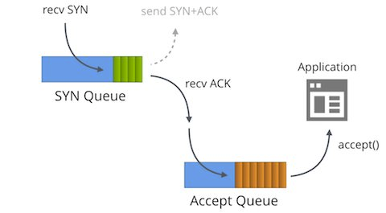

最近使用 netty 过程中发现了几个比较细节的 Connection reset by peer 异常，做个笔记。

## 1. 服务端

#### a. 客户端设置 **SO_LINGER**=0

这个场景出现在用 Jedis ping 检测的场景，用完直接 close，服务端稳定出现 Connection reset by peer。

tcpdump 一下就很容易定位到问题所在，客户端收到 PONG 响应后直接发了一个 RST 包给服务端：
```
13:23:20.371000 IP client > server: Flags [S], seq 1642204245, win 29200, options [mss 1460,sackOK,TS val 3295733375 ecr 0,nop,wscale 9], length 0
	0x0000:  4500 003c ea2a 4000 3706 0fd4 0a74 f82b  E..<.*@.7....t.+
	0x0010:  0a1e 3d00 bb7c 0f7c 61e2 0c55 0000 0000  ..=..|.|a..U....
	0x0020:  a002 7210 a80f 0000 0204 05b4 0402 080a  ..r.............
	0x0030:  c470 e67f 0000 0000 0103 0309            .p..........
13:23:20.371024 IP server > client: Flags [S.], seq 1241908279, ack 1642204246, win 14600, options [mss 1460,nop,nop,sackOK,nop,wscale 9], length 0
	0x0000:  4500 0034 0000 4000 ff06 3206 0a1e 3d00  E..4..@...2...=.
	0x0010:  0a74 f82b 0f7c bb7c 4a06 0437 61e2 0c56  .t.+.|.|J..7a..V
	0x0020:  8012 3908 64cb 0000 0204 05b4 0101 0402  ..9.d...........
	0x0030:  0103 0309                                ....
13:23:20.373036 IP client > server: Flags [.], ack 1, win 58, length 0
	0x0000:  4500 0028 ea2b 4000 3706 0fe7 0a74 f82b  E..(.+@.7....t.+
	0x0010:  0a1e 3d00 bb7c 0f7c 61e2 0c56 4a06 0438  ..=..|.|a..VJ..8
	0x0020:  5010 003a de6d 0000                      P..:.m..
13:23:20.373063 IP client > server: Flags [P.], seq 1:15, ack 1, win 58, length 14
	0x0000:  4500 0036 ea2c 4000 3706 0fd8 0a74 f82b  E..6.,@.7....t.+
	0x0010:  0a1e 3d00 bb7c 0f7c 61e2 0c56 4a06 0438  ..=..|.|a..VJ..8
	0x0020:  5018 003a ca43 0000 2a31 0d0a 2434 0d0a  P..:.C..*1..$4..
	0x0030:  5049 4e47 0d0a                           PING..
13:23:20.373068 IP server > client: Flags [.], ack 15, win 29, length 0
	0x0000:  4500 0028 43e4 4000 ff06 ee2d 0a1e 3d00  E..(C.@....-..=.
	0x0010:  0a74 f82b 0f7c bb7c 4a06 0438 61e2 0c64  .t.+.|.|J..8a..d
	0x0020:  5010 001d de7c 0000                      P....|..
13:23:20.373411 IP server > client: Flags [P.], seq 1:8, ack 15, win 29, length 7
	0x0000:  4500 002f 43e5 4000 ff06 ee25 0a1e 3d00  E../C.@....%..=.
	0x0010:  0a74 f82b 0f7c bb7c 4a06 0438 61e2 0c64  .t.+.|.|J..8a..d
	0x0020:  5018 001d 49df 0000 2b50 4f4e 470d 0a    P...I...+PONG..
13:23:20.375397 IP client > server: Flags [.], ack 8, win 58, length 0
	0x0000:  4500 0028 ea2d 4000 3706 0fe5 0a74 f82b  E..(.-@.7....t.+
	0x0010:  0a1e 3d00 bb7c 0f7c 61e2 0c64 4a06 043f  ..=..|.|a..dJ..?
	0x0020:  5010 003a de58 0000                      P..:.X..
13:23:20.375408 IP client > server: Flags [R.], seq 15, ack 8, win 58, length 0
	0x0000:  4500 0028 ea2e 4000 3706 0fe4 0a74 f82b  E..(..@.7....t.+
	0x0010:  0a1e 3d00 bb7c 0f7c 61e2 0c64 4a06 043f  ..=..|.|a..dJ..?
	0x0020:  5014 003a de54 0000                      P..:.T..
```

查看 Jedis 的源码发现 socket 有个比较特殊的配置 `socket.setSoLinger(true, 0)`。

先看一下 [man7/socket.7](https://man7.org/linux/man-pages/man7/socket.7.html) 的解释：
```
**SO_LINGER**
              Sets or gets the **SO_LINGER** option.  The argument is a
              *linger* structure.

                  struct linger {
                      int l_onoff;    /* linger active */
                      int l_linger;   /* how many seconds to linger for */
                  };

              When enabled, a close(2) or shutdown(2) will not return
              until all queued messages for the socket have been
              successfully sent or the linger timeout has been reached.
              Otherwise, the call returns immediately and the closing is
              done in the background.  When the socket is closed as part
              of exit(2), it always lingers in the background.

```
坦白说不是很明白啥意思。。。

最终在 [stackoverflow](https://stackoverflow.com/questions/3757289/when-is-tcp-option-so-linger-0-required) 上找到一个比较容易理解的解释：
>The typical reason to set a SO_LINGER timeout of zero is to avoid large numbers of connections sitting in the TIME_WAIT state, tying up all the available resources on a server.
>
>When a TCP connection is closed cleanly, the end that initiated the close ("active close") ends up with the connection sitting in TIME_WAIT for several minutes. So if your protocol is one where the server initiates the connection close, and involves very large numbers of short-lived connections, then it might be susceptible to this problem.
>
>This isn't a good idea, though - TIME_WAIT exists for a reason (to ensure that stray packets from old connections don't interfere with new connections). It's a better idea to redesign your protocol to one where the client initiates the connection close, if possible.

简而言之，设置 SO_LINGER(0) 可以不进行四次挥手直接关闭 TCP 连接，在协议交互上就是直接发 RST 包，这样的好处是可以避免长时间处于 TIME_WAIT 状态，当然 TIME_WAIT 存在也是有原因的，大部分评论都不建议这样配置。

## 2. 客户端

#### a. 服务端 accept 队列满

这个场景有点儿微妙，首先得理解一下 tcp 的两个队列。

这篇文章讲得比较清楚：[SYN packet handling in the wild](https://blog.cloudflare.com/syn-packet-handling-in-the-wild/)



accept 队列满通常是由于 netty boss 线程处理慢，特别是在容器化之后，服务刚启动的时候很容易出现 CPU 受限。

为了模拟这个现象，我写了个示例程序 [shichaoyuan/netty-backlog-test](https://github.com/shichaoyuan/netty-backlog-test)，设置 SO_BACKLOG 为 1，并且在 accept 第一个连接后设置 autoRead 为 false，也就是让 boss 线程不再继续 accept 连接。

启动第一个 Client，可以正常连接，发送 PING，接收 PONG。

启动第二个 Client，也可以正常连接，但是没有收到 PONG：
```
[yuan@server ~]$ ss -nlt | grep 18088
LISTEN     1      1            *:18088                    *:*
[yuan@server ~]$ netstat -nap | grep 18088
(Not all processes could be identified, non-owned process info
 will not be shown, you would have to be root to see it all.)
tcp        1      0 0.0.0.0:18088           0.0.0.0:*               LISTEN      11155/java
tcp        0      0 server:18088      client:47496      ESTABLISHED 11155/java
tcp        5      0 server:18088      client:47568      ESTABLISHED -
```
可见这个连接创建成功了，已经在 Accept Queue 里了，但是进程没有 accept，所以没有与进程绑定。

启动第三个 Client，也可以正常连接，也没有收到 PONG：
```
[yuan@server ~]$ ss -nlt | grep 18088
LISTEN     2      1            *:18088                    *:*
[yuan@server ~]$ netstat -nap | grep 18088
(Not all processes could be identified, non-owned process info
 will not be shown, you would have to be root to see it all.)
tcp        2      0 0.0.0.0:18088           0.0.0.0:*               LISTEN      11155/java
tcp        0      0 server:18088      client:47496      ESTABLISHED 11155/java
tcp        5      0 server:18088      client:47568      ESTABLISHED -
tcp        5      0 server:18088      client:47826      ESTABLISHED -
```
与第二个连接一样。

启动第四个 Client，也可以正常连接，但是在发送 PING 后出现 Connection reset by peer：
```
[yuan@server ~]$ ss -nlt | grep 18088
LISTEN     2      1            *:18088                    *:*
[yuan@server ~]$ netstat -nap | grep 18088
(Not all processes could be identified, non-owned process info
 will not be shown, you would have to be root to see it all.)
tcp        2      0 0.0.0.0:18088           0.0.0.0:*               LISTEN      11155/java
tcp        0      0 server:18088      client:47496      ESTABLISHED 11155/java
tcp        5      0 server:18088      client:47568      ESTABLISHED -
tcp        5      0 server:18088      client:47826      ESTABLISHED -
tcp        0      0 server:18088      client:47876      SYN_RECV    -
```
这个连接在服务端并没有进入 accept queue，处于  SYN_RECV 状态，并且很快就消失了（因为 accept queue 已经满了，无法转入 ESTABLISHED  状态）。

抓包看一下：
```
17:43:47.437096 IP client.47876 > server.18088: Flags [S], seq 4054390029, win 29200, options [mss 1460,sackOK,TS val 1453776664 ecr 0,nop,wscale 9], length 0
	0x0000:  4500 003c ca15 4000 4006 f825 ac10 1031  E..<..@.@..%...1
	0x0010:  ac10 102f bb04 46a8 f1a9 150d 0000 0000  .../..F.........
	0x0020:  a002 7210 1f4a 0000 0204 05b4 0402 080a  ..r..J..........
	0x0030:  56a6 df18 0000 0000 0103 0309            V...........
17:43:47.437150 IP server.18088 > client.47876: Flags [S.], seq 2975142789, ack 4054390030, win 28960, options [mss 1460,sackOK,TS val 3821588077 ecr 1453776664,nop,wscale 9], length 0
	0x0000:  4500 003c 0000 4000 4006 c23b ac10 102f  E..<..@.@..;.../
	0x0010:  ac10 1031 46a8 bb04 b155 1385 f1a9 150e  ...1F....U......
	0x0020:  a012 7120 78af 0000 0204 05b4 0402 080a  ..q.x...........
	0x0030:  e3c8 ce6d 56a6 df18 0103 0309            ...mV.......
17:43:47.437239 IP client.47876 > server.18088: Flags [.], ack 1, win 58, options [nop,nop,TS val 1453776664 ecr 3821588077], length 0
	0x0000:  4500 0034 ca16 4000 4006 f82c ac10 1031  E..4..@.@..,...1
	0x0010:  ac10 102f bb04 46a8 f1a9 150e b155 1386  .../..F......U..
	0x0020:  8010 003a 48cc 0000 0101 080a 56a6 df18  ...:H.......V...
	0x0030:  e3c8 ce6d                                ...m
17:43:48.439207 IP server.18088 > client.47876: Flags [S.], seq 2975142789, ack 4054390030, win 28960, options [mss 1460,sackOK,TS val 3821589080 ecr 1453776664,nop,wscale 9], length 0
	0x0000:  4500 003c 0000 4000 4006 c23b ac10 102f  E..<..@.@..;.../
	0x0010:  ac10 1031 46a8 bb04 b155 1385 f1a9 150e  ...1F....U......
	0x0020:  a012 7120 78af 0000 0204 05b4 0402 080a  ..q.x...........
	0x0030:  e3c8 d258 56a6 df18 0103 0309            ...XV.......
17:43:48.439302 IP client.47876 > server.18088: Flags [.], ack 1, win 58, options [nop,nop,TS val 1453777666 ecr 3821588077], length 0
	0x0000:  4500 0034 ca17 4000 4006 f82b ac10 1031  E..4..@.@..+...1
	0x0010:  ac10 102f bb04 46a8 f1a9 150e b155 1386  .../..F......U..
	0x0020:  8010 003a 44e2 0000 0101 080a 56a6 e302  ...:D.......V...
	0x0030:  e3c8 ce6d                                ...m
17:43:52.522571 IP client.47876 > server.18088: Flags [P.], seq 1:6, ack 1, win 58, options [nop,nop,TS val 1453781750 ecr 3821588077], length 5
	0x0000:  4500 0039 ca18 4000 4006 f825 ac10 1031  E..9..@.@..%...1
	0x0010:  ac10 102f bb04 46a8 f1a9 150e b155 1386  .../..F......U..
	0x0020:  8018 003a a042 0000 0101 080a 56a6 f2f6  ...:.B......V...
	0x0030:  e3c8 ce6d 0450 494e 47                   ...m.PING
17:43:52.522605 IP server.18088 > client.47876: Flags [R], seq 2975142790, win 0, length 0
	0x0000:  4500 0028 249a 4000 4006 9db5 ac10 102f  E..($.@.@....../
	0x0010:  ac10 1031 46a8 bb04 b155 1386 0000 0000  ...1F....U......
	0x0020:  5004 0000 70d7 0000                      P...p...
```
从客户端视角来看连接确实是建成功了，有一个比较特殊的地方在三次握手之后，服务端又向客户端发送了一个 [S.]，客户端回复了一个 [.]，这个交互看起来不影响连接。

服务端后来销毁了连接，而客户端还认为连接是 ESTABLISHED 的，发送 PING 消息，服务端自然得回复一个 RST。

*PS：我在 Windows 10 的 WSL2 中实验这种场景是建连接超时，可能不同的操作系统或 linux 版本对这个交互的过程处理不同，在此不进行进一步测试了。*

以上，这个故事告诉我们判断连接是否可用，建成功之后应该发个心跳包测试一下。
