## 0. 是什么
>This project is a low overhead sampling profiler for Java that does not suffer from [Safepoint bias problem](http://psy-lob-saw.blogspot.ru/2016/02/why-most-sampling-java-profilers-are.html). It features HotSpot-specific APIs to collect stack traces and to track memory allocations. The profiler works with OpenJDK, Oracle JDK and other Java runtimes based on HotSpot JVM.
>
>async-profiler can trace the following kinds of events:
>
> * CPU cycles
> * Hardware and Software performance counters like cache misses, branch misses, page faults, context switches etc.
> * Allocations in Java Heap
> * Contented lock attempts, including both Java object monitors and ReentrantLocks

一个没有 *Safepoint bias* 问题的 profiler，可以追踪 CPU 周期，也可以追踪 Java 堆中的分配、锁争用，以及软件和硬件的性能计数器。

## 1. 怎么用

[async-profiler](https://github.com/jvm-profiling-tools/async-profiler) 是基于 [JVMTI(JVM tool interface)](https://docs.oracle.com/javase/8/docs/technotes/guides/jvmti/) 开发的 Agent，自然而然有两种使用方式：a.跟随 Java 进程启动，自动载入共享库；b.程序运行时通过 attach api 动态载入。

**a. 启动时**
```
$ java -agentpath:/path/to/libasyncProfiler.so=start,svg,file=profile.svg ...
```

**b. 运行时**

```
$ jps
9234 Jps
8983 Computey
$ ./profiler.sh start 8983
$ ./profiler.sh stop 8983
```

`profiler.sh` 脚本中封装了调用 attach api 的逻辑 —— jattach。

参数配置参考文档 [README/Profiler Options](https://github.com/jvm-profiling-tools/async-profiler/blob/master/README.md#profiler-options)

## 2. 实现

#### attach

通过本地 socket 与 JVM 进行交互的逻辑封装在 `src/jattach/jattach.c`，由于不是 profile 的重点逻辑，所以简单略过。
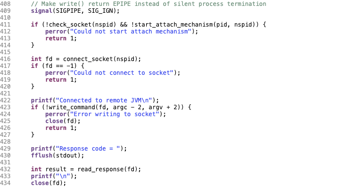


#### JVMTI

JVMTI 入口函数实现的逻辑在 `src/vmEntry.cpp` 中
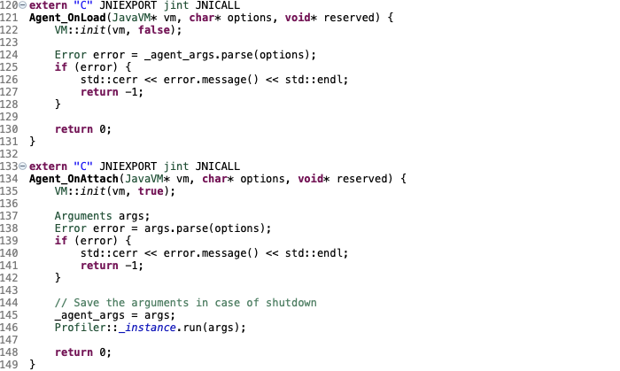

通过 `profiler.sh` 脚本 attach 到 JVM 时就会调用 `Agent_OnAttach` 方法，如果是跟随 Java 进程启动那么会调用 `Agent_OnLoad` 方法。

首先进行一些初始化的逻辑，封装在 `VM::init` 方法中：
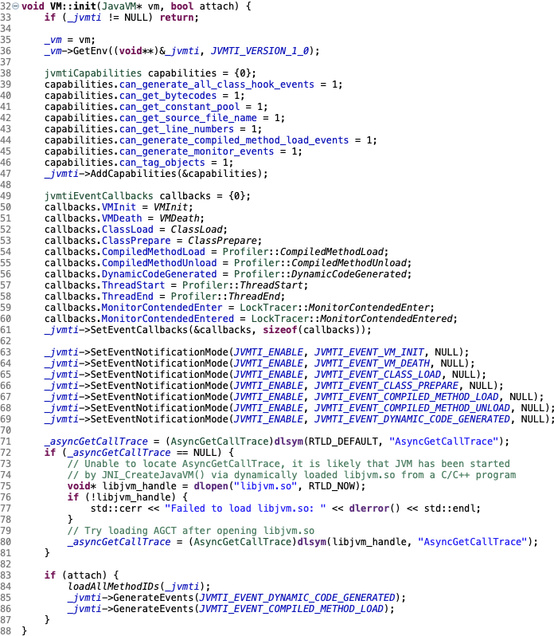

L36 获取 JVM 环境。每个 agent 都有自己的环境，在指定 agent 行为前，首先要获取环境信息，后面的操作都是针对这个环境。

L47 添加 capabilities。JVMTI 中有很多事件，每个事件都对应一些 Capabilities，如果你想为此事件编写回调函数，首先得开启相应的 [Capabilities](https://docs.oracle.com/javase/8/docs/platform/jvmti/jvmti.html#capability)。

|Field|Description|Since|
|--|--|--|
|can_generate_all_class_hook_events|Can generate ClassFileLoadHook events for every loaded class.|1.0|
|can_get_bytecodes|Can get bytecodes of a method [`GetBytecodes`](https://docs.oracle.com/javase/8/docs/platform/jvmti/jvmti.html#GetBytecodes)|1.0|
|can_get_constant_pool|Can get the constant pool of a class - [`GetConstantPool`](https://docs.oracle.com/javase/8/docs/platform/jvmti/jvmti.html#GetConstantPool)|1.0|
|can_get_source_file_name|Can get the source file name of a class|1.0|
|can_get_line_numbers|Can get the line number table of a method|1.0|
|can_generate_compiled_method_load_events|Can generate events when a method is compiled or unloaded|1.0|
|can_generate_monitor_events|Can generate events on monitor activity|1.0|
|can_tag_objects|Can set and get tags, as described in the [Heap category](https://docs.oracle.com/javase/8/docs/platform/jvmti/jvmti.html#Heap).|1.0|

L61 注册[回调函数](https://docs.oracle.com/javase/8/docs/platform/jvmti/jvmti.html#jvmtiEventCallbacks)。事件回调函数的接口是由JVMTI指定的。

|Callback|Description|
|--|--|
|VMInit|The VM initialization event signals the completion of VM initialization. Once this event is generated, the agent is free to call any JNI or JVM TI function.|
|VMDeath|The VM death event notifies the agent of the termination of the VM. No events will occur after the VMDeath event.|
|ClassLoad|A class load event is generated when a class is first loaded.|
|ClassPrepare|A class prepare event is generated when class preparation is complete.|
|CompiledMethodLoad|Sent when a method is compiled and loaded into memory by the VM.|
|CompiledMethodUnload|Sent when a compiled method is unloaded from memory.|
|DynamicCodeGenerated|Sent when a component of the virtual machine is generated dynamically.|
|ThreadStart|Thread start events are generated by a new thread before its initial method executes. |
|ThreadEnd|Thread end events are generated by a terminating thread after its initial method has finished execution. |
|MonitorContendedEnter|Sent when a thread is attempting to enter a Java programming language monitor already acquired by another thread.|
|MonitorContendedEntered|Sent when a thread enters a Java programming language monitor after waiting for it to be released by another thread.|

*注：通过 attach 动态加载 agent 不会触发 VMInit 事件回调，因为此时 VM  已经初始化完毕；但是通过 -agentpath 跟随 Java 进程启动加载，在 Agent_OnLoad 入口方法执行后就会触发 VMInit 事件回调。*

L63-L69 指定事件。当 JVM 发生一个事件，回调为此事件编写的函数，所以需要指定哪个事件发生时通知 agent。

*注：`ThreadStart`、`ThreadEnd`、`MonitorContendedEnter`、`MonitorContendedEntered` 事件的指定逻辑在 `Profiler` 和 `LockTracer` 启动和停止的方法中。*

L71-L81 获取 `AsyncGetCallTrace`。

如果是通过 attach 动态加载，那么加载所有的方法，并且生成 JVMTI_EVENT_DYNAMIC_CODE_GENERATED、JVMTI_EVENT_COMPILED_METHOD_LOAD 事件。

`VM::init` 初始化之后就是解析参数，最终调用 `Profiler::run` 方法执行 profile 的逻辑。

#### profiler

profiler 的逻辑位于 `src/profiler.cpp` 中
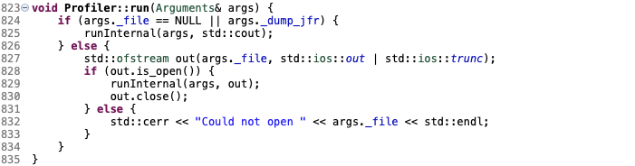

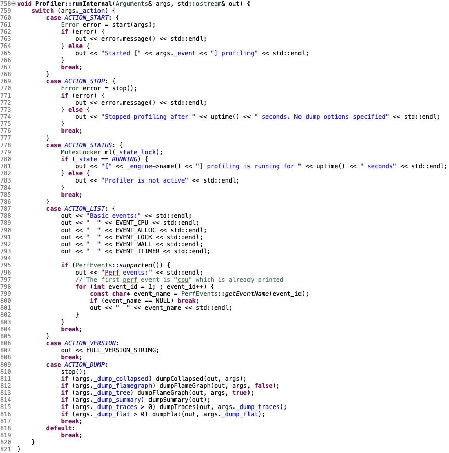

根据 action 执行对应的函数。

开始 profile 就会执行 `start` 方法：

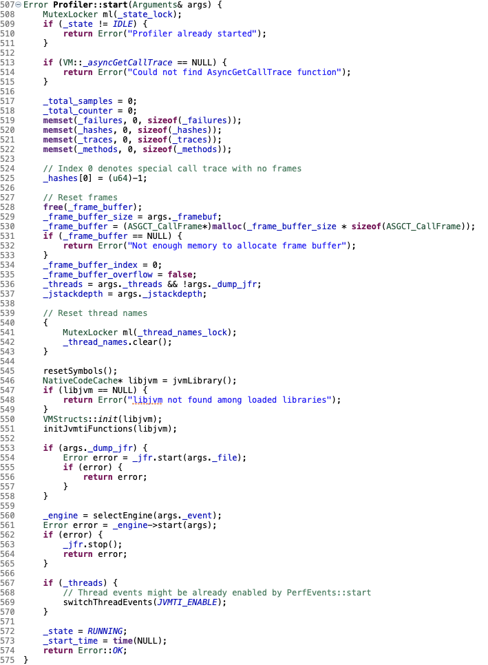
 
L530 分配 frame_buffer，如果需要存储的 call traces 大于这个缓存将会溢出。

L545-L551 初始化 Hotspot 和 JVMTI 相关的资源。

L554 如果要输出 JFR 那么启动 `_jfr`，相关格式输出的逻辑封装在 `FlightRecorder` 和 `Recording` 中。

L560 根据 event 选择 engine，如果是支持 perf_events 的 linux 系统，那么还提供了很多系统底层的事件。

```plain
Basic events:
  cpu
  alloc
  lock
  wall
  itimer
Perf events:
  page-faults
  context-switches
  cycles
  instructions
  cache-references
  cache-misses
  branches
  branch-misses
  bus-cycles
  L1-dcache-load-misses
  LLC-load-misses
  dTLB-load-misses
  mem:breakpoint
  trace:tracepoint
```

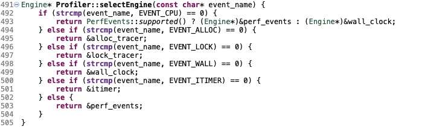

先看一下 EVENT_CPU 在 perf_events 的实现 `PerfEvents`：

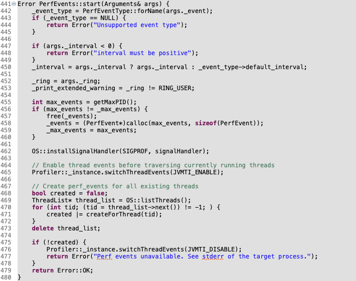

L462 接收操作系统信号 SIGPROF 执行 `signalHandler`。

L471 每个线程打开相应的 perf_events 计数器，注册 SIGPROF 事件。

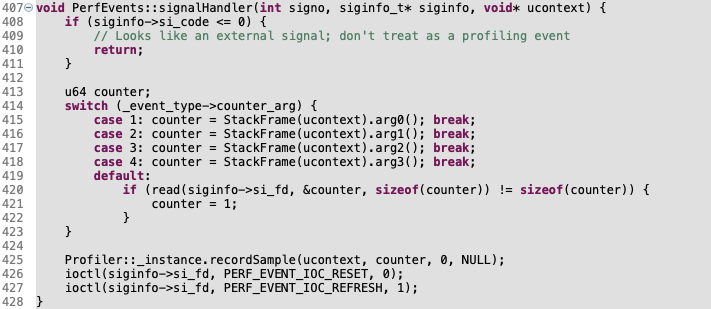

L425 回调 Profiler 采样调用栈信息

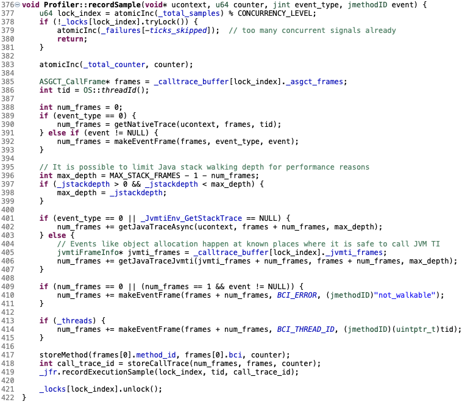

L402 通过 `AsyncGetCallTrace` 异步获取调用栈。

L418 将调用栈存储到 `_frame_buffer`。

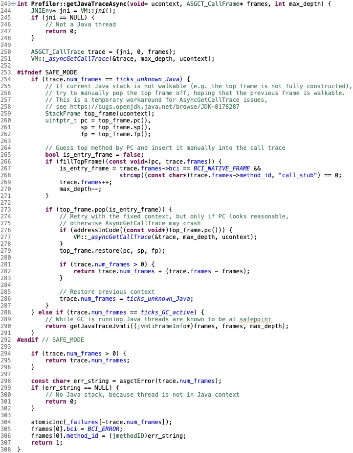

[JDK-8178287](https://bugs.openjdk.java.net/browse/JDK-8178287) 列举了一些无法获取调用栈的情况，这里做了一个补救方案，但是最终还得依赖 `AsyncGetCallTrace` 本身的修复更新。

其它类型 engine 的处理流程类似，具体的数据细节这里暂且略过。

回过头来在再看一下 ACTION_DUMP：

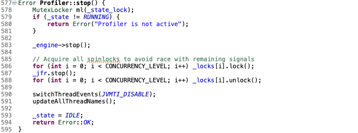

首先关闭各种资源，`_jfr` 会在关闭的时候输出。

然后是根据配置各种 dump：
* dumpCollapsed 输出 [FlameGraph](https://github.com/brendangregg/FlameGraph) 脚本所需的格式
* dumpFlameGraph 输出火焰图 svg 或者调用树 html
* dumpSummary 输出汇总信息
* dumpTraces 输出调用栈列表
* dumpFlat 输出 top N hot methods
