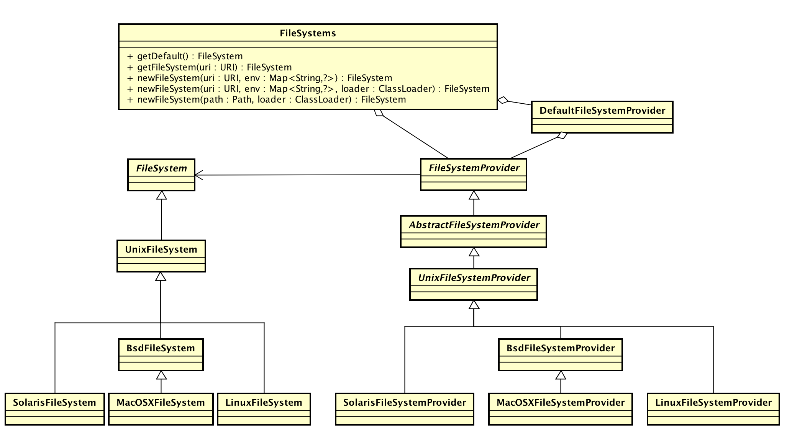
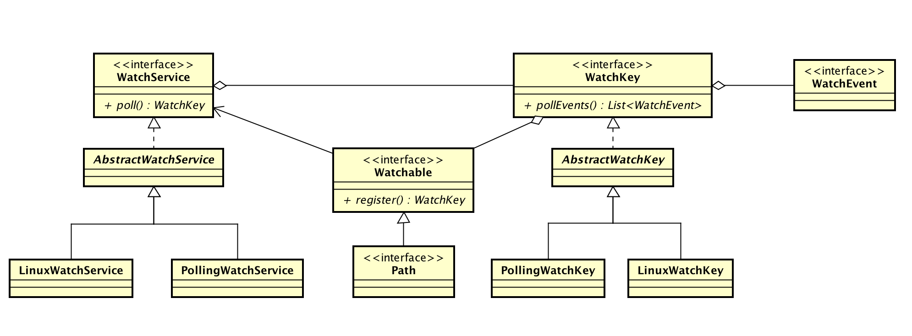

[JSR 203](https://jcp.org/en/jsr/detail?id=203) 对 I/O APIs 进行了升级，其中包含了对 Linux inotify 的封装。

《The Java™ Tutorials》中的一个例子 -- [Watching a Directory for Changes](https://docs.oracle.com/javase/tutorial/essential/io/notification.html)

```java
// Creating a Watch Service and Registering for Events
WatchService watcher = FileSystems.getDefault().newWatchService();

Path dir = ...;
try {
    WatchKey key = dir.register(watcher,
                           ENTRY_CREATE,
                           ENTRY_DELETE,
                           ENTRY_MODIFY);
} catch (IOException x) {
    System.err.println(x);
}

// Processing Events
for (;;) {

    // wait for key to be signaled
    WatchKey key;
    try {
        key = watcher.take();
    } catch (InterruptedException x) {
        return;
    }

    for (WatchEvent<?> event: key.pollEvents()) {
        WatchEvent.Kind<?> kind = event.kind();

        // This key is registered only
        // for ENTRY_CREATE events,
        // but an OVERFLOW event can
        // occur regardless if events
        // are lost or discarded.
        if (kind == OVERFLOW) {
            continue;
        }

        // The filename is the
        // context of the event.
        WatchEvent<Path> ev = (WatchEvent<Path>)event;
        Path filename = ev.context();

        // Verify that the new
        //  file is a text file.
        try {
            // Resolve the filename against the directory.
            // If the filename is "test" and the directory is "foo",
            // the resolved name is "test/foo".
            Path child = dir.resolve(filename);
            if (!Files.probeContentType(child).equals("text/plain")) {
                System.err.format("New file '%s'" +
                    " is not a plain text file.%n", filename);
                continue;
            }
        } catch (IOException x) {
            System.err.println(x);
            continue;
        }

        // Email the file to the
        //  specified email alias.
        System.out.format("Emailing file %s%n", filename);
        //Details left to reader....
    }

    // Reset the key -- this step is critical if you want to
    // receive further watch events.  If the key is no longer valid,
    // the directory is inaccessible so exit the loop.
    boolean valid = key.reset();
    if (!valid) {
        break;
    }
}
```

新建一个 `WatchService`，首先得创建一个 `FileSystem`。

## FileSystem



`FileSystems` 作为工厂类封装了创建 `FileSystem` 的逻辑，`FileSystemProvider` 封装了文件系统创建的具体逻辑，不同的文件系统通过继承该类自定义具体实现。


### Default 

大部分情况下通过 `getDefault()` 获取默认的文件系统，核心逻辑如下：

```java
// jdk/src/share/classes/java/nio/file/FileSystems.java

        // returns default file system
        private static FileSystem defaultFileSystem() {
            // load default provider
            FileSystemProvider provider = AccessController
                .doPrivileged(new PrivilegedAction<FileSystemProvider>() {
                    public FileSystemProvider run() {
                        return getDefaultProvider();
                    }
                });

            // return file system
            return provider.getFileSystem(URI.create("file:///"));
        }

        // returns default provider
        private static FileSystemProvider getDefaultProvider() {
            FileSystemProvider provider = sun.nio.fs.DefaultFileSystemProvider.create();

            // if the property java.nio.file.spi.DefaultFileSystemProvider is
            // set then its value is the name of the default provider (or a list)
            String propValue = System
                .getProperty("java.nio.file.spi.DefaultFileSystemProvider");
            if (propValue != null) {
                for (String cn: propValue.split(",")) {
                    try {
                        Class<?> c = Class
                            .forName(cn, true, ClassLoader.getSystemClassLoader());
                        Constructor<?> ctor = c
                            .getDeclaredConstructor(FileSystemProvider.class);
                        provider = (FileSystemProvider)ctor.newInstance(provider);

                        // must be "file"
                        if (!provider.getScheme().equals("file"))
                            throw new Error("Default provider must use scheme 'file'");

                    } catch (Exception x) {
                        throw new Error(x);
                    }
                }
            }
            return provider;
        }
```

1. `DefaultFileSystemProvider` 通过 `os.name` 环境变量创建对应的的 `FileSystemProvider `
2. 如果配置了 `java.nio.file.spi.DefaultFileSystemProvider` 环境变量，那么将配置的最后一个作为默认 Provider。

### getFileSystem / newFileSystem

对于特殊情况则通过 `getFileSystem` 和 `newFileSystem` 方法获取文件系统

```java
// jdk/src/share/classes/java/nio/file/FileSystems.java

    public static FileSystem getFileSystem(URI uri) {
        String scheme = uri.getScheme();
        for (FileSystemProvider provider: FileSystemProvider.installedProviders()) {
            if (scheme.equalsIgnoreCase(provider.getScheme())) {
                return provider.getFileSystem(uri);
            }
        }
        throw new ProviderNotFoundException("Provider \"" + scheme + "\" not found");
    }
```

简而言之，`FileSystemProvider` 以 scheme 为主键，缓存了初始化加载的 Provider，这里就是查找对应 scheme 的 Provider。

Providers 的初始化加载通过 `ServiceLoader` 完成，也就说可以很方便的实现自定义的 Provider。

实现自定义 `FileSystemProvider` 可以参考 [jimfs](https://github.com/google/jimfs)。

## WatchService

### newWatchService

通过 `FileSystems.getDefault()` 可以获取 Linux 对应的 `LinuxFileSystem`，然后通过 `newWatchService` 方法，就可以完成新建 `WatchService` 的步骤。

```java
// jdk/src/solaris/classes/sun/nio/fs/LinuxFileSystem.java

    @Override
    public WatchService newWatchService()
        throws IOException
    {
        // assume 2.6.13 or newer
        return new LinuxWatchService(this);
    }

```

通常来说版本小于 2.6.13 的 Linux 基本上不存在了




回到 `LinuxWatchService` 的构造方法

```java
// jdk/src/solaris/classes/sun/nio/fs/LinuxWatchService.java

    LinuxWatchService(UnixFileSystem fs) throws IOException {
        // initialize inotify
        int ifd = - 1;
        try {
            ifd = inotifyInit();
        } catch (UnixException x) {
            String msg = (x.errno() == EMFILE) ?
                "User limit of inotify instances reached or too many open files" :
                x.errorString();
            throw new IOException(msg);
        }

        // configure inotify to be non-blocking
        // create socketpair used in the close mechanism
        int sp[] = new int[2];
        try {
            configureBlocking(ifd, false);
            socketpair(sp);
            configureBlocking(sp[0], false);
        } catch (UnixException x) {
            UnixNativeDispatcher.close(ifd);
            throw new IOException(x.errorString());
        }

        this.poller = new Poller(fs, this, ifd, sp);
        this.poller.start();
    }

```

[Linux Programmer's Manual -- inotify](http://www.man7.org/linux/man-pages/man7/inotify.7.html)


a) 初始化 inotify

```c
// jdk/src/solaris/native/sun/nio/fs/LinuxWatchService.c

Java_sun_nio_fs_LinuxWatchService_inotifyInit
    (JNIEnv* env, jclass clazz)
{
    int ifd = inotify_init();
    if (ifd == -1) {
        throwUnixException(env, errno);
    }
    return (jint)ifd;
}
```

[inotify_init](http://man7.org/linux/man-pages/man2/inotify_init.2.html)

inotify_init() 初始化 inotify 实例，返回一个文件描述符，该描述符关联一个
 inotify 事件队列。

异常情况：
1. 初始化的 `ifd` 数量超过 `/proc/sys/fs/inotify/max_user_instances` 那么返回 `EMFILE`
2. 如果该进程打开的文件描述符超过 `/etc/security/limits.conf` 中的设置那么返回 `EMFILE`
3. 如果打开的文件描述符超出系统范围 `/proc/sys/fs/file-max` 那么返回 `ENFILE`
4. 申请不到内存返回 `ENOMEM`

b) 设置非阻塞模式，创建 socketpair 用于注册、关闭事件

```c
// jdk/src/solaris/native/sun/nio/fs/LinuxWatchService.c

Java_sun_nio_fs_LinuxWatchService_configureBlocking
    (JNIEnv* env, jclass clazz, jint fd, jboolean blocking)
{
    int flags = fcntl(fd, F_GETFL);

    if ((blocking == JNI_FALSE) && !(flags & O_NONBLOCK))
        fcntl(fd, F_SETFL, flags | O_NONBLOCK);
    else if ((blocking == JNI_TRUE) && (flags & O_NONBLOCK))
        fcntl(fd, F_SETFL, flags & ~O_NONBLOCK);
}

Java_sun_nio_fs_LinuxWatchService_socketpair
    (JNIEnv* env, jclass clazz, jintArray sv)
{
    int sp[2];
    if (socketpair(PF_UNIX, SOCK_STREAM, 0, sp) == -1) {
        throwUnixException(env, errno);
    } else {
        jint res[2];
        res[0] = (jint)sp[0];
        res[1] = (jint)sp[1];
        (*env)->SetIntArrayRegion(env, sv, 0, 2, &res[0]);
    }
}
```

c) 启动 Poller

`Poller` 是一个后台线程，主要负责消费 `ifd` 队列中的事件，以及注册、关闭事件等。

```java
// jdk/src/solaris/classes/sun/nio/fs/LinuxWatchService.java

        Poller(UnixFileSystem fs, LinuxWatchService watcher, int ifd, int[] sp) {
            this.fs = fs;
            this.watcher = watcher;
            this.ifd = ifd;
            this.socketpair = sp;
            this.wdToKey = new HashMap<Integer,LinuxWatchKey>();
            this.address = unsafe.allocateMemory(BUFFER_SIZE);
        }
```

1. ` wdToKey` 维护 watch descriptor 与 LinuxWatchKey 之间的映射
2. `address` 是 I/O buffer 的地址

### Poller main loop

```java
// jdk/src/solaris/classes/sun/nio/fs/LinuxWatchService.java

        /**
         * Poller main loop
         */
        @Override
        public void run() {
            try {
                for (;;) {
                    int nReady, bytesRead;

                    // wait for close or inotify event
                    nReady = poll(ifd, socketpair[0]);

                    // read from inotify
                    try {
                        bytesRead = read(ifd, address, BUFFER_SIZE);
                    } catch (UnixException x) {
                        if (x.errno() != EAGAIN)
                            throw x;
                        bytesRead = 0;
                    }

                    // iterate over buffer to decode events
                    int offset = 0;
                    while (offset < bytesRead) {
                        long event = address + offset;
                        int wd = unsafe.getInt(event + OFFSETOF_WD);
                        int mask = unsafe.getInt(event + OFFSETOF_MASK);
                        int len = unsafe.getInt(event + OFFSETOF_LEN);

                        // file name
                        UnixPath name = null;
                        if (len > 0) {
                            int actual = len;

                            // null-terminated and maybe additional null bytes to
                            // align the next event
                            while (actual > 0) {
                                long last = event + OFFSETOF_NAME + actual - 1;
                                if (unsafe.getByte(last) != 0)
                                    break;
                                actual--;
                            }
                            if (actual > 0) {
                                byte[] buf = new byte[actual];
                                unsafe.copyMemory(null, event + OFFSETOF_NAME,
                                    buf, Unsafe.ARRAY_BYTE_BASE_OFFSET, actual);
                                name = new UnixPath(fs, buf);
                            }
                        }

                        // process event
                        processEvent(wd, mask, name);

                        offset += (SIZEOF_INOTIFY_EVENT + len);
                    }

                    // process any pending requests
                    if ((nReady > 1) || (nReady == 1 && bytesRead == 0)) {
                        try {
                            read(socketpair[0], address, BUFFER_SIZE);
                            boolean shutdown = processRequests();
                            if (shutdown)
                                break;
                        } catch (UnixException x) {
                            if (x.errno() != UnixConstants.EAGAIN)
                                throw x;
                        }
                    }
                }
            } catch (UnixException x) {
                x.printStackTrace();
            }
        }

```

a) poll 是否有数据可读

```c
// jdk/src/solaris/native/sun/nio/fs/LinuxWatchService.c

Java_sun_nio_fs_LinuxWatchService_poll
    (JNIEnv* env, jclass clazz, jint fd1, jint fd2)
{
    struct pollfd ufds[2];
    int n;

    ufds[0].fd = fd1;
    ufds[0].events = POLLIN;
    ufds[1].fd = fd2;
    ufds[1].events = POLLIN;

    n = poll(&ufds[0], 2, -1);
    if (n == -1) {
        if (errno == EINTR) {
            n = 0;
        } else {
            throwUnixException(env, errno);
        }
     }
    return (jint)n;
}

```

这里 poll 了两个文件描述符：1. ifd，也就是 inotify 事件队列；2. socketpair[0]，用于注册、关闭等事件通知

b) 读 ifd

```c
// jdk/src/solaris/native/sun/nio/fs/UnixNativeDispatcher.c

Java_sun_nio_fs_UnixNativeDispatcher_read(JNIEnv* env, jclass this, jint fd,
    jlong address, jint nbytes)
{
    ssize_t n;
    void* bufp = jlong_to_ptr(address);
    RESTARTABLE(read((int)fd, bufp, (size_t)nbytes), n);
    if (n == -1) {
        throwUnixException(env, errno);
    }
    return (jint)n;
}
```

c) 解析 inotify 事件，交给 `processEvent` 方法处理

d) 响应  `socketpair[0]` 信号，调用 `processRequests` 处理注册、关闭等事件

### processEvent

```
// jdk/src/solaris/classes/sun/nio/fs/LinuxWatchService.java

        /**
         * Process event from inotify
         */
        private void processEvent(int wd, int mask, final UnixPath name) {
            // overflow - signal all keys
            if ((mask & IN_Q_OVERFLOW) > 0) {
                for (Map.Entry<Integer,LinuxWatchKey> entry: wdToKey.entrySet()) {
                    entry.getValue()
                        .signalEvent(StandardWatchEventKinds.OVERFLOW, null);
                }
                return;
            }

            // lookup wd to get key
            LinuxWatchKey key = wdToKey.get(wd);
            if (key == null)
                return; // should not happen

            // file deleted
            if ((mask & IN_IGNORED) > 0) {
                wdToKey.remove(wd);
                key.invalidate(false);
                key.signal();
                return;
            }

            // event for directory itself
            if (name == null)
                return;

            // map to event and queue to key
            WatchEvent.Kind<?> kind = maskToEventKind(mask);
            if (kind != null) {
                key.signalEvent(kind, name);
            }
        }
    }
```

a) 如果收到 `IN_Q_OVERFLOW` 信号，向所有注册的 `WatchKey` 发送该信号

如果收到 OVERFLOW 表示事件队列已经满了，之后的事件将会直接丢弃。不过这是不是永久性的，只要消费一些事件，队列有空间了，之后的事件还会进来。

队列长度受限于 `/proc/sys/fs/inotify/max_queued_events`

[Challenge 2: handling overflow events](https://lwn.net/Articles/605128/)

b) 查找 `wd` 对应的 `WatchKey`

1. 如果找不到，返回（should not happen）
2. 如果是 `IN_IGNORED` 事件，那么表示 Watch was removed explicitly (inotify_rm_watch(2)) or automatically (file was deleted, or filesystem was unmounted)，那么就 invalidate 并且通知对应的 `WatchKey`
3. 如果 `name == null`，表示是自身的事件，这里支持丢弃（因为JDK只提供目录的注册，不提供文件的注册）
4. 映射 mask 到 WatchEvent.Kind，通知对应的 `WatchKey`

```
// jdk/src/solaris/classes/sun/nio/fs/LinuxWatchService.java

        /**
         * map inotify event to WatchEvent.Kind
         */
        private WatchEvent.Kind<?> maskToEventKind(int mask) {
            if ((mask & IN_MODIFY) > 0)
                return StandardWatchEventKinds.ENTRY_MODIFY;
            if ((mask & IN_ATTRIB) > 0)
                return StandardWatchEventKinds.ENTRY_MODIFY;
            if ((mask & IN_CREATE) > 0)
                return StandardWatchEventKinds.ENTRY_CREATE;
            if ((mask & IN_MOVED_TO) > 0)
                return StandardWatchEventKinds.ENTRY_CREATE;
            if ((mask & IN_DELETE) > 0)
                return StandardWatchEventKinds.ENTRY_DELETE;
            if ((mask & IN_MOVED_FROM) > 0)
                return StandardWatchEventKinds.ENTRY_DELETE;
            return null;
        }
```

ENTRY_MODIFY 包含：

```
           IN_ATTRIB (*)
                  Metadata changed—for example, permissions (e.g.,
                  chmod(2)), timestamps (e.g., utimensat(2)), extended
                  attributes (setxattr(2)), link count (since Linux 2.6.25;
                  e.g., for the target of link(2) and for unlink(2)), and
                  user/group ID (e.g., chown(2)).

           IN_MODIFY (+)
                  File was modified (e.g., write(2), truncate(2)).
```

ENTRY_CREATE 包含：

```
           IN_CREATE (+)
                  File/directory created in watched directory (e.g., open(2)
                  O_CREAT, mkdir(2), link(2), symlink(2), bind(2) on a UNIX
                  domain socket).
           IN_MOVED_TO (+)
                  Generated for the directory containing the new filename
                  when a file is renamed.

```

ENTRY_DELETE 包含：

```
           IN_DELETE (+)
                  File/directory deleted from watched directory.
           IN_MOVED_FROM (+)
                  Generated for the directory containing the old filename
                  when a file is renamed.
```

其他事件都忽略。

## Path.register

将需要监听的 `Path` 注册到 `WatchService`

### register

核心逻辑在 `LinuxWatchService` 中

```
// jdk/src/solaris/classes/sun/nio/fs/LinuxWatchService.java

    @Override
    WatchKey register(Path dir,
                      WatchEvent.Kind<?>[] events,
                      WatchEvent.Modifier... modifiers)
         throws IOException
    {
        // delegate to poller
        return poller.register(dir, events, modifiers);
    }

```

```
// jdk/src/share/classes/sun/nio/fs/AbstractPoller.java

    /**
     * Requests, and waits on, poller thread to register given file.
     */
    final WatchKey register(Path dir,
                            WatchEvent.Kind<?>[] events,
                            WatchEvent.Modifier... modifiers)
        throws IOException
    {
        // validate arguments before request to poller
        if (dir == null)
            throw new NullPointerException();
        Set<WatchEvent.Kind<?>> eventSet = new HashSet<>(events.length);
        for (WatchEvent.Kind<?> event: events) {
            // standard events
            if (event == StandardWatchEventKinds.ENTRY_CREATE ||
                event == StandardWatchEventKinds.ENTRY_MODIFY ||
                event == StandardWatchEventKinds.ENTRY_DELETE)
            {
                eventSet.add(event);
                continue;
            }

            // OVERFLOW is ignored
            if (event == StandardWatchEventKinds.OVERFLOW)
                continue;

            // null/unsupported
            if (event == null)
                throw new NullPointerException("An element in event set is 'null'");
            throw new UnsupportedOperationException(event.name());
        }
        if (eventSet.isEmpty())
            throw new IllegalArgumentException("No events to register");
        return (WatchKey)invoke(RequestType.REGISTER, dir, eventSet, modifiers);
    }
```

封装成 `Request` 后由 `invoke` 执行，这是一个公用的方法，`RequestType` 有三类：`REGISTER`、`CANCEL`、 `CLOSE`

```
// jdk/src/share/classes/sun/nio/fs/AbstractPoller.java

    /**
     * Enqueues request to poller thread and waits for result
     */
    private Object invoke(RequestType type, Object... params) throws IOException {
        // submit request
        Request req = new Request(type, params);
        synchronized (requestList) {
            if (shutdown) {
                throw new ClosedWatchServiceException();
            }
            requestList.add(req);
        }

        // wakeup thread
        wakeup();

        // wait for result
        Object result = req.awaitResult();

        if (result instanceof RuntimeException)
            throw (RuntimeException)result;
        if (result instanceof IOException )
            throw (IOException)result;
        return result;
    }

```

```
// jdk/src/solaris/classes/sun/nio/fs/LinuxWatchService.java

        @Override
        void wakeup() throws IOException {
            // write to socketpair to wakeup polling thread
            try {
                write(socketpair[1], address, 1);
            } catch (UnixException x) {
                throw new IOException(x.errorString());
            }
        }
```

1. 将请求添加到 `requestList`
2. 唤醒执行线程，也就是 `Poller` 中的 `poll` 主循环
3. 等待执行结果

### processRequests

```
// jdk/src/share/classes/sun/nio/fs/AbstractPoller.java

    /**
     * Invoked by poller thread to process all pending requests
     *
     * @return  true if poller thread should shutdown
     */
    @SuppressWarnings("unchecked")
    boolean processRequests() {
        synchronized (requestList) {
            Request req;
            while ((req = requestList.poll()) != null) {
                // if in process of shutdown then reject request
                if (shutdown) {
                    req.release(new ClosedWatchServiceException());
                }

                switch (req.type()) {
                    /**
                     * Register directory
                     */
                    case REGISTER: {
                        Object[] params = req.parameters();
                        Path path = (Path)params[0];
                        Set<? extends WatchEvent.Kind<?>> events =
                            (Set<? extends WatchEvent.Kind<?>>)params[1];
                        WatchEvent.Modifier[] modifiers =
                            (WatchEvent.Modifier[])params[2];
                        req.release(implRegister(path, events, modifiers));
                        break;
                    }
                    /**
                     * Cancel existing key
                     */
                    case CANCEL : {
                        Object[] params = req.parameters();
                        WatchKey key = (WatchKey)params[0];
                        implCancelKey(key);
                        req.release(null);
                        break;
                    }
                    /**
                     * Close watch service
                     */
                    case CLOSE: {
                        implCloseAll();
                        req.release(null);
                        shutdown = true;
                        break;
                    }

                    default:
                        req.release(new IOException("request not recognized"));
                }
            }
        }
        return shutdown;
    }
```

在`Poller` 主循环中调用该方法处理 `requestList` 中的请求

**shutdown 情况下没有退出，这应该是一个 bug**

```
// jdk/src/solaris/classes/sun/nio/fs/LinuxWatchService.java

        @Override
        Object implRegister(Path obj,
                            Set<? extends WatchEvent.Kind<?>> events,
                            WatchEvent.Modifier... modifiers)
        {
            UnixPath dir = (UnixPath)obj;

            int mask = 0;
            for (WatchEvent.Kind<?> event: events) {
                if (event == StandardWatchEventKinds.ENTRY_CREATE) {
                    mask |= IN_CREATE | IN_MOVED_TO;
                    continue;
                }
                if (event == StandardWatchEventKinds.ENTRY_DELETE) {
                    mask |= IN_DELETE | IN_MOVED_FROM;
                    continue;
                }
                if (event == StandardWatchEventKinds.ENTRY_MODIFY) {
                    mask |= IN_MODIFY | IN_ATTRIB;
                    continue;
                }
            }

            // no modifiers supported at this time
            if (modifiers.length > 0) {
                for (WatchEvent.Modifier modifier: modifiers) {
                    if (modifier == null)
                        return new NullPointerException();
                    if (modifier instanceof com.sun.nio.file.SensitivityWatchEventModifier)
                        continue; // ignore
                    return new UnsupportedOperationException("Modifier not supported");
                }
            }

            // check file is directory
            UnixFileAttributes attrs = null;
            try {
                attrs = UnixFileAttributes.get(dir, true);
            } catch (UnixException x) {
                return x.asIOException(dir);
            }
            if (!attrs.isDirectory()) {
                return new NotDirectoryException(dir.getPathForExceptionMessage());
            }

            // register with inotify (replaces existing mask if already registered)
            int wd = -1;
            try {
                NativeBuffer buffer =
                    NativeBuffers.asNativeBuffer(dir.getByteArrayForSysCalls());
                try {
                    wd = inotifyAddWatch(ifd, buffer.address(), mask);
                } finally {
                    buffer.release();
                }
            } catch (UnixException x) {
                if (x.errno() == ENOSPC) {
                    return new IOException("User limit of inotify watches reached");
                }
                return x.asIOException(dir);
            }

            // ensure watch descriptor is in map
            LinuxWatchKey key = wdToKey.get(wd);
            if (key == null) {
                key = new LinuxWatchKey(dir, watcher, ifd, wd);
                wdToKey.put(wd, key);
            }
            return key;
        }
```

1. 根据 `WatchEvent.Kind` 计算 `mask`
2. `modifiers` 无用
3. 只能注册目录
4. `inotifyAddWatch` 注册目录
5. 返回封装 `wd` 的 `LinuxWatchKey`

[inotify\_add\_watch](http://man7.org/linux/man-pages/man2/inotify_add_watch.2.html)

```
Java_sun_nio_fs_LinuxWatchService_inotifyAddWatch
    (JNIEnv* env, jclass clazz, jint fd, jlong address, jint mask)
{
    int wfd = -1;
    const char* path = (const char*)jlong_to_ptr(address);

    wfd = inotify_add_watch((int)fd, path, mask);
    if (wfd == -1) {
        throwUnixException(env, errno);
    }
    return (jint)wfd;
}
```

该方法添加一个新的监听，也可以修改某个存在的监听。`wfd` 是惟一的，与 `inode` 绑定。

如果监听的数量大于用户范围的 `/proc/sys/fs/inotify/max_user_watches` 那么返回 `ENOSPC`。

对于 `CANCEL` 和 `CLOSE` 处理流程类似。


```
// jdk/src/solaris/classes/sun/nio/fs/LinuxWatchService.java

        // cancel single key
        @Override
        void implCancelKey(WatchKey obj) {
            LinuxWatchKey key = (LinuxWatchKey)obj;
            if (key.isValid()) {
                wdToKey.remove(key.descriptor());
                key.invalidate(true);
            }
        }
        
        // close watch service
        @Override
        void implCloseAll() {
            // invalidate all keys
            for (Map.Entry<Integer,LinuxWatchKey> entry: wdToKey.entrySet()) {
                entry.getValue().invalidate(true);
            }
            wdToKey.clear();

            // free resources
            unsafe.freeMemory(address);
            UnixNativeDispatcher.close(socketpair[0]);
            UnixNativeDispatcher.close(socketpair[1]);
            UnixNativeDispatcher.close(ifd);
        }

```

[inotify\_rm\_watch](http://man7.org/linux/man-pages/man2/inotify_rm_watch.2.html)

```
Java_sun_nio_fs_LinuxWatchService_inotifyRmWatch
    (JNIEnv* env, jclass clazz, jint fd, jint wd)
{
    int err = inotify_rm_watch((int)fd, (int)wd);
    if (err == -1)
        throwUnixException(env, errno);
}
```

## watcher.take() / poll()

目录注册成功后，就可以从 `WatchService` 中读取事件了

```
// jdk/src/share/classes/sun/nio/fs/AbstractWatchService.java

    @Override
    public final WatchKey poll(long timeout, TimeUnit unit)
        throws InterruptedException
    {
        checkOpen();
        WatchKey key = pendingKeys.poll(timeout, unit);
        checkKey(key);
        return key;
    }
```

获取有事件待处理的 `WatchKey` 就是拉取 `pendingKeys` 队列，入队列的逻辑在 `WatchKey` 中，回到上面 `Poller` 处理事件之后会调用 `key.signal` 方法。

```
// jdk/src/share/classes/sun/nio/fs/AbstractWatchKey.java

    final void signal() {
        synchronized (this) {
            if (state == State.READY) {
                state = State.SIGNALLED;
                watcher.enqueueKey(this);
            }
        }
    }

    /**
     * Adds the event to this key and signals it.
     */
    @SuppressWarnings("unchecked")
    final void signalEvent(WatchEvent.Kind<?> kind, Object context) {
        boolean isModify = (kind == StandardWatchEventKinds.ENTRY_MODIFY);
        synchronized (this) {
            int size = events.size();
            if (size > 0) {
                // if the previous event is an OVERFLOW event or this is a
                // repeated event then we simply increment the counter
                WatchEvent<?> prev = events.get(size-1);
                if ((prev.kind() == StandardWatchEventKinds.OVERFLOW) ||
                    ((kind == prev.kind() &&
                     Objects.equals(context, prev.context()))))
                {
                    ((Event<?>)prev).increment();
                    return;
                }

                // if this is a modify event and the last entry for the context
                // is a modify event then we simply increment the count
                if (!lastModifyEvents.isEmpty()) {
                    if (isModify) {
                        WatchEvent<?> ev = lastModifyEvents.get(context);
                        if (ev != null) {
                            assert ev.kind() == StandardWatchEventKinds.ENTRY_MODIFY;
                            ((Event<?>)ev).increment();
                            return;
                        }
                    } else {
                        // not a modify event so remove from the map as the
                        // last event will no longer be a modify event.
                        lastModifyEvents.remove(context);
                    }
                }

                // if the list has reached the limit then drop pending events
                // and queue an OVERFLOW event
                if (size >= MAX_EVENT_LIST_SIZE) {
                    kind = StandardWatchEventKinds.OVERFLOW;
                    isModify = false;
                    context = null;
                }
            }

            // non-repeated event
            Event<Object> ev =
                new Event<Object>((WatchEvent.Kind<Object>)kind, context);
            if (isModify) {
                lastModifyEvents.put(context, ev);
            } else if (kind == StandardWatchEventKinds.OVERFLOW) {
                // drop all pending events
                events.clear();
                lastModifyEvents.clear();
            }
            events.add(ev);
            signal();
        }
    }

```

简而言之就是事件入 `events` 队列，然后将自己加入 `WatchService` 的 `pendingKeys`

1. 如果队列中最后一个是 `OVERFLOW` 事件，那么直接丢弃
2. 如果跟队列中最后一个事件相同，那么事件次数自增
3. 如果是 `MODIFY` 事件，尝试跟队列中相同的事件聚合
4. 如果队列长度大于 `MAX_EVENT_LIST_SIZE(512)` 那么清空 `events` 队列后加入 `OVERFLOW` 事件

## key.pollEvents()

获取到有事件的 `WatchKey` 后，就可以读取事件列表了

```
// jdk/src/share/classes/sun/nio/fs/AbstractWatchKey.java

    @Override
    public final List<WatchEvent<?>> pollEvents() {
        synchronized (this) {
            List<WatchEvent<?>> result = events;
            events = new ArrayList<WatchEvent<?>>();
            lastModifyEvents.clear();
            return result;
        }
    }
```

也就是返回 `events` 队列

## key.reset()

`WatchKey` 消费完后需要将其 `reset` 回去

```
// jdk/src/share/classes/sun/nio/fs/AbstractWatchKey.java

    @Override
    public final boolean reset() {
        synchronized (this) {
            if (state == State.SIGNALLED && isValid()) {
                if (events.isEmpty()) {
                    state = State.READY;
                } else {
                    // pending events so re-queue key
                    watcher.enqueueKey(this);
                }
            }
            return isValid();
        }
    }
```

1. 如果标记为无效那么不将该 `WatchKey` 重入队列，也就是删除
2. 如果不调用 `reset()` 方法那么将再也取不到该 Key，虽然该 Key 是可能是正常的
