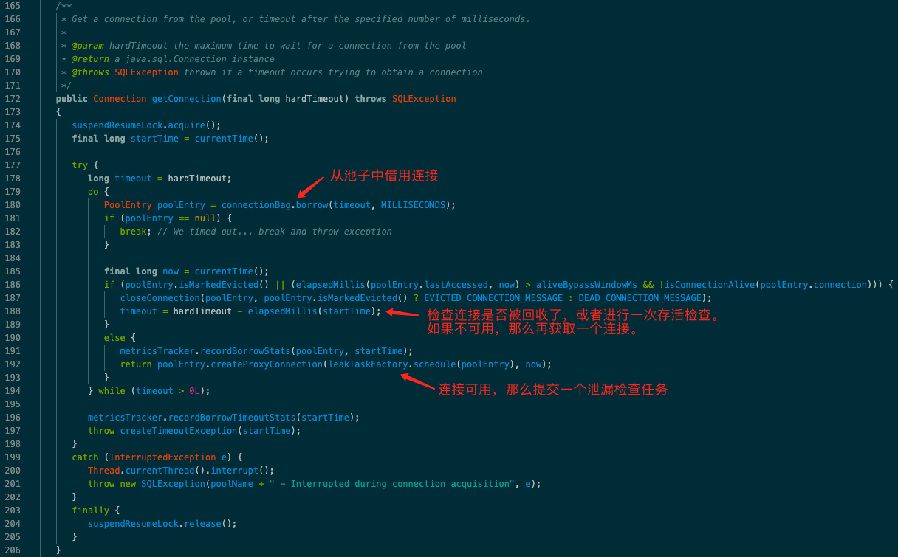
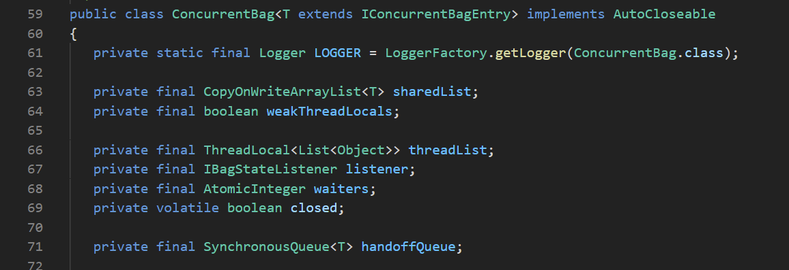
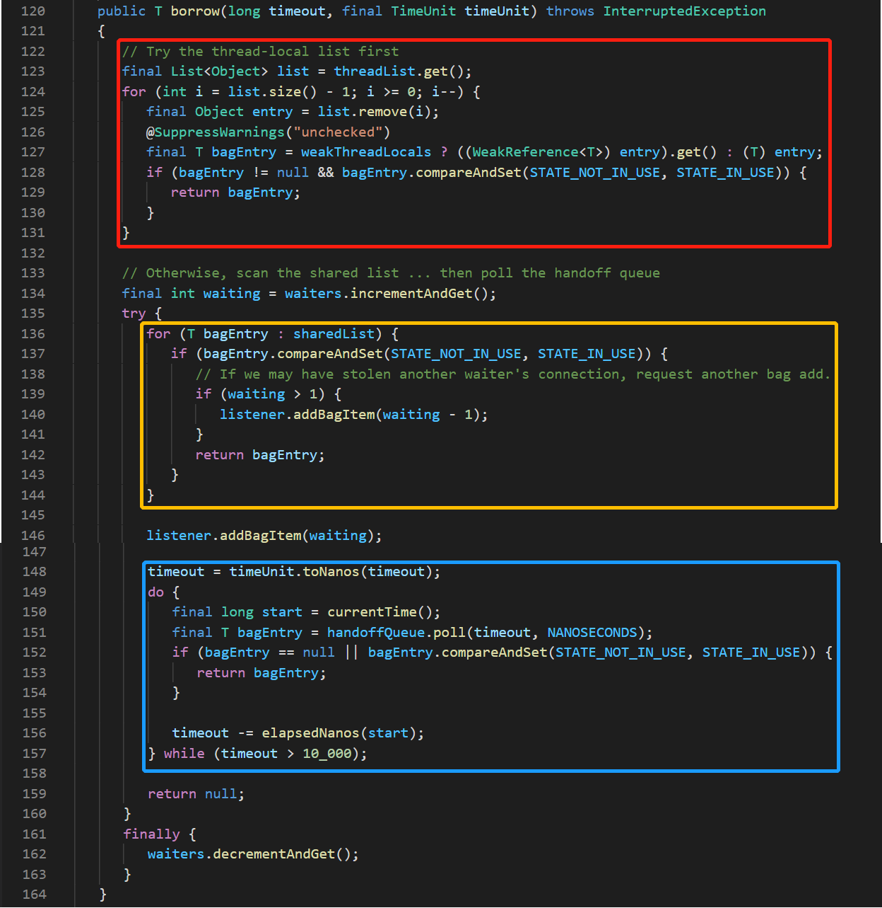
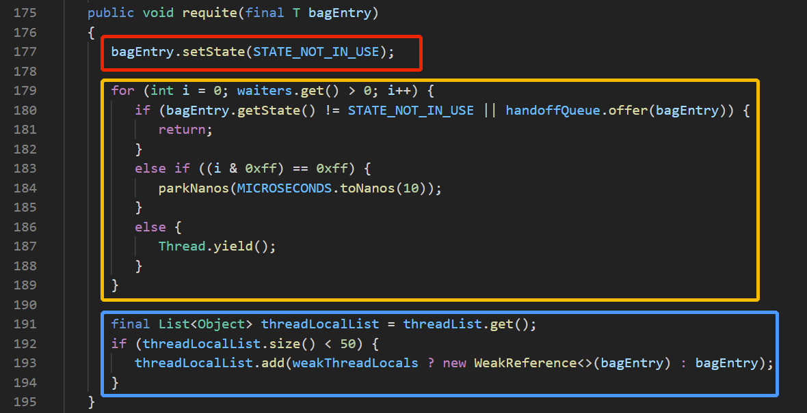

## 0.

最近使用 [commons-pool2](https://commons.apache.org/proper/commons-pool/) 遇到了各种问题，所以了解了一下其它连接池方案：

1. 用得比较多的通用连接池（对象池）也就是 commons-pool2 了，其它都比较小众。
2. JDBC 连接池真是百花齐放。
3. Netty RPC 连接池看起来没什么比较通用的库，异步连接池基本上是空白。（Netty 自己的 FixedChannelPool [性能上有点儿缺陷](https://www.jianshu.com/p/24fd1bb4edee)）

其中看到比较有启发的也就是 HikariCP 了，代码实现很精巧， [About Pool Sizing](https://github.com/brettwooldridge/HikariCP/wiki/About-Pool-Sizing) 这篇文章值得一读。

## 1. 连接池的大小如何设置

[About Pool Sizing](https://github.com/brettwooldridge/HikariCP/wiki/About-Pool-Sizing) 一文中提到了一个 Oracle 数据库压测的例子，降低了连接数，平均时延反而降低了，吞吐量也上去了。

这个例子让我想起了之前在 redis 代理上遇到的问题，事情大致是这样，
* 有个 redis 代理集群实例比较多（一百多个），在代理中使用 [JedisPool](https://github.com/redis/jedis) 连接 redis 实例（最大连接数设置比较大，数百个），
* 出问题的时候，首先是某个 redis 实例变慢了，业务方的请求量没有变化，
* 此时 redis 代理已建立的连接用完了，根据 JedisPool 的配置会创建更多的连接，
* 由于创建了更多连接 redis 实例变得更慢了（建立连接这个操作也挺消耗资源），基本上是不可用了，redis 代理由于阻塞了太多请求，也濒临 OOM。

总结一下，对于访问数据库的连接池来说：
1. 连接数不能太多；
2. 连接池不能太动态，突然建连接很可能会造成恶性循环。

现在的 RPC 框架都是异步长连接，所以不会遇到上述问题，对于比较就旧的同步阻塞框架应该也会遇到上述问题。

这篇文章还提到一个计算数据库连接数的公式，看起来只对 PostgreSQL 这类数据库借鉴意义比较大，但是接下来的“公理”值得好好理解一下：

>  **Axiom: You want a small pool, saturated with threads waiting for connections.**

HikariCP 的核心逻辑就是基于这个公理实现的，连接池的大小是固定的（也是可变的），重点是**如何快速为等待的任务分配连接**。

在文章末尾作者也附加了一个 Caveat Lector：

> Pool sizing is ultimately very specific to deployments.

如何设置连接数没有一个简单的公式，但是这篇文章的思路值得借鉴。

## 2. ConcurrentBag

[Down the Rabbit Hole](https://github.com/brettwooldridge/HikariCP/wiki/Down-the-Rabbit-Hole) 一文介绍了 HikariCP 做的各种优化，其中比较核心的就是 `ConcurrentBag`，看一下代码。

使用的入口是 `HikariPool` 的 getConnection 方法：

代码写得很简洁。

在此之前先看一下 `ConcurrentBag` 主要的数据结构：

1. `sharedList` 是全局的 entry 列表，在 `HikariPool` 的使用场景下就是全局的连接列表。
2. `threadList` 顾名思义就是一个线程本地的 entry 列表，可想而知使用方式就是先查线程本地列表，再查全局列表。
3. `waiters` 记录正在等待获取连接的线程数。
4. `handoffQueue` 是一个等待队列，从上面两个列表获取不到 entry 时，就通过这个零队列等待其它线程归还的 entry。

再回过头来看一下 borrow 方法，很清晰的三个层次：

首先，从线程本地列表获取，一开始这个列表当然是空的，添加到本地队列的位置在归还 entry 的 requite 方法中（稍后再看）。通过 CAS 操作标志位 `state` 的方式判断是否可以借到该 entry。

Q: 既然是线程本地的列表，为什么还要通过 CAS 判断？不是直接拿就可以了么？
A：因为其它线程可能会来偷 entry，也就是下面的逻辑。

然后，从全局列表获取，遍历 `sharedList`，也是通过 CAS 操作标志位的方式判断是否可以借到该 entry，在这里获取到的 entry 有可能是别的线程本地持有的，这种策略比较形象的说法就是 **Queue-stealing**。

（从这也能看出 HikariCP 在实现时就假设了一个前提：最大连接数不能太大，否则遍历列表的成本就很显著了。）

另外需要提一下，这种只改标识位不实际从列表中移除的方式是 **A lock-free design** 的关键。（可以对比一下 commons-pool2 中的 `idleObjects`）

如果还是获取不到 entry，那么调了一下 `listener.addBagItem`，判断是否应该再建新的 entry。

最后，如果还是获取不到可用的 entry，那通过 `handoffQueue` 等待其它线程归还的或者新创建的。

用完之后归还 entry，调用的是 requite 方法：

首先，通过设置标志位归还 entry。

然后，如果有其它线程在等待 entry，那么尝试将该 entry 交给等待线程。

最后，如果没有等待的线程，那么将该 entry 放到线程本地的列表，下次就能直接获取到。
