# 1. 入口

lettuce 提供了 [Synchronous](https://github.com/lettuce-io/lettuce-core/wiki/Basic-usage)、[Asynchronous](https://github.com/lettuce-io/lettuce-core/wiki/Asynchronous-API) 和 [Reactive](https://github.com/lettuce-io/lettuce-core/wiki/Reactive-API-%285.0%29) 三种 API，可谓是相当的现代化。

在使用方式上都是先建立连接：

```
RedisClient client = RedisClient.create("redis://localhost");
StatefulRedisConnection<String, String> connection = client.connect();
```

从 `StatefulRedisConnection` 获取各种 API 接口封装：

```
// 同步
RedisStringCommands sync = connection.sync();
// 异步
RedisStringAsyncCommands<String, String> async = connection.async();
//  响应式
RedisStringReactiveCommands<String, String> reactive = connection.reactive();
```

## 2. 建立连接

我们首先看一下 `client.connect()` 建立连接的逻辑。

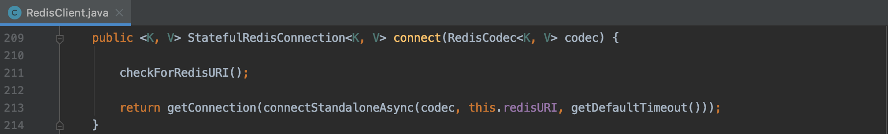

最终调用的是 `connectStandaloneAsync` 方法，返回 `ConnectionFuture`，也是异步编程的方式。`getConnection` 方法比较简单，就是 get 一下 future。

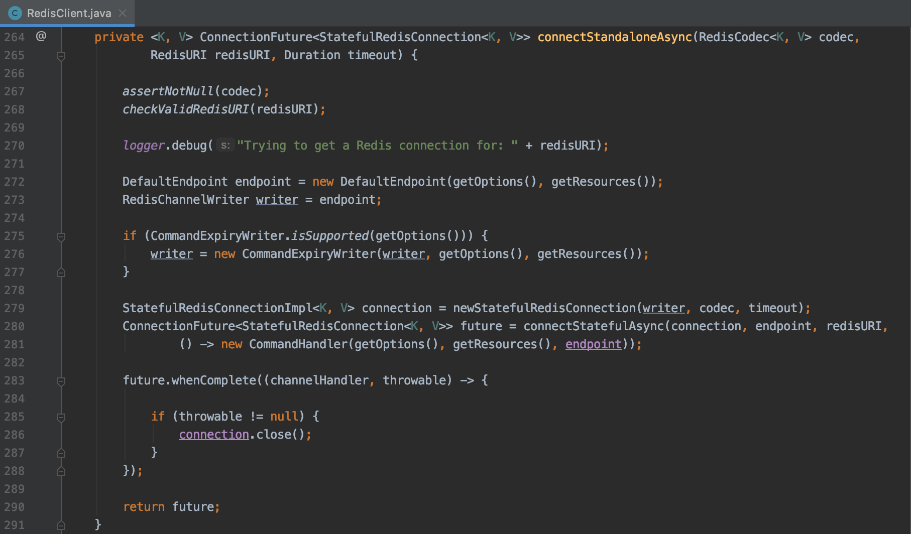

对于连接最重要的封装类是 `StatefulRedisConnectionImpl`，至于命令操作逻辑抽象为 `Endpoint`，普通的 redis 命令操作实现在 `DefaultEndpoint` 中，像 PubSub 这种特殊的命令扩展实现在 `PubSubEndpoint` 中。

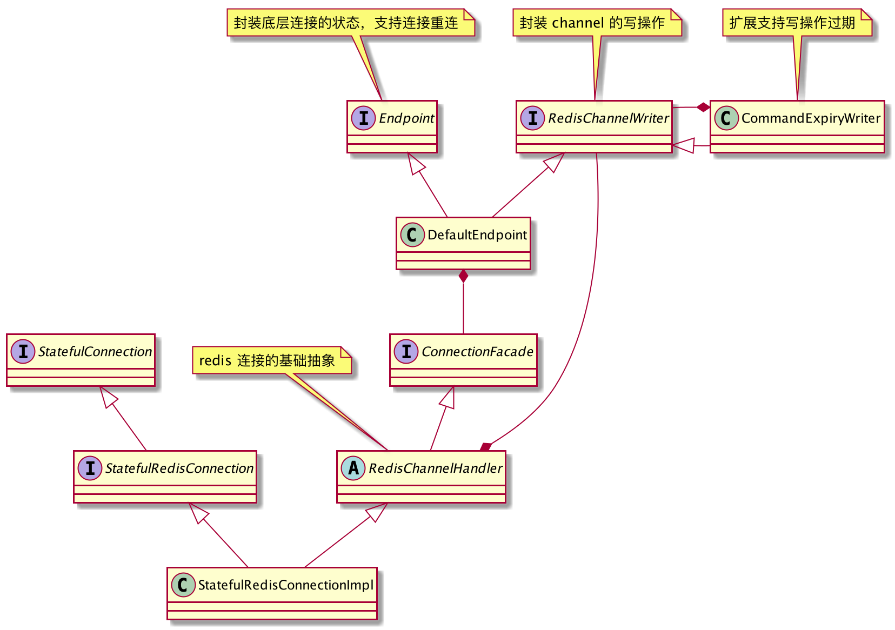

接下来很重要的一个方法是 `connectStatefulAsync`，异步建立真实的连接。

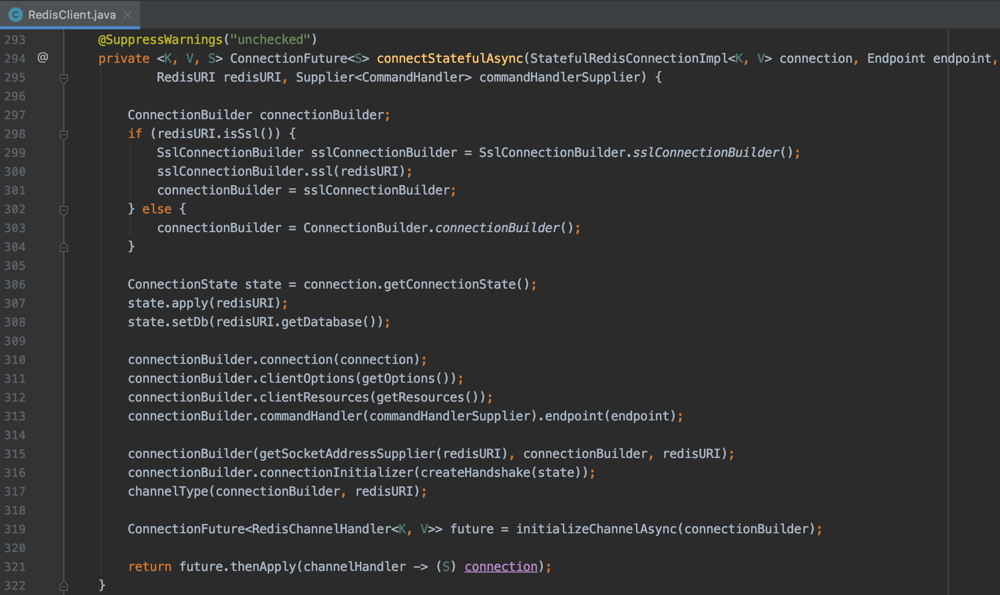

不得不佩服 lettuce 真的是异步编程的很彻底，从 redisURI 获取 SocketAddress 就用到 reactor-core 的 [Mono](https://projectreactor.io/docs/core/release/api/reactor/core/publisher/Mono.html)。

接下来就是通过 `ConnectionBuilder` 异步初始化连接：

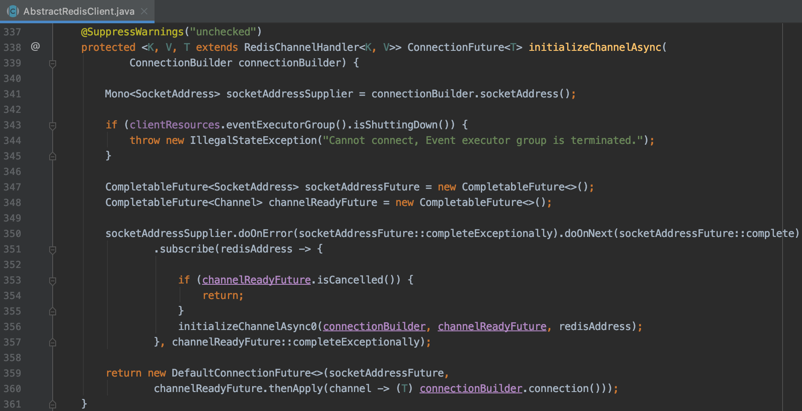

接下来就是通过 Netty 进行连接的逻辑了。

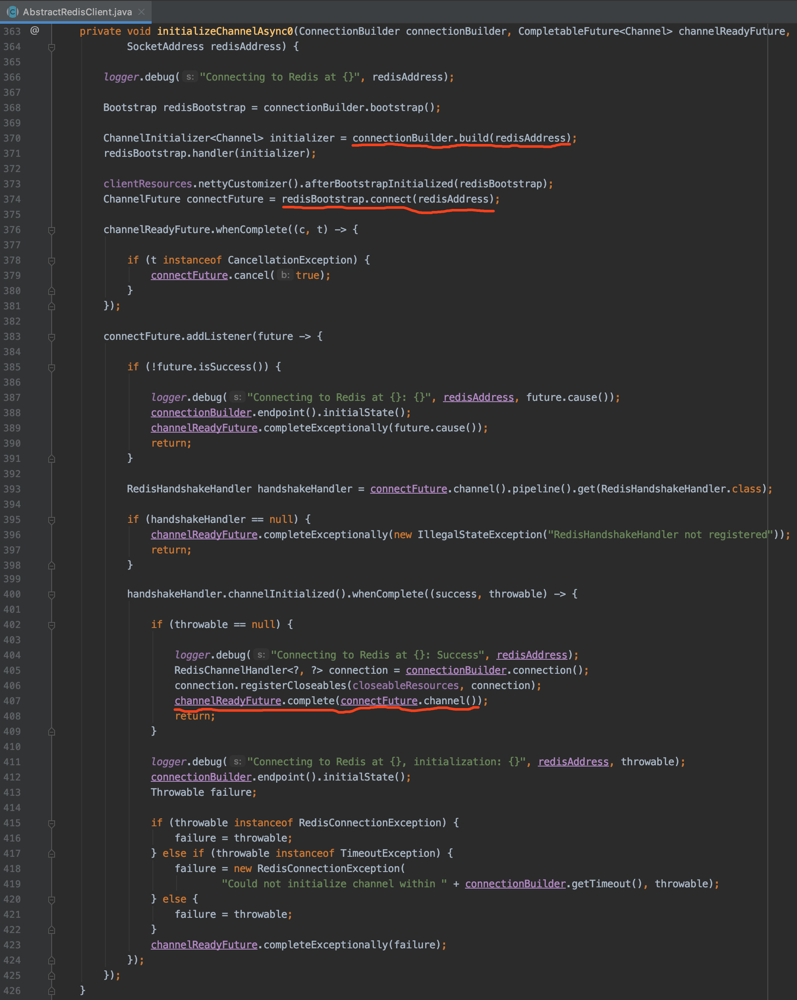

L370 构建 Netty 的 handler pipeline：

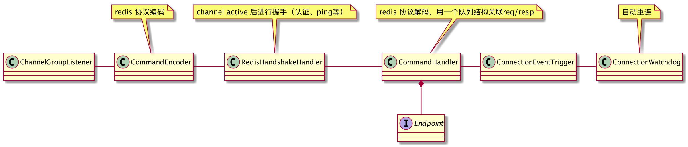


L407 当 handshake 成功后设置 `channelReadyFuture` 完成。

由于 redis 协议没有 request_id 之类的概念，所以在异步化的时候用了一个队列结构（虽然名字叫stack）来关联请求和响应。

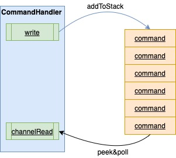

## 3. 异步执行命令

基于以上的分析，可见 lettuce 内部是异步执行命令的，我们就先看一下 `RedisAsyncCommands`。

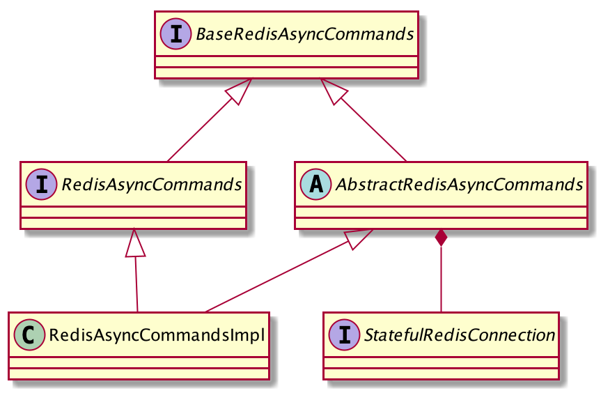

命令的执行都会转入 `AbstractRedisAsyncCommands` 的 dispatch 方法：

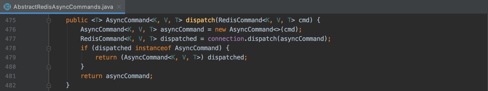

然后经过 `StatefulRedisConnectionImpl` 到达`RedisChannelHandler`：

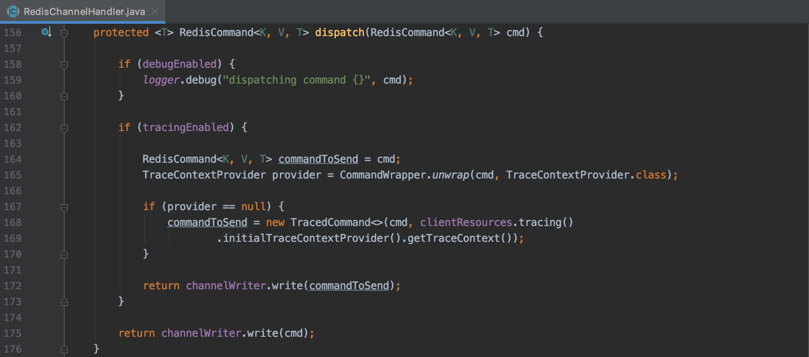

然后调用 `RedisChannelWriter` 的 write 方法执行命令发送，实现逻辑在 `DefaultEndpoing`：

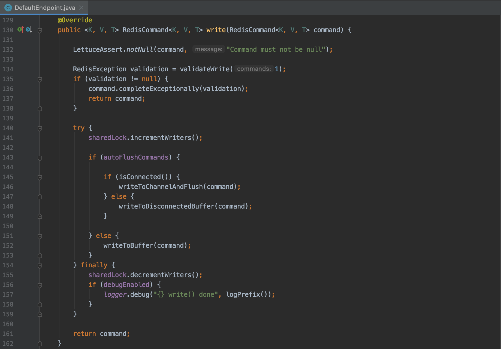

主干逻辑很清晰，就是调用 channel write 出去。另外还有一些缓存和容错的逻辑。

## 4. 同步执行命令

同步执行的背后还是上述异步执行的框架，只是包装了一个 `syncHandler`。

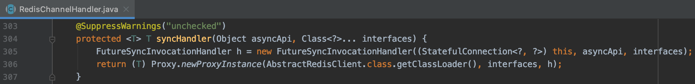

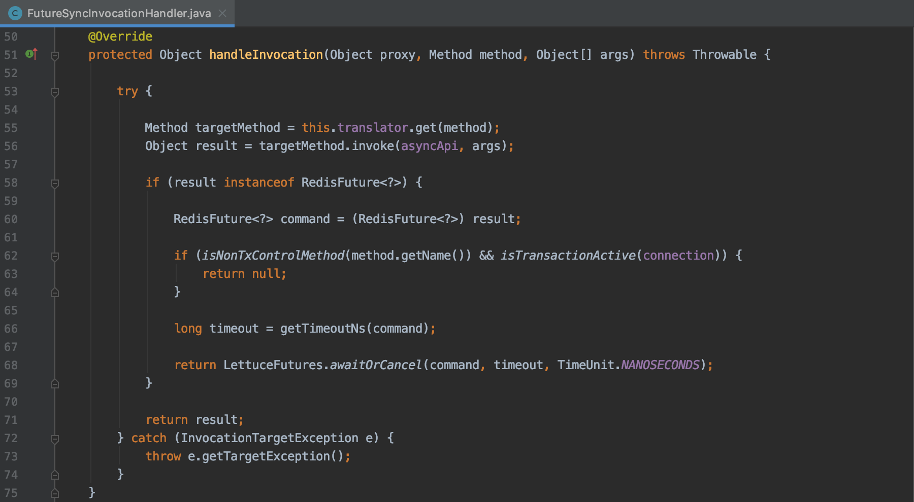

逻辑很清晰，在异步返回 future 后主动等待，也就变成同步了。

## 5. 其他

至于响应式执行命令，就是使用 [reactor-core](https://projectreactor.io/) 框架，这里就不介绍了。
