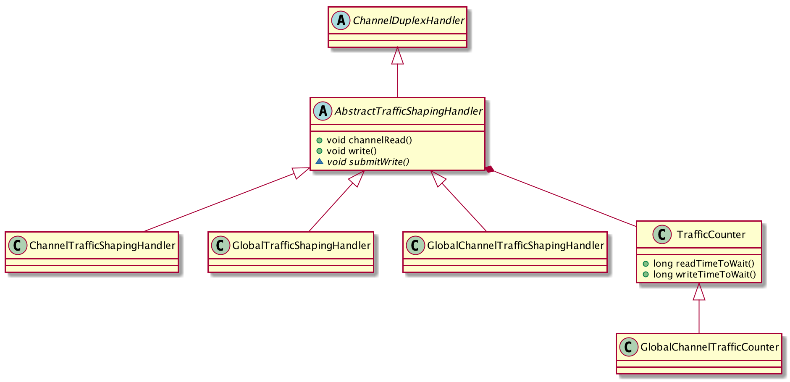
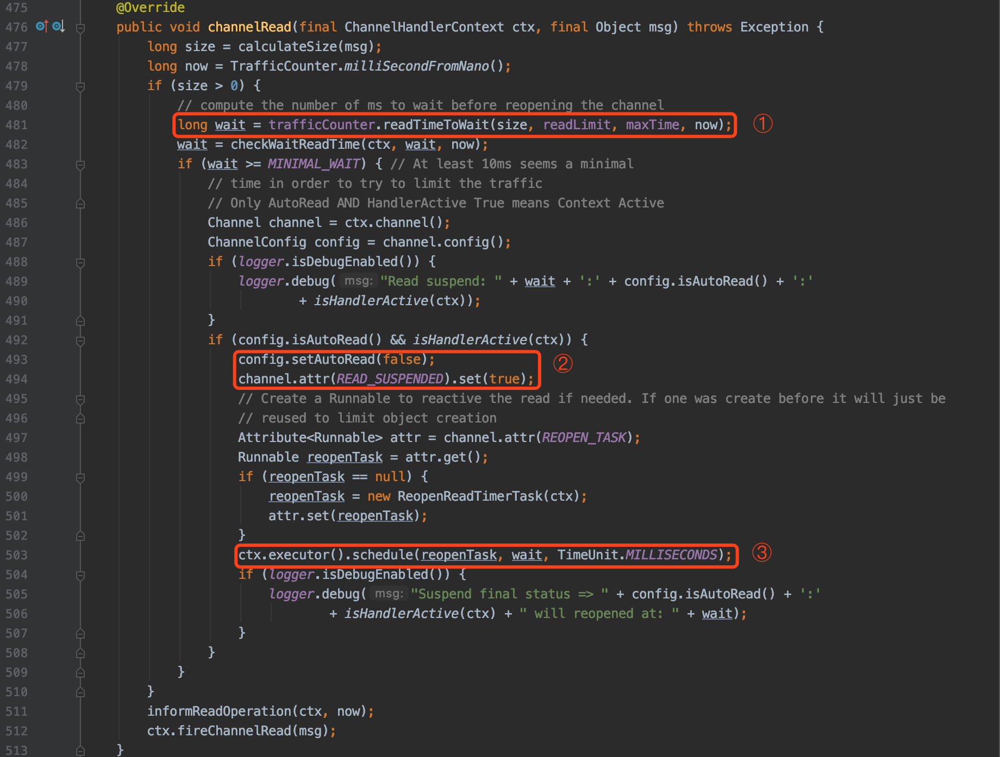
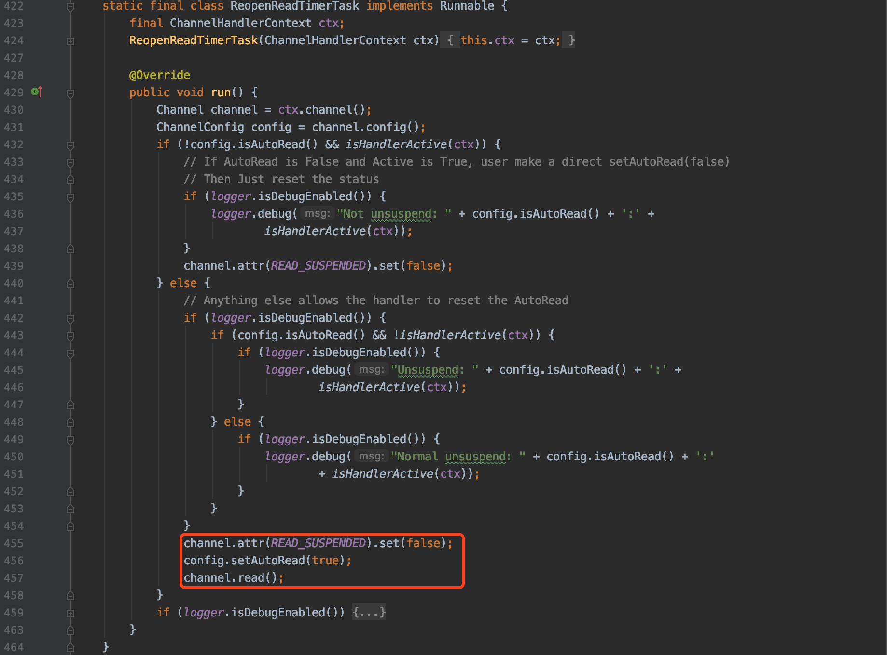
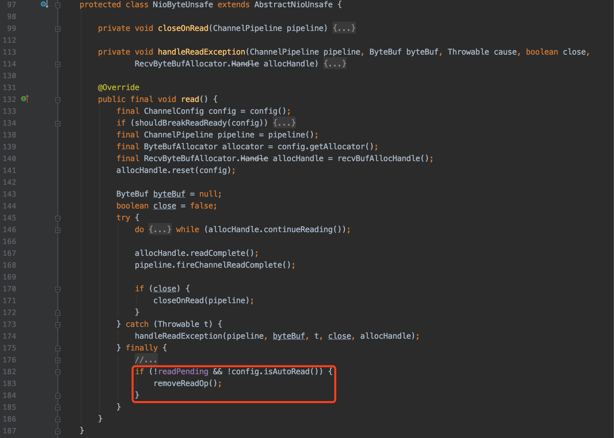
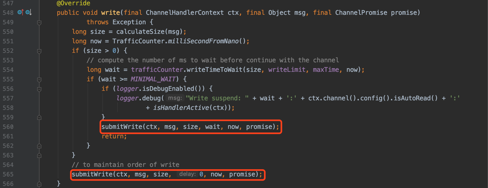
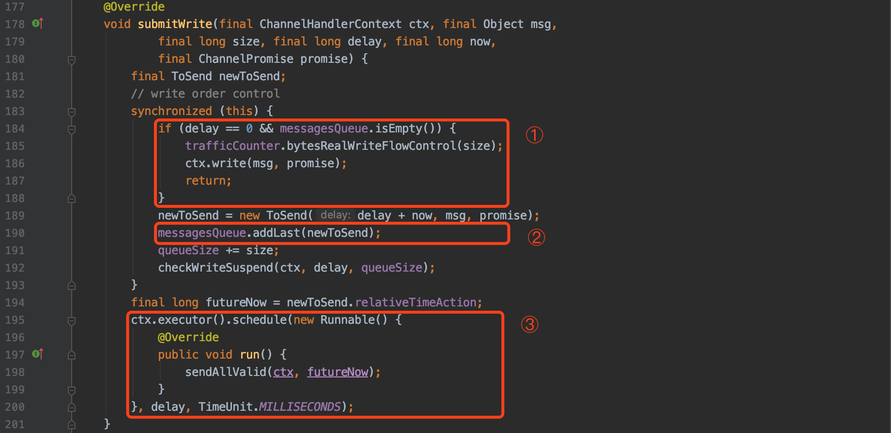
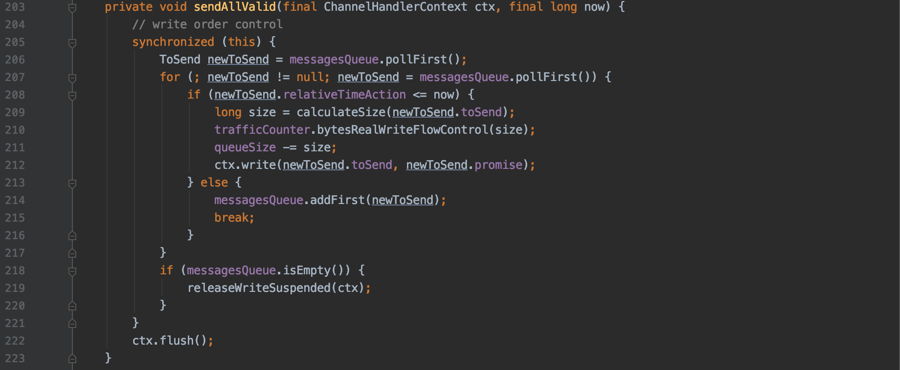
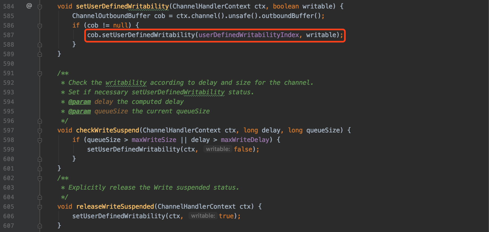

## 0.

最近想做个限流的功能，看了一下 Kafka 的 [Quotas](https://cwiki.apache.org/confluence/display/KAFKA/KIP-13+-+Quotas)，感觉可以借鉴在 Netty 中实现一下，后来发现 Netty 中已经实现了一系列类似功能的 `*TrafficShapingHandler`，按照名称直译为“流量整形”，具体的作用也就是控制读取、发送消息的速率。

## 1. 整体流程

总的来看 `AbstractTrafficShapingHandler` 在入口、出口的位置实现了控制读取、发送速率的逻辑。对于速率统计和判断的逻辑封装在 `TrafficCounter` 中，`TrafficCounter` 暴露了 readTimeToWait 和 writeTimeToWait 这两个方法，根据当前的消息量计算是否需要阻塞，以及阻塞多长时间才能将速率降到限制以下。

根据流控粒度的不同，`AbstractTrafficShapingHandler` 提供了三个实现：
1. `ChannelTrafficShapingHandler` 连接粒度（也就是 channel）
        在每个 handlerAdded 方法中为每个 Channel 设置单独的 `TrafficCounter`。
2. `GlobalTrafficShapingHandler` 全局粒度（也就是整个 server）
        在构造方法中设置全局的 `TrafficCounter`。
3. `GlobalChannelTrafficShapingHandler` 全局粒度，但是又平衡各个连接
        在构造方法中设置全局的 `GlobalChannelTrafficCounter`；
        在每个 handlerAdded 方法中为每个 Channel 设置单独的 `TrafficCounter`。

## 2. 阻塞读

接下来看一下 `AbstractTrafficShapingHandler` 的 `channelRead` 方法中是如何阻塞读操作的：

1. 根据 trafficCounter 统计的读速率计算等待时间；
2. 如果需要等待，通过 `config.setAutoRead(false)` 设置暂停读操作；
3. 提交一个延迟执行的任务，重新开启读操作。

延迟开启读操作的任务 `ReopenReadTimerTask` 很简单：

#### setAutoRead 的作用

`config.setAutoRead(false)` 的作用本质上就是移除 `SelectionKey.OP_READ` 事件监听。

## 3. 挂起写

接下来看一下 `AbstractTrafficShapingHandler` 的 `write` 方法是如何挂起写操作的：

根据 trafficCounter 计算的等待时间，在 `submitWrite` 方法中将得发送的消息提交到延迟队列，具体的实现在三个子类中略有不同，接下来看一下 `ChannelTrafficShapingHandler` 中 `submitWrite` 方法：

1. 如果该 channel 的发送队列为空，并且该消息不需要延迟发送，那么直接发送；
2. 否则追加到发送队列；
3. 提交一个延迟执行的任务，检查发送到期的消息。

检查发送到期消息的 `sendAllValid` 方法很简单：

对于写操作都会进入延迟发送队列，如果持续有消息进入的话可能会撑爆内存，所以需要一种机制通知上游不能再写了。

仔细看上面的代码发现还有一个 `checkWriteSuspend` 方法，用于检查是否需要挂起写操作。

#### WriteSuspend 的作用

`setUserDefinedWritability` 的作用本质上就是修改 `ChannelOutboundBuffer` 的 `unwritable`。在 `unwritable` 不为 0 的情况下，channel 的 `isWritable` 方法将会返回 false，以此通知上游不能再写了。

至于不同的  `userDefinedWritabilityIndex` 只是为了区分不同的 `*TrafficShapingHandler`。

## 4. TrafficCounter

最后看一下 `TrafficCounter`，其中的计算稍微有点儿复杂，实际上核心就是一行代码：

> long time = lastsum * 1000 / limitTraffic - lastinterval + pastDelay;

上一个时间区间的总流量（lastsum*1000）除以限制的阈值（limitTraffic），那么得出的“时间”可以理解为这些数据“预期占用服务的时间”，如果大于“实际的时间”（lastinterval），那么就代表需要限流了，你不能再占用服务了，阻塞的时间就是两者的差值。

等到阻塞后的时间点，等式就平了（lastsum * 1000 / limitTraffic == lastinterval），也就是平均来看流量限制在了阈值之下。

## 5. 总结

总的来说，Netty 的这一系列 `*TrafficShapingHandler` 实现的还是很简洁，试了一下效果还不错。

如果非要挑个刺的话，那就是“限流粒度”没有抽象一下，使用起来比较受限。
