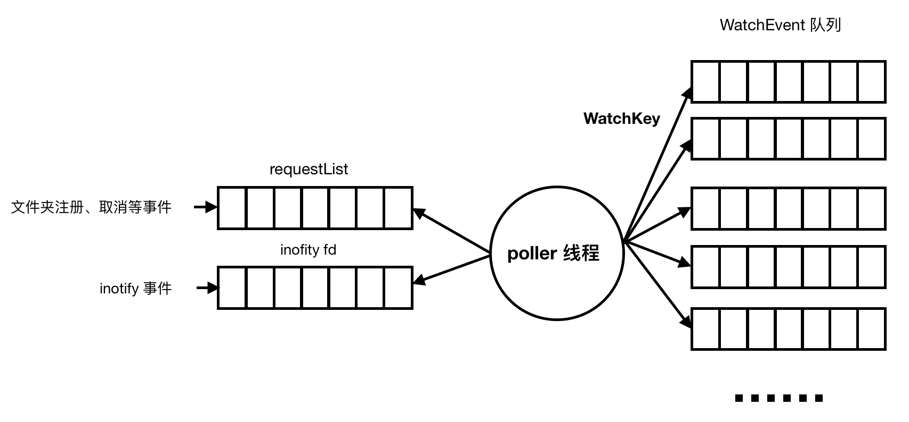
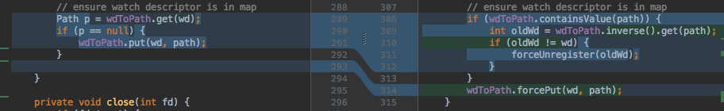

[Inotify](https://en.wikipedia.org/wiki/Inotify) 用于监听文件系统的变更，我们有个场景需要监听一个根目录下的所有文件，包括不同深度子目录下的文件，如果文件发生变化，增量读取新增的内容。

之前我们使用轮询的模式，周期性递归遍历根目录，对比文件属性信息选择要读取的文件，这种方式有一个问题就是周期很难选择：

1. 如果选择较小的周期，读文件的磁盘 I/O 会相对均匀，但是频繁的递归遍历会造成较高的 CPU 占用
2. 如果选择较大的周期，递归遍历占用的资源将会下降，但是周期变大造成增量数据变大，结果每次读取将会造成瞬间较高的磁盘 I/O

所以我们考虑用系统级别的 inotify 替换掉轮询的逻辑，结果踩了不少坑。。。

##1. JDK 封装的问题 —— poller

jdk 将 inotify 的功能封装为 WatchService，使用起来非常简单，sample 中还提供了一个递归注册目录的例子 [WatchDir.java](https://github.com/AdoptOpenJDK/openjdk-jdk8u-backup/blob/ab4834a6274ad6beb81e50b46aee04b4d328999a/jdk/src/share/sample/nio/file/WatchDir.java)。

由于 inotify 只支持 1.监听文件，2.监听目录，以及目录下的目录和文件，不能监听子目录下的变更，所以需要递归注册目录。

基于官方的 sample 我们很快就用上了 inotify，效果很不错，不仅 CPU 占用下降了，而且文件读取特别均匀。

直到有一天 CPU 使用率开始飚高了，通过 top 和 jstack 发现占用 CPU 最多的线程不是读文件的线程，而是 [LinuxWatchService](https://github.com/AdoptOpenJDK/openjdk-jdk8u-backup/blob/ab4834a6274ad6beb81e50b46aee04b4d328999a/jdk/src/solaris/classes/sun/nio/fs/LinuxWatchService.java) 中的 poller 线程。



poller 线程的作用如上图所示：

1. poll requestList，处理业务代码中的目录注册、取消和关闭等请求；
2. poll inotify 文件描述符获取 inoitfy_event, 然后按照  WatchKey （也就是 watch descriptor）放到不同的队列，队列的长度默认为 512，如果队列满了，那么清空队列并且放入 overflow 事件。

由于我们监听的目录比较多，当大量文件频繁修改的时候是会产生大量的事件，而 poller 线程会尽最大能力读取这些事件，所以造成了很高的 CPU 占用。

然后这是一种无用功，因为 1.事件数量超出 WatchEvent 队列长度，上层业务逻辑也就取不到事件；2. inotify 的文件队列也有简单的事件去重逻辑，没必要特别快地读取事件然后再去重。

实际上 poller 的速度应该受制于下游的处理能力，如果下游已经不能处理，那么暂时放在中转队列也是意义不大的，我们只需要依赖 inotify 的文件队列即可。

顺便提一下 inotify 相关的几个系统参数：

1. /proc/sys/fs/inotify/max_user_instances 初始化 ifd 的数量限制
2. /proc/sys/fs/inotify/max_queued_events ifd 文件队列长度限制
3. /proc/sys/fs/inotify/max_user_watches 注册监听目录的数量限制
4. 既然是文件描述符，当然也受 /etc/security/limits.conf 和 /proc/sys/fs/file-max 限制

所以我们通过 JNI 调用重新实现了 WatchService 的逻辑，去掉了 poller 线程，由业务线程控制 poll 的频率。

## 2. 莫名其妙的 MODIFY 事件 —— deleted

然后一切又变正常了，只是偶尔有几条莫名其妙的 MODIFY 事件。

读到 MODIFY 事件，首先需要读取文件属性，然后走不同的逻辑，但是此刻却抛出 NoSuchFileException。

这个问题一开始也毫无头绪，甚至怀疑是不是文件瞬间被删除了。。。

直到有一天想起了 lsof 这个命令，验证了一下：

```
REG                8,6        16    6161077 /xxx/xxx/xxx/xxx (deleted)
```

果然是文件被删除了，但是打开的文件描述符没有关闭，而且还偶尔在写数据。

## 3. 有目录脱离监听 —— overflow

然后一切又变正常了，文件不存在的 MODIFY 事件归咎于业务方程序的问题。

但是又遇到了新的问题，偶尔发现存在没有读取的文件，而且是整个子目录下的所有文件都没有读。

由于我们监听的目录比较多，有些机器上有约五千个监听目录，所以偶尔会发生事件 overflow，我们猜测是目录创建的事件被 overflow 了，所以没有监听到这个目录。

针对这个问题，我们添加了一个周期性重新递归注册的机制。

由于 inotify 是基于 inode 的，所以重复注册目录获得的 wd (watch descriptor) 是一样的，但是如果目录被移除然后重建了，那么就是一个新的 wd。

此处由于一个 bug 使得问题更严重，由于需要构建文件的绝对路径，我们采用 guava 的 BiMap 存储 wd 与 path 之间的映射，完成 inotify_add_watch 之后需要更新 wdToPath



调用 BiMap 的 put 方法，如果存在遗留的 path，那么是会抛出 IllegalArgumentException 的，所以首先需要处理这种情况，然后调用 forcePut 覆盖旧的映射。

## 4. 隐藏最深的 mv

移动监听目录这个场景，由于写代码的时候没有考虑，第一次发现这个问题着实被吓了一下。

有些业务方的重启脚本有保存历史日志的逻辑，也就是 mv 旧的日志根目录，然后创建一个新的日志根目录。

由于 inotify 是基于 inode 的，所以 mv 后的目录还在监听中，并且 wd 没有变化，所以目录下文件的改动还是会触发事件。触发事件不可怕，关键是通过 wdToPath 映射还原的绝对路径已经不对了。

在我们的使用场景中，将 mv 作为删除处理即可，所以注册目录时默认加上 IN_MOVE_SELF 事件监听，如果收到该事件，那么 forceUnregister 这个 wd，如果事件 overflow 了，那么还是依赖周期性重新注册的机制。

## 参考

本文只是粗略记一下遇过的问题，inotify 的详细介绍可以参考下述文章。

1. [Filesystem notification series by Michael Kerrisk](https://lwn.net/Articles/605313/)
2. [Monitor Linux file system events with inotify](https://www.ibm.com/developerworks/library/l-inotify/index.html)

***


**如果觉得我的文章对您有用，请随意打赏。**


