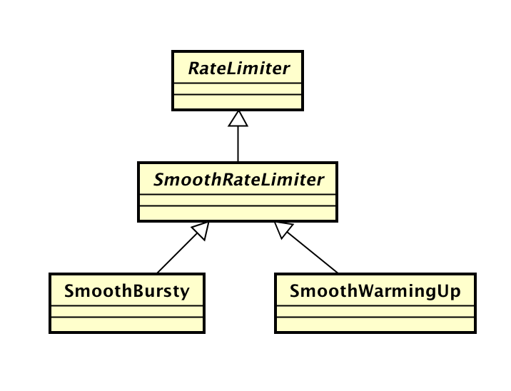
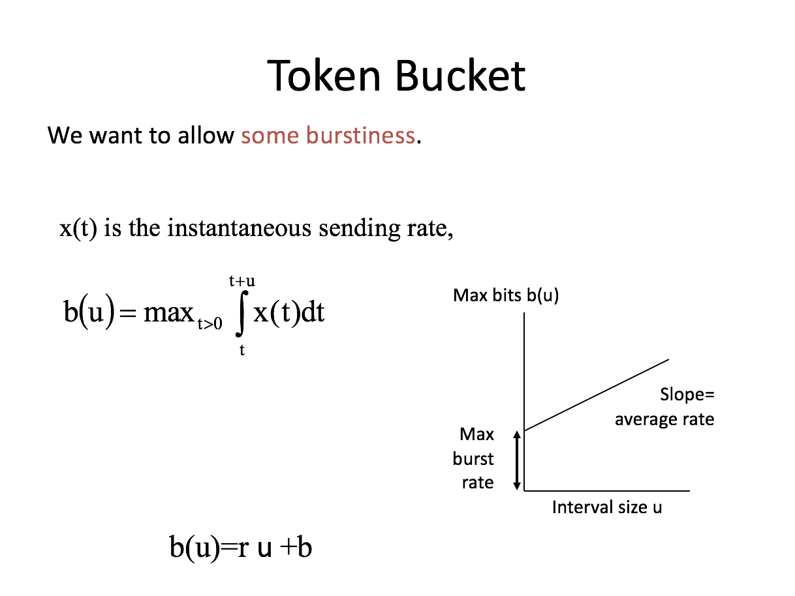
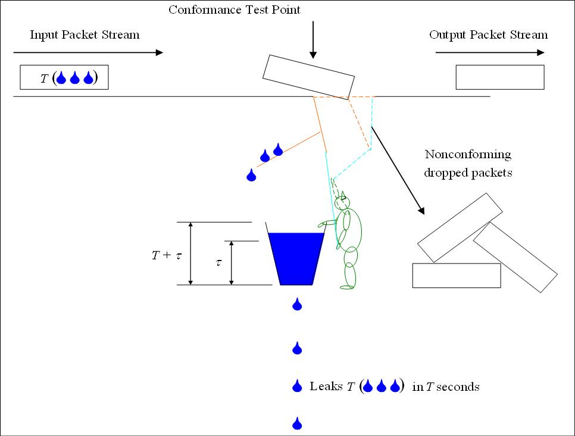

对于流控这个问题，最先想到的可能是 Guava 的 RateLimiter，然后是 Token bucket 和 Leaky bucket 这些算法，但是其中的细节就似懂非懂了。

最近由于写一块逻辑需要流控，所以又复习了一下 RateLimiter。

##1. Guava RateLimiter



Guava 提供了两种 RateLimiter 的实现：

1. SmoothBursty
2. SmoothWarmingUp

我们从父类的 tryAcquire 方法开始：

```java
  public boolean tryAcquire(int permits, long timeout, TimeUnit unit) {
    long timeoutMicros = max(unit.toMicros(timeout), 0);
    checkPermits(permits);
    long microsToWait;
    synchronized (mutex()) {
      long nowMicros = stopwatch.readMicros(); // 获取当前时间
      if (!canAcquire(nowMicros, timeoutMicros)) { // 尝试获取许可
        return false;
      } else {
        microsToWait = reserveAndGetWaitLength(permits, nowMicros); // 计算等待许可的时间
      }
    }
    stopwatch.sleepMicrosUninterruptibly(microsToWait); // 等待许可
    return true;
  }
```

在尝试获取许可的 canAcquire 方法中

```java
  private boolean canAcquire(long nowMicros, long timeoutMicros) {
    return queryEarliestAvailable(nowMicros) - timeoutMicros <= nowMicros;
  }
```

queryEarliestAvailable 用于计算最早可以获取许可的时间点，如果该时间点大于 timeout，那么返回 false，也就是无法获得许可。

queryEarliestAvailable 是抽象方法，具体实现在 SmoothRateLimiter 中：

```java
  @Override
  final long queryEarliestAvailable(long nowMicros) {
    return nextFreeTicketMicros;
  }
```

nextFreeTicketMicros 用于标记下次请求获得许可的时间，其更新的逻辑在 reserveAndGetWaitLength 中。

顺便提一下另外几个关键参数：

1. storedPermits 当前许可的数量
2. maxPermits 许可数量的最大值
3. stableIntervalMicros 两次请求之间的时间差。例如每秒5个许可，那么该值为200ms

```java
  final long reserveAndGetWaitLength(int permits, long nowMicros) {
    long momentAvailable = reserveEarliestAvailable(permits, nowMicros);
    return max(momentAvailable - nowMicros, 0);
  }
```

reserveEarliestAvailable 也是一个抽象方法，其实现逻辑在 SmoothRateLimiter 中：

```java
  @Override
  final long reserveEarliestAvailable(int requiredPermits, long nowMicros) {
    resync(nowMicros);  // 基于当前时间更新 storedPermits 和 nextFreeTicketMicros
    long returnValue = nextFreeTicketMicros;
    double storedPermitsToSpend = min(requiredPermits, this.storedPermits);
    double freshPermits = requiredPermits - storedPermitsToSpend;
    long waitMicros = //等待时间包含两部分 1. 当前许可的等待时间 2. 超过当前许可的等待时间
        storedPermitsToWaitTime(this.storedPermits, storedPermitsToSpend)
            + (long) (freshPermits * stableIntervalMicros);

    this.nextFreeTicketMicros = LongMath.saturatedAdd(nextFreeTicketMicros, waitMicros);
    this.storedPermits -= storedPermitsToSpend;
    return returnValue;
  }
```

更新 nextFreeTicketMicros 下次获取许可的时间点，以及减去已经使用的许可。

```java
  void resync(long nowMicros) {
    // if nextFreeTicket is in the past, resync to now
    if (nowMicros > nextFreeTicketMicros) {
      double newPermits = (nowMicros - nextFreeTicketMicros) / coolDownIntervalMicros();
      storedPermits = min(maxPermits, storedPermits + newPermits);
      nextFreeTicketMicros = nowMicros;
    }
  }
```

可见当 timeout 为 0 时， microsToWait 总是为 0，所以不会造成阻塞。

至此，RateLimiter 的主流程已经很清楚了。

剩下的就是3个细节了：

**1. maxPermits**

在 SmoothBursty 中，

```java
    void doSetRate(double permitsPerSecond, double stableIntervalMicros) {
      double oldMaxPermits = this.maxPermits;
      maxPermits = maxBurstSeconds * permitsPerSecond;
      if (oldMaxPermits == Double.POSITIVE_INFINITY) {
        // if we don't special-case this, we would get storedPermits == NaN, below
        storedPermits = maxPermits;
      } else {
        storedPermits =
            (oldMaxPermits == 0.0)
                ? 0.0 // initial state
                : storedPermits * maxPermits / oldMaxPermits;
      }
    }
```
 
maxBurstSeconds 默认为 1.0，所以 SmoothBursty 最大突发 permitsPerSecond 个许可。

在 SmoothWarmingUp 中，

```java
    void doSetRate(double permitsPerSecond, double stableIntervalMicros) {
      double oldMaxPermits = maxPermits;
      double coldIntervalMicros = stableIntervalMicros * coldFactor;
      thresholdPermits = 0.5 * warmupPeriodMicros / stableIntervalMicros;
      maxPermits =
          thresholdPermits + 2.0 * warmupPeriodMicros / (stableIntervalMicros + coldIntervalMicros);
      slope = (coldIntervalMicros - stableIntervalMicros) / (maxPermits - thresholdPermits);
      if (oldMaxPermits == Double.POSITIVE_INFINITY) {
        // if we don't special-case this, we would get storedPermits == NaN, below
        storedPermits = 0.0;
      } else {
        storedPermits =
            (oldMaxPermits == 0.0)
                ? maxPermits // initial state is cold
                : storedPermits * maxPermits / oldMaxPermits;
      }
    }
```

**2. coolDownIntervalMicros**

在 SmoothBursty 中，coolDownIntervalMicros 就是 stableIntervalMicros，也就是说匀速生成许可。

在 SmoothWarmingUp 中，

```java
    @Override
    double coolDownIntervalMicros() {
      return warmupPeriodMicros / maxPermits;
    }
```

**3. storedPermitsToWaitTime**

在 SmoothBursty 中，storedPermitsToWaitTime 为 0，也就是说对于已经生成的许可，不需要再等待。

在 SmoothWarmingUp 中，

```java
    @Override
    long storedPermitsToWaitTime(double storedPermits, double permitsToTake) {
      double availablePermitsAboveThreshold = storedPermits - thresholdPermits;
      long micros = 0;
      // measuring the integral on the right part of the function (the climbing line)
      if (availablePermitsAboveThreshold > 0.0) {
        double permitsAboveThresholdToTake = min(availablePermitsAboveThreshold, permitsToTake);
        // TODO(cpovirk): Figure out a good name for this variable.
        double length =
            permitsToTime(availablePermitsAboveThreshold)
                + permitsToTime(availablePermitsAboveThreshold - permitsAboveThresholdToTake);
        micros = (long) (permitsAboveThresholdToTake * length / 2.0);
        permitsToTake -= permitsAboveThresholdToTake;
      }
      // measuring the integral on the left part of the function (the horizontal line)
      micros += (long) (stableIntervalMicros * permitsToTake);
      return micros;
    }

    private double permitsToTime(double permits) {
      return stableIntervalMicros + permits * slope;
    }
```

总的来说，SmoothBursty 比较容易理解，而 SmoothWarmingUp 添加了预热机制，代码不太直观，可以配合下图来理解代码。


```plain
  /**
   *          ^ throttling
   *          |
   *    cold  +                  /
   * interval |                 /.
   *          |                / .
   *          |               /  .   ← "warmup period" is the area of the trapezoid between
   *          |              /   .     thresholdPermits and maxPermits
   *          |             /    .
   *          |            /     .
   *          |           /      .
   *   stable +----------/  WARM .
   * interval |          .   UP  .
   *          |          . PERIOD.
   *          |          .       .
   *        0 +----------+-------+--------------→ storedPermits
   *          0 thresholdPermits maxPermits
   */
```

许可数量从 thresholdPermits 降至 0 的时间周期等于 warmupPeriod/2，因此 `thresholdPermits = 0.5 * warmupPeriod / stableInterval`。

从 maxPermits 降至 thresholdPermits 的时间周期等于 warmupPeriod，因此 `maxPermits = thresholdPermits + 2 * warmupPeriod / (stableInterval + coldInterval)`。

coolDownIntervalMicros 方法控制许可的生成速度，也就是在 warmupPeriod 周期匀速生成 maxPermits 个许可。

对于已经生成的许可，storedPermitsToWaitTime 方法增加了等待时间，计算方式也就是对上图求个积分，初始态在x轴的右边，然后向左移动，也就是说一开始等待时间比较大，然后逐渐减小，最后平稳。

由于 coldFactor 硬编码为 3.0， 所以预热的“斜率”由 warmupPeriod 控制，warmupPeriod 越大，慢启动速率衰减越平缓，达到稳定的时间也比较长。

##2. Token bucket

[Token bucket](https://en.wikipedia.org/wiki/Token_bucket)



实际上 SmoothBursty 就是一个标准的 Token bucket 实现，Token bucket 的优点是支持 burstiness。


##3. Leaky bucket

[Leaky bucket](https://en.wikipedia.org/wiki/Leaky_bucket)



Leaky bucket 与 Token bucket 的不同在于，Leaky bucket 是针对“水滴”限流，所以不会存在突发流量。

SmoothWarmingUp 实际上是一个 Leaky bucket 的实现。
