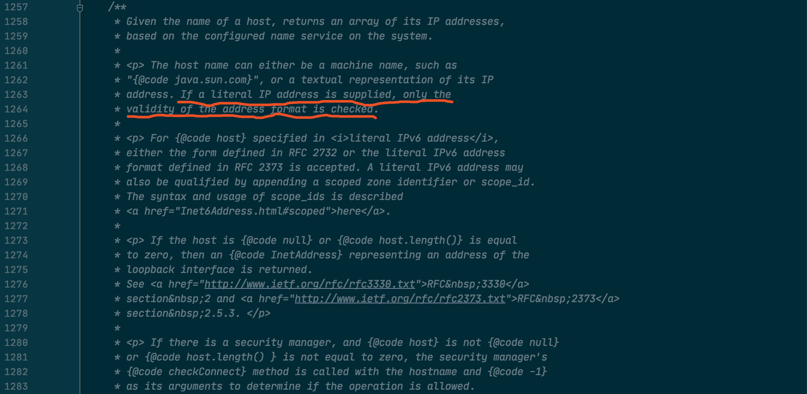
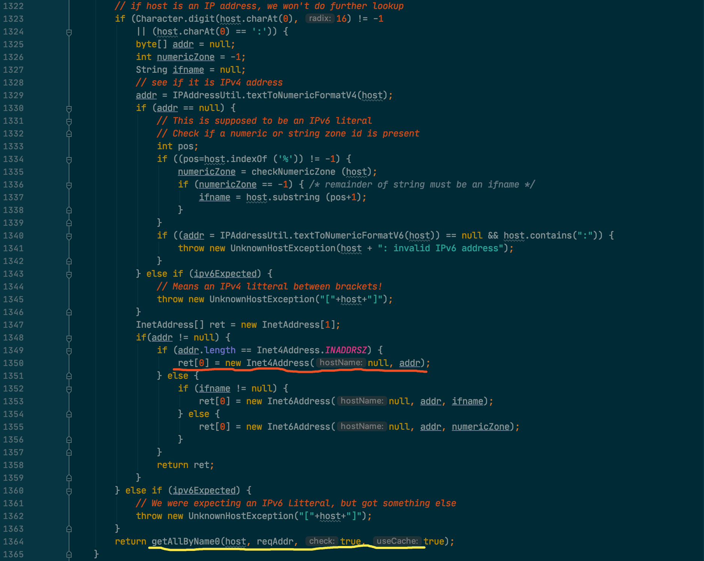
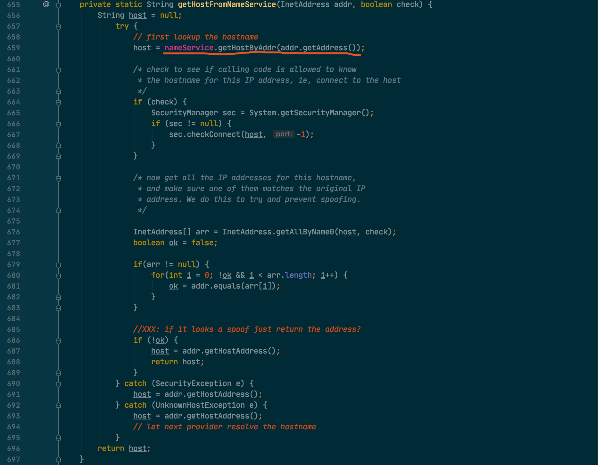
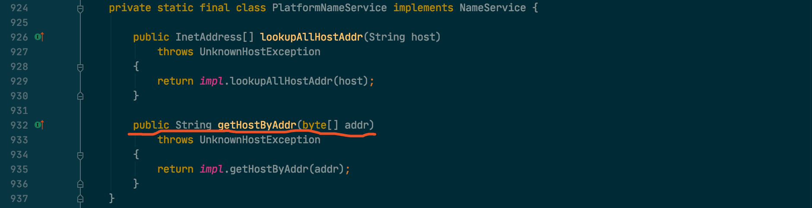
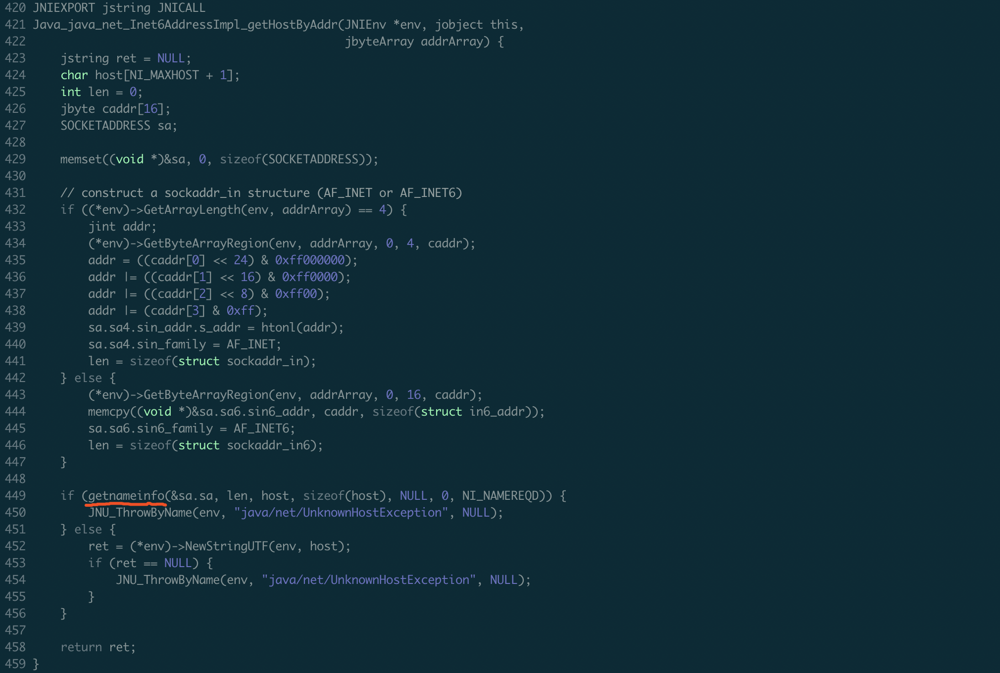
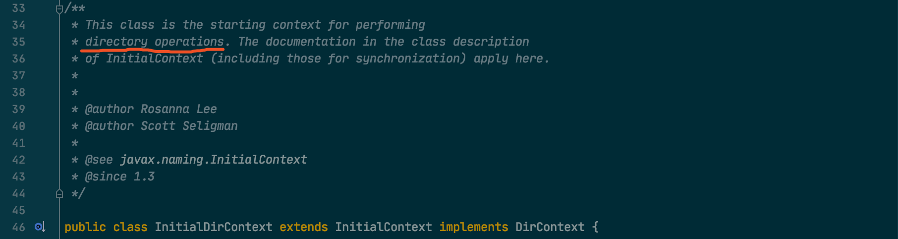
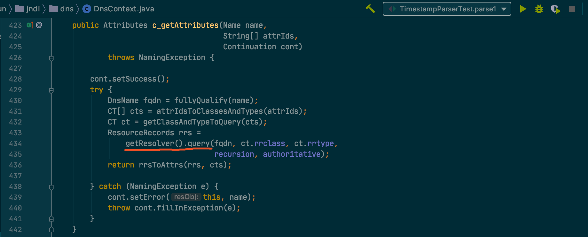
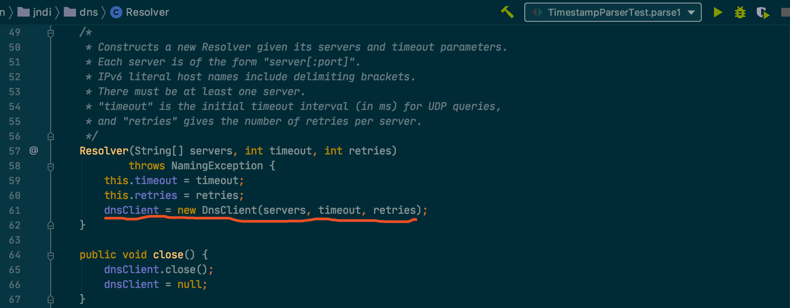

## 0.

最近在统计一个数据，原始数据是 IP 粒度，需要聚合为 hostname 公共前缀的粒度。其中涉及一个从 IP 反查 hostname 的操作，本质上就是 [nslookup](https://linux.die.net/man/1/nslookup) 提供的功能，在实现过程中发现 Java 提供的封装不太好用。

不过最终还是找到一个优雅的方法，顺便记个笔记。

## 1. InetAddress.getHostName

看了一些遗留代码和 [stackoverflow 上的问答](https://stackoverflow.com/a/3371993)，查找 hostname 的操作基本都是这样实现：

```java
InetAddress addr = InetAddress.getByName("192.168.190.62");
String host = addr.getHostName();
System.out.println(host);
```

`InetAddress.getByName` 方法接下来调用的是 `getAllByName` 方法，先看一下注释：



这个方法的用意是传入一个主机名返回一组 IP 地址，也就是正向 DNS 查询，对于传入 IP 地址的情况只是返回一个包装：



重点看 L1350，对于格式正确的 IPv4 地址返回 `Inet4Address`。

> 至于传入域名的情况（L1364），在 `getAllByName0` 方法中通过 DNS 查询 IP 地址列表，这个流程跟本文无关暂且忽略。

接下来就是用返回的包装对象的 `getHostName` 方法查询：


由于构建的时候 `hostName` 为 `null`，所以接下来调用 `getHostFromNameService` 方法：



重点看 L659，通过 `nameService.getHostByAddr` 方法查 hostname，剩下的处理逻辑主要是一些安全检查，这里也不看了。

`nameService` 的初始化在 `createNameService` 方法中，未设置 jdk.net.hosts.file 系统参数的情况下构建的是 `PlatformNameService`。



`getHostByAddr` 方法接下来调的是 `impl.getHostByAddr`，至于 `impl` 根据是否支持 ipv6 提供了两个实现：`Inet6AddressImpl` 和 `Inet4AddressImpl`。

由于现在的系统基本都是支持 v6 的，所以接下来看一下 `Inet6AddressImpl` 中的实现：



在 unix 系统下调用的系统函数是 [getnameinfo](http://man7.org/linux/man-pages/man3/getnameinfo.3.html)，虽然不太熟悉 linux 网络编程，但是搜了一下感觉这也是一个常用的函数。

#### getnameinfo 的局限性

这个方法很有效，但是有个局限性，在一个 IP 绑定多个 hostname 的时候，使用 nslookup 可以查到全部的 hostname，而使用 `getnameinfo` 只能查到一个 hostname。

在多个域名的情况下，使用 `getnameinfo` 获取的经常不是想要的主机名，而且还会发生变化，完全不能满足我们聚合统计数据的需求。

难道在 Java 中就没有对应 nslookup 的封装么？如果能获取到 hostname 列表就可以根据格式筛选出想要的主机名。

## 2. InitialDirContext.getAttributes

其实可以通过 `Runtime.getRuntime().exec` 执行 nslookup 命令获取 hostname 列表，缺点就是不太优雅，而且每次都要 fork 子进程。

所以继续搜索了一下，还真找到了一个方法：

**[NSLookup.java](https://gist.github.com/shichaoyuan/f759ea533b5bddd09970b2ab528d4e0b)**

```java
public class NSLookup {
    private static final String PTR = "PTR";
    private static final String[] ATTR_IDS = { PTR };

    private final InitialDirContext idc;

    public NSLookup() throws NamingException {
        Properties env = new Properties();
        env.put(Context.INITIAL_CONTEXT_FACTORY, "com.sun.jndi.dns.DnsContextFactory");
        idc = new InitialDirContext(env);
    }

    public String[] getHostnames(String ip) throws NamingException {
        String arpaName = buildArpaName(ip);

        Attributes attrs = idc.getAttributes(arpaName, ATTR_IDS);
        Attribute attr = attrs.get(PTR);

        if (attr == null) {
            return null;
        }

        String[] hosts = new String[attr.size()];
        for (int i = 0; i < attr.size(); i++) {
            hosts[i] = attr.get(i).toString();
        }
        return hosts;
    }

    private String buildArpaName(String ip) {
        String[] quads = ip.split("\\.");
        StringBuilder sb = new StringBuilder();
        for (int i = quads.length - 1; i >= 0; i--) {
            sb.append(quads[i]).append(".");
        }
        sb.append("in-addr.arpa.");

        return sb.toString();
    }
}
```

该方法的核心是 `InitialDirContext`，从注释的内容来看也就是执行目录操作的上下文封装。



DirContext 一看就是一个很抽象的名字，JDK 中提供了很多种实现，对于 IP 反查 hostname 的场景需要的是 `DnsContext`，所以在构建的时候将属性 `Context.INITIAL_CONTEXT_FACTORY` 设置为 "com.sun.jndi.dns.DnsContextFactory"，通过这个工厂类创建对应的 `DnsContext`。

宏观上来看接下来通过 DNS 的 PTR 记录反查即可，具体来说首先需要将 IP 转换为 in-addr.arpa 的形式，然后调用 `getAttributes` 方法执行查询，一步步跟下去最终调用的是 `c_getAttributes` 方法：



其中的 `Resolver` 就是对 DNS 访问的封装，默认超时时间 1000ms，重试次数为 4，也可以通过 "com.sun.jndi.dns.timeout.initial"、"com.sun.jndi.dns.timeout.retries" 配置.



再往下的细节是 DNS 交互了，就不往下看了。

## 3. 总结

Java 积累了这么多年，感觉还是很完善呀，各种主流功能都有比较优秀的封装。
