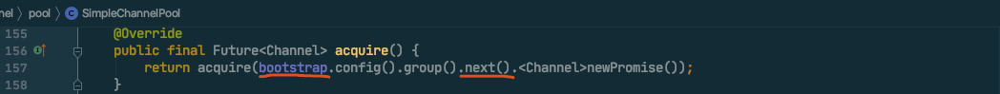

## 0.

Netty 是一个好工具，但也不是怎么使用都好，其中有些用法也得注意，就比如说 FixedChannelPool：

```java
FixedChannelPool fixedChannelPool = new FixedChannelPool(...);

fixedChannelPool.acquire().addListener(f -> {
        // 对消息进行一些处理
        ...
        // 发送消息
        channel.writeAndFlush(msg);
    });
```

异步获取连接，在 listener 回调中对消息进行一些处理，最后发送消息。（为了文章简洁，异常处理省略了）

这段代码没有任何问题，而且基于对 Netty 的信任，相信在性能上也很高效，但是压测结果却显示这成了性能瓶颈。

在看了源码之后才发现 `FixedChannelPool` 是**单线程**异步处理的。（意想不到，后来又觉得是合理的）

本文将会分析一下 `FixedChannelPool` 内部实现，给自己“造轮子”一点儿启发。

## 1. FixedChannelPool 整体结构


Netty 的 `ChannelPool` 实现如上图所示，`SimpleChannelPool` 提供了创建连接和获取释放连接的基本能力，其中用了 `Deque<Channel>` 双向队列做为内部存储结构。

`FixedChannelPool` 在 `SimpleChannelPool` 的基础上增加了最大连接数的限制，并且提供了获取连接等待时间的限制，其中使用了 `Queue<AcquireTask>` 队列存储等待获取连接的任务。

代码结构很清晰，我们自上而下来分析一下 `ChannelPool` 的实现。

## 2. SimpleChannelPool 分析

首先看入口 `acquire` 方法：



由此可见 `Future<Channel>` 的回调 listener 是由 `bootstrap` 的下一个 `EventLoop` 执行的。


逻辑很清晰，池中没有了就创建新的；能从池中获取到还需要做个健康检查。**健康检查失败**的情况需要关注一下，这里并不是直接将 future 置为失败，而是又回到了 `acquireHealthyFromPoolOrNew` 方法，继续尝试获取健康的连接。

这里我们主要关注一下 `EventLoop` 切换：
1. 创建新连接的情况（ 2 次切换）
    1. 连接创建完成，由连接所注册的 `EventLoop` 执行 `notifyConnect`。L184
    2. 由 `promise` 所注册的 `EventLoop` 执行业务 listener（也就是示例中的 addListener）。
2. 重用旧连接的情况（连接健康时， 2 次切换）
    1. 由连接所注册的 `EventLoop` 执行健康检查。L197
    2. 默认的 `ACTIVE` 健康检查不会切换。
    3. 最后由 `promise` 所注册的 `EventLoop` 执行业务 listener。

`EventLoop` 切换并不一定是线程切换，但是对于时延敏感的程序，总是切换线程还是有影响的。

#### 2.1 pollChannel 中的一个细节


从池中获取连接的 `pollChannel` 方法还有一个需要注意的细节。

当 `lastRecentUsed` 为 true 时，这个池子以 LIFO 的形式运行，可这能会导致一个极端情况：一个连接刚还回到池子，又被拿出去使用，从整体来看，反反复复只用了这一个连接，这会导致数据都堆积在一个发送缓存里。

当 `lastRecentUsed` 为 false 时，这个池子以 FIFO 的形式运行，看起来会比较均匀。

## 3. FixedChannelPool 分析

`FixedChannelPool` 在 `SimpleChannelPool` 的基础上加了两个限制：最大连接数限制和最长等待时间限制。


先看一下构造方法中的几个关键参数，**重点看 `executor`，这是从 client `bootstrap` 中获取的单个 `EventLoop`，并且不是独占的，也就是说该 `EventLoop` 还会处理其他任务**。

具体这个 `executor` 是如何使用的呢？我们看一下 `acquire` 方法：


从主干逻辑来看，所有获取连接的任务都会提交给 `executor` 来处理，优点是单线程执行，不需要考虑线程安全，极大简化代码，而且在线程较多的情况下，这种模式很可能会比多线程加锁好一些（只是猜测，没有验证）。

缺点也很明显，**前面多线程处理的任务，到这里不仅切换了一次线程，而且处理任务的线程只有一个，最后的回调任务处理还得再切一次**，通常来说这没有问题，但是对时延敏感的程序，肯定会成为瓶颈候选者之一。

`AcquireListener` 和 `TimeoutTask` 的逻辑这里就不细看了，我们也算一下 `EventLoop` 切换（不包括父类 SimpleChannelPool 的）：
1. 少于最大连接数的情况（3 次切换）
    1. 提交给 `executor` 执行 `acquire0`。
    2. SimpleChannelPool 连接获取完成，又切回 `executor` 执行 `AcquireListener`。
    3. 由 `promise` 所注册的 `EventLoop` 执行业务 listener。
2. 大于最大连接数，并且小于 pending 获取数（没有超时的情况，3 次切换）
    1. `executor` 在 `runTaskQueue` 方法中消费 `pendingAcquireQueue`
    2. SimpleChannelPool 连接获取完成，又切回 `executor` 执行 `AcquireListener`。
    3. 由 `promise` 所注册的 `EventLoop` 执行业务 listener。

## 4. 总结

连接池不容易。。。

优秀如 [lettuce-io/lettuce-core](https://github.com/lettuce-io/lettuce-core) 这样的客户端也提供了[两种连接池使用方式](https://github.com/lettuce-io/lettuce-core/wiki/Connection-Pooling-5.1)：一个是基于 Commons Pool 2 的同步模式；另一个是自己实现的异步模式。

同步异步各有优缺点，但终归异步是发展方向。

感觉上可以将 `FixedChannelPool` 异步执行的任务都绑定给连接所注册的 `EventLoop` 处理，应该可以提高一定的效率。


