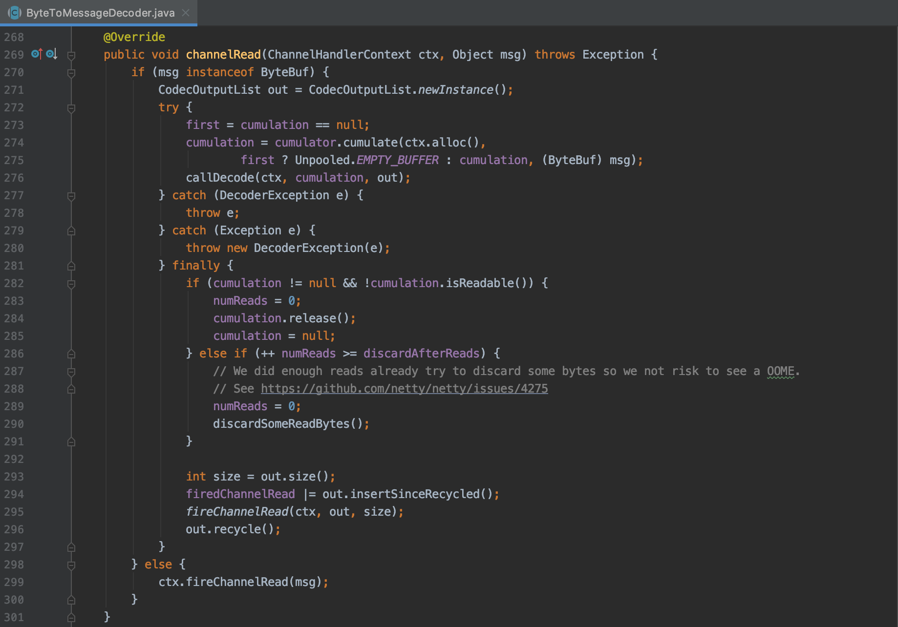
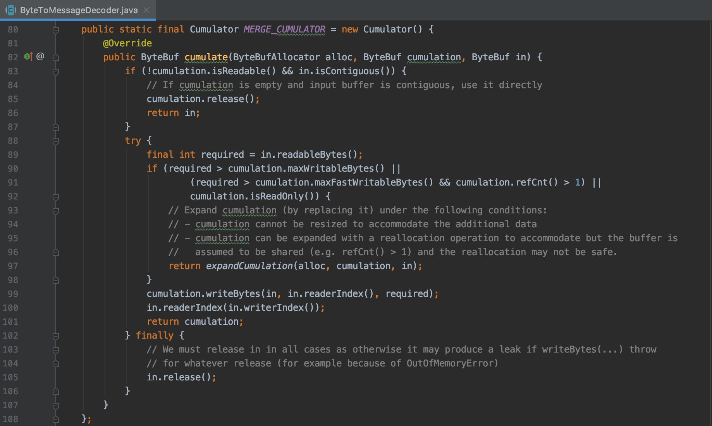

## 0. 错误示范

最近在优化一个基于 Netty 实现的 proxy，为了消除消息序列化的成本，在解码完成后用了 `in.retainedSlice` 保存原始数据，发送的时候直接 write 即可。

解码模块是基于 `ByteToMessageDecoder` 实现的，转发的协议是 redis 协议，本来是个很好的想法，结果想当然的用错了API，下面是简化的代码。

```java
public class NavieDecoderDemo extends ByteToMessageDecoder {

    private int startIndex;
    private int endIndex;

    @Override
    protected void decode(ChannelHandlerContext ctx, ByteBuf in, List<Object> out) throws Exception {
        if (status == WAIT_FOR_REQUEST) {
            processRequest(in);
        } else if (status == WAIT_FOR_FIELD) {
            processField(in);
        } else if (status == WAIT_FOR_CONTENT) {
            if (processContent(in)){
                ByteBuf origin = in.retainedSlice(startIndex, endIndex - startIndex);
                request.setOrigin(origin);
                out.add(request);
                request = null;
            }
        }
    }

    public Object processRequest(ByteBuf buffer) {
        startIndex = buffer.readerIndex();
        ...
    }

    public boolean processContent(ByteBuf buffer) {
        ...
        if (request.getFieldIndex() == request.getFieldNum()) {
            endIndex = buffer.readerIndex();
            status = WAIT_FOR_REQUEST;
            return true;
        }
        status = WAIT_FOR_FIELD;
        return false;
    }
}
```

开始解码的时候将读索引记录在 `startIndex` 中，解码出一条完成的 redis 命令后再将当前的读索引记录在 `endIndex` 中，然后再 `in.retainedSlice(startIndex, endIndex - startIndex)` 一下就是原始数据切片。

## 1. 出错了

这个用法太想当然了，API 文档也没有说明，但是程序一直运行正常，所以也没太多关注。

最近优化测试偶尔发现几条错误，特别是对于大消息体，基本上发十几条消息就出错，总的来说有两类错误日志：
1. 读 `ByteBuf` 时抛出 io.netty.util.IllegalReferenceCountException: refCnt: 0
2. 成功读到部分数据，解析的时候发现数据是**偏移**的。

> 此处的“偏移”很重要，由于数据不是乱的，只是向后偏移了，才猜测是不是 ByteToMessageDecoder 中聚合 ByteBuf 的问题。

## 2. 打日志

这样的程序 debug 不方便，只能打日志了，加了两个位置：
1. 在 `out.add(` 之前打印 `startIndex`、`endIndex`、解码过程中读取的字节、retainedSlice 的可读字节数。
2. 将 `MERGE_CUMULATOR` 复制出来，在三个 `return` 之前打印标识。

```
[2020-04-09 11:18:11:255] - MERGE_CUMULATOR in.isContiguous
[2020-04-09 11:18:11:262] - MERGE_CUMULATOR writeBytes
[2020-04-09 11:18:11:262] - ---- out /10.251.120.22:41984 0 16498 16498 16498
[2020-04-09 11:18:11:662] - MERGE_CUMULATOR in.isContiguous
[2020-04-09 11:18:11:663] - ---- out /10.251.120.22:41984 0 16498 16498 16498
[2020-04-09 11:18:11:673] - MERGE_CUMULATOR in.isContiguous
[2020-04-09 11:18:11:673] - MERGE_CUMULATOR writeBytes
[2020-04-09 11:18:11:674]  - ---- out /10.251.120.22:41984 0 16498 16498 16498
[2020-04-09 11:18:11:682] - MERGE_CUMULATOR in.isContiguous
[2020-04-09 11:18:11:682] - MERGE_CUMULATOR writeBytes
[2020-04-09 11:18:11:683] - ---- out /10.251.120.22:41984 0 16498 16498 16498
[2020-04-09 11:18:11:691] - MERGE_CUMULATOR in.isContiguous
[2020-04-09 11:18:11:691] - MERGE_CUMULATOR writeBytes
[2020-04-09 11:18:11:692] - ---- out /10.251.120.22:41984 0 16498 16498 16498
[2020-04-09 11:18:11:700] - MERGE_CUMULATOR in.isContiguous
[2020-04-09 11:18:11:701] - MERGE_CUMULATOR writeBytes
[2020-04-09 11:18:11:702] - ---- out /10.251.120.22:41984 0 16498 16498 16498
[2020-04-09 11:18:11:797] - MERGE_CUMULATOR in.isContiguous
[2020-04-09 11:18:11:798] - MERGE_CUMULATOR writeBytes
[2020-04-09 11:18:11:799] - ---- out /10.251.120.22:41984 0 16498 16498 16498
[2020-04-09 11:18:11:896] - MERGE_CUMULATOR in.isContiguous
[2020-04-09 11:18:11:897] - MERGE_CUMULATOR writeBytes
[2020-04-09 11:18:11:898] - ---- out /10.251.120.22:41984 0 16498 16498 16498
[2020-04-09 11:18:11:995] - MERGE_CUMULATOR in.isContiguous
[2020-04-09 11:18:11:996] - MERGE_CUMULATOR writeBytes
[2020-04-09 11:18:11:997] - ---- out /10.251.120.22:41984 0 16498 16498 16498
[2020-04-09 11:18:12:095] - MERGE_CUMULATOR in.isContiguous
[2020-04-09 11:18:12:096] - MERGE_CUMULATOR writeBytes
[2020-04-09 11:18:12:096] - ---- out /10.251.120.22:41984 0 16497 16497 16497
[2020-04-09 11:18:12:195] - MERGE_CUMULATOR in.isContiguous
[2020-04-09 11:18:12:196] - MERGE_CUMULATOR writeBytes
[2020-04-09 11:18:12:197] - ---- out /10.251.120.22:41984 0 16498 16498 16498
[2020-04-09 11:18:12:295] - MERGE_CUMULATOR in.isContiguous
[2020-04-09 11:18:12:296] - MERGE_CUMULATOR writeBytes
[2020-04-09 11:18:12:296] - ---- out /10.251.120.22:41984 0 16498 16498 16498
[2020-04-09 11:18:12:395] - MERGE_CUMULATOR in.isContiguous
[2020-04-09 11:18:12:396] - MERGE_CUMULATOR writeBytes
[2020-04-09 11:18:12:397] - ---- out /10.251.120.22:41984 0 16498 16498 16498
[2020-04-09 11:18:12:495] - MERGE_CUMULATOR in.isContiguous
[2020-04-09 11:18:12:496] - MERGE_CUMULATOR in.isContiguous
[2020-04-09 11:18:12:496] - MERGE_CUMULATOR writeBytes
[2020-04-09 11:18:12:496] - ---- out /10.251.120.22:41984 0 16390 16498 16390
# 出错
```

前面都是读两次获取一个完整的 redis 命令，最后一次就比较特殊了：
```
[2020-04-09 11:18:12:495] - MERGE_CUMULATOR in.isContiguous
# 读到末尾，正好是 redis 协议的一个完整子部分，所以释放掉
[2020-04-09 11:18:12:496] - MERGE_CUMULATOR in.isContiguous
# 现在 cumulation 是不完整的了，但是 startIndex 是 0，slice 时不会报错
[2020-04-09 11:18:12:496] - MERGE_CUMULATOR writeBytes
# 最后发现第一个 ByteBuf 是 108 字节，已经被释放了
[2020-04-09 11:18:12:496] - ---- out /10.251.120.22:41984 0 16390 16498 16390
```

由于 redis 字段的读取用的是 `readSlice(`，如果是位于前半部分释放了，那就是IllegalReferenceCountException；如果位于 retainSlice 的后半部分，那就是消息格式出错了（偏移）。

## 3. 如何处理

把 `ByteToMessageDecoder` 看了一遍，想基于这个抽象类实现还是比较麻烦，还不如拷贝出来改一下，控制好释放的时机。

## 4. ByteToMessageDecoder 笔记

解析 `ByteToMessageDecoder` 的文章有很多，感觉[《 Netty 解码器抽象父类 ByteToMessageDecoder 源码解析 》](https://www.jianshu.com/p/4c35541eec10)、[《Netty拆包器分析》](https://xuanjian1992.top/2019/09/02/Netty%E6%8B%86%E5%8C%85%E5%99%A8%E5%88%86%E6%9E%90/)这两篇写的还不错。

核心逻辑很清晰：





