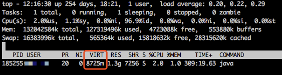
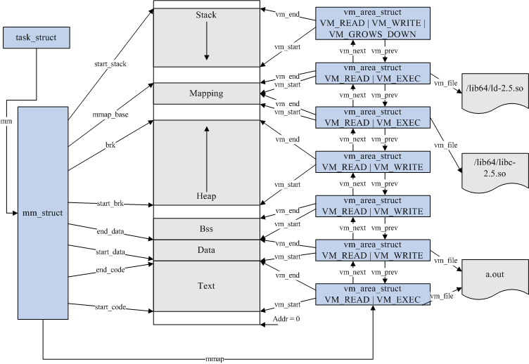
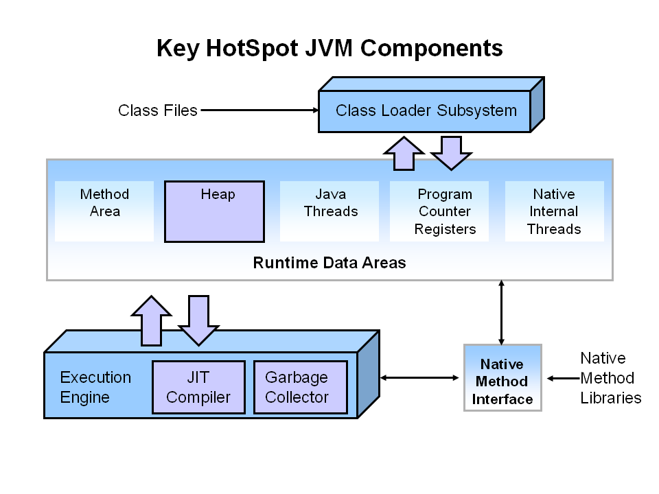
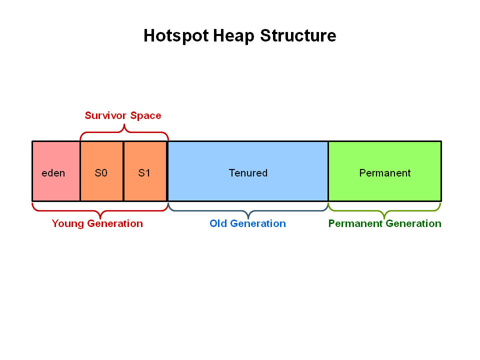
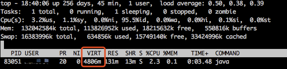

## 0. 问题

最近业务方反馈我们的一个 Java 写的 agent 内存占用过高：



业务方是通过 top 命令查看 VIRT 数值过高，但是通常来说我们都是采用 RES 衡量内存占用……

按照我们的理解，这个数值仅仅表示进程占用的虚拟地址空间，并不是实际的物理内存占用，但是具体到 Java 程序，其中的细节跟业务方又说不清楚。

所以本文的目的就是尽可能理清 Java 程序内存与操作系统内存管理之间的关系，看看有没有可能在不影响程序的情况下降低“虚拟内存地址”占用。

## 1. 基础知识

对于写 Java 程序的同学来说，本来就是为了“逃避”内存管理，所以对内存管理的知识了解不多。

对于操作系统层面的理解通常仅限于：



对于 Java 层面的理解通常仅限于：





这两层怎么对应？中间层做了哪些工作？都是完全不清楚的！

幸好 JDK8 提供了 [Native Memory Tracking](https://docs.oracle.com/javase/8/docs/technotes/guides/troubleshoot/tooldescr007.html)，所以我们选择自上而下地探索内存管理。

## 2. 使用 NMT 查看 Java 程序内存使用

JDK8 提供的 NMT 用于追踪 JVM 内存使用，也就是统计 malloc / mmap 的调用情况。

我们找了一台自己的机器测试，JVM 启动参数如下：

```
nohup $JAVA_HOME/bin/java -server \
-XX:+UseG1GC \
-XX:ConcGCThreads=1 \
-XX:ParallelGCThreads=4 \
-Xmx2g \
-Xms2g \
-XX:+ExplicitGCInvokesConcurrent \
-XX:MaxDirectMemorySize=256m \
-XX:MaxMetaspaceSize=64m \
-XX:NativeMemoryTracking=detail \
```

启动之后通过 jcmd 查看详细信息：

```
Total: reserved=3590817KB, committed=2295813KB
-                 Java Heap (reserved=2097152KB, committed=2097152KB)
                            (mmap: reserved=2097152KB, committed=2097152KB)

-                     Class (reserved=1061169KB, committed=13489KB)
                            (classes #2295)
                            (malloc=305KB #2057)
                            (mmap: reserved=1060864KB, committed=13184KB)

-                    Thread (reserved=42328KB, committed=42328KB)
                            (thread #42)
                            (stack: reserved=42148KB, committed=42148KB)
                            (malloc=132KB #212)
                            (arena=48KB #82)

-                      Code (reserved=250310KB, committed=7082KB)
                            (malloc=710KB #1820)
                            (mmap: reserved=249600KB, committed=6372KB)

-                        GC (reserved=125871KB, committed=125871KB)
                            (malloc=15279KB #12893)
                            (mmap: reserved=110592KB, committed=110592KB)

-                  Compiler (reserved=146KB, committed=146KB)
                            (malloc=15KB #77)
                            (arena=131KB #3)

-                  Internal (reserved=3896KB, committed=3896KB)
                            (malloc=3864KB #6264)
                            (mmap: reserved=32KB, committed=32KB)

-                    Symbol (reserved=3662KB, committed=3662KB)
                            (malloc=2471KB #15155)
                            (arena=1191KB #1)

-    Native Memory Tracking (reserved=767KB, committed=767KB)
                            (malloc=130KB #2060)
                            (tracking overhead=636KB)

-               Arena Chunk (reserved=1420KB, committed=1420KB)
                            (malloc=1420KB)

-                   Unknown (reserved=4096KB, committed=0KB)
                            (mmap: reserved=4096KB, committed=0KB)

Virtual memory map:

(调用栈信息太多，不复制)
```

Java Heap 的分配通过 mmap，而不是 malloc，也就说这块内存不受 glibc 管理。

NMT 的调用栈打印出了详细的虚拟内存地址，跟 /proc/[PID]/smaps 中的地址核对一下：

```
// NMT 中 Java Heap 分配的调用栈信息：

[0x0000000080000000 - 0x0000000100000000] reserved 2097152KB for Java Heap from
    [0x00007f7041a9c472] ReservedSpace::initialize(unsigned long, unsigned long, bool, char*, unsigned long, bool)+0xc2
    [0x00007f7041a9ce4e] ReservedHeapSpace::ReservedHeapSpace(unsigned long, unsigned long, bool, char*)+0x6e
    [0x00007f7041a6a3ab] Universe::reserve_heap(unsigned long, unsigned long)+0x8b
    [0x00007f70415829d0] G1CollectedHeap::initialize()+0x130

        [0x0000000080000000 - 0x0000000100000000] committed 2097152KB from
            [0x00007f70415a5a6f] G1PageBasedVirtualSpace::commit_internal(unsigned long, unsigned long)+0xbf
            [0x00007f70415a5cfc] G1PageBasedVirtualSpace::commit(unsigned long, unsigned long)+0x11c
            [0x00007f70415a8940] G1RegionsLargerThanCommitSizeMapper::commit_regions(unsigned int, unsigned long)+0x40
            [0x00007f704160ae27] HeapRegionManager::commit_regions(unsigned int, unsigned long)+0x77

[0x0000000100000000 - 0x0000000140000000] reserved 1048576KB for Class from
    [0x00007f7041a9c472] ReservedSpace::initialize(unsigned long, unsigned long, bool, char*, unsigned long, bool)+0xc2
    [0x00007f7041a9c6ab] ReservedSpace::ReservedSpace(unsigned long, unsigned long, bool, char*, unsigned long)+0x1b
    [0x00007f7041881860] Metaspace::allocate_metaspace_compressed_klass_ptrs(char*, unsigned char*)+0x40
    [0x00007f7041883d3f] Metaspace::global_initialize()+0x4cf

        [0x0000000100000000 - 0x00000001001a0000] committed 1664KB from
            [0x00007f7041a9bee9] VirtualSpace::expand_by(unsigned long, bool)+0x199
            [0x00007f704187fcc6] VirtualSpaceList::expand_node_by(VirtualSpaceNode*, unsigned long, unsigned long)+0x76
            [0x00007f7041882ae0] VirtualSpaceList::expand_by(unsigned long, unsigned long)+0xf0
            [0x00007f7041882c73] VirtualSpaceList::get_new_chunk(unsigned long, unsigned long, unsigned long)+0xb3
```

```
// /proc/[PID]/smaps 中对应的地址空间

80000000-1001a0000 rw-p 00000000 00:00 0
Size:            2098816 kB
Rss:              673288 kB
Pss:              673288 kB
Shared_Clean:          0 kB
Shared_Dirty:          0 kB
Private_Clean:         0 kB
Private_Dirty:    673288 kB
Referenced:       673288 kB
Anonymous:        673288 kB
AnonHugePages:    671744 kB
Swap:                  0 kB
KernelPageSize:        4 kB
MMUPageSize:           4 kB
VmFlags: rd wr mr mw me ac
1001a0000-140000000 ---p 00000000 00:00 0
Size:            1046912 kB
Rss:                   0 kB
Pss:                   0 kB
Shared_Clean:          0 kB
Shared_Dirty:          0 kB
Private_Clean:         0 kB
Private_Dirty:         0 kB
Referenced:            0 kB
Anonymous:             0 kB
AnonHugePages:         0 kB
Swap:                  0 kB
KernelPageSize:        4 kB
MMUPageSize:           4 kB
VmFlags: mr mw me nr
```

可以看出 Java Heap 与 Metaspace 紧挨着分配，两块一共占用了 3GB 的 Size（虚拟内存地址空间），而表征物理内存占用的 Rss 却只有 673288KB。也就是说，mmap 只是给进程分配一个线性区域（虚拟内存），并没有分配物理内存，只有当进程访问这块内存时，操作系统才会分配具体的内存页给进程，这就是 Linux 内存管理的延迟分配策略。

这时可能会联系到 -XX:+AlwaysPreTouch 这个启动参数，其所用就是按照内存页粒度访问一遍 Java Heap：

```
// hotspot/src/share/vm/runtime/os.cpp

void os::pretouch_memory(char* start, char* end) {
  for (volatile char *p = start; p < end; p += os::vm_page_size()) {
    *p = 0;
  }
}
```
对应到操作系统层面，就是为了抵消延迟分配策略，在进程启动时强制分配好 Java Heap 的物理内存，虽然增加了启动延时，但是可以减少进程运行时由于分配内存造成的延时。

**以上可以看出 Java Heap 区域在启动时可以强制占用 Xmx 设置的物理内存空间，但是并不会多余占用虚拟内存地址。**

但是 Metaspace 分配的虚拟内存地址已经超过 -XX:MaxMetaspaceSize 设置的上限了，而且还有 Class、Thread、Code、GC、Compiler、Internal、Symbol、Arena Chunk 等内存，实际上 Java 程序占用的物理内存是会超出 Xmx 等设置的上限的，而虚拟内存地址空间可能会超出更多。

我们可以算一下该进程当前除了 Java Heap 和 Metaspace 多占用了多少物理内存：
```
cat smaps.txt | grep Rss | cut -d: -f2 | tr -d " " | cut -f1 -dk | sort -n | awk '{ sum += $1 } END { print sum }'
775932
```

**总共占用物理内存 775932KB，这个数值与 top 命令查看的 RES 一致，减去 Java Heap 和 Metaspace 占用的物理内存 673288KB，额外占用了 102644KB，这包含代码、链接库、线程、GC数据结构、JIT编译器等占用的内存。**

**再算一下虚拟内存 6447068KB，这个数值与 top 命令查看的 VIRT 一致，而通过 NMT 统计的 reserved 只有 3590817KB，代码和链接库不应该额外占用这么多，其中的偏差应该在于 glibc malloc 管理的内存。（NMT 中的 arena 实际上也是通过 malloc 分配的内存）**

## 3. 查看 malloc 分配的地址空间

在查看 NMT 中 malloc 分配的地址空间之前，我们先复习一下内存分配的相关知识：

1. 操作系统层面提供了两个分配内存的函数 —— brk 和 mmap。brk 用于操作堆内存（进程的堆内存，而不是 Java Heap）；mmap 将文件或者其它对象映射进内存，JVM 就是直接调用该函数申请 Java Heap。

2. glibc 的 malloc 内存分配器处在用户进程和内核之间，也是通过这两个函数向内核申请内存，在此基础上还提供了动态内存管理的功能。为了保持高效的分配，分配器一般都会预先分配一块大于用户请求的内存，并通过某种算法管理这块内存；用户释放掉的内存也并不是立即就返回给操作系统，相反，分配器会管理这些被释放掉的空闲空间，以应对用户以后的内存分配请求。也就是说，分配器不但要管理已分配的内存块，还需要管理空闲的内存块，当响应用户分配要求时，分配器会首先在空闲空间中寻找一块合适的内存给用户，在空闲空间中找不到的情况下才分配一块新的内存。

回到 NMT 的信息，发现存在 42 个 Thread（包含了process reaper），这个数字比预想的大很多，由于线程栈默认为 1MB，所以这就占用了 (42 - 1) * (1024 + 4) = 42148KB。线程栈的大小可以通过 -Xss 参数控制，但这不会造成 VIRT 数值过高，还是得寻找 malloc 分配的虚拟内存地址空间。

很遗憾在 NMT 中关于 Thread 中的 malloc 操作虽然打印了调用堆栈，但是没有打印地址空间。

```
[0x00007f7041a4baa5] Thread::allocate(unsigned long, bool, MemoryType)+0x2f5
[0x00007f704170490f] JVM_StartThread+0x23f
[0x00007f702d017a94]
                             (malloc=32KB #11)
```

根据调用栈找到 hotspot 代码中的具体实现：

```
// hotspot/src/share/vm/memory/allocation.inline.hpp

// Explicit C-heap memory management

// allocate using malloc; will fail if no memory available
inline char* AllocateHeap(size_t size, MEMFLAGS flags,
    const NativeCallStack& stack,
    AllocFailType alloc_failmode = AllocFailStrategy::EXIT_OOM) {
  char* p = (char*) os::malloc(size, flags, stack);
  #ifdef ASSERT
  if (PrintMallocFree) trace_heap_malloc(size, "AllocateHeap", p);
  #endif
  if (p == NULL && alloc_failmode == AllocFailStrategy::EXIT_OOM) {
    vm_exit_out_of_memory(size, OOM_MALLOC_ERROR, "AllocateHeap");
  }
  return p;
}
```

实际上调用的就是 glibc 的 malloc 函数。

没有打印 malloc 分配的地址空间，那就只能硬着头皮挨个地址段对比了。。。 但是由于 Java 程序的地址空间太多，完全没有头绪，所以还是先写个简单的 C 程序模拟一下。

测试代码来自[《Understanding glibc malloc》](https://sploitfun.wordpress.com/2015/02/10/understanding-glibc-malloc/)

```
#include <stdio.h>
#include <stdlib.h>
#include <pthread.h>
#include <unistd.h>
#include <sys/types.h>

void* threadFunc(void* arg) {
        printf("Before malloc in thread 1\n");
        getchar();
        char* addr = (char*) malloc(1000);
        printf("After malloc and before free in thread 1\n");
        getchar();
        free(addr);
        printf("After free in thread 1\n");
        getchar();
}


int main() {
        pthread_t t1;
        void* s;
        int ret;
        char* addr;

        printf("Welcome to per thread arena example::%d\n",getpid());
        printf("Before malloc in main thread\n");
        getchar();
        addr = (char*) malloc(1000);
        printf("After malloc and before free in main thread\n");
        getchar();
        free(addr);
        printf("After free in main thread\n");
        getchar();
        ret = pthread_create(&t1, NULL, threadFunc, NULL);
        if(ret)
        {
                printf("Thread creation error\n");
                return -1;
        }
        ret = pthread_join(t1, &s);
        if(ret)
        {
                printf("Thread join error\n");
                return -1;
        }
        return 0;
}
```

当打印出 'After malloc and before free in thread 1' 之后，发现 /proc/[PID]/smaps 多了一些地址空间：

```
7fc460000000-7fc460021000 rw-p 00000000 00:00 0
Size:                132 kB
Rss:                   4 kB
Pss:                   4 kB
Shared_Clean:          0 kB
Shared_Dirty:          0 kB
Private_Clean:         0 kB
Private_Dirty:         4 kB
Referenced:            4 kB
Anonymous:             4 kB
AnonHugePages:         0 kB
Swap:                  0 kB
KernelPageSize:        4 kB
MMUPageSize:           4 kB
VmFlags: rd wr mr mw me nr
7fc460021000-7fc464000000 ---p 00000000 00:00 0
Size:              65404 kB
Rss:                   0 kB
Pss:                   0 kB
Shared_Clean:          0 kB
Shared_Dirty:          0 kB
Private_Clean:         0 kB
Private_Dirty:         0 kB
Referenced:            0 kB
Anonymous:             0 kB
AnonHugePages:         0 kB
Swap:                  0 kB
KernelPageSize:        4 kB
MMUPageSize:           4 kB
VmFlags: mr mw me nr


7fc467a45000-7fc468448000 rw-p 00000000 00:00 0
Size:              10252 kB
Rss:                  20 kB
Pss:                  20 kB
Shared_Clean:          0 kB
Shared_Dirty:          0 kB
Private_Clean:         0 kB
Private_Dirty:        20 kB
Referenced:           20 kB
Anonymous:            20 kB
AnonHugePages:         0 kB
Swap:                  0 kB
KernelPageSize:        4 kB
MMUPageSize:           4 kB
VmFlags: rd wr mr mw me ac
```

7fc467a45000-7fc468448000 是线程栈的空间，通过ulimit 查看 stack size  默认值为 10240，数值上是匹配的。

7fc460000000-7fc460021000 和 7fc460021000-7fc464000000 合起来的大小为 65536，这个与 glibc malloc 分配器中 arena 的默认大小匹配。（arena 是分配器对分配区的封装，这里只要理解为一个内存分配区域即可，也就是一段地址空间，其中具体细节详见——[《Glibc 内存管理剖析－－Ptmalloc2源码分析》](http://www.valleytalk.org/2015/02/17/glibc-%E5%86%85%E5%AD%98%E7%AE%A1%E7%90%86%E5%89%96%E6%9E%90%EF%BC%8D%EF%BC%8Dptmalloc2%E6%BA%90%E7%A0%81%E5%88%86%E6%9E%90/)）

```
HEAP_MAX_SIZE = (2 * DEFAULT_MMAP_THRESHOLD_MAX)

32-bit DEFAULT_MMAP_THRESHOLD_MAX = (512 * 1024)
64-bit DEFAULT_MMAP_THRESHOLD_MAX = (4 * 1024 * 1024 * sizeof(long))
```

也就是说在线程中调用 malloc 分配内存，默认会先分配 65536KB （HEAP_MAX_SIZE）大小的虚拟内存地址空间。

## 4. malloc 多线程优化的副作用

回过头来看 Java 程序的地址空间：

```
7f6ff4000000-7f6ff4021000 rw-p 00000000 00:00 0
Size:                132 kB
Rss:                   4 kB
Pss:                   4 kB
Shared_Clean:          0 kB
Shared_Dirty:          0 kB
Private_Clean:         0 kB
Private_Dirty:         4 kB
Referenced:            4 kB
Anonymous:             4 kB
AnonHugePages:         0 kB
Swap:                  0 kB
KernelPageSize:        4 kB
MMUPageSize:           4 kB
VmFlags: rd wr mr mw me nr
7f6ff4021000-7f6ff8000000 ---p 00000000 00:00 0
Size:              65404 kB
Rss:                   0 kB
Pss:                   0 kB
Shared_Clean:          0 kB
Shared_Dirty:          0 kB
Private_Clean:         0 kB
Private_Dirty:         0 kB
Referenced:            0 kB
Anonymous:             0 kB
AnonHugePages:         0 kB
Swap:                  0 kB
KernelPageSize:        4 kB
MMUPageSize:           4 kB
VmFlags: mr mw me nr
```

**也存在这样的 65536 KB 大小的地址空间，粗略统计一下有 41 个这样的 arena，仅仅这些 arena 就占了 2686976KB 的地址空间，难怪 VIRT 数值这么高，但是表征物理内存占用的 Rss 却是特别小，因为 Java 层面的对象都是管理在 Java Heap 中，而不是线程分配的这块区域。**

41 这个数字有点儿奇怪，跟线程数是匹配上，这不是巧合，测试机器的 glibc 版本为 2.12，其中 malloc 的具体实现是 Wolfram Gloger 的 ptmalloc2，其中对多线程内存分配进行了优化：由于多个线程会并发申请内存，如果只有一个 arena，那么并发请求需要加锁，就会影响性能，所以 ptmalloc2 对每个线程分配了单独的 arena。

但是由于线程可能太多，所以对 arena 的数量进行了限制，32位机器的默认值为CPU核数的两倍，64位机器的默认值为CPU核心数的8倍，对于24核的机器，最多可以分配 24 * 8 = 192 个 arean，那么某些线程比较多的程序，VIRT 这个指标会更高，而物理内存占用却正常。

除了 glibc 基于 CPU 核数的自动限制策略，环境变量 MALLOC_ARENA_MAX 可以手工限制最大的 arena 数量，设置过小可能会加剧并发内存分配的锁争用，但是采用默认值看起来又太大。感觉可以设置小一点儿，但是通常来说，虚拟地址过大也没有太明显的负面影响。

## 5. 降低虚拟内存地址占用

对于 agent 类的应用，尽可能少占用宿主机的资源还是有必要的，所以我们尝试控制一下虚拟内存地址占用，通过以上的分析，解决思路已经很明显了：

**1. 通过 MALLOC_ARENA_MAX 限制 arena 数量上限**
**2. 减少线程数量**

具体来说：

1. 设置 MALLOC_ARENA_MAX=2
2. 设置 -XX:CICompilerCount=2

由于GC线程数量与CPU核数成正比，所以我们已经通过 -XX:ConcGCThreads 和 -XX:ParallelGCThreads 限制了GC的线程数，但是看到 41 个线程也是超出了我们的预期，查了一下发现是JIT编译器线程过多，所以通过 -XX:CICompilerCount 限制一下。

修改业务方机器上的启动脚本：

```
export MALLOC_ARENA_MAX=2

nohup $JAVA_HOME/bin/java -server \
-XX:CICompilerCount=2 \
-XX:+UseG1GC \
-XX:ConcGCThreads=1 \
-XX:ParallelGCThreads=4 \
-Xmx3g \
-Xms3g \
-Xmn1g \
-XX:+ExplicitGCInvokesConcurrent \
-XX:MaxDirectMemorySize=256m \
-XX:MaxMetaspaceSize=64m \
```


当前 VIRT 值为 4806MB，相比之前的 8725MB，减少了 3919MB （45%），并且性能基本没有影响。
