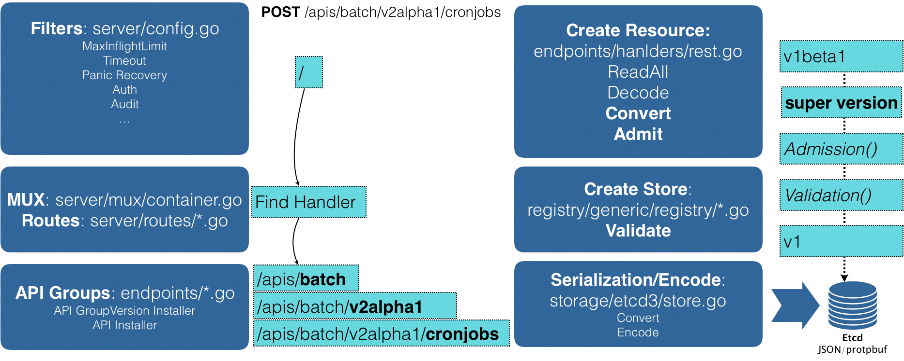
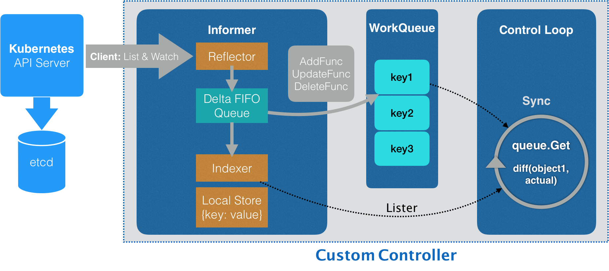

最近学习张磊的《深入剖析Kubernetes》，感觉 Kubernetes 编程范式确实优秀，这里总结一下。

## 1. 声明式 API

#### API 对象

从 Kubernetes 使用者的角度来看，使用 YAML 文件声明 API 对象，例如一个 cronjob 对象：

```yaml
apiVersion: batch/v1beta1
kind: CronJob
metadata:
  name: hello
spec:
  schedule: "*/1 * * * *"
  jobTemplate:
    spec:
      template:
        spec:
          containers:
          - name: hello
            image: busybox
            args:
            - /bin/sh
            - -c
            - date; echo Hello from the Kubernetes cluster
          restartPolicy: OnFailure
```

其中 `kind: CronJob` 表示 API 资源类型，`apiVersion: batch/v1beta1` 表示 API 组和 API 版本。(有些 API 资源使用默认分组，比如 Pod、Node)

#### 声明式

“声明式”这种方式相对于“命令式”而言。

首先体现在以 YAML 文件的形式声明 API 对象，而不是进行命令式命令行操作；然而仅仅以 YAML 文件声明还不够，每次替换一下就成了命令式配置文件操作。

“声明式”关键体现在一次能处理多个写操作，并且具备 Merge 能力。

#### 实现方式

以上的表述比较偏概念性，具体看一下声明式 API 的执行过程可能会清晰一些。

还是以上面的 cronjob 为例，yaml 文件提交给 apiserver 后的执行流程如下：



可见 apiserver 并没有执行“命令”，而只是将对象声明写入了 etcd（经过了各种处理后的）。

调谐（Reconcile）过程的逻辑在 controller 中，这就是大名鼎鼎的“控制器模式”，核心逻辑就是如下的“控制循环”：

```

for {
  实际状态 := 获取集群中对象X的实际状态（Actual State）
  期望状态 := 获取集群中对象X的期望状态（Desired State）
  if 实际状态 == 期望状态{
    什么都不做
  } else {
    执行编排动作，将实际状态调整为期望状态
  }
}
```

简而言之，k8s 通过 apiserver 声明对象的期望状态，你可以不断修改期望状态，但是在 apiserver 中不会执行编排动作，而仅仅是将期望的状态写入 etcd；真正执行编排动作的是 controller，通过控制循环不断进行调谐，直到期望状态与实际状态达成一致。

控制器的逻辑运行在 kube-controller-manager 中，实现代码在[kubernetes/tree/master/pkg/controller](https://github.com/kubernetes/kubernetes/tree/master/pkg/controller)中，控制循环的逻辑看似简单，但是实现的细节很多，要处理的情况很复杂。

## 2. API 扩展

#### 自定义资源

k8s 原生提供了很丰富的 API 资源类型，比如说 Deployment、StatefulSet、DaemonSet 等，每种应对不同的场景，但是总有一些场景是这些通用的类型无法完美支持的。

此时怎么办呢？需要扩展一个新的 API 资源类型。在这里 k8s 又提供了很便捷的插件机制：CRD（Custom Resource Definition）。

以课程中的 Network 为例：

```yaml
apiVersion: apiextensions.k8s.io/v1beta1
kind: CustomResourceDefinition
metadata:
  name: networks.samplecrd.k8s.io
spec:
  group: samplecrd.k8s.io
  version: v1
  names:
    kind: Network
    plural: networks
  scope: Namespaced
```

这个 CRD apply 给 apiserver 之后就能声明 Network 资源类型的 API 对象了，比如说声明一个 example-network：

```yaml
apiVersion: samplecrd.k8s.io/v1
kind: Network
metadata:
  name: example-network
spec:
  cidr: "192.168.0.0/16"
  gateway: "192.168.0.1"
```

此时通过 kubectl get networks 就能查询到声明的对象，但是没有对应的 controller，所以对集群没有任何的操作。

#### 自定义控制器

自定义控制器的代码可以分为两部分：事件处理模板代码和调谐代码。

**事件处理模板代码**



其中大部分代码都可以通过[kubernetes/code-generator](https://github.com/kubernetes/code-generator)生成。

**调谐代码**

调谐代码就是具体的编排动作了，知易行难，特别是看了[coreos/etcd-operator](https://github.com/coreos/etcd-operator)之后，要处理各种很微妙的场景，但是一旦完善了，就是云原生的完美状态了。

## 3. Operator

Operator 是管理“有状态应用”的一个解决方案。

听这个名字感觉比较高深，实际上 Operator 就是以 Deployment 类型部署的自定义控制器，在启动时自动声明待编排的自定义资源。

对于构建 Operator，现在有很多封装的很好的工具，比如[KubeBuilder](
https://github.com/kubernetes-sigs/kubebuilder) 和 [OperatorSDK](
https://github.com/operator-framework/operator-sdk)。


