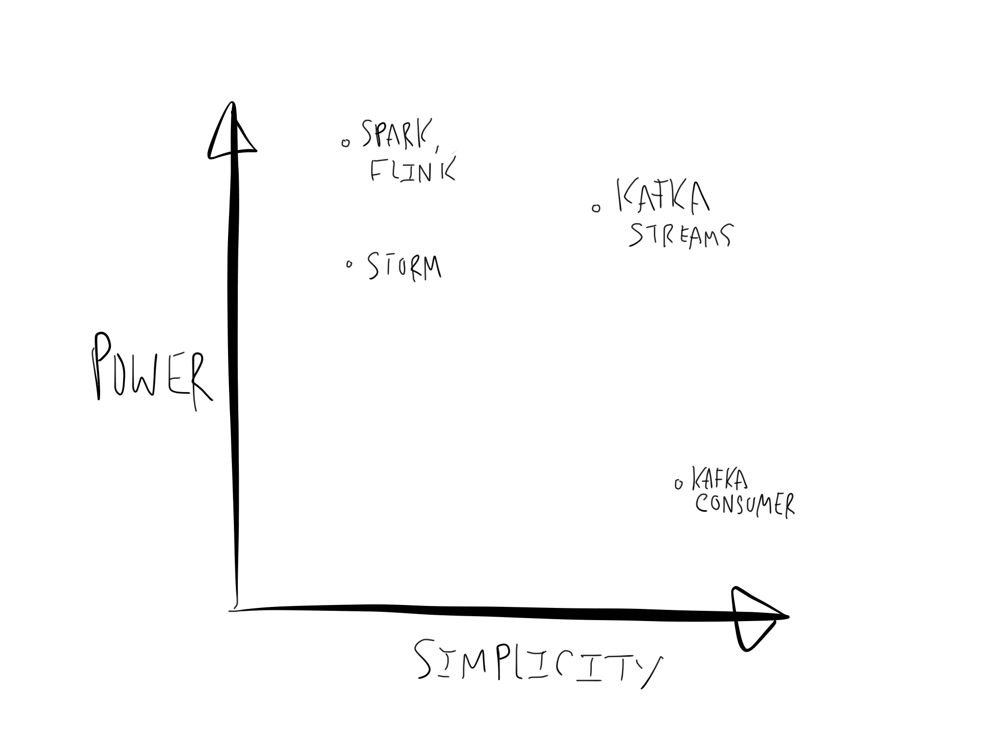
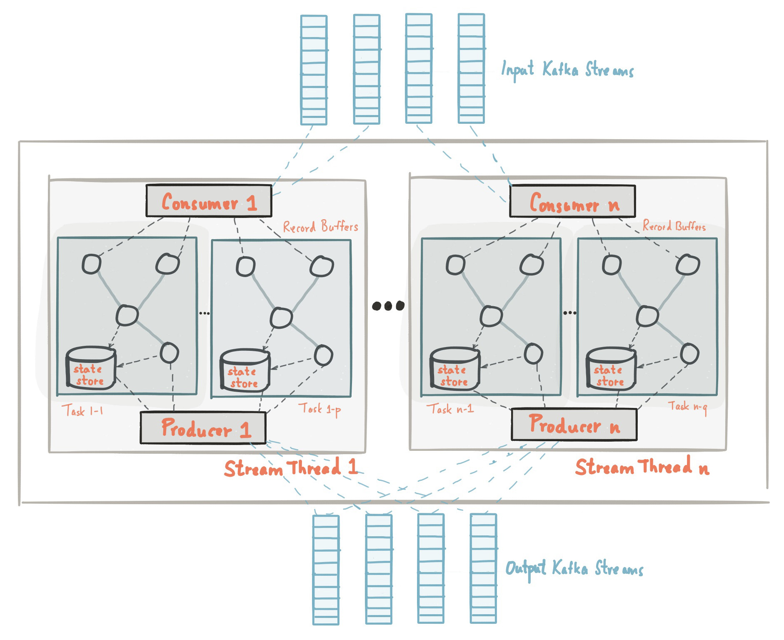

## 0. 是什么

Kafka Streams 是一个流式处理框架，功能类似于 storm、flink。



Jay Kreps 在自己撰写的[软文](https://www.confluent.io/blog/introducing-kafka-streams-stream-processing-made-simple/)中这样定位 Kafka Streams ，也就是简单而又强大的流式处理框架。

## 1. 架构

[Architecture](https://docs.confluent.io/4.1.1/streams/architecture.html)



Kafka Streams 并没有做资源管理功能（也就是 storm 中的 nimbus、superviosr），一个 task 包含消费数据的 consumer、发送处理结果的 producer、state store 和 processor topology。

我们关心的几个问题：

1. 并行处理能力。受制于 source topic 的 partition 数量
2. 反压。没有反压的必要，因为使用深度优先的处理策略，在一条消息开始处理之前，上一条消息会经过整个 topology
3. 容错。依赖 kafka：a. 丢掉的消息重新拉取；b. state store 同步到 kafka

## 2. 数据抽象

[Concepts](https://docs.confluent.io/current/streams/concepts.html)

### KStream

>A **KStream** is an abstraction of a **record stream**, where each data record represents a self-contained datum in the unbounded data set. 

简而言之，数据流

### KTable

>A **KTable** is an abstraction of a **changelog stream**, where each data record represents an update. More precisely, the value in a data record is interpreted as an “UPDATE” of the last value for the same record key, if any (if a corresponding key doesn’t exist yet, the update will be considered an INSERT)

简而言之，KV存储

单个 partition 粒度

### GlobalKTable

>Like a KTable, a **GlobalKTable** is an abstraction of a **changelog stream**, where each data record represents an update.
>A GlobalKTable differs from a KTable in the data that they are being populated with, i.e. which data from the underlying Kafka topic is being read into the respective table.

跟 KTable 一样，不同点在于 Global 是 topic 粒度

## 3. 执行框架

### TaskManager

topology 构建的代码很直观，最终传给 taskManager 的是 activeTaskCreator，`TaskManager` 负责实例化 topology processor，以及 task 的分配，默认情况下一个 partition 对应一个 task。

### StreamThread

topology 的执行流程封装在 StreamThread 中，默认情况下启动一个线程。

```java
// org/apache/kafka/streams/processor/internals/StreamThread.java#L767

    long runOnce(final long recordsProcessedBeforeCommit) {
        long processedBeforeCommit = recordsProcessedBeforeCommit;

        ConsumerRecords<byte[], byte[]> records;

        timerStartedMs = time.milliseconds();

        if (state == State.PARTITIONS_ASSIGNED) {
            // try to fetch some records with zero poll millis
            // to unblock the restoration as soon as possible
            records = pollRequests(0L);

            if (taskManager.updateNewAndRestoringTasks()) {
                setState(State.RUNNING);
            }
        } else {
            // try to fetch some records if necessary
            records = pollRequests(pollTimeMs);

            // if state changed after the poll call,
            // try to initialize the assigned tasks again
            if (state == State.PARTITIONS_ASSIGNED) {
                if (taskManager.updateNewAndRestoringTasks()) {
                    setState(State.RUNNING);
                }
            }
        }

        if (records != null && !records.isEmpty() && taskManager.hasActiveRunningTasks()) {
            streamsMetrics.pollTimeSensor.record(computeLatency(), timerStartedMs);
            addRecordsToTasks(records);
            final long totalProcessed = processAndMaybeCommit(recordsProcessedBeforeCommit);
            if (totalProcessed > 0) {
                final long processLatency = computeLatency();
                streamsMetrics.processTimeSensor.record(processLatency / (double) totalProcessed,
                                                        timerStartedMs);
                processedBeforeCommit = adjustRecordsProcessedBeforeCommit(recordsProcessedBeforeCommit,
                                                                           totalProcessed,
                                                                           processLatency,
                                                                           commitTimeMs);
            }
        }

        punctuate();
        maybeCommit(timerStartedMs);
        maybeUpdateStandbyTasks(timerStartedMs);
        return processedBeforeCommit;
    }
```

方法 `addRecordsToTasks `，将消息添加到对应 task 的处理队列

```java
// org/apache/kafka/streams/processor/internals/StreamThread.java#L890

    /**
     * Take records and add them to each respective task
     * @param records Records, can be null
     */
    private void addRecordsToTasks(final ConsumerRecords<byte[], byte[]> records) {
        if (records != null && !records.isEmpty()) {
            int numAddedRecords = 0;

            for (final TopicPartition partition : records.partitions()) {
                final StreamTask task = taskManager.activeTask(partition);
                numAddedRecords += task.addRecords(partition, records.records(partition));
            }
            streamsMetrics.skippedRecordsSensor.record(records.count() - numAddedRecords, timerStartedMs);
        }
    }
```

方法 `processAndMaybeCommit`，处理 taskManager 队列中的消息

```java
// org/apache/kafka/streams/processor/internals/StreamThread.java#L911

    private long processAndMaybeCommit(final long recordsProcessedBeforeCommit) {

        long processed;
        long totalProcessedSinceLastMaybeCommit = 0;
        // Round-robin scheduling by taking one record from each task repeatedly
        // until no task has any records left
        do {
            processed = taskManager.process();
            if (processed > 0) {
                streamsMetrics.processTimeSensor.record(computeLatency() / (double) processed, timerStartedMs);
            }
            totalProcessedSinceLastMaybeCommit += processed;

            punctuate();

            if (recordsProcessedBeforeCommit != UNLIMITED_RECORDS &&
                totalProcessedSinceLastMaybeCommit >= recordsProcessedBeforeCommit) {
                totalProcessedSinceLastMaybeCommit = 0;
                maybeCommit(timerStartedMs);
            }
            // commit any tasks that have requested a commit
            final int committed = taskManager.maybeCommitActiveTasks();
            if (committed > 0) {
                streamsMetrics.commitTimeSensor.record(computeLatency() / (double) committed, timerStartedMs);
            }
        } while (processed != 0);

        return totalProcessedSinceLastMaybeCommit;
    }
```

方法 `punctuate` 用于实现聚合消息，这里就不深究了。

## 4. repartition

在执行 [WordCount](https://kafka.apache.org/11/documentation/streams/tutorial) 这个例子时，可以发现多了两个 topic

1. streams-wordcount-counts-store-changelog
2. streams-wordcount-counts-store-repartition

changelog 这个很明显是 state store 的日志信息；repartition 理解起来稍微麻烦一点儿。

回到 WordCount 这个例子，设想 streams-plaintext-input 的 partition 数量大于1，而 counts-store 这个本地状态又是 partition 独立的，那么是不是最后 count 出来的数值也是各个 partition 单独统计的呢？

如果没有 repartition 确实是这样，但是这就违反了 groupBy 的语义，所以在 count 的时候实际上又生成了一个 sub-topology，也就是按照新的 key 又 repartition 了一次。

```java
// org/apache/kafka/streams/kstream/internals/KStreamImpl.java#L661

    static <K1, V1> String createReparitionedSource(final InternalStreamsBuilder builder,
                                                    final Serde<K1> keySerde,
                                                    final Serde<V1> valSerde,
                                                    final String topicNamePrefix,
                                                    final String name) {
        Serializer<K1> keySerializer = keySerde != null ? keySerde.serializer() : null;
        Serializer<V1> valSerializer = valSerde != null ? valSerde.serializer() : null;
        Deserializer<K1> keyDeserializer = keySerde != null ? keySerde.deserializer() : null;
        Deserializer<V1> valDeserializer = valSerde != null ? valSerde.deserializer() : null;
        String baseName = topicNamePrefix != null ? topicNamePrefix : name;

        String repartitionTopic = baseName + REPARTITION_TOPIC_SUFFIX;
        String sinkName = builder.newProcessorName(SINK_NAME);
        String filterName = builder.newProcessorName(FILTER_NAME);
        String sourceName = builder.newProcessorName(SOURCE_NAME);

        builder.internalTopologyBuilder.addInternalTopic(repartitionTopic);
        builder.internalTopologyBuilder.addProcessor(filterName, new KStreamFilter<>(new Predicate<K1, V1>() {
            @Override
            public boolean test(final K1 key, final V1 value) {
                return key != null;
            }
        }, false), name);

        builder.internalTopologyBuilder.addSink(sinkName, repartitionTopic, keySerializer, valSerializer,
            null, filterName);
        builder.internalTopologyBuilder.addSource(null, sourceName, new FailOnInvalidTimestamp(),
            keyDeserializer, valDeserializer, repartitionTopic);

        return sourceName;
    }

```


***


**如果觉得我的文章对您有用，请随意打赏。**
