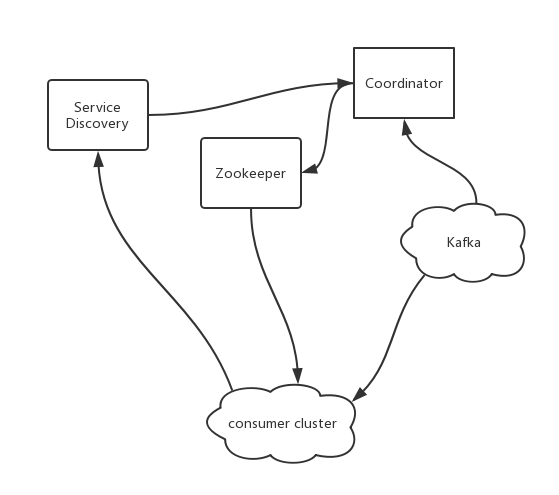
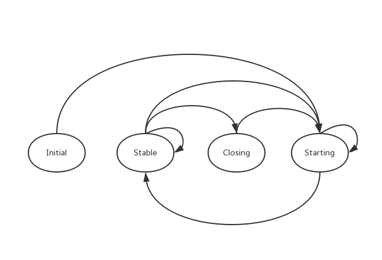

## 0. 整体架构

由于官方 KafkaConsumer 的消费分配不太可控，所以最近在想另一种实现思路，核心的想法跟新版的 KafkaConsumer 类似，也是依赖一个中心化的 Coordinator 协调。

1. 假设现有一套比较成熟的服务化基础设施，Service Discovery 负责消费者集群的管理；
2. Zookeeper 用于存储和通知 Partition 消费分配结果，消费者根据 zk 的信息独立操作；
3. Coordinator 通过服务发现获取消费者主机列表，通过 Zookeeper 获取 TopicPartition 列表，然后做出消费分配，协调 rebalance 过程。

## 1. consumer

ZK 路径：`/consumers/[CLUSTER]/assignments/[TOPIC]/[PARTITION]`，存储消费分配的结果：
1. [CLUSTER] 表示集群名；
2. [TOPIC] 表示该集群需要消费的 topic，节点数据是 {"bootstrap.servers": "xxx:9092", "group.id": "xxx", "assignments": {"45":"xxx"}}，也就是官方 KafkaConsumer 的配置以及消费分配结果。

消费者的逻辑非常简单，而且是独立操作：
1. 服务注册
2. 监听和定时检查 `/consumers/[CLUSTER]/assignments/` 子节点变更

**发现新增 topic**
创建对应的 TopicConsumer 并执行，在 TopicConsumer 中，监听和定时检查 `/consumers/[CLUSTER]/assignments/[TOPIC]` 内容变化。

1. 获取 [TOPIC] 中的数据，过滤出需要消费的 partition 列表；
2. 跟当前消费的 partition 列表对比，得出需要移除的 partition 列表 needRemovePartitionList 和需要添加的 partition 列表 needAddPartitionList；
3. 遍历 needRemovePartitionList，停止消费，并且提交 offset；
4. 遍历 needAddPartitionList，启动消费。

异常处理：
1. 上述第1步，如果 ZK 访问异常，那么放弃本次操作，还是按照本地的情况继续消费。

**极端情况服务状态：**
1. 如果 ZK 无法访问，按照当前的分配结果继续消费；
2. 如果正好在 rebalance 过程中 ZK 无法访问，某些消费者已经关闭，但是对应的消费者没有启动，此时只能保证部分 partition 继续消费，**需要等待 ZK 恢复**。

**说到这里你可能有个疑问，这样无法保证 rebalance 过程中不发生重复消费！是这样的，这里选择的解决方案不是旧版 KafkaConsumer 中的 owners 节点，而是依靠 Coordinator 协调。**

## 2. Coordinator

ZK 路径：`/consumers/[CLUSTER]/state/[TOPIC]`，存储消费分配的状态和数据：
1. [CLUSTER] 表示集群名；
2. [TOPIC] 表示该集群需要消费的 topic，节点数据是 {"state": "Closing", "toStart": {"xxx", [1,3]}, "toClose": {"ooo":[1,3]}}，也就是分配的状态和启停的 partition 列表。

启动时从 `/consumers/[CLUSTER]/state/[TOPIC]` 中恢复状态，默认状态为 Initial。

1. 处于 Initial 状态
    1. 拉取 `assignments/[TOPIC]/[PARTITION]` 的 partition 列表；
    2. 通过 Service Discovery 获取当前在线的消费者列表；
    3. 然后执行**分配逻辑**，分配结果写入 `assignments`，状态写入 `state`，转为 Starting；
2. 处于 Starting 状态
    1. 通过 Service Discovery 获取当前在线的消费者列表；
    2. 遍历消费者列表，直接调用消费者的接口，获取当前的消费状态；
    3. 对比结果，如果 toStart 中的 partition 都启动了，那么转为 Stable 状态；
    4. 如果没有，等待再检查，如果存在消费者被 **隔离** ，那么将相关的 partition 重新分配，状态还是 Starting；
3. 处于 Stable 状态
    1. 拉取 `assignments/[TOPIC]/[PARTITION]` 的 partition 列表；
    2. 通过 Service Discovery 获取当前在线的消费者列表；
    3. 检查是否有上下线的消费者和未分配的 partition；
    4. 如果没有，还是处于 Stable 状态；
    5. 如果有，重新执行**分配逻辑**；
        1. 如果分配结果中有 toClose 的 partition，那么转入 Closing 状态；
        2. 如果没有需要关闭的，只有 toStart 的 partition，那么转入 Starting 状态；
4. 处于 Closing 状态
    1. 通过 Service Discovery 获取当前在线的消费者列表；
    2. 遍历消费者列表，直接调用消费者的接口，获取当前的消费状态；
    3. 对比结果，如果 toClose 中的 partition 都关闭了，那么转为 Starting 状态；
    4. 如果没有，等待再检查，如果消费者被**隔离**了，那么也表示关闭成功了，转为 Starting 状态。

异常情况：
1. 如果 zookeeper 无法访问，维持现状；
2. 如果 Service Discovery 无法访问，维持现状；
3. 如果存在消费者无法访问，那么重复检查，不要主动**隔离**，依赖服务化基础设施治理；
4. 长期处于非 Stable 状态，需要人工干预，主动**隔离**异常的消费者，但是通常来说服务化基础设施会主动检测隔离异常的服务。
