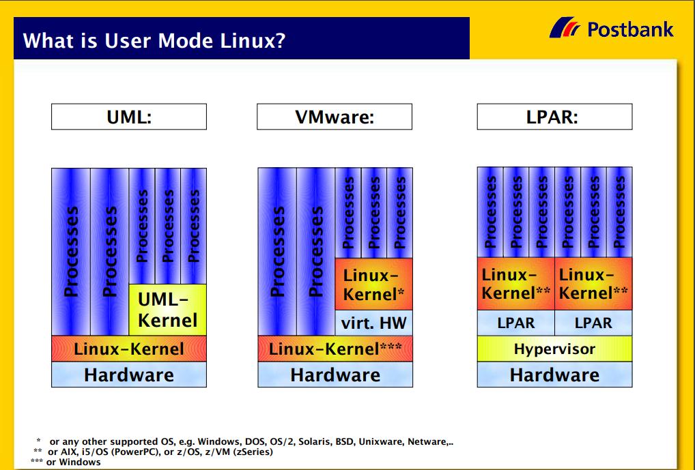

之前使用 QEMU debug Linux kernel 来学习内核，稍微麻烦一些但是挺好用，最近又学到了一个更方便的方式——User-mode Linux。


## 1. User-mode Linux 是什么？

顾名思义就是用户态的Linux，跟QEMU这类虚拟机对比一下就比较清楚了。



更多细节详见 [Virtual Labs with User Mode Linux](https://papers.harvie.cz/unsorted/Virtual-UML-Lab-Presentation.pdf)。


可想而知UML存在的主要价值就是测试，例如 [KUnit](https://www.kernel.org/doc/html/latest/dev-tools/kunit/)、[Android Network Tests](https://source.android.com/docs/core/architecture/kernel/network_tests)等。


## 2. 编译 UML

从 [kernel.org]() 下载当前的 longterm 版本 6.1.65

```shell
make defconfig ARCH=um SUBARCH=x86_64
make linux ARCH=um SUBARCH=x86_64 -j `nproc`
```

指定编译的架构是 um，也就是 User-mode（由此可见UML也是有限制的，如果要debug的逻辑是特定架构的，那还得用QEMU）。

最终会编译成 linux 可执行文件：

```shell
❯ ./linux --help
User Mode Linux v6.1.65
	available at http://user-mode-linux.sourceforge.net/

--showconfig
    Prints the config file that this UML binary was generated from.

......

hostfs=<root dir>,<flags>,...
    This is used to set hostfs parameters.  The root directory argument
    is used to confine all hostfs mounts to within the specified directory
    tree on the host.  If this isn't specified, then a user inside UML can
    mount anything on the host that's accessible to the user that's running
    it.
    The only flag currently supported is 'append', which specifies that all
    files opened by hostfs will be opened in append mode.

```


## 3. 建立 rootfs

建立 rootfs 的方式很多，这里用 [Alpine Linux](https://alpinelinux.org/) 建立 rootfs。

```shell
mkdir -p rootfs
curl https://dl-cdn.alpinelinux.org/alpine/v3.18/main/x86_64/apk-tools-static-2.14.0-r2.apk | fakeroot tar -xz -C rootfs
```

下载APK工具到 rootfs 目录。

```shell
fakeroot rootfs/sbin/apk.static \
    --repository https://dl-cdn.alpinelinux.org/alpine/v3.18/main --update-cache \
    --allow-untrusted \
    --root $PWD/rootfs --initdb add alpine-base
echo https://dl-cdn.alpinelinux.org/alpine/v3.18/main > rootfs/etc/apk/repositories
echo "LABEL=ALPINE_ROOT / auto defaults 1 1" >> rootfs/etc/fstab
```

建立rootfs。


## 4. 启动UML

编写启动脚本 UML.sh

```shell
#!/bin/sh
./linux ubd0=/dev/null umid=uml0 \
        root=/dev/root rootfstype=hostfs hostfs=./rootfs \
        rw mem=64M init=/bin/sh quiet
stty sane ; echo
```

执行该脚本，瞬间就启动了一个linux，真的是瞬间。

首次启动初始化一下 busybox，挂载一下目录：

```shell
~ # /bin/busybox --install
~ # mount -t proc none /proc
```

查看当前的系统信息：

```shell
~ # cat /proc/cpuinfo 
processor	: 0
vendor_id	: User Mode Linux
model name	: UML
mode		: skas
host		: Linux yuan-T14p 6.2.0-37-generic #38~22.04.1-Ubuntu SMP PREEMPT_DYNAMIC Thu Nov  2 18:01:13 UTC 2 x86_64
fpu		: yes
flags		: fpu vme de pse tsc msr pae mce cx8 apic sep mtrr pge mca cmov pat pse36 pn clflush dts acpi mmx fxsr sse sse2 ss ht tm pbe syscall mp nx pdpe1gb rdtscp lm 3dnow constant_tsc art arch_perfmon pebs bts rep_good nopl xtopology nonstop_tsc cpuid aperfmperf tsc_known_freq pni pclmulqdq dtes64 monitor ds_cpl vmx smx est tm2 ssse3 cid sdbg fma cx16 xtpr pdcm pcid sse4_1 sse4_2 x2apic movbe popcnt tsc_deadline_timer aes xsave avx f16c rdrand lahf_lm abm 3dnowprefetch cpuid_fault epb pti ssbd ibrs ibpb stibp ibrs_enhanced tpr_shadow vnmi flexpriority ept vpid ept_ad fsgsbase tsc_adjust bmi1 avx2 smep bmi2 erms invpcid rdseed adx smap clflushopt clwb intel_pt sha_ni xsaveopt xsavec xgetbv1 xsaves avx_vnni brs dtherm ida arat pln pts hwp hwp_notify hwp_act_window hwp_epp hwp_pkg_req hfi umip pku ospke waitpkg gfni vaes vpclmulqdq tme rdpid movdiri movdir64b fsrm md_clear serialize pconfig arch_lbr ibt flush_l1d arch_capabilities sme
cache_alignment	: 64
bogomips	: 10738.07

```

确实不是当前host的了。


## 5. 设置 init.sh

下载 tini 工具：

```shell
wget -O rootfs/sbin/tini https://github.com/krallin/tini/releases/download/v0.19.0/tini-static
chmod +x rootfs/sbin/tini
```


编写 rootfs/init.sh

```shell
#!/bin/sh

mount -t proc proc /proc
mount -t sysfs sys /sys

ip link set eth0 up
ip address add 192.168.100.101/24 dev eth0

export PS1='\[\033[01;32mUML:\w\033[00m \$ '
exec /sbin/tini /bin/sh +m
```


修改 UML.sh

```shell
#!/bin/sh
./linux ubd0=/dev/null umid=uml0 hostname=uml1 eth0=tuntap,tap0 \
        root=/dev/root rootfstype=hostfs hostfs=./rootfs \
        rw mem=64M init=/init.sh quiet
stty sane ; echo
```


## 6. 配置 GDB

6.1.65这个版本有点儿问题，首先得改一下 scripts/gdb/linux/constants.py.in

```
/* linux/fs.h */
- LX_VALUE(SB_RDONLY)
- LX_VALUE(SB_SYNCHRONOUS)
- LX_VALUE(SB_MANDLOCK)
- LX_VALUE(SB_DIRSYNC)
- LX_VALUE(SB_NOATIME)
- LX_VALUE(SB_NODIRATIME)
+ LX_GDBPARSED(SB_RDONLY)
+ LX_GDBPARSED(SB_SYNCHRONOUS)
+ LX_GDBPARSED(SB_MANDLOCK)
+ LX_GDBPARSED(SB_DIRSYNC)
+ LX_GDBPARSED(SB_NOATIME)
+ LX_GDBPARSED(SB_NODIRATIME)

```


然后执行

```shell
echo "CONFIG_GDB_SCRIPTS=y" > .config-fragment
ARCH=um scripts/kconfig/merge_config.sh .config .config-fragment
make ARCH=um scripts_gdb
```


验一下

```shell
❯ gdb -ex "add-auto-load-safe-path scripts/gdb/vmlinux-gdb.py" \
      -ex "file vmlinux" \
      -ex "lx-version" -q
Reading symbols from vmlinux...
Linux version 6.1.65 (yuan@yuan-T14p) (gcc (Ubuntu 11.4.0-1ubuntu1~22.04) 11.4.0, GNU ld (GNU Binutils for Ubuntu) 2.38) #1 Wed Dec  6 21:00:15 CST 2023
(gdb) 

```


编写 gdbinit

```shell
python gdb.COMPLETE_EXPRESSION = gdb.COMPLETE_SYMBOL
add-auto-load-safe-path scripts/gdb/vmlinux-gdb.py
file vmlinux
lx-version
set args ubd0=/dev/null umid=uml0 hostname=uml1 eth0=tuntap,tap0 root=/dev/root rootfstype=hostfs rootflags=${FULLPATH}/rootfs rw mem=64M init=/init.sh quiet
handle SIGSEGV nostop noprint
handle SIGUSR1 nopass stop print
```

（替换其中的 FULLPATH）


在GDB内启动UML：

```shell
gdb -q -x gdbinit
(gdb) run
```


加个断点试一下：

```shell
UML:~ # 
        Thread 1 "vmlinux" received signal SIGUSR1, User defined signal 1.
                                                                          0x00007ffff7c427dc in __GI___sigsuspend (set=set@entry=0x604c7db0) at ../sysdeps/unix/sysv/linux/sigsuspend.c:26
26	../sysdeps/unix/sysv/linux/sigsuspend.c: No such file or directory.
(gdb) b cmdline_proc_show
Breakpoint 1 at 0x6014c793: file fs/proc/cmdline.c, line 8.
(gdb) c
Continuing.

UML:~ # cat /proc/cmdline

Thread 1 "vmlinux" hit Breakpoint 1, cmdline_proc_show (m=0x60a6a690, v=0x1) at fs/proc/cmdline.c:8
8	{
(gdb) bt
#0  cmdline_proc_show (m=0x60a6a690, v=0x1) at fs/proc/cmdline.c:8
#1  0x000000006010f41e in seq_read_iter (iocb=0x6489fc40, iter=0x6489fc18) at fs/seq_file.c:230
#2  0x0000000060144a37 in proc_reg_read_iter (iocb=<optimized out>, iter=<optimized out>) at fs/proc/inode.c:305
#3  0x00000000601163af in call_read_iter (file=0x60808100, file=0x60808100, iter=0x6489fc18, kio=0x6489fc40)
    at ./include/linux/fs.h:2242
#4  generic_file_splice_read (in=0x60808100, ppos=0x6489fd28, pipe=0x60a5a240, len=<optimized out>, flags=<optimized out>)
    at fs/splice.c:309
#5  0x000000006011623d in do_splice_to (in=in@entry=0x60808100, ppos=ppos@entry=0x6489fd28, pipe=pipe@entry=0x60a5a240, len=65536, 
    len@entry=16777216, flags=flags@entry=0) at fs/splice.c:793
#6  0x0000000060116d5b in splice_direct_to_actor (in=in@entry=0x60808100, sd=sd@entry=0x6489fd78, 
    actor=actor@entry=0x60115ece <direct_splice_actor>) at fs/splice.c:865
#7  0x0000000060116eb8 in do_splice_direct (in=in@entry=0x60808100, ppos=ppos@entry=0x6489fdf8, out=out@entry=0x60808b00, 
    opos=opos@entry=0x6489fe00, len=len@entry=16777216, flags=flags@entry=0) at fs/splice.c:974
#8  0x00000000600e9a4e in do_sendfile (out_fd=<optimized out>, in_fd=<optimized out>, ppos=ppos@entry=0x0, count=16777216, 
    max=2147483647, max@entry=0) at fs/read_write.c:1255
#9  0x00000000600ea90f in __do_sys_sendfile64 (count=<optimized out>, offset=<optimized out>, in_fd=<optimized out>, 
    out_fd=<optimized out>) at fs/read_write.c:1323
#10 __se_sys_sendfile64 (out_fd=<optimized out>, in_fd=<optimized out>, offset=<optimized out>, count=<optimized out>)
    at fs/read_write.c:1309
#11 0x00000000600231ee in handle_syscall (r=r@entry=0x60a5ebc0) at arch/um/kernel/skas/syscall.c:45
#12 0x0000000060035cc3 in handle_trap (local_using_sysemu=2, regs=0x60a5ebc0, pid=75674) at arch/um/os-Linux/skas/process.c:224
#13 userspace (regs=0x60a5ebc0, aux_fp_regs=0x6489c020) at arch/um/os-Linux/skas/process.c:480
#14 0x000000006001ff37 in fork_handler () at arch/um/kernel/process.c:154
#15 0x0000000000000000 in ?? ()
Backtrace stopped: Cannot access memory at address 0x648a0000
(gdb) 

```


