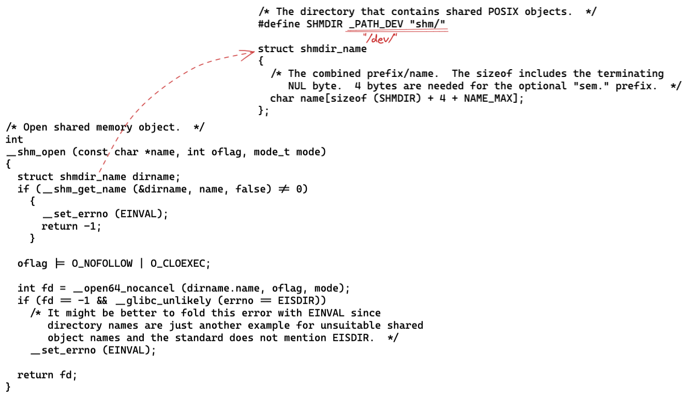
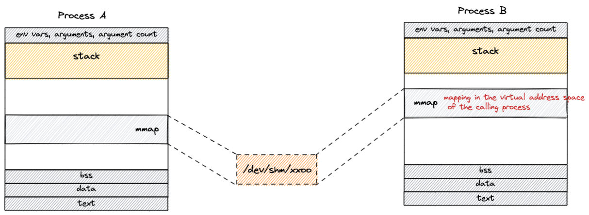
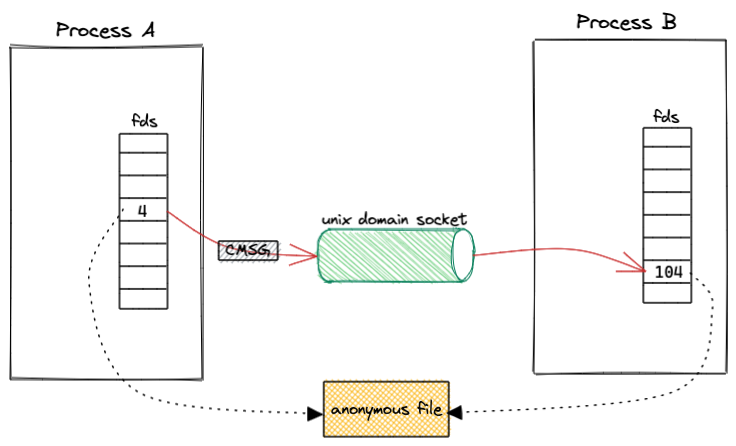

关于 Linux 共享内存，写得最好的应该是宋宝华的 [《世上最好的共享内存》](https://cloud.tencent.com/developer/article/1551288)一文。

本文可以说是对这篇文章的学习笔记，顺手练习了一下 rust libc —— [shichaoyuan/learn_rust/linux-shmipc-demo](https://github.com/shichaoyuan/learn_rust/tree/main/linux-shmipc-demo)

按照宋宝华的总结，当前有四种主流的共享内存方式：
>1. 基于传统 SYS V 的共享内存；
>2. 基于 POSIX mmap 文件映射实现共享内存；
>3. 通过 memfd_create() 和 fd 跨进程共享实现共享内存；
>4. 多媒体、图形领域广泛使用的基于 dma-buf 的共享内存。

前两种方式比较符合传统的用法，共享内存做为进程间通信的媒介。
第三种方式更像是通过传递内存“句柄”进行数据传输。
第四种方式是为设备间传递数据设计，避免内存拷贝，直接传递内存“句柄”。

这里尝试了一下第二种和第三种方式。

## 1. POSIX mmap

这套 API 应该是最普遍的 —— shm_open + mmap，本质上来说 [Aeron](https://github.com/real-logic/aeron) 也是用的这种方式（关于 Aeron 可以参考[我之前的文章](https://www.jianshu.com/p/abb8286a5b3c)）。

看一下 glibc 中 shm_open 函数的实现就一清二楚了：

shm_open 函数就是在 /dev/shm 目录下建文件，该目录挂载为 tmpfs，至于 tmpfs 可以简单理解为存储介质是内存的一种文件系统，更准确的理解可以参考官方文档 [tmpfs.txt](https://www.kernel.org/doc/Documentation/filesystems/tmpfs.txt)。

然后通过 mmap 函数将 tmpfs 文件映射到用户空间就可以随意操作了。

**优点：**
这种方式最大的优势在于共享的内存是有“实体”（也就是 tmpfs 中的文件）的，所以多个进程可以很容易通过文件名这个信息构建共享内存结构，特别适合把共享内存做为通信媒介的场景（例如 [Aeron](https://github.com/real-logic/aeron)）。

**缺点：**
如果非要找一个缺点的话，可能是，文件本身独立于进程的生命周期，在使用完毕后需要注意删除文件（仅仅 close 是不行的），否则会一直占用内存资源。

## 2. memfd_create

memfd_create 函数的作用是创建一个匿名的文件，返回对应的 fd，这个文件当然不普通，它存活在内存中。更准确的理解可以参考官方文档 [memfd_create(2)](https://man7.org/linux/man-pages/man2/memfd_create.2.html)。

直观理解，memfd_create 与 shm_open 的作用是一样的，都是创建共享内存实体，只是 memfd_create 创建的实体是匿名的，这就带了一个问题：如何让其它进程获取到匿名的实体？shm_open 方式有具体的文件名，所以可以通过打开文件的方式获取，那么对于匿名的文件怎么处理呢？

答案是：通过 Unix Domain Socket 传递 fd。

**rust 的 UDS 实现：**
rust 在 std 中已经提供了 UDS 的实现，但是关于传递 fd 的 [send_vectored_with_ancillary](https://doc.rust-lang.org/stable/std/os/unix/net/struct.UnixStream.html#method.send_vectored_with_ancillary) 函数还属于 nightly-only experimental API 阶段。所以这里使用了一个三方 crate —— [sendfd](https://crates.io/crates/sendfd)，坦白说可以自己实现一下，使用 libc 构建好 SCM_RIGHTS 数据，sendmsg 出去即可，不过细节还是挺多，我这里就放弃了。

这套 API 设计更灵活，直接拓展了我的思路，本来还是受限于  [Aeron](https://github.com/real-logic/aeron) 的用法，如果在这套 API 的加持下，是否可以通过传递数据包内存块（fd）真正实现零拷贝呢？

**优点：**
灵活。

**缺点：**
无
