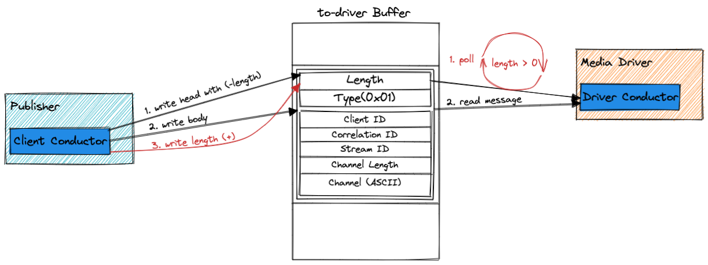
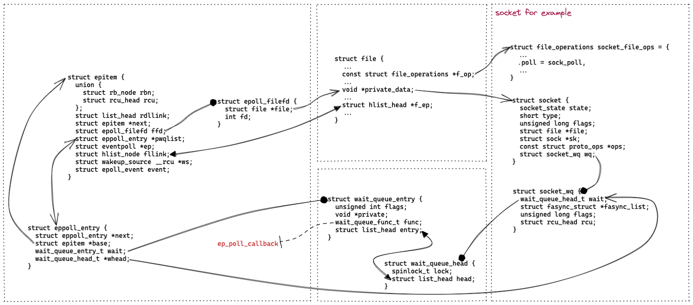
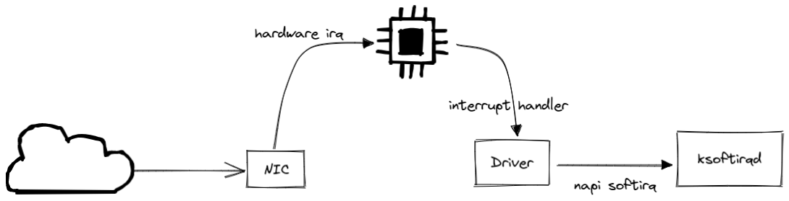
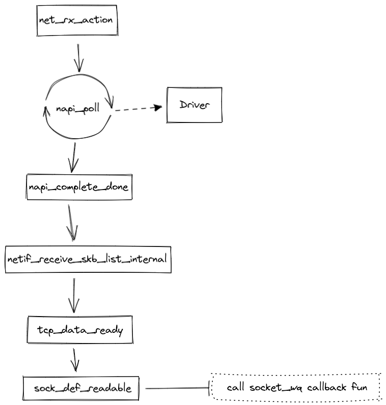
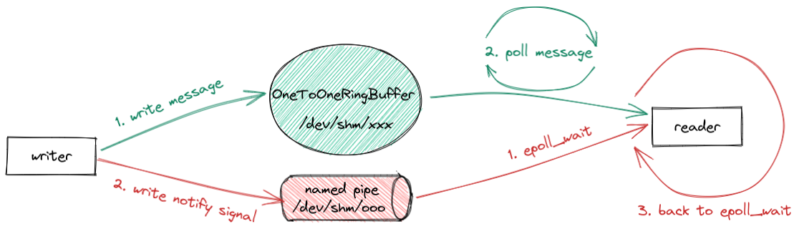

最近基于 Aeron 实现了一下 Service Mesh Sidecar 的本地通信，但是在 IdleStrategy 上犯了难，无论怎么选都感觉不合适，这几天跟大数据部门写 C++ 的同学聊了一下，一句话帮我解开了难题，不得不感慨一下：虽然一直不认为自己是一个 CURD boy，但是看起来也没有高明多少（尴尬......）。

这篇文章简单总结了一下我遇到的问题，简而言之，就是在 Aeron 共享内存通信的场景下，如何告诉对端进程有新消息可读了，而不是让对端进程一直在轮询检查。

## 0. 

首先解释一下，何为共享内存通信中的通知机制？

以 [Aeron](https://github.com/real-logic/aeron) 的 Conductor 通信为例：

（如果你不了解 Aeron 也没关系，重点关注读取数据那部分，想要详细了解可以参考我[之前的文章](https://www.jianshu.com/p/abb8286a5b3c)。）

Aeron 实现了一个很优秀的无锁轮询算法：
1. 「写入者」先在 length 字段写入一个负值，然后写入消息体，最后再更新 length 字段；
2. 「读取者」轮询 length 字段，如果是正值，那就表示有待读取的消息。

Aeron 是通过控制 length 字段，结合轮询机制，实现了通知机制。

简而言之，本文要探讨的通知机制就是：「写入者」如何告诉「读取者」有新的数据可读。

这是个比较细节的问题，对于一个 Java 开发来说，你可能根本就不会认为这是个问题，比如说网络通信，我们用 Netty 就好，追问一句 Netty 的 reactor 模型是如何实现的？答：基于 epoll 的事件通知。至于通知事件是如何产生的，这可能就没人关心了，因为这是内核里的逻辑了。

当然，我们用共享内存机制就是想跳出内核，实现一个轻量的高性能的通信方式，所以也不会亦步亦趋的照搬内核的逻辑，但是掌握 epoll 的通知机制非常有助于理解通知机制中的 tradeoff。

## 1. epoll 通知机制

epoll 是一个非常优秀的事件通知机制。

总体来看，调用 `epoll_wait` 时，如果有就绪的 fds，那么直接返回；如果没有，那么主动让出 CPU，阻塞等待。等到有 fd 就绪的时候，会回调等待队列中注册的 `ep_poll_callback` 函数，更新就绪列表，然后唤醒线程，返回结果。

优秀！如果持续有就绪事件，以轮询的模式运行，不需要切换线程；如果没有就绪事件，会让出 CPU，等待回调，不至于浪费资源。

epoll 的核心就是等待队列的回调机制，因为就绪列表的设置都是在这个回调中完成，另外还做了阻塞时的唤醒操作。

上图以 socket 为例，展示了 socket 文件的等待队列，以及与 epitem 的关联关系。

对于 TCP 网络的场景，再深入一下，我们看一下 `ep_poll_callback` 回调是如何执行的。换句话说，这里想再了解一下 Linux 内核对于网络包接收的通知机制。

在[之前的文章](https://www.jianshu.com/p/9b68e9ea5849)中，我用 debug 的方式查看过 `ep_poll_callback` 的调用栈，再结合理论知识，其实不难理解整体的过程。（当然细节很多，短时间不太可能完整理解）

首先网卡收包是一个硬中断：

然后是软中断（debug 的调用栈主要展示的就是这个过程）：

主干流程很清晰，软中断执行线程一路调用，最终在 `sock_def_readable` 方法中回调了 socket 等待队列中注册的 func，也就是 epoll_ctl 时注册的 `ep_poll_callback`。

其中有个细节很有意思，软中断处理函数 `net_rx_action` 第一步操作是通过 napi_poll 继续收包，而不是立即交付数据，继续响应中断。

收到中断，改为轮询，达到条件再退回到等待中断，这个设计很巧妙，既减少中断的频次，又避免了单纯轮询对 CPU 资源的浪费。

## 2. 共享内存通信的通知机制

#### 2.1 semaphore

由于刚接触共享内存通信就站在了 [Martin Thompson](https://github.com/mjpt777) 这位巨人的肩膀上，最近从头学了一下 [man7/tlpi](https://www.man7.org/tlpi/index.html) 才意识到一个事情，通常来说两个进程同时操作一块内存区域是需要加锁的，Aeron 这种无锁的算法实际上是一种很高级的方式。

如果不用这种无锁的方式，那么可以使用 [POSIX semaphores](https://man7.org/linux/man-pages/man7/sem_overview.7.html)，既处理了并发操作，又提供了通知机制。

#### 2.2 epoll 通知 + 轮询

既然 Aeron 已经提供了无锁的实现，再退回到 semaphore 同步就不太合适了。

参考内核处理网络收包的方式，同时又利用好内核提供的基础设施，那么可以这样来实现通知机制。

使用 named pipe 传递通知信号，「读取者」使用 epoll 监听 named pipe，如果有新的通知，那么转为轮询策略，读取共享内存中的数据，最后再退回到 epoll 等待新的通知。

既能尽可能快的处理新消息，又不至于将 CPU 资源都浪费在轮询上。

当然，可以用于传递的信号的基础设施有很多，这里选择 named pipe 原因是使用方式与 shm_open 这套 API 比较统一。关于各种共享内存的方式可以参考我[上篇文章](https://www.jianshu.com/p/8a2103f974bd)，如果已经使用了 memfd_create 的方式构建共享内存的话，那么用 [eventfd](https://man7.org/linux/man-pages/man2/eventfd.2.html) 传递通知信号更合适。

