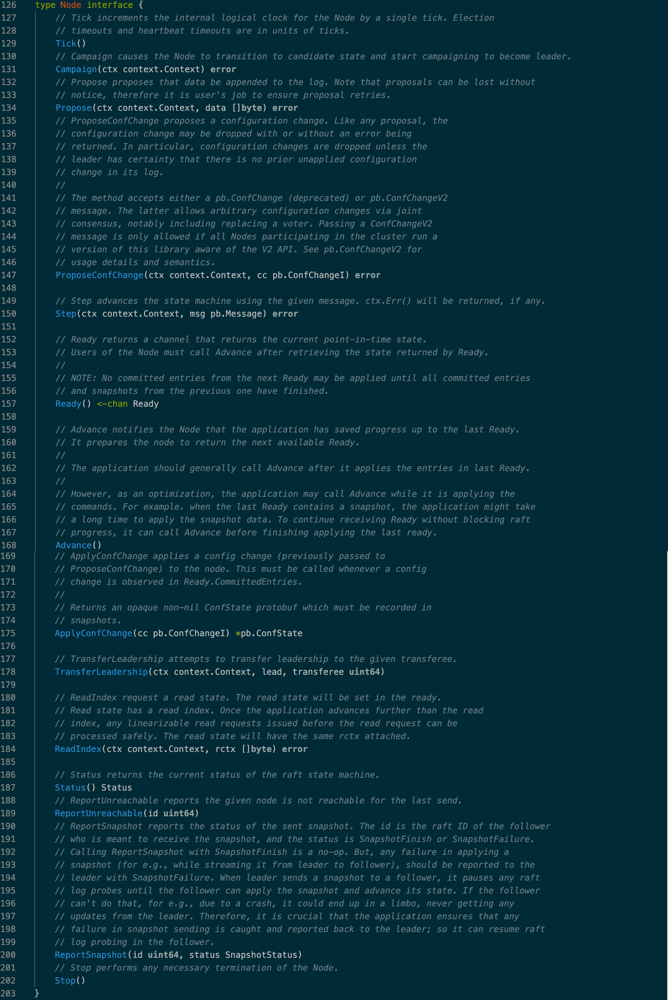
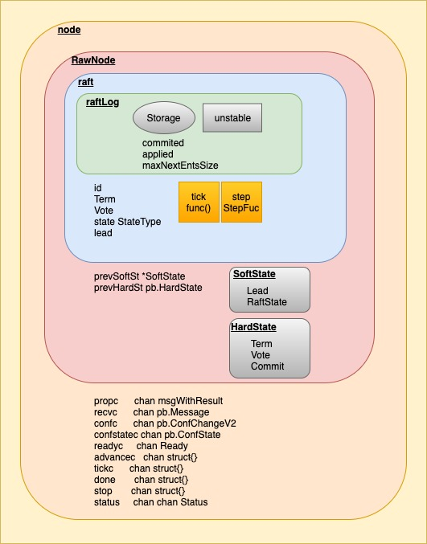
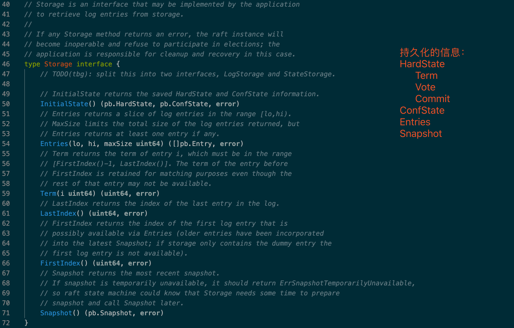
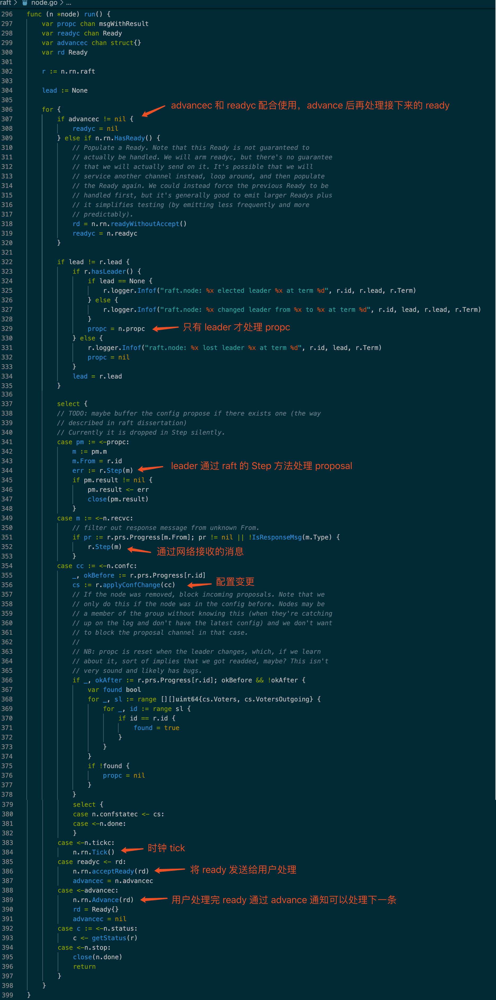
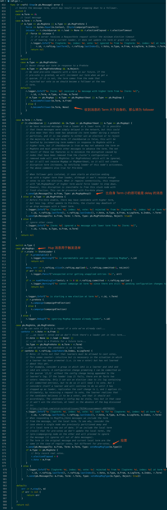
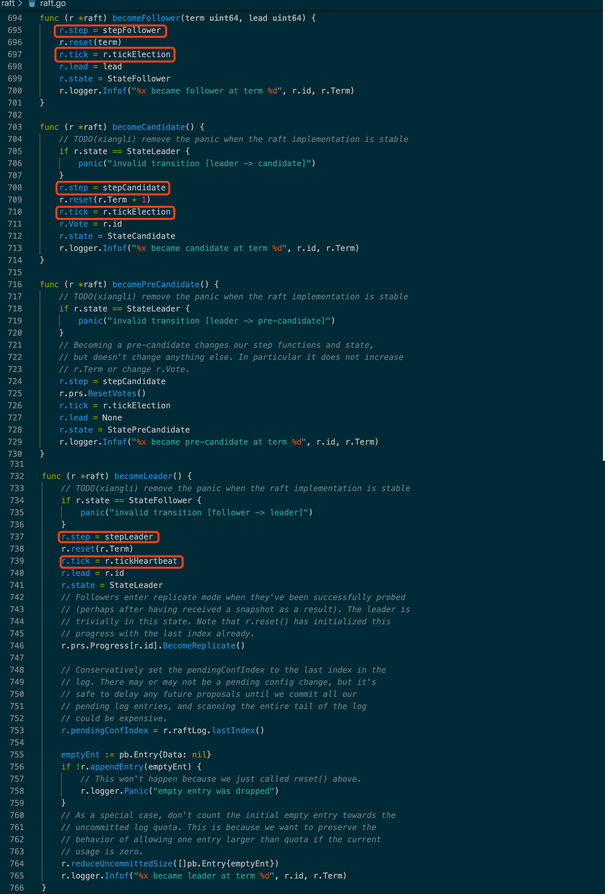

[etcd/raft](https://github.com/etcd-io/etcd/tree/master/raft)

## 0.

> Most Raft implementations have a monolithic design, including storage handling, messaging serialization, and network transport. This library instead follows a minimalistic design philosophy by only implementing the core raft algorithm. This minimalism buys flexibility, determinism, and performance.

etcd raft 是一个很精简的抽象，只实现了核心算法，transportation layer 和  storage layer 需要用户自己实现。

##1. API

etcd raft 对用户暴露的主要接口是 `Node`



初始化 `Node` 的方法有两个：

1. `func StartNode(c *Config, peers []Peer)`
    创建一个新的 Node，它将会把 peers 信息以 ConfChangeAddNode entry 形式追加到初始 log 中。
2. `func RestartNode(c *Config)`
    重启 Node，集群配置信息将从 Storage 中恢复。

`Node` 初始化后，用户需要自己维护下述逻辑：

```go
  for {
    select {
    case <-s.Ticker:
      n.Tick()
    case rd := <-s.Node.Ready():
      saveToStorage(rd.HardState, rd.Entries, rd.Snapshot)
      send(rd.Messages)
      if !raft.IsEmptySnap(rd.Snapshot) {
        processSnapshot(rd.Snapshot)
      }
      for _, entry := range rd.CommittedEntries {
        process(entry)
        if entry.Type == raftpb.EntryConfChange {
          var cc raftpb.ConfChange
          cc.Unmarshal(entry.Data)
          s.Node.ApplyConfChange(cc)
        }
      }
      s.Node.Advance()
    case <-s.done:
      return
    }
  }
```

用户向 etcd raft 提交消息通过 `n.Propose(ctx, data)`，成员配置通过 `n.ProposeConfChange(ctx, cc)`。

## 2. 整体结构



代码实现的整体结构如上图所示，核心的算法实现在 `raft` 中，`raftLog` 提供了存储的封装，具体的存储逻辑需要用户基于 `Storage` 接口实现。



transportation layer 的逻辑与 raft 核心算法没有交集，`Node` 提供的接收处理消息的接口是 `Step(ctx, msg)`。

## 3. 主体逻辑

node 主要逻辑是 `func (n *node) run()`，从各种 channel 获取处理事件。



rawnode 逻辑比较简单，这里就不展开了。

最核心的 raft，处理消息的入口是 `func (r *raft) Step(m pb.Message)`



除了对特殊的几种情况的处理，默认都会调用 `step stepFunc`，step 和 tick 两个函数构建了 raft 角色转换的状态机



剩下的核心算法实现就不一一列举了，对照着论文还是挺容易理解的。
