本文代码基于 redis 4.0.14 版本，主要涉及[PSYNC](http://antirez.com/news/47)协议相关。

## 1. MASTER 收到 REPLCONF 命令

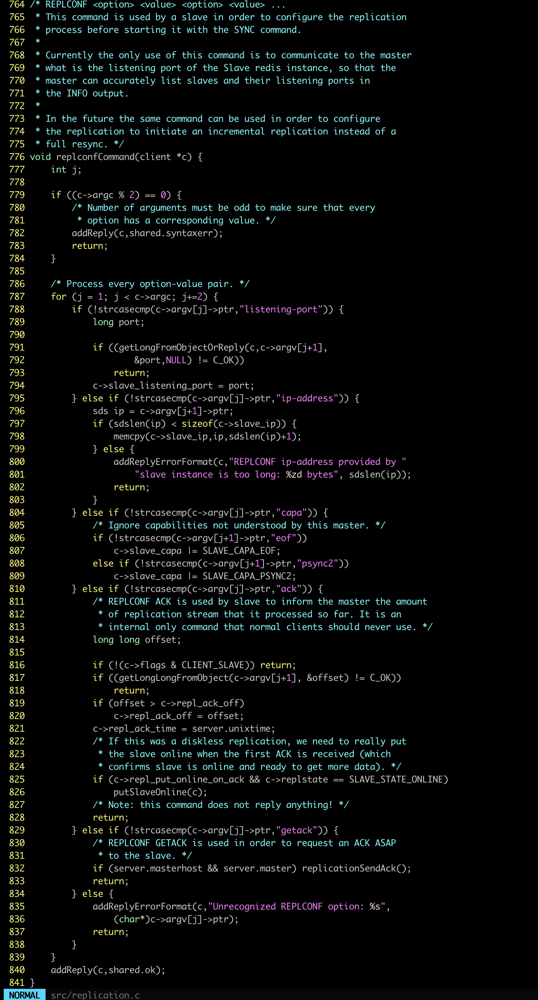

#### 1.1. 收到 listening-port
L788
解析端口，设置`c->slave_listening_port`

#### 1.2. 收到 ip-address
L795
解析IP，设置 `c->slave_ip`

#### 1.3 收到 capa
L804
解析支持的能力，设置`c->slave_capa`

## 2. MASTER 收到 PSYNC 命令
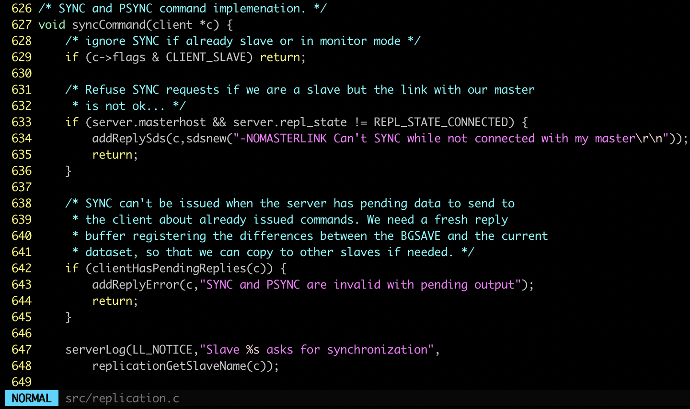

L633 如果自身是 SLAVE，而且没有与 MASTER 建立同步关系，那么返回 *-NOMASTERLINK*。

L642 如果该连接还有未发送和处理的数据，那么返回错误。

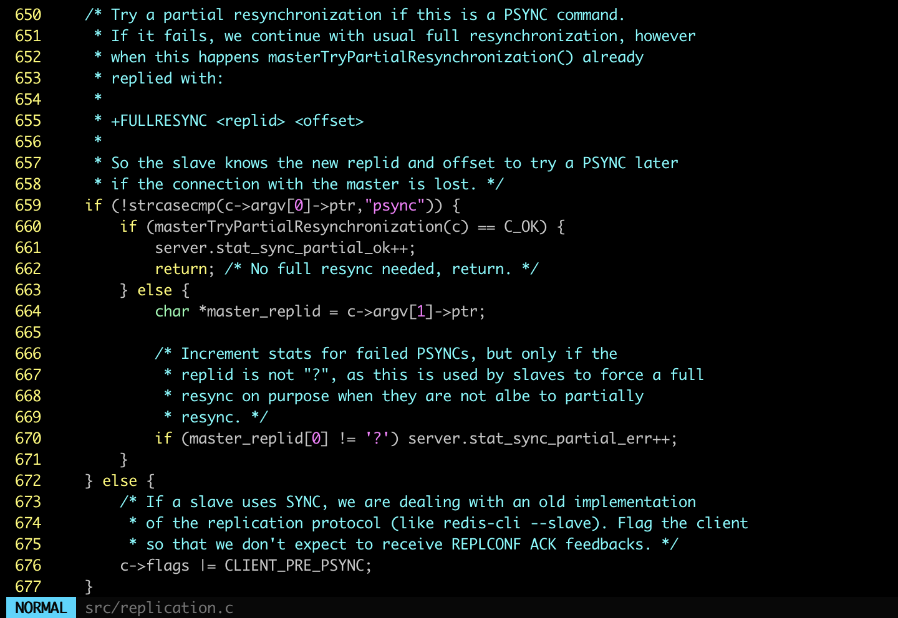

L660 如果是 psync，并且`masterTryPartialResynchronization`函数判断可以增量同步，那么直接返回。

否则继续向下走，进行全量同步。

#### 2.1. masterTryPartialResynchronization
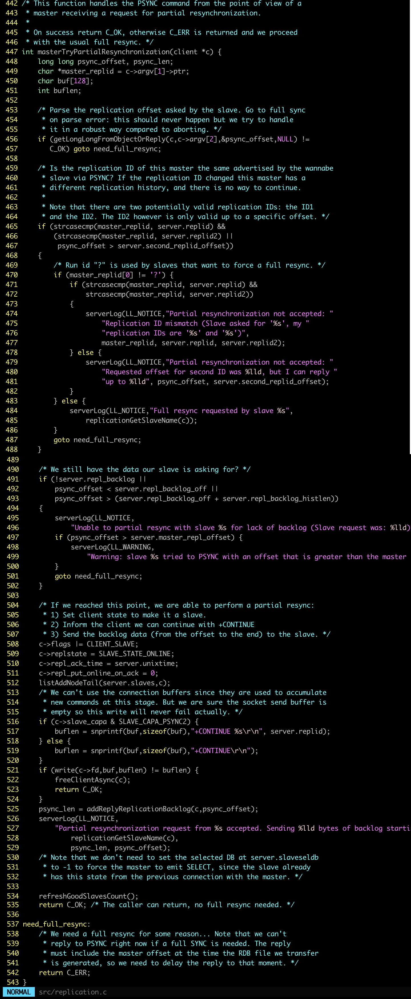

L456 如果参数中的 offset 无法解析，那么返回全同步。

L465 如果参数中的 replid 既不是`server.replid`；也不是`server.replid2`或者不符合`server.second_replid_offset`的范围，那么也返回全同步。

L491 如果没有`server.repl_backlog`；或者请求的 offset 小于 backlog 的起始位置`server.repl_backlog_off`；或者请求的 offset 大于 backlog 的终止位置`server.repl_backlog_off + server.repl_backlog_histlen`，那么也返回全同步。

L516-520 返回*+CONTINUE*，SLAVE 收到后就可以接收增量数据了。如果是 psync2 协议，还会带上`server.replid`。

L522 如果*+CONTINUE*写失败了，那么直接关闭连接。

L525 计算 backlog 中需要发送给 SLAVE 的数据，添加到发送缓冲区。

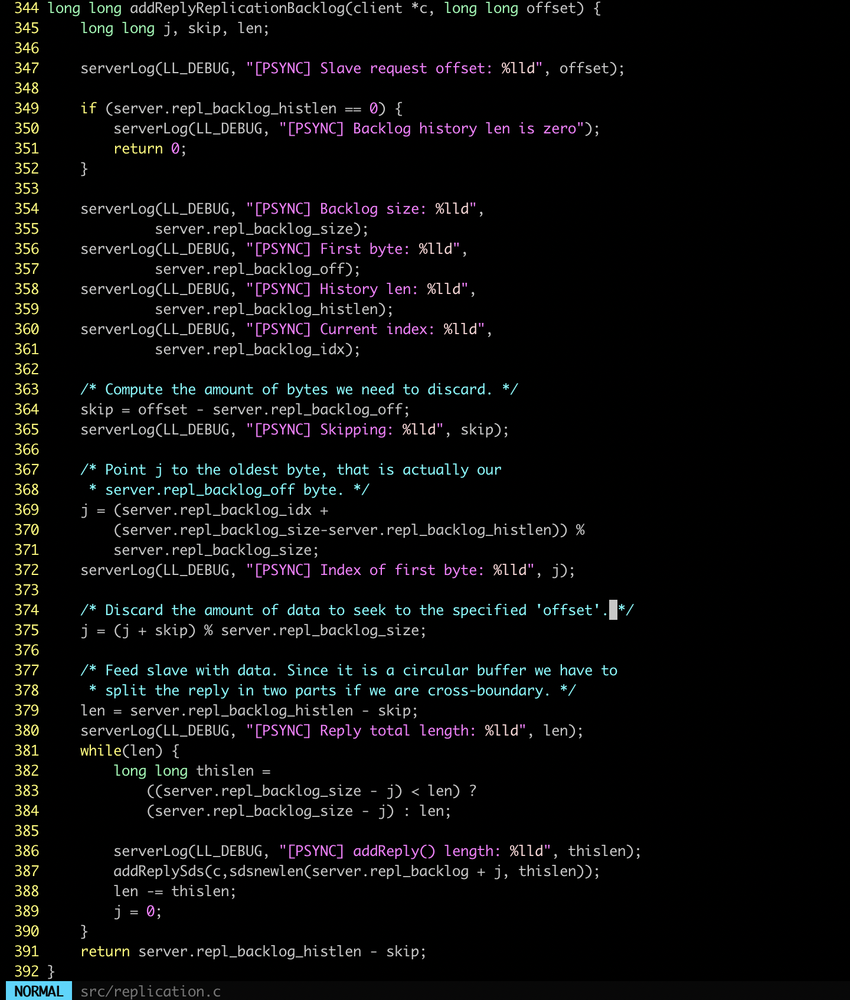

重点说一下 repl_backlog 这个 circular buffer 数据结构。

circular buffer 相关：
1. `repl_backlog_idx` buffer 写入位置的索引
2. `repl_backlog_size` buffer 的长度
3. `repl_backlog_histlen` buffer 中数据的长度

全局数值：
1. `repl_backlog_off` backlog 中起始位置的全局 offset

L364 `skip` 指的是从 backlog 起始位置开始**不需要**发送给 SLAVE 的长度。

L369 `j` 指的是 buffer 中数据起始位置的索引。

L375 `j` 又调整为需要发送的位置的索引。

L379 `len` 表示需要发送的数据长度。

L381-390 由于是环形buffer，所以判断一下是否超过了最大位置，分成了两段。

#### 2.2. Full resynchronization

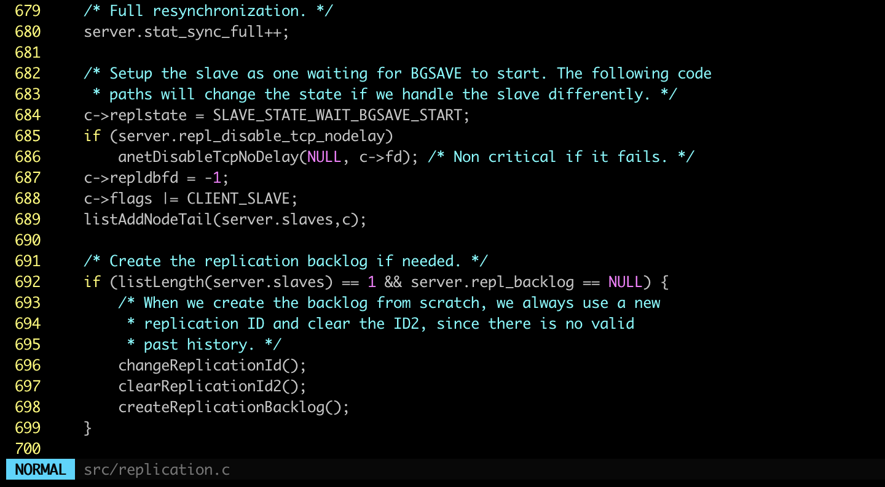

L684 设置该连接的`replstate`为 SLAVE_STATE_WAIT_BGSAVE_START。

L692-699 如果没有`repl_backlog`，那么创建一下。随机生成 40 个字符的`server.replid`，`server.replid2`置为 0，`server.second_replid_offset` 为 -1，最重要的`server.repl_backlog_off = server.master_repl_offset+1`表示下一个需要发送的字节。

对于三个 CASE，在此打乱一下顺序。

###### CASE 3: There is no BGSAVE is progress.
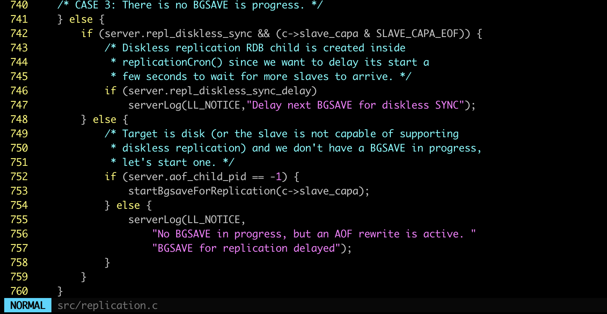

如果还没开始 BGSAVE。
L742 如果是不落盘的同步，并且该 SLAVE 支持 SLAVE_CAPA_EOF，那么等在 replicationCron 生成RDB。

L753 如果需要此时进行 BGSAVE，并且 AOF 不在执行，那么调用`startBgsaveForReplication`函数进行 BGSAVE。

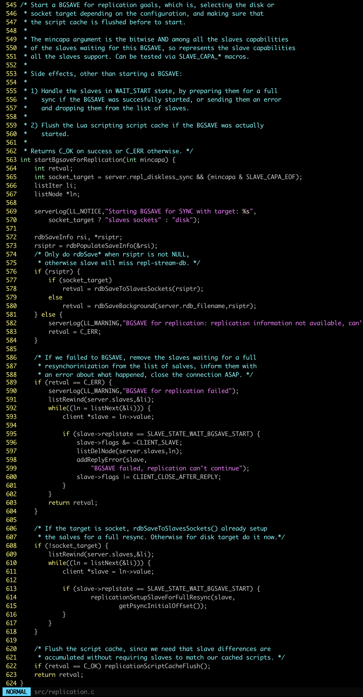

此时执行的是 `rdbSaveBackground` 做 RDB 落盘，细节暂且忽略。

L589-604 如果执行 BGSAVE 失败，那么关闭所有状态为 SLAVE_STATE_WAIT_BGSAVE_START 的 SLAVE 的连接。

L608-618 如果执行 BGSAVE 成功，那么向所有状态为 SLAVE_STATE_WAIT_BGSAVE_START 的 SLAVE 执行`replicationSetupSlaveForFullResync`函数。初始的 offset 即为`server.master_repl_offset`。

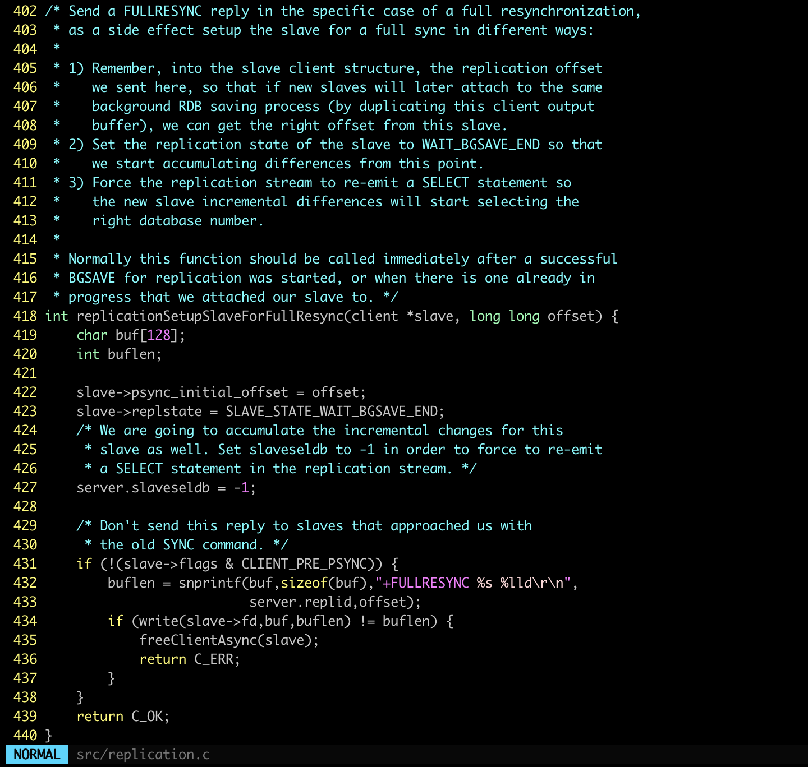

SLAVE 的`replstate`置为 SLAVE_STATE_WAIT_BGSAVE_END。

L432-437 向 SLAVE 发送 *+FULLRESYNC*，通知开始全同步。

###### CASE 1: BGSAVE is in progress, with disk target.
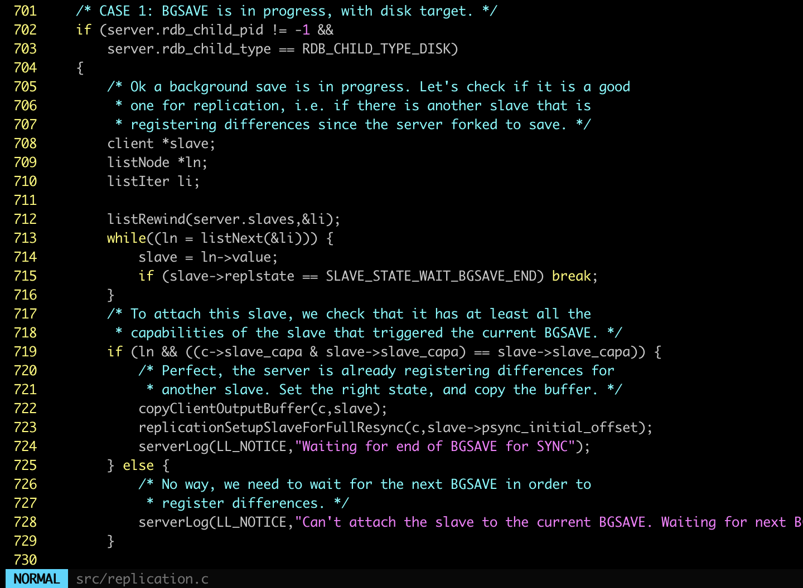

如果之前的 SLAVE 连接已经触发落盘的 BGSAVE 了。

L715 找到第一个状态置为 SLAVE_STATE_WAIT_BGSAVE_END 的连接。

L719-724 如果该连接的`slave_capa`至少是触发 BGSAVE 连接的 capa，那么复制输出缓存，并且将`replstate`置为 SLAVE_STATE_WAIT_BGSAVE_END，发送 *+FULLRESYNC*。

L728 如果不符合条件，等一下。

###### CASE 2: BGSAVE is in progress, with socket target.
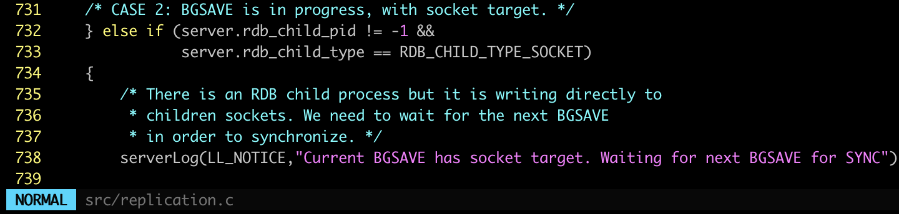

如果其他 SLAVE 正在进行无盘的 BGSAVE，那么等一下。

###### replicationCron 中开始 BGSAVE
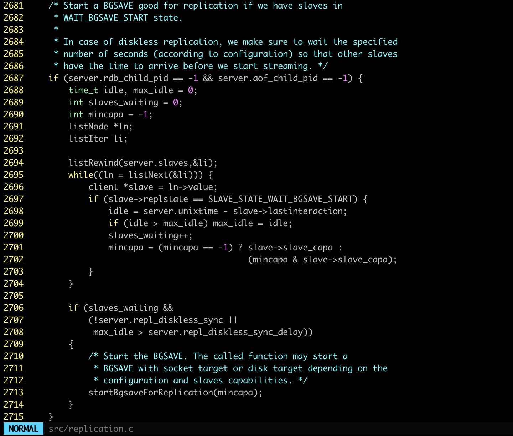

L2694-2704 遍历连接的 SLAVE，如果存在 SLAVE_STATE_WAIT_BGSAVE_START 状态的，那么统计等待的个数`slaves_waiting`，最大的等待时间`max_idle`和最大共同支持的`mincapa`。

L2706-2714 如果满足条件那么调用`startBgsaveForReplication`开始 BGSAVE。此时有可能进行无盘的同步。

## 3. 检查全同步完成

上面在 PSYNC 命令的处理流程中，可能会触发全同步，判断全同步的完成的逻辑在`serverCron`中，检查子进程执行结束，调用`backgroundSaveDoneHandler`函数。

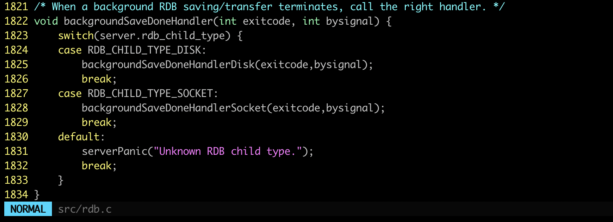

#### 3.1. RDB_CHILD_TYPE_DISK
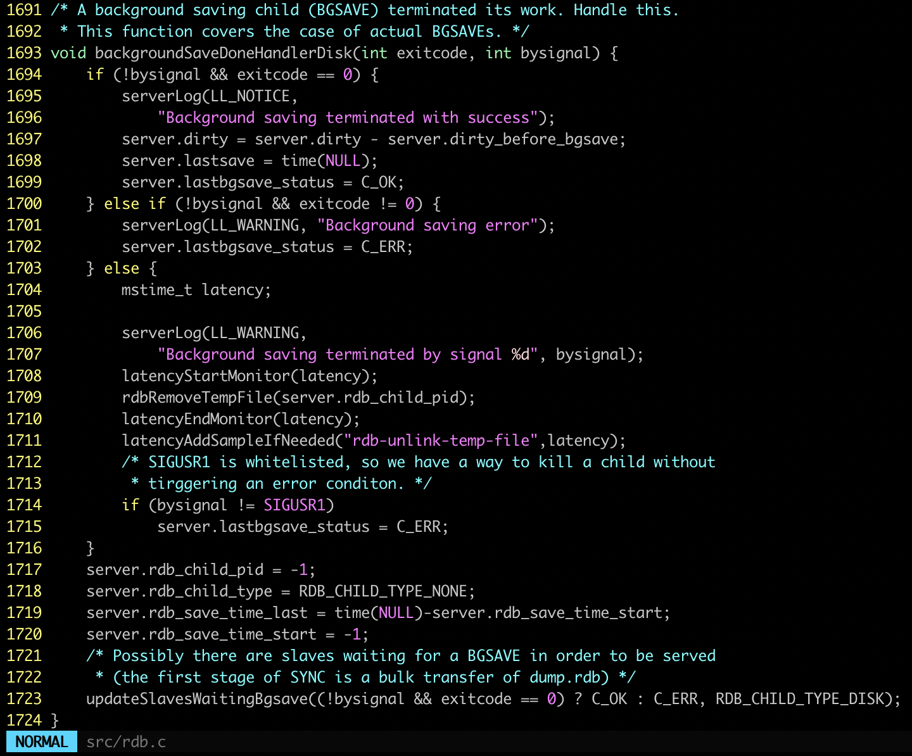

根据`bysignal`和`exitcode`判断BGSAVE是否成功，再调用`updateSlavesWaitingBgsave`函数，只有`(!bysignal && exitcode == 0)`才表示上面触发的 BGSAVE 成功。

#### 3.2. RDB_CHILD_TYPE_SOCKET
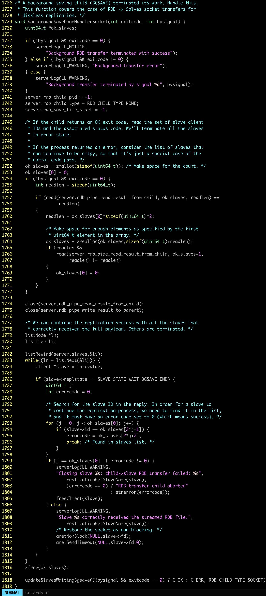

L1783-1815 遍历所有 SLAVE_STATE_WAIT_BGSAVE_END 状态的 slave 连接，如果通过接收 RDB 不成功，那么关闭连接。最后也是调用`updateSlavesWaitingBgsave`函数。

#### 3.3. updateSlavesWaitingBgsave

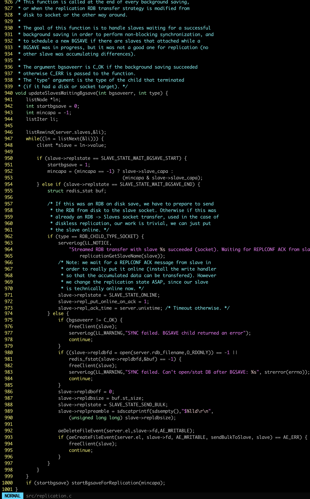

L971-973 对于 RDB_CHILD_TYPE_SOCKET 类型的 slave，将状态置为 SLAVE_STATE_ONLINE，并且`slave->repl_put_online_on_ack = 1`，表示收到 *REPLCONF ACK* 后再注册写增量数据的 handler。

L986-996 对于 RDB_CHILD_TYPE_DISK 类型的 slave，将状态置为 SLAVE_STATE_SEND_BULK，注册发送RDB的`sendBulkToSlave`函数。

如果 RDB 发送成功，那么在`sendBulkToSlave`中最后会调用`putSlaveOnline`函数。
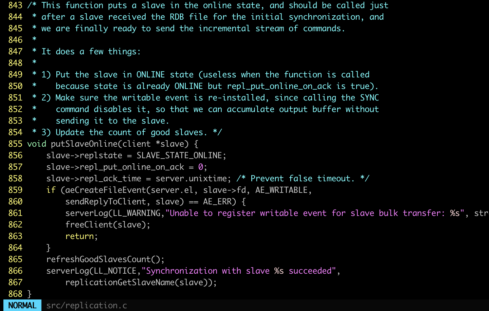

状态置为 SLAVE_STATE_ONLINE，注册`sendReplyToClient`函数，发送增量数据给 slave。

#### 3.4. RDB_CHILD_TYPE_SOCKET 收到 REPLCONF ACK

slave 与 master 建立关系后，会周期性发送 ack 信息，当`c->repl_put_online_on_ack && c->replstate == SLAVE_STATE_ONLINE`时，也就是 RDB_CHILD_TYPE_SOCKET 传输 RDB 完成后，也会触发 `putSlaveOnline` 函数。

## 4. 增量数据如何进入 output buffer

`call` 函数在执行命令之后，对于有必要同步的命令，会调用`replicationFeedSlaves`函数。

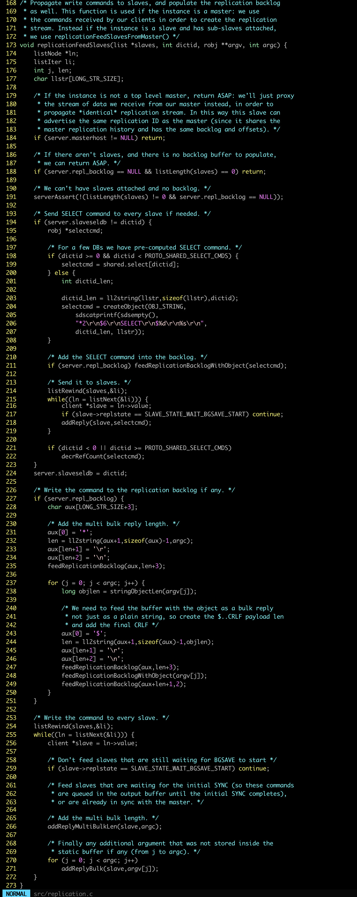

L194-223 如果期间执行了 SELECT 命名，切换了 DB，那么向`repl_backlog`写入 SELECT 命令，然后写到状态为 SLAVE_STATE_WAIT_BGSAVE_START 之后的 slave 的 output buffer 中。

L227-251 将命令写到`repl_backlog`。

L255-272 将命令写到状态为 SLAVE_STATE_WAIT_BGSAVE_START 之后的 slave 的 output buffer 中。

## 5. 再回到 replicationCron

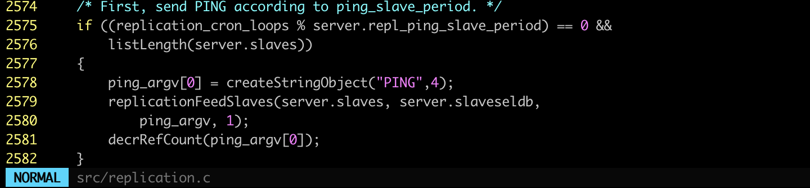

以`repl_ping_slave_period`周期（默认10s）`replicationFeedSlaves` PING 命令。

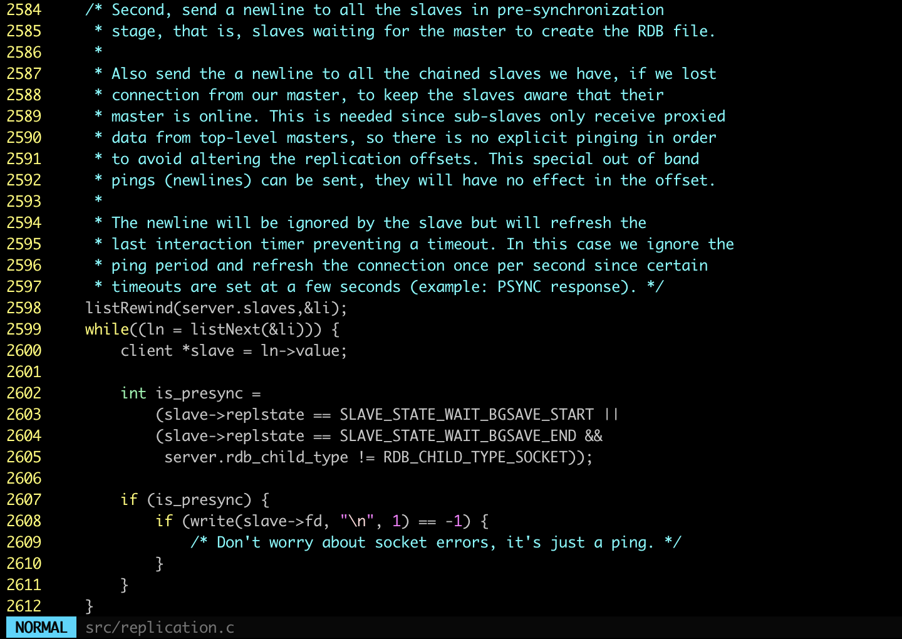

在建立连接，并且没有传输数据的阶段，周期性发送`\n`，以防 slave 超时关闭连接。

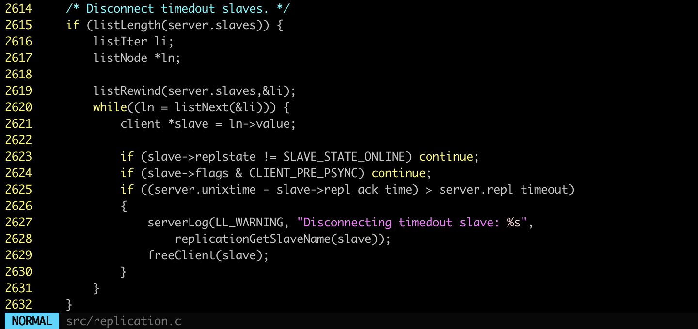

关闭超过`server.repl_timeout`未收到 ack 的 slave 连接。

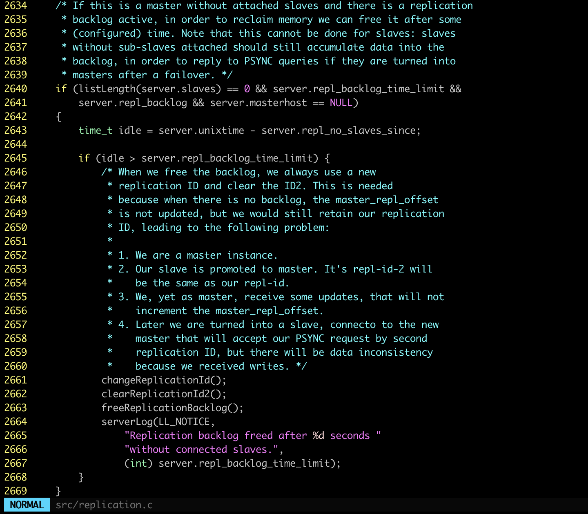

如果超过`server.repl_backlog_time_limit`阈值，没有 slave 连接，那么释放`repl_backlog`节约内存。

