本文代码基于 redis 4.0.14 版本，主要涉及[PSYNC](http://antirez.com/news/47)协议相关。

## 0. 一图胜千言
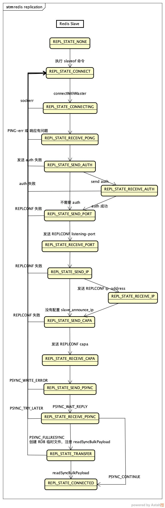

## 1. 在 SLAVE 上执行 slaveof 命令

通过查询`server.commands`找到处理该命令的函数为`void slaveofCommand(client *c)`：

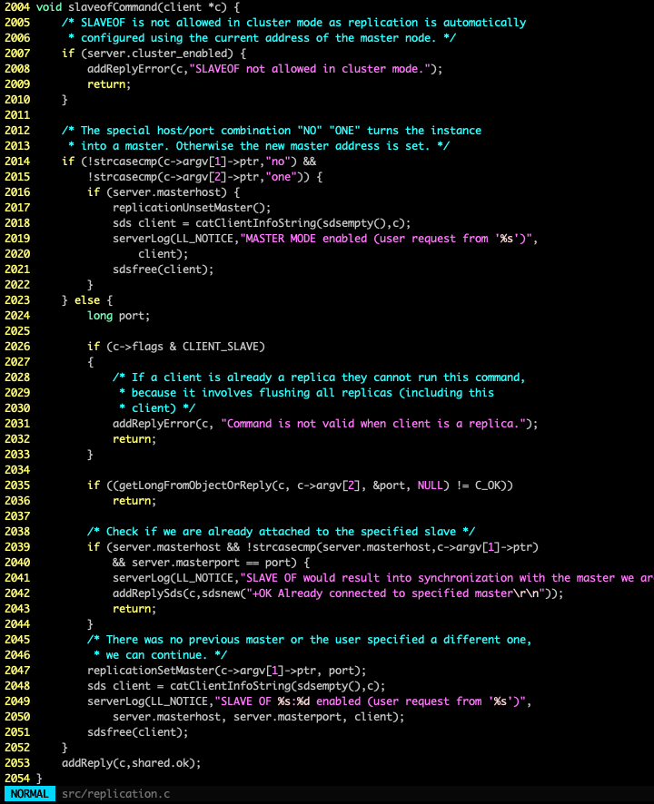

1. L2014 如果参数为 no one，那么取消之前的同步，将状态设置为 MASTER；
2. L2026 如果发送该命令的 client，本身就是 SLAVE，那么返回错误；
3. L2039 如果命令中同步的地址与 redis 正在同步的地址相同，那么直接返回；
4. L2047 设置同步的地址。

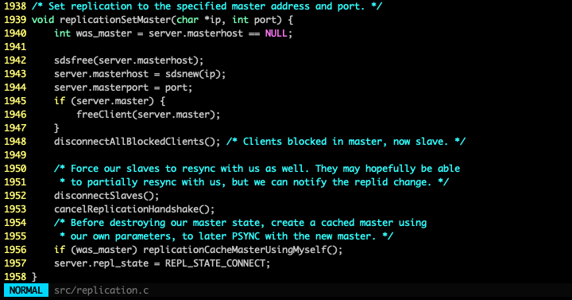

1. L1943-1944 设置需要连接的 MASTER 地址；
2. L1945 如果当前连接另外一个 MASTER，那么断开连接；
3. L1952 如果当前有 SLAVE，那么断开连接；
4. L1953 取消复制流程中的握手任务；
5. L1956 如果本身是 MASTER，那么将信息保存到`cached_master`；
6. L1957 最后将`repl_state`设置为`REPL_STATE_CONNECT`。

至此 slaveof 命令执行完毕。

## 2. SLAVE 上的 replicationCron 定时任务

slaveof 命令只是设置了信息和状态，接下来 redis 的定时任务`serverCron`会以每秒一次的频率执行`replicationCron`。

在执行 slaveof 命令之后，`repl_state`为`REPL_STATE_CONNECT`：

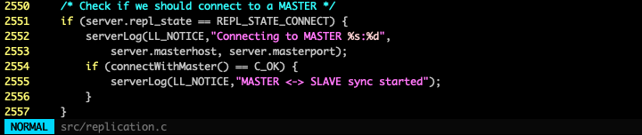

L2554 向设置的 MASTER 地址发起连接。

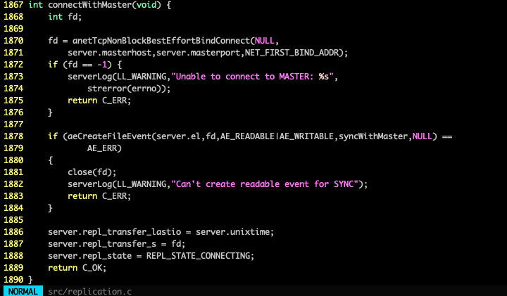

建立连接，监听读写事件，将`repl_state`设置为`REPL_STATE_CONNECTING`。

## 3. 与 MASTER 建立连接之后

连接建立之后会回调`syncWithMaster`函数：

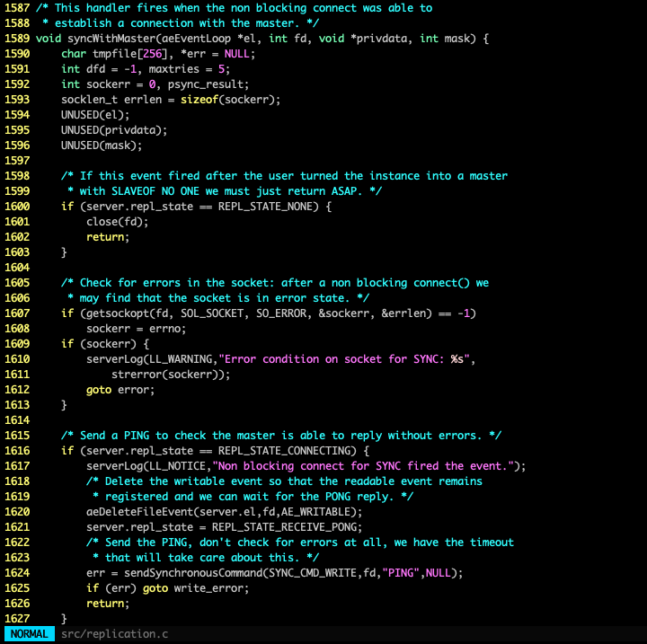

L1609 如果 socket 有问题，那么关闭连接，返回`REPL_STATE_CONNECT`状态。

L1617-1626 将状态置为`REPL_STATE_RECEIVE_PONG`，向 MASTER 同步发送 PING 命令，如果失败也退回`REPL_STATE_CONNECT`状态。

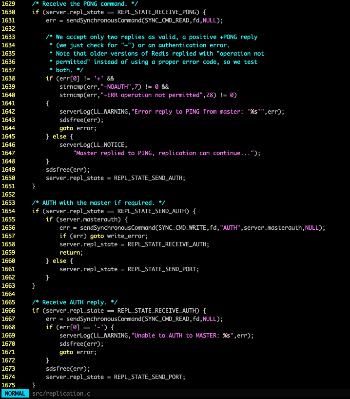

验证接收到的 PONG 响应，如果有认证的需要，那么再加上 AUTH 过程，如果请求响应正常，那么状态置为`REPL_STATE_SEND_PORT`。

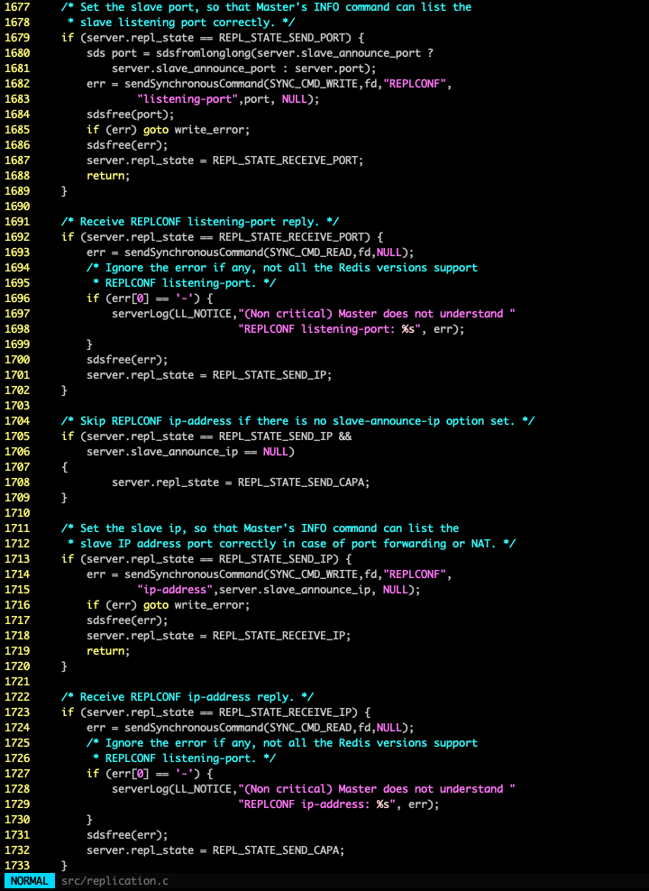

接下来发送 REPLCONF listening-port，如果有配置`slave_announce_ip`再发送 REPLCONF ip-address，如果一切正常，那么状态置为`REPL_STATE_SEND_CAPA`。

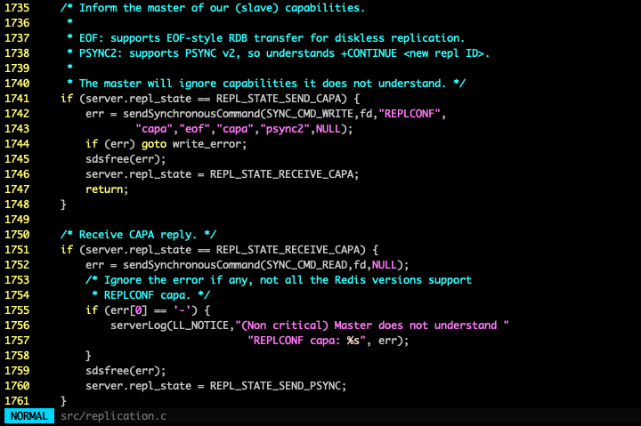

接下来向 MASTER 发送自身支持的特性，最后状态置为`REPL_STATE_SEND_PSYNC`。

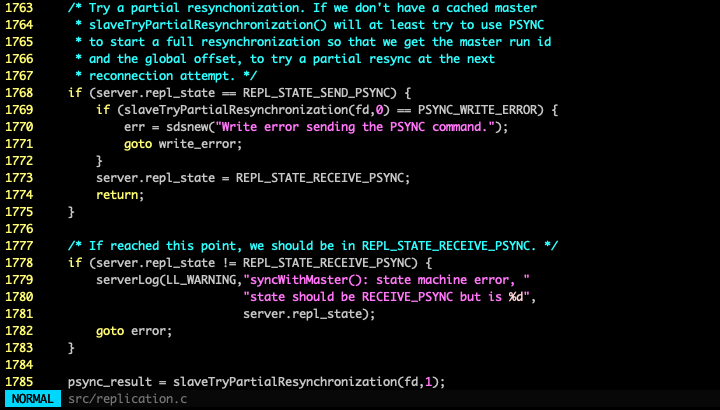

L1769 在`slaveTryPartialResynchronization`方法中向 MASTER 发送 PSYNC 命令，参数`read_reply`为0时，发送 PSYNC 命令；参数`read_reply`为1时，读取响应。

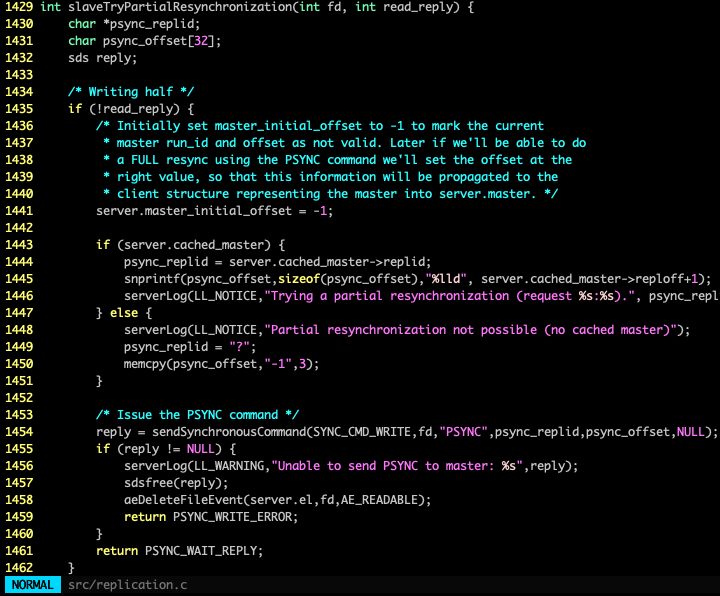

发送PSYNC命名，`psync_replid`默认为"?"，`psync_offset`默认为"-1"，如果本地有之前缓存的，那么用之前的信息。

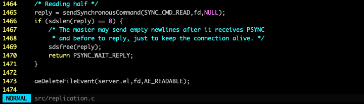

读取 PSYNC 的响应，如果为空继续等待。

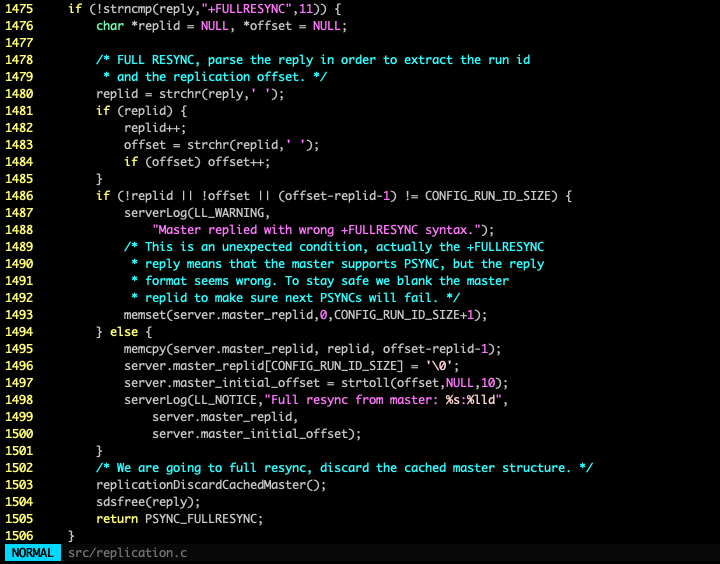

如果返回+FULLRESYNC，那么需要全同步，解析replid和offset信息。

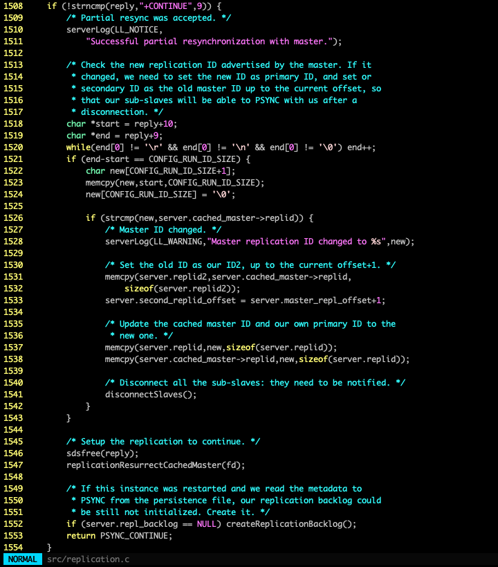

如果返回+CONTINUE，那么可以增量同步，这里为了 sub-slaves 在重连之后可以继续增量同步，增加了 replid2 这个参数，具体细节这里暂且略过。

L1547 `replicationResurrectCachedMaster`函数设置`server.master`的信息，状态置为REPL_STATE_CONNECTED。

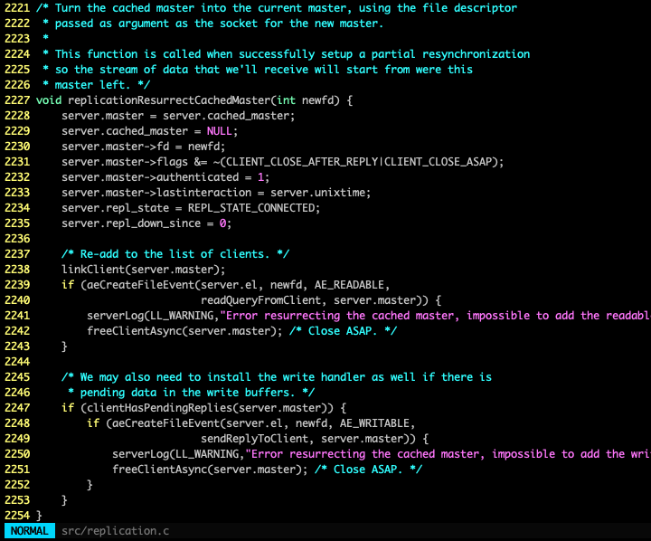

L2240 注册`readQueryFromClient`函数，用于处理收到的增量数据。（该函数的具体细节暂且略过）

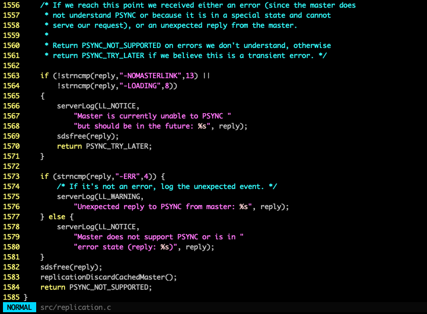

如果返回错误，如果是可恢复的，返回PSYNC_TRY_LATER重试，如果是不可恢复的，返回PSYNC_NOT_SUPPORTED。

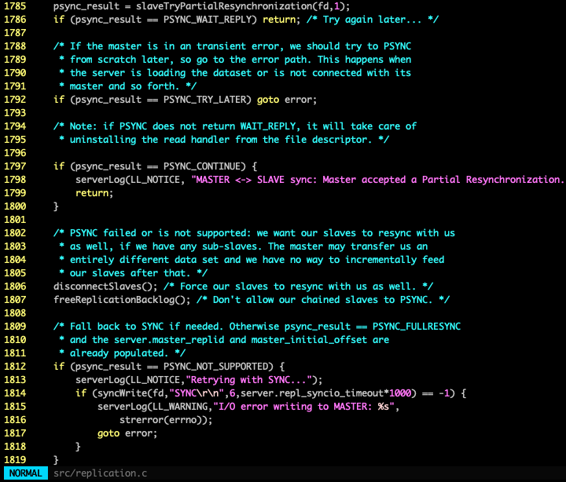

L1797 如果可以增量同步，直接返回。

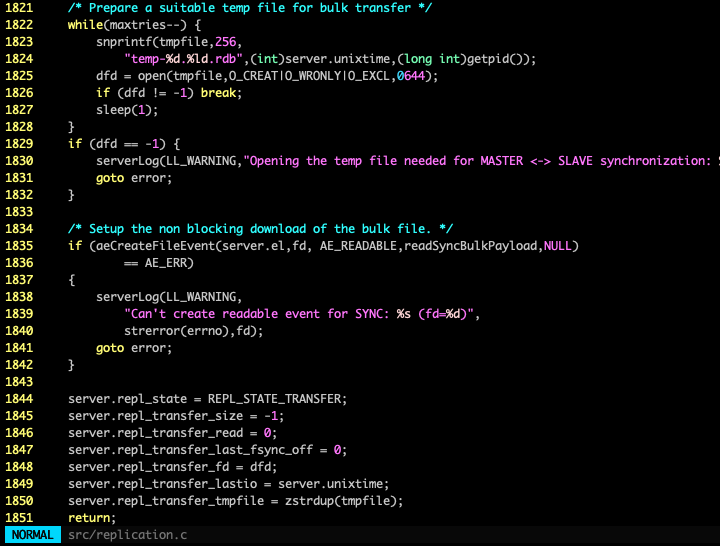

L1835 如果是全量同步，注册`readSyncBulkPayload`函数用于接收处理 RDB。（该函数的具体细节暂且略过）

如果接收 RDB 正常，最终状态置为 REPL_STATE_CONNECTED，在`replicationCreateMasterClient`函数中也会注册`readQueryFromClient`函数，用于处理收到的增量数据。

## 4. 再回到 replicationCron

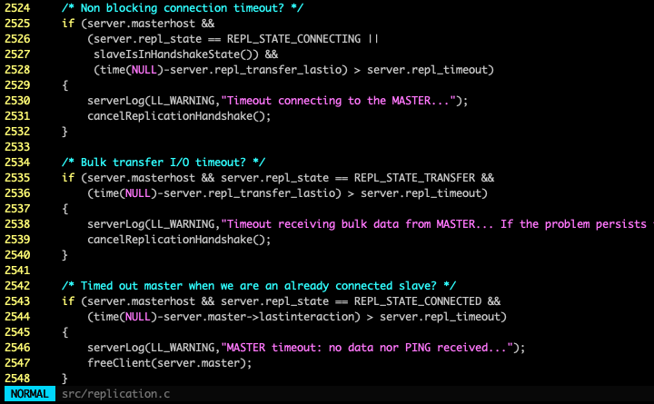

1. L2528 与 MASTER 建立 socket 之后，如果超过`server.repl_timeout`阈值没有进行下一步 PING PONG，那么关闭连接，退回 REPL_STATE_CONNECT 状态。
2. L2536 做全同步传输 RDB 期间，如果超过`server.repl_timeout`阈值没有收到数据，那么关闭连接，退回 REPL_STATE_CONNECT 状态。
3. L2544 做增量同步期间，如果超过`server.repl_timeout`阈值没有收到数据，那么关闭连接，退回 REPL_STATE_CONNECT 状态。

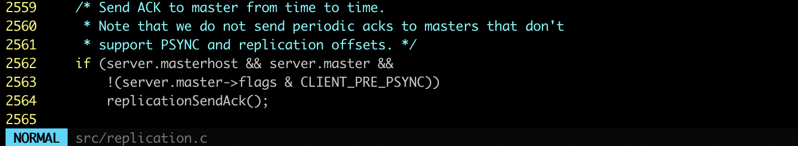

L2564 周期性向 MASTER 发送 REPLCONF ACK。

