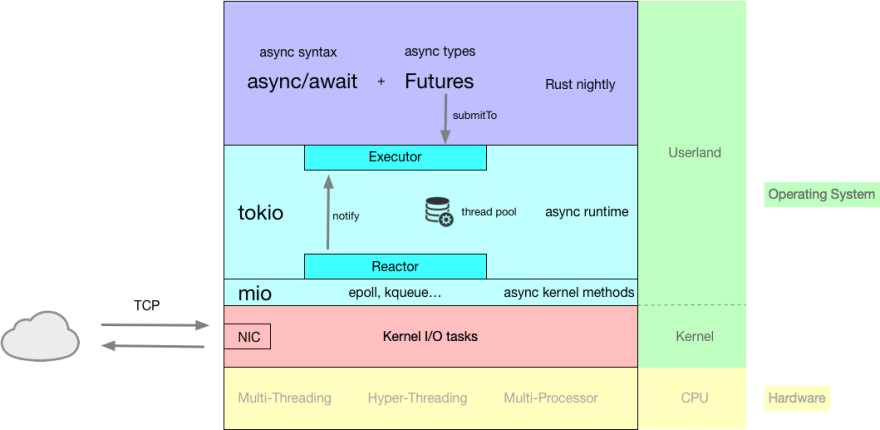

# 0. 

Rust 在 [1.39.0](https://blog.rust-lang.org/2019/11/07/Async-await-stable.html) 为异步编程提供了语法层面的支持，也就是 `async` 和 `await`。

跟 Go 等语言不同的是 Rust 自身并没有内建异步执行的运行时（例如 Go 中的goroutine）。运行时是类库提供的功能，目前实际上的标准运行时是 [Tokio](https://tokio.rs/) 。

Tokio 官方提供的 [mini-redis](https://github.com/tokio-rs/mini-redis) 是一个不错的学习项目，我增加一对 [HSET/HGET 命令](https://github.com/shichaoyuan/mini-redis/commit/2377a95255445d24c51dfaff30b88b3fb0557f0a)，总的来说很容易上手。

Tokio 非常易用，而底层 Rust 异步编程的一些概念还是不容易理解。

# 1.  overview



1. 整体来看 Tokio 运行时采用了 reactor 模型。
2. Rust 对使用者暴露的接口是 `Future`，提交给 Executor 执行。

# 2. std::future::Future

Rust 标准库只定义了 `Future`。

如何理解 Future 呢？可以参考 Aaron Turon 的文章 [《Zero-cost futures in Rust》](http://aturon.github.io/blog/2016/08/11/futures/)：

>In essence, a future represents a value that might not be ready yet. Usually, the future becomes complete (the value is ready) due to an event happening somewhere else.

在标准库中，`Future` 只定义了一个 poll 函数，调用该函数返回 `Poll<Self::Oputput>`：
```rust
// libcore/future/future.rs
pub trait Future {
    #[stable(feature = "futures_api", since = "1.36.0")]
    type Output;

    #[stable(feature = "futures_api", since = "1.36.0")]
    fn poll(self: Pin<&mut Self>, cx: &mut Context<'_>) -> Poll<Self::Output>;
}
```

`Poll` 是一个枚举，表示 `Future` 的两个状态，`Ready` 已经完成，`Pending` 未完成。

```rust
// libcore/task/poll.rs
pub enum Poll<T> {
    #[stable(feature = "futures_api", since = "1.36.0")]
    Ready(#[stable(feature = "futures_api", since = "1.36.0")] T),

    #[stable(feature = "futures_api", since = "1.36.0")]
    Pending,
}
```

这样的定义方式有别于 Java 世界常见的 callback，Aaron Turon 称之为 *demand-driven* 方法。详见 Aaron Turon 的文章 [《Designing futures for Rust》](https://aturon.github.io/blog/2016/09/07/futures-design/)。

在 *demand-driven* 方法中，Executor 会主动调用 poll，如果返回 `Ready` 那么表示该任务完成；如果返回 `Pending` 那么表示任务未完成，需要等待再次调用 poll 函数。这里的“等待”就需要 Reactor 的协助了，将 `Pending` 的 future 注册到 Reactor 中，Reactor 在该 future 准备就绪时就会通知 Executor 再次执行。

Executor 与 Reactor 之间的通知机制封装在 `Context` 中，也就是 poll 函数的第二个参数：

```rust
// libcore/task/wake.rs
#[stable(feature = "futures_api", since = "1.36.0")]
pub struct Context<'a> {
    waker: &'a Waker,
    _marker: PhantomData<fn(&'a ()) -> &'a ()>,
}
```

核心就是其中的 `Waker`。（这部分没有完全理解）

关于 poll 函数的第一个参数类型 `Pin`，是为了解决自引用移动的问题，让数据在内存中固定。

## 3. async.await

为了使用方便，Rust 提供了两个语法糖 —— async 和 await。

async 用于修饰函数和代码块，例如
```rust
async fn hello_world() {
    println!("hello, world!");
}
```

编译器将其转换为：
```rust
fn hello_world() -> impl Future<Output = ()> {
...
```

也就是将异步代码块生成为一个实现了 `Future` 的结构体。

await 的作用就是等待 `Future` 完成，并不会阻塞线程。

## 4. Executor 与 Reactor

`Future` 的定义基本上决定了异步运行时采用 reactor 模型。

其中的 Reactor 部分对使用者来说是无感知的，Tokio 是基于 mio（封装了 epoll、kqueue 等） 实现的。

而 Executor 部分也被 Tokio 用 macro 隐藏了。例如：
```rust
#[tokio::main]
async fn main() {
    println!("Hello world");
}
```

编译器将会扩展为：
```rust
fn main() {
    tokio::runtime::Runtime::new()
        .unwrap()
        .block_on(async {
            println!("Hello world");
        })
}
```
也就是初始化运行时，提交 `Future` 的逻辑。

---
学习资料：
1. [https://dev.to/gruberb/explained-how-does-async-work-in-rust-46f8](https://dev.to/gruberb/explained-how-does-async-work-in-rust-46f8)
2. [http://aturon.github.io/blog/2016/08/11/futures/](http://aturon.github.io/blog/2016/08/11/futures/)
3. [https://aturon.github.io/blog/2016/09/07/futures-design/](https://aturon.github.io/blog/2016/09/07/futures-design/)
4. [https://boats.gitlab.io/blog/post/wakers-i/](https://boats.gitlab.io/blog/post/wakers-i/)
5. [https://cafbit.com/post/tokio_internals/](https://cafbit.com/post/tokio_internals/)
6. [https://fasterthanli.me/articles/surviving-rust-async-interfaces](https://fasterthanli.me/articles/surviving-rust-async-interfaces)


