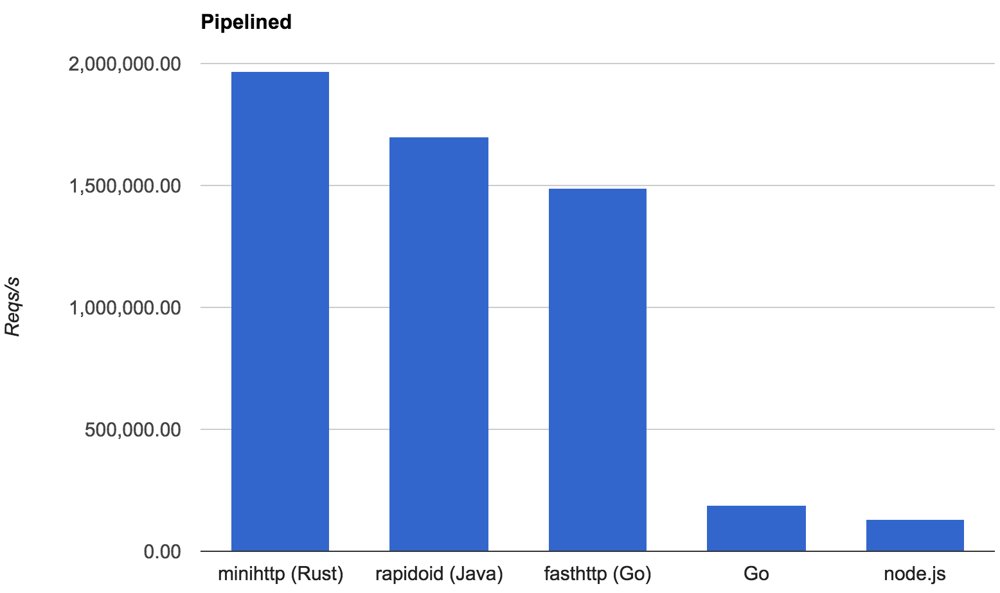

原文链接：[Zero-cost futures in Rust](http://aturon.github.io/blog/2016/08/11/futures/)

11 Aug 2016 · Aaron Turon

Rust 生态的一个主要缺陷是快速高效的*异步 I/O*。我们有坚实的基础，比如 [mio](http://github.com/carllerche/mio) 库，但是这些都比较低层：你不得不创建状态机，直接处理回调。

我们想要一些更高层次的东西，具有更好的人机工学，但是也得有更好的*可组合性*，支持一个可以协同工作的异步抽象生态。这听起来可能很熟悉：这与[许多语言](https://en.wikipedia.org/wiki/Futures_and_promises#List_of_implementations)引入 *futures*（又名 promises）的目的一致，并在其基础上支持 *async/await* 语法糖。

Rust 的主要信条是构建[零成本抽象](https://blog.rust-lang.org/2015/05/11/traits.html)的能力，这为我们的异步 I/O 增加了一个额外的目标：理想情况下，futures 这样的抽象可以编译为我们现在写的状态机回调处理代码（而没有额外的运行时开销）。

**在过去几个月，Alex Crichton 和我为 Rust 开发了一个 [*零成本 futures 库*](https://github.com/alexcrichton/futures-rs)，我们相信该库实现了这些目标**。（感谢 Carl Lerche、Yehuda Katz 和 Nicholas Matsakis 提供的真知灼见。）

今天，我们很兴奋地开启了一个关于这个新库的博客系列。本文将会介绍其中的亮点、几个关键的想法和一些初步的基准测试。接下来的文章将会介绍 Rust 的特性是如何与零成本抽象的设计结合在一起的。这里已经有了一个[入门指南](https://github.com/alexcrichton/futures-rs/blob/master/TUTORIAL.md)。

## 为什么需要异步 I/O？

在深入 futures 之前，谈谈过去会有帮助。

让我们从一个你可能执行的简单 I/O 操作开始：从一个套接字中读取一定数量的字节。Rust 提供了一下执行该操作的函数，[`read_exact`](https://static.rust-lang.org/doc/master/std/io/trait.Read.html#method.read_exact)：

```
// reads 256 bytes into `my_vec`
socket.read_exact(&mut my_vec[..256]);

```

快问快答：如果我们还没有从套接字接收到足够的字节，会怎么样？

在今天的 Rust 中，答案是当前的线程会阻塞，休眠，直到有更多字节可用。但情况并非总是这样。

在早期，Rust 有一个“绿色线程”模型，有点儿像 Go 的。你可以启动大量轻量级*任务*，然后这些任务会被调度给真正的 OS 线程（有时被称为“M:N 线程”）。在绿色线程模型中，`read_exact` 这样的函数会阻塞当前的*任务*，而不是底层 OS 线程；相反，任务调度器会切换到另一个任务。这很棒，因为你可以扩展到非常多的任务，其中大部分都是阻塞的，而只使用少量 OS 线程。

问题是，绿色线程与 Rust 想要取代 C 的理想[不一致](https://mail.mozilla.org/pipermail/rust-dev/2013-November/006314.html)，不能有强加的运行时系统或 FFI 成本：我们没有找到一个不需要强加严重的全局成本的实现策略。你可以从[这个移除绿色线程的 RFC 中](https://github.com/aturon/rfcs/blob/remove-runtime/active/0000-remove-runtime.md)了解更多。

所以如果我们想要处理大量并发连接，其中许多都在等待 I/O，但是我们又想将 OS 线程数降至最低，我们还能做什么？

异步 I/O 就是答案——实际上，它也用于实现绿色线程。

简而言之，通过异步 I/O，你可以*尝试*一个不阻塞的 I/O 操作。如果这个操作不能立即完成，那么你可以稍后重试。为了实现这一点，OS 提供了 [epoll](https://en.wikipedia.org/wiki/Epoll) 这样的工具，使得你可以查询大量 I/O 对象中哪些已经*准备*好进行读写——这本质上就是 [mio](http://github.com/carllerche/mio) 提供的 API。

问题是，跟踪所有你感兴趣的 I/O 事件并且分发给正确的回调（更不用说以纯回调驱动的方式编程）需要大量痛苦的工作。这就是 futures 解决的关键问题之一。

## Futures

那么 future *是*什么？

本质上，一个 future 表示一个还没准备好的值。通常来说，future *完成*（值准备好了）是由于其它地方产生的事件。虽然我们一直以基本 I/O 操作的角度看待这个问题，但是你可以用 future 表示广泛的事件，例如：

*   在线程池中执行的**数据库查询**。当查询结束时，future 就完成了，它的值就是查询结果。

*   对服务的**RPC 调用**。当服务响应时，future 就完成了，它的值是服务的响应。

*   **超时**。时间一到，future 就完成了，它的值仅是 `()`（Rust 中的“unit”值）

*   **长时间运行的 CPU 密集型任务**，运行在线程池中。当任务结束时，future 就完成了，它的值是任务的返回值。

诸如此类。重点是 futures 适用于各种各样的异步事件。异步反映在你可以立即得到一个 *future*，而没有阻塞，即使 future 表示的*值*将会在未来某个不确定的时间准备好。

在 Rust 中，我们将 futures 表示为一个 [trait](http://alexcrichton.com/futures-rs/futures/trait.Future.html)（也就是一个接口），大致如下：

```
trait Future {
    type Item;
    // ... lots more elided ...
}

```

`Item` 类型表示一旦 future 完成它将产生的值类型。

回到前面的例子列表，我们可以写几个函数生成不同的 future（使用 [`impl` 语法](https://github.com/rust-lang/rfcs/pull/1522)）：

```
// Lookup a row in a table by the given id, yielding the row when finished
fn get_row(id: i32) -> impl Future<Item = Row>;

// Makes an RPC call that will yield an i32
fn id_rpc(server: &RpcServer) -> impl Future<Item = i32>;

// Writes an entire string to a TcpStream, yielding back the stream when finished
fn write_string(socket: TcpStream, data: String) -> impl Future<Item = TcpStream>;

```

所有这些函数将会*直接*返回对应的 future，无论 future 表示的事件是否完成；这些函数是非阻塞的。

当你将 futures 组合起来的时候，事情就变得有意思了。有无数种方式，例如：

*   [**顺序组合**](http://alexcrichton.com/futures-rs/futures/trait.Future.html#method.and_then)：`f.and_then(|val| some_new_future(val))`。给你一个执行 `f` 的 future，用它产生的 `val` 构建另一个 future `some_new_future(val)`，然后执行该 future。

*   [**Mapping**](http://alexcrichton.com/futures-rs/futures/trait.Future.html#method.map)：`f.map(|val| some_new_value(val))`。给你一个执行 `f` 的 future，产生 `some_new_value(val)` 的结果。

*   [**Joining**](http://alexcrichton.com/futures-rs/futures/trait.Future.html#method.join)：`f.join(g)`。给你一个并行执行 `f` 和 `g` 的 future，当两者都完成时，该 future 完成，同时返回两者值。

*   [**Selecting**](http://alexcrichton.com/futures-rs/futures/trait.Future.html#method.select)：`f.select(g)`。给你一个并行执行 `f` 和 `g` 的 future，当*其中一个*完成时，该 future 完成，返回它的值和另一个 future。（想要为某个 future 添加超时吗？只需为该 future 和超时 future 执行 `select` 即可！） 

做为上面使用 futures 的一个简单例子，我们可以这样写：

```
id_rpc(&my_server).and_then(|id| {
    get_row(id)
}).map(|row| {
    json::encode(row)
}).and_then(|encoded| {
    write_string(my_socket, encoded)
})

```

> 更详细的示例，请看[此代码](https://github.com/alexcrichton/futures-rs/blob/master/futures-minihttp/techempower2/src/main.rs)

这是一段转移了好几个状态的非阻塞代码：首先执行一次 RPC 调用获取一个 ID；然后查找对应的行；然后编码为 json；然后写给一个套接字。**在底层，这段代码将被编译为一个实际的状态机，它通过回调工作（没有开销）**，但是在这里我们用一种与简单*阻塞*代码差不多的风格编写。（Rustaceans 将会注意到这与标准库中的 `Iterator` 类似。）符合人机工学的高级代码编译为状态机回调：这就是我们所追求的！

这里使用的每个 futures 可能来自不同的库，这一点也值得考虑。futures 抽象使得它们可以无缝地组合在一起。

## Streams

但是等一下——还有更多！当你继续推进 future “组合子”时，你不仅能得到与简单阻塞代码相同的效果，还能实现一些需要技巧或难以编写的逻辑。为了举个一个例子，我们还需要一个概念：streams。

futures 都是关于最终将产生的*单个*值，但是许多事件源随着时间的推移自然会产生*一系列*值。例如，套接字上传来的 TCP 连接和传来的请求自然都是 stream。

futures 库也提供了一个 [`Stream` trait](http://alexcrichton.com/futures-rs/futures/stream/trait.Stream.html)，它与 futures 非常类似，但它是为产生一系列值而设置的。它有一些组合子，其中有些对 futures 有效。例如，如果 `s` 是一个 stream，你可以写：

```
s.and_then(|val| some_future(val))

```

这段代码提供一个新的 stream，它首先从 `s` 中拉取一个值 `val`，然后计算 `some_future(val)`，然后执行该 future，产生它的值——然后再次执行这些操作以生产 stream 中下一个值。

让我们看一个真实的例子：

```
// Given an `input` I/O object create a stream of requests
let requests = ParseStream::new(input);

// For each request, run our service's `process` function to handle the request
// and generate a response
let responses = requests.and_then(|req| service.process(req));

// Create a new future that'll write out each response to an `output` I/O object
StreamWriter::new(responses, output)

```

在这里，我们编写了一个通过 stream 操作的简单服务器的核心代码。并不是什么高深莫测的东西，但是操作诸如 `responses` 之类的表示服务器生成的全部内容的值还是有点儿令人兴奋的。

让我们把事情变得更有趣。假设协议是流水线式的，也就是，客户端可以在收到响应之前在套接字上发送额外的请求。实际上我们想要按顺序处理请求，但是这里可以并行处理：我们可以在处理当前请求时，提取读取*解析*几个请求。在合适的地方添加一个组合子，就能很容易实现该功能：

```
let requests = ParseStream::new(input);
let responses = requests.map(|req| service.process(req)).buffered(32); // <--
StreamWriter::new(responsesm, output)

```

[`buffered` 组合子](http://alexcrichton.com/futures-rs/futures/stream/trait.Stream.html#method.buffered)接收一个 *futures* 的 stream，并且缓冲固定数量。缓冲 stream 意味着它将急切地拉取超过所需数量的元素，并将结果 futures 存放在缓冲区中以待稍后处理。在这个例子中，这意味着在对当前请求进行 `process` 的同时，我们将会并行读取解析多达 32 个额外的请求。

这些是使用 futures 和 streams 相对简单的例子，但是希望这些例子能让你感性地了解组合子是如何帮助你进行非常高级的异步编程的。

## 零成本？

我曾多次声明，我们的 futures 库提供了零成本抽象，因为它可以编译为非常接近手写的状态机代码。更具体一点儿：

*   没有一个 future 组合子强加任何分配。当我们链式使用 `and_then` 这样操作时，我们不仅没有分配，实际上我们构建了一个表示状态机的大 `enum`。（每个“任务”只需要一次分配，通常这就等于每个连接一次分配。）

*   当一个事件到达的时候，只需要一次动态分发。

*   基本上没有强加的同步成本；如果你想要关联事件循环中的数据，并且从 futures 中以单线程的方式访问它，那么我们为你提供了这样做的工具。

诸如此类。接下来的博客文章将会深入其中的细节，并且介绍我们是如何利用 Rust 来实现零成本的。

不过还是要试过才知道。我们写了一个简单的 HTTP 服务框架，[minihttp](https://github.com/alexcrichton/futures-rs/tree/master/futures-minihttp)，它支持流水线和 TLS。**该服务在其实现的每个层面都使用了 futures，从套接字读取字节到处理请求**。除了为编写服务提供了一种愉悦的方式外，它也为 futures 抽象开销提供了一个相对强大的压力测试。

为了对这个开销进行基本的评估，我们又实现了 [TechEmpower “明文”基准测试](https://www.techempower.com/benchmarks/#section=data-r12&hw=peak&test=plaintext)。这个微基准测试通过向“hello world” HTTP 服务抛出大量并发流水线请求来测试它。由于服务处理请求的“工作”很琐碎，所以性能很大程度上反应服务框架的基本开销（在我们的例子中，是 futures 框架）。

TechEmpower 用于对比不同语言各种 web 框架。我们将 minihttp 与几个主要的竞争者进行了[对比](https://github.com/alexcrichton/futures-rs/blob/master/futures-minihttp/README.md)：

*   [rapidoid](https://github.com/TechEmpower/FrameworkBenchmarks/tree/master/frameworks/Java/rapidoid)，一个 Java 框架，这是上一轮官方测试性能最好的。

*   [Go](https://github.com/TechEmpower/FrameworkBenchmarks/tree/master/frameworks/Go/go-std)，一个使用 Go 标准库 HTTP 支持的实现。

*   [fasthttp](https://github.com/TechEmpower/FrameworkBenchmarks/tree/master/frameworks/Go/fasthttp)，一个 Go 标准库的竞争者。

*   [node.js](https://github.com/TechEmpower/FrameworkBenchmarks/tree/master/frameworks/JavaScript/nodejs).


这是测试结果，在一台 8 核 Linux 机器上每秒处理的 “Hello world!” 数量：



似乎可以肯定的说，futures 没有造成显著的开销。

**更新**：为了提供额外的证据，我们又将 minihttp 与一个直接编码的状态机版本（请看链接中的“raw mio”）进行了[对比](https://github.com/alexcrichton/futures-rs/blob/master/futures-minihttp/README.md)。两者相差 0.3%。

## 未来

至此我们快速地介绍了 Rust 的零成本 futures。我们将会在接下来的文章中看到更多关于设计的细节。

此时此刻，该库已完全可用，并且有非常完整的文档；它提供了一个[入门指南](https://github.com/alexcrichton/futures-rs/blob/master/TUTORIAL.md)和大量的例子，包括：

*   一个简单的 [TCP echo 服务](https://github.com/alexcrichton/futures-rs/blob/master/futures-mio/src/bin/echo.rs)；
*   一个高效的 [SOCKSv5 代理服务](https://github.com/alexcrichton/futures-rs/blob/master/futures-socks5/src/main.rs)；
*   `minihttp`，一个高效的 [HTTP 服务](https://github.com/alexcrichton/futures-rs/tree/master/futures-minihttp)，支持 TLS，使用 [Hyper 的解析器](https://crates.io/crates/httparse)；
*   一个 [使用 minihttp](https://github.com/alexcrichton/futures-rs/tree/master/futures-minihttp/tls-example) 进行 TLS 连接的实例，

以及各种各样的集成，例如一个基于 futures 的 [curl](http://alexcrichton.com/futures-rs/futures_curl) 接口。我们正与 Rust 社区的几个人积极合作，以整合他们的工作；如果你感兴趣，请联系 Alex 或我！

如果你想用 futures 做低层 I/O 编程，你可以使用 mio 之上的 [futures-mio](http://alexcrichton.com/futures-rs/futures_mio)。我们认为在 Rust 中普遍采用异步 I/O 编程是一个令人兴奋的方向，在后续的文章中我们将会对该机制进行详细的介绍。

另外，如果你只想使用 HTTP，那么你可以在 [minihttp](https://github.com/alexcrichton/futures-rs/tree/master/futures-minihttp) 之上提供一个 *service*：一个接受 HTTP 请求返回 HTTP 响应的 *future* 的函数。这种类型的 RPC/service 抽象为编写大量可重用服务器“中间件”打开了大门，并在 Twitter 的 Scala 语言的 [Finagle](https://twitter.github.io/finagle/) 库中获得了许多关注；这也被用于 Facebook 的 [Wangle](https://github.com/facebook/wangle) 库。在 Rust 世界，已经有了一个名为 [Tokio](https://medium.com/@carllerche/announcing-tokio-df6bb4ddb34#.g9ugbqg71) 的库在为我们的 future 库构建通用服务抽象，可以扮演类似于 Finagle 的角色。

仍然有大量的工作要做：

*   首先，我们渴望听到核心 future 和 stream 抽象的反馈，有些组合子的设计细节我们还不太确定。

*   其次，虽然我们已经构建了一些基本 I/O 概念的 future 抽象，但是仍然有很多空间去探索，我们非常感谢你的帮助。

*   更广泛的说，各种库（包括 C 和 Rust）的 futures “绑定”是无止境的；如果你有一个库，你想要 futures 绑定，我们很乐意帮忙！

*   从长远来看，一个明显的最终步骤是在 futures 之上探索 `async`/`await` 语法，可能采用 [Javascript](https://tc39.github.io/ecmascript-asyncawait/) 相同的方式。但是在考虑这一步之前，我们想要通过直接作为库使用 future 来获取更多经验。

无论你对哪些感兴趣，我们很乐意听到你的消息——我们是 Rust [IRC channels](https://www.rust-lang.org/en-US/community.html) 的 `acrichto` 和 `aturon`。来打个招呼！
