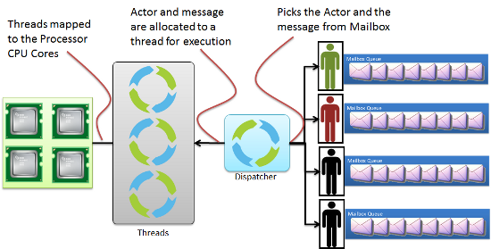

最近在写一个调度模块，所以调研了几个开源项目的调度模型。（这里指的是应用程序层面的调度，并不是操作系统层面的 scheduling）

先从 Akka 开始吧。

## 0. MessageDispatcher

> An Akka `MessageDispatcher` is what makes Akka Actors “tick”, it is the engine of the machine so to speak. All `MessageDispatcher` implementations are also an `ExecutionContext`, which means that they can be used to execute arbitrary code, for instance [Futures](https://doc.akka.io/docs/akka/current/futures.html).

Akka 的调度模块称为 MessageDispatcher，目前提供了三种：

*   **Dispatcher**

    基于事件将一组 Actors 绑定到一个线程池。

    *   Sharability: Unlimited
    *   Mailboxes: Any, creates one per Actor
    *   Use cases: Default dispatcher, Bulkheading
    *   Driven by: `java.util.concurrent.ExecutorService`. Specify using “executor” using “fork-join-executor”, “thread-pool-executor” or the FQCN of an `akka.dispatcher.ExecutorServiceConfigurator`.

*   **PinnedDispatcher**

    为每个 actor 指定唯一的执行线程。具体来说，每个 actor 有其自己的线程池，并且池中只有一个线程。

    *   Sharability: None
    *   Mailboxes: Any, creates one per Actor
    *   Use cases: Bulkheading
    *   Driven by: Any `akka.dispatch.ThreadPoolExecutorConfigurator`. By default a “thread-pool-executor”.

*   **CallingThreadDispatcher**

    当前线程执行 actor 调用，也就是说调度器不创建执行线程。  

    *   Sharability: Unlimited
    *   Mailboxes: Any, creates one per Actor per Thread (on demand)
    *   Use cases: Testing
    *   Driven by: The calling thread (duh)

其中有个几个名词需要解释一下：

1. Mailbox 就是 Actor 之间传递事件的队列，也就是每个 Actor 的收件箱。
2. ExecutorService 就是执行线程池，默认为 fork-join-executor，也可以自定义的实现，理解为 Java 标准的线程池即可。

ExecutorService、Actor、Mailbox、Dispatcher 之间的关系如下图所示：



## 1. 从入口开始

下面我们从一个简单的 Akka 示例程序开始追踪 MessageDispatcher 的逻辑。

```java
    package com.lightbend.akka.sample;

    import akka.actor.AbstractActor;
    import akka.actor.AbstractActor.Receive;
    import akka.actor.ActorRef;
    import akka.actor.ActorSystem;
    import akka.actor.Props;

    class PrintMyActorRefActor extends AbstractActor {
      @Override
      public Receive createReceive() {
        return receiveBuilder()
            .matchEquals("printit", p -> {
              ActorRef secondRef = getContext().actorOf(Props.empty(), "second-actor");
              System.out.println("Second: " + secondRef);
            })
            .build();
      }
    }
    public class ActorHierarchyExperiments {
      public static void main(String[] args) throws java.io.IOException {
        ActorSystem system = ActorSystem.create("testSystem");

        ActorRef firstRef = system.actorOf(Props.create(PrintMyActorRefActor.class), "first-actor");
        System.out.println("First: " + firstRef);
        firstRef.tell("printit", ActorRef.noSender());

        System.out.println(">>> Press ENTER to exit <<<");
        try {
          System.in.read();
        } finally {
          system.terminate();
        }
      }
    }
```

对于 Akka 程序首先需要初始化一个 ActorSystem，在执行完 `create("testSystem")` 之后，MessageDispatcher 也完成了初始化，并且开始调度 Actor 执行了。

顺着 `create("testSystem")` 方法调用，发现最终实例化了 `ActorSystemImpl`，并且执行了 `start()` 方法。

```scala
// akka-actor/src/main/scala/akka/actor/ActorSystem.scala

  /**
   * Scala API: Creates a new actor system with the specified name and settings
   * The core actor system settings are defined in [[BootstrapSetup]]
   */
  def apply(name: String, setup: ActorSystemSetup): ActorSystem = {
    val bootstrapSettings = setup.get[BootstrapSetup]
    val cl = bootstrapSettings.flatMap(_.classLoader).getOrElse(findClassLoader())
    val appConfig = bootstrapSettings.flatMap(_.config).getOrElse(ConfigFactory.load(cl))
    val defaultEC = bootstrapSettings.flatMap(_.defaultExecutionContext)

    new ActorSystemImpl(name, appConfig, cl, defaultEC, None, setup).start()
  }
```

默认情况下 `defaultEC` 为 `None`。

在 `ActorSystemImpl` 中就可以找到默认全局 dispatcher 的初始化过程。

```scala
// akka-actor/src/main/scala/akka/actor/ActorSystem.scala

  val dispatchers: Dispatchers = new Dispatchers(settings, DefaultDispatcherPrerequisites(
    threadFactory, eventStream, scheduler, dynamicAccess, settings, mailboxes, defaultExecutionContext))

  val dispatcher: ExecutionContextExecutor = dispatchers.defaultGlobalDispatcher
```

简而言之， `Dispatchers` 实现了“工厂模式”，根据不同的配置生成相应的 `MessageDispatcher`。

```scala
// akka-actor/src/main/scala/akka/dispatch/Dispatchers.scala

  /**
   * The one and only default dispatcher.
   */
  def defaultGlobalDispatcher: MessageDispatcher = lookup(DefaultDispatcherId)

  /**
   * Returns a dispatcher as specified in configuration. Please note that this
   * method _may_ create and return a NEW dispatcher, _every_ call.
   *
   * Throws ConfigurationException if the specified dispatcher cannot be found in the configuration.
   */
  def lookup(id: String): MessageDispatcher = lookupConfigurator(id).dispatcher()

  private def lookupConfigurator(id: String): MessageDispatcherConfigurator = {
    dispatcherConfigurators.get(id) match {
      case null ⇒
        // It doesn't matter if we create a dispatcher configurator that isn't used due to concurrent lookup.
        // That shouldn't happen often and in case it does the actual ExecutorService isn't
        // created until used, i.e. cheap.
        val newConfigurator =
          if (cachingConfig.hasPath(id)) configuratorFrom(config(id))
          else throw new ConfigurationException(s"Dispatcher [$id] not configured")

        dispatcherConfigurators.putIfAbsent(id, newConfigurator) match {
          case null     ⇒ newConfigurator
          case existing ⇒ existing
        }

      case existing ⇒ existing
    }
  }

```

默认全局 dispatcher 的 `id` 是 `akka.actor.default-dispatcher`，用户可以定义多个 dispatcher，每个 `id` 对应一个 `MessageDispatcherConfigurator`。

```scala
// akka-actor/src/main/scala/akka/dispatch/Dispatchers.scala

  /**
   * INTERNAL API
   */
  private[akka] def config(id: String): Config = {
    config(id, settings.config.getConfig(id))
  }

  /**
   * INTERNAL API
   */
  private[akka] def config(id: String, appConfig: Config): Config = {
    import scala.collection.JavaConverters._
    def simpleName = id.substring(id.lastIndexOf('.') + 1)
    idConfig(id)
      .withFallback(appConfig)
      .withFallback(ConfigFactory.parseMap(Map("name" → simpleName).asJava))
      .withFallback(defaultDispatcherConfig)
  }
```

每个 `id` 对应的配置可以在多个层面进行重写，我们暂且忽略配置相关的代码，以默认配置为例继续跟踪。


## 2. Dispatcher 初始化


### 2.1 构建 MessageDispatcherConfigurator

初始化 `MessageDispatcherConfigurator` 的逻辑在 `configuratorFrom` 方法中。

```scala
// akka-actor/src/main/scala/akka/dispatch/Dispatchers.scala

  private def configuratorFrom(cfg: Config): MessageDispatcherConfigurator = {
    if (!cfg.hasPath("id")) throw new ConfigurationException("Missing dispatcher 'id' property in config: " + cfg.root.render)

    cfg.getString("type") match {
      case "Dispatcher" ⇒ new DispatcherConfigurator(cfg, prerequisites)
      case "BalancingDispatcher" ⇒
        // FIXME remove this case in 2.4
        throw new IllegalArgumentException("BalancingDispatcher is deprecated, use a BalancingPool instead. " +
          "During a migration period you can still use BalancingDispatcher by specifying the full class name: " +
          classOf[BalancingDispatcherConfigurator].getName)
      case "PinnedDispatcher" ⇒ new PinnedDispatcherConfigurator(cfg, prerequisites)
      case fqn ⇒
        val args = List(classOf[Config] → cfg, classOf[DispatcherPrerequisites] → prerequisites)
        prerequisites.dynamicAccess.createInstanceFor[MessageDispatcherConfigurator](fqn, args).recover({
          case exception ⇒
            throw new ConfigurationException(
              ("Cannot instantiate MessageDispatcherConfigurator type [%s], defined in [%s], " +
                "make sure it has constructor with [com.typesafe.config.Config] and " +
                "[akka.dispatch.DispatcherPrerequisites] parameters")
                .format(fqn, cfg.getString("id")), exception)
        }).get
    }
  }
``` 

`type` 的默认值为 `Dispatcher`

```
/**
 * Configurator for creating [[akka.dispatch.Dispatcher]].
 * Returns the same dispatcher instance for for each invocation
 * of the `dispatcher()` method.
 */
class DispatcherConfigurator(config: Config, prerequisites: DispatcherPrerequisites)
  extends MessageDispatcherConfigurator(config, prerequisites) {

  private val instance = new Dispatcher(
    this,
    config.getString("id"),
    config.getInt("throughput"),
    config.getNanosDuration("throughput-deadline-time"),
    configureExecutor(),
    config.getMillisDuration("shutdown-timeout"))

  /**
   * Returns the same dispatcher instance for each invocation
   */
  override def dispatcher(): MessageDispatcher = instance
}
```

配置 executor 的逻辑在父类的 `configureExecutor` 中。

```scala
// akka-actor/src/main/scala/akka/dispatch/AbstractDispatcher.scala

  def configureExecutor(): ExecutorServiceConfigurator = {
    def configurator(executor: String): ExecutorServiceConfigurator = executor match {
      case null | "" | "fork-join-executor" ⇒ new ForkJoinExecutorConfigurator(config.getConfig("fork-join-executor"), prerequisites)
      case "thread-pool-executor"           ⇒ new ThreadPoolExecutorConfigurator(config.getConfig("thread-pool-executor"), prerequisites)
      case "affinity-pool-executor"         ⇒ new AffinityPoolConfigurator(config.getConfig("affinity-pool-executor"), prerequisites)

      case fqcn ⇒
        val args = List(
          classOf[Config] → config,
          classOf[DispatcherPrerequisites] → prerequisites)
        prerequisites.dynamicAccess.createInstanceFor[ExecutorServiceConfigurator](fqcn, args).recover({
          case exception ⇒ throw new IllegalArgumentException(
            ("""Cannot instantiate ExecutorServiceConfigurator ("executor = [%s]"), defined in [%s],
                make sure it has an accessible constructor with a [%s,%s] signature""")
              .format(fqcn, config.getString("id"), classOf[Config], classOf[DispatcherPrerequisites]), exception)
        }).get
    }

    config.getString("executor") match {
      case "default-executor" ⇒ new DefaultExecutorServiceConfigurator(config.getConfig("default-executor"), prerequisites, configurator(config.getString("default-executor.fallback")))
      case other              ⇒ configurator(other)
    }
  }
```

`executor` 默认为 `fork-join-executor`，其中的细节暂且忽略，理解为一个线程池即可。

### 2.2 构建 MessageDispatcher

`Dispatcher` 的初始化过程主要是创建执行线程池——`executorService`。

```
// akka-actor/src/main/scala/akka/dispatch/Dispatcher.scala

  private class LazyExecutorServiceDelegate(factory: ExecutorServiceFactory) extends ExecutorServiceDelegate {
    lazy val executor: ExecutorService = factory.createExecutorService
    def copy(): LazyExecutorServiceDelegate = new LazyExecutorServiceDelegate(factory)
  }

  @volatile private var executorServiceDelegate: LazyExecutorServiceDelegate =
    new LazyExecutorServiceDelegate(executorServiceFactoryProvider.createExecutorServiceFactory(id, threadFactory))

  protected final def executorService: ExecutorServiceDelegate = executorServiceDelegate

```

也就是通过传入的 `ExecutorServiceConfigurator` 创建对应的线程池工厂，然后通过 lazy 机制在使用时创建线程池。


## 3.  Dispatcher 使用

### 3.1 Actor 的 start()

继续追踪 ActorSystem  的 `create("testSystem")` 方法调用，下一步是 `start()` 方法。

```scala
// akka-actor/src/main/scala/akka/actor/ActorSystem.scala

  private lazy val _start: this.type = try {
    registerOnTermination(stopScheduler())
    // the provider is expected to start default loggers, LocalActorRefProvider does this
    provider.init(this)
    // at this point it should be initialized "enough" for most extensions that we might want to guard against otherwise
    _initialized = true

    if (settings.LogDeadLetters > 0)
      logDeadLetterListener = Some(systemActorOf(Props[DeadLetterListener], "deadLetterListener"))
    eventStream.startUnsubscriber()
    loadExtensions()
    if (LogConfigOnStart) logConfiguration()
    this
  } catch {
    case NonFatal(e) ⇒
      try terminate() catch { case NonFatal(_) ⇒ Try(stopScheduler()) }
      throw e
  }
```

无关的细节先忽略，关于 dispatcher 的重点在 `provider.init(this)` 中。

```
// akka-actor/src/main/scala/akka/actor/ActorRefProvider.scala

  private[akka] def init(_system: ActorSystemImpl) {
    system = _system
    rootGuardian.start()
    // chain death watchers so that killing guardian stops the application
    systemGuardian.sendSystemMessage(Watch(guardian, systemGuardian))
    rootGuardian.sendSystemMessage(Watch(systemGuardian, rootGuardian))
    eventStream.startDefaultLoggers(_system)
  }
```

这里涉及三个系统 Actor —— `rootGuardian`、`systemGuardian` 和 `guardian`。

首先启动 `rootGuardian`，实际上所有 Actor 的 `start()` 流程都是一致的。（Router略有不同，我们暂且忽略）

```scala
// akka-actor/src/main/scala/akka/actor/dungeon/Dispatch.scala

  /**
   * Start this cell, i.e. attach it to the dispatcher.
   */
  def start(): this.type = {
    // This call is expected to start off the actor by scheduling its mailbox.
    dispatcher.attach(this)
    this
  }
```

```scala
// akka-actor/src/main/scala/akka/dispatch/AbstractDispatcher.scala

  /**
   * Attaches the specified actor instance to this dispatcher, which includes
   * scheduling it to run for the first time (Create() is expected to have
   * been enqueued by the ActorCell upon mailbox creation).
   */
  final def attach(actor: ActorCell): Unit = {
    register(actor)
    registerForExecution(actor.mailbox, false, true)
  }
```

**注意：到了最核心的代码了 ——  `registerForExecution`**

```scala
// akka-actor/src/main/scala/akka/dispatch/Dispatcher.scala

  /**
   * Returns if it was registered
   *
   * INTERNAL API
   */
  protected[akka] override def registerForExecution(mbox: Mailbox, hasMessageHint: Boolean, hasSystemMessageHint: Boolean): Boolean = {
    if (mbox.canBeScheduledForExecution(hasMessageHint, hasSystemMessageHint)) { //This needs to be here to ensure thread safety and no races
      if (mbox.setAsScheduled()) {
        try {
          executorService execute mbox
          true
        } catch {
          case e: RejectedExecutionException ⇒
            try {
              executorService execute mbox
              true
            } catch { //Retry once
              case e: RejectedExecutionException ⇒
                mbox.setAsIdle()
                eventStream.publish(Error(e, getClass.getName, getClass, "registerForExecution was rejected twice!"))
                throw e
            }
        }
      } else false
    } else false
  }
```

1.  判断该 actor 是否可以调度执行
2. 设置该 actor 为 `Scheduled` 状态
3. 将该 actor 的 mbox 提交给线程池
4. 如果两次提交失败，那么将状态设置为 `Idle`

### 3.2 循环 registerForExecution

`rootGuardian.start()` 过程中的这次注册执行肯定是可以成功提交的，我们接着看 `Mailbox` 的 `run()` 方法。（对于提交失败的情况稍后再分析）

```scala
// akka-actor/src/main/scala/akka/dispatch/Mailbox.scala

  override final def run(): Unit = {
    try {
      if (!isClosed) { //Volatile read, needed here
        processAllSystemMessages() //First, deal with any system messages
        processMailbox() //Then deal with messages
      }
    } finally {
      setAsIdle() //Volatile write, needed here
      dispatcher.registerForExecution(this, false, false)
    }
  }
```

如果没有关闭，那么处理系统消息和收件箱。最后在 `finally` 中再一次调用了 dispatcher 的 `registerForExecution`。

如果始终可以成功注册执行的话，那么本质上就是一个处理队列消息的死循环了，**可以说是一个挺精巧的设计**。

但是 Akka 的调度模型**并没有优先级的概念**，只是依赖线程池的任务队列实现了FIFO；在**时间片**上做了一些控制，但是由于 JVM 没有提供协程，实际上也比较难精确控制。

```scala
// akka-actor/src/main/scala/akka/dispatch/Mailbox.scala

  /**
   * Process the messages in the mailbox
   */
  @tailrec private final def processMailbox(
    left:       Int  = java.lang.Math.max(dispatcher.throughput, 1),
    deadlineNs: Long = if (dispatcher.isThroughputDeadlineTimeDefined == true) System.nanoTime + dispatcher.throughputDeadlineTime.toNanos else 0L): Unit =
    if (shouldProcessMessage) {
      val next = dequeue()
      if (next ne null) {
        if (Mailbox.debug) println(actor.self + " processing message " + next)
        actor invoke next
        if (Thread.interrupted())
          throw new InterruptedException("Interrupted while processing actor messages")
        processAllSystemMessages()
        if ((left > 1) && ((dispatcher.isThroughputDeadlineTimeDefined == false) || (System.nanoTime - deadlineNs) < 0))
          processMailbox(left - 1, deadlineNs)
      }
    }

```

`processMailbox` 方法中实现了时间片控制：`throughput` 控制一次处理的消息条数，`throughputDeadlineTime` 控制一次处理的时间片，达到限制条件就让出线程，重新提交自己。

### 3.3 registerForExecution 失败

回过头来再看一下注册执行失败的情况：a. 不满足 `canBeScheduledForExecution` 条件；b. 被 Rejected 了两次。

对于不满足 `canBeScheduledForExecution` 条件的情况

```
  final def canBeScheduledForExecution(hasMessageHint: Boolean, hasSystemMessageHint: Boolean): Boolean = currentStatus match {
    case Open | Scheduled ⇒ hasMessageHint || hasSystemMessageHint || hasSystemMessages || hasMessages
    case Closed           ⇒ false
    case _                ⇒ hasSystemMessageHint || hasSystemMessages
  }

  /**
   * Set Scheduled status, keeping primary status as is.
   */
  @tailrec
  final def setAsScheduled(): Boolean = {
    val s = currentStatus
    /*
     * Only try to add Scheduled bit if pure Open/Suspended, not Closed or with
     * Scheduled bit already set.
     */
    if ((s & shouldScheduleMask) != Open) false
    else updateStatus(s, s | Scheduled) || setAsScheduled()
  }
```

不考虑异常状态，实际上只有队列中已经没有待处理消息了才不提交任务，此时不提交也是合适的，只是后续如果再来新消息应该主动注册执行。（这部分逻辑等到追踪发送消息代码时再分析）

对于被 Rejected 了两次的情况就比较麻烦了，如果队列中残存待处理的消息，而且又很久不再来新的消息，那么这部分残存的消息岂不是不能被处理了？

**在这种情况下，如果永远没有新消息，那么确实就永远无法处理残存的消息了，这是一种很极端的情况，通常消息都是源源不断的，但是在日志中看到 "registerForExecution was rejected twice!"，还是需要慎重对待的。**

### 3.4 sendSystemMessage

回到 `provider.init(this)` 方法，下一步是发送系统消息`systemGuardian.sendSystemMessage(Watch(guardian, systemGuardian))`。

```scala
// akka-actor/src/main/scala/akka/dispatch/Dispatcher.scala

  /**
   * INTERNAL API
   */
  protected[akka] def systemDispatch(receiver: ActorCell, invocation: SystemMessage): Unit = {
    val mbox = receiver.mailbox
    mbox.systemEnqueue(receiver.self, invocation)
    registerForExecution(mbox, false, true)
  }

```

将消息发送到对应 Actor 的收件箱之后，又调用了 `registerForExecution(mbox, false, true)` 方法，如此确保新来的消息有机会被处理。（也就是3.3节分析的问题）

## 4. actorOf 与 tell

通过以上的分析已经可以知晓 dispatcher 的原理与实现了，但是其中的调用只涉及系统 Actor，实际上普通 Actor 的调用也是一样的，下面简单看一下即可。

创建普通 Actor 的 `actorOf` 方法

```scala
// akka-actor/src/main/scala/akka/actor/ActorSystem.scala

  def actorOf(props: Props, name: String): ActorRef =
    if (guardianProps.isEmpty) guardian.underlying.attachChild(props, name, systemService = false)
    else throw new UnsupportedOperationException(
      s"cannot create top-level actor [$name] from the outside on ActorSystem with custom user guardian")
```

```
// akka-actor/src/main/scala/akka/actor/dungeon/Children.scala

  private[akka] def attachChild(props: Props, name: String, systemService: Boolean): ActorRef =
    makeChild(this, props, checkName(name), async = true, systemService = systemService)

  private def makeChild(cell: ActorCell, props: Props, name: String, async: Boolean, systemService: Boolean): ActorRef = {
    if (cell.system.settings.SerializeAllCreators && !systemService && props.deploy.scope != LocalScope)
      try {
        val ser = SerializationExtension(cell.system)
        props.args forall (arg ⇒
          arg == null ||
            arg.isInstanceOf[NoSerializationVerificationNeeded] ||
            {
              val o = arg.asInstanceOf[AnyRef]
              val serializer = ser.findSerializerFor(o)
              val bytes = serializer.toBinary(o)
              serializer match {
                case ser2: SerializerWithStringManifest ⇒
                  val manifest = ser2.manifest(o)
                  ser.deserialize(bytes, serializer.identifier, manifest).get != null
                case _ ⇒
                  ser.deserialize(bytes, arg.getClass).get != null
              }
            })
      } catch {
        case NonFatal(e) ⇒ throw new IllegalArgumentException(s"pre-creation serialization check failed at [${cell.self.path}/$name]", e)
      }
    /*
     * in case we are currently terminating, fail external attachChild requests
     * (internal calls cannot happen anyway because we are suspended)
     */
    if (cell.childrenRefs.isTerminating) throw new IllegalStateException("cannot create children while terminating or terminated")
    else {
      reserveChild(name)
      // this name will either be unreserved or overwritten with a real child below
      val actor =
        try {
          val childPath = new ChildActorPath(cell.self.path, name, ActorCell.newUid())
          cell.provider.actorOf(cell.systemImpl, props, cell.self, childPath,
            systemService = systemService, deploy = None, lookupDeploy = true, async = async)
        } catch {
          case e: InterruptedException ⇒
            unreserveChild(name)
            Thread.interrupted() // clear interrupted flag before throwing according to java convention
            throw e
          case NonFatal(e) ⇒
            unreserveChild(name)
            throw e
        }
      // mailbox==null during RoutedActorCell constructor, where suspends are queued otherwise
      if (mailbox ne null) for (_ ← 1 to mailbox.suspendCount) actor.suspend()
      initChild(actor)
      actor.start()
      actor
    }
  }
```

看到 `actor.start()` 就不需要继续向下看了。

发送消息的 `tell` 方法

```scala
// akka-actor/src/main/scala/akka/actor/dungeon/Dispatch.scala

  def sendMessage(msg: Envelope): Unit =
    try {
      val msgToDispatch =
        if (system.settings.SerializeAllMessages) serializeAndDeserialize(msg)
        else msg

      dispatcher.dispatch(this, msgToDispatch)
    } catch handleException
```

```scala
// akka-actor/src/main/scala/akka/dispatch/Dispatcher.scala

  /**
   * INTERNAL API
   */
  protected[akka] def dispatch(receiver: ActorCell, invocation: Envelope): Unit = {
    val mbox = receiver.mailbox
    mbox.enqueue(receiver.self, invocation)
    registerForExecution(mbox, true, false)
  }
```

又看到了熟悉的 `registerForExecution` 方法。

## 5. PinnedDispatcher

最后我们再看一下 PinnedDispatcher 如何实现独占线程的。

```scala
// akka-actor/src/main/scala/akka/dispatch/Dispatchers.scala

class PinnedDispatcherConfigurator(config: Config, prerequisites: DispatcherPrerequisites)
  extends MessageDispatcherConfigurator(config, prerequisites) {

  private val threadPoolConfig: ThreadPoolConfig = configureExecutor() match {
    case e: ThreadPoolExecutorConfigurator ⇒ e.threadPoolConfig
    case other ⇒
      prerequisites.eventStream.publish(
        Warning(
          "PinnedDispatcherConfigurator",
          this.getClass,
          "PinnedDispatcher [%s] not configured to use ThreadPoolExecutor, falling back to default config.".format(
            config.getString("id"))))
      ThreadPoolConfig()
  }
  /**
   * Creates new dispatcher for each invocation.
   */
  override def dispatcher(): MessageDispatcher =
    new PinnedDispatcher(
      this, null, config.getString("id"),
      config.getMillisDuration("shutdown-timeout"), threadPoolConfig)

}
```

与 `DispatcherConfigurator` 不同的是 `PinnedDispatcherConfigurator` 的 `dispatcher()` 方法每次都返回一个新的 dispatcher，也就是说每个 actor 都有一个私有的 dispatcher。

```scala
// akka-actor/src/main/scala/akka/dispatch/PinnedDispatcher.scala
class PinnedDispatcher(
  _configurator:     MessageDispatcherConfigurator,
  _actor:            ActorCell,
  _id:               String,
  _shutdownTimeout:  FiniteDuration,
  _threadPoolConfig: ThreadPoolConfig)
  extends Dispatcher(
    _configurator,
    _id,
    Int.MaxValue,
    Duration.Zero,
    _threadPoolConfig.copy(corePoolSize = 1, maxPoolSize = 1),
    _shutdownTimeout) {

  @volatile
  private var owner: ActorCell = _actor

  //Relies on an external lock provided by MessageDispatcher.attach
  protected[akka] override def register(actorCell: ActorCell) = {
    val actor = owner
    if ((actor ne null) && actorCell != actor) throw new IllegalArgumentException("Cannot register to anyone but " + actor)
    owner = actorCell
    super.register(actorCell)
  }
  //Relies on an external lock provided by MessageDispatcher.detach
  protected[akka] override def unregister(actor: ActorCell) = {
    super.unregister(actor)
    owner = null
  }
```

通过 `_threadPoolConfig.copy(corePoolSize = 1, maxPoolSize = 1)` 设置每个 dispatcher 中的线程池为一个独占的线程，所属 actor 的任务都是提交给这个私有的线程池。


***


**如果觉得我的文章对您有用，请随意打赏。**
