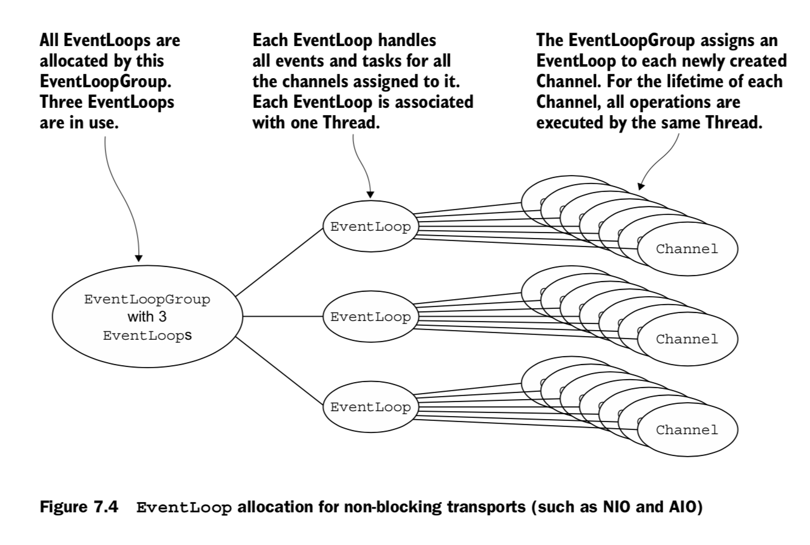
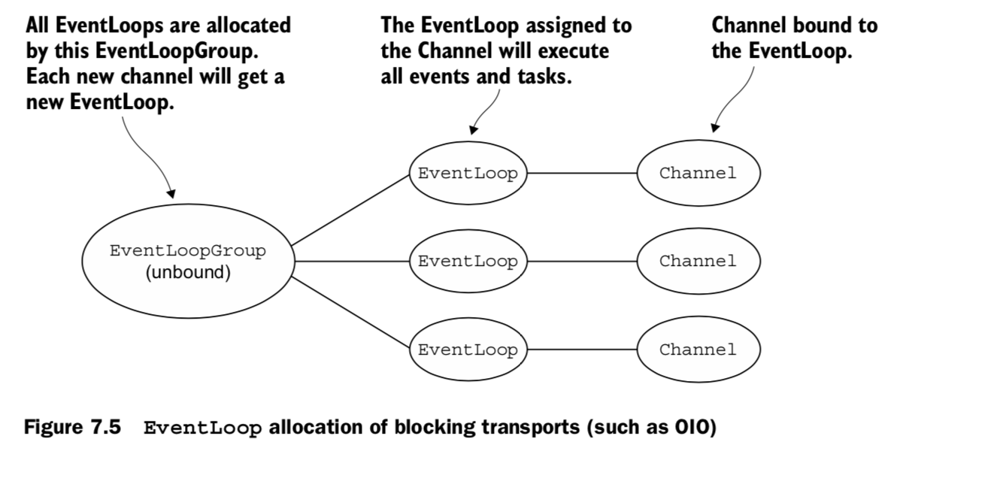
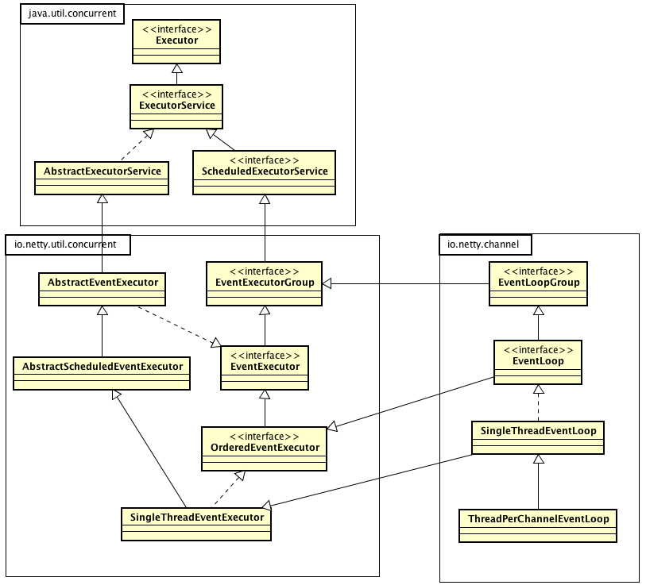
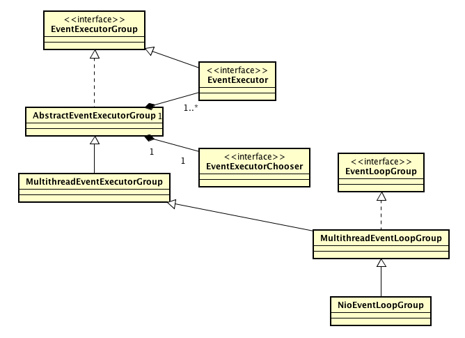
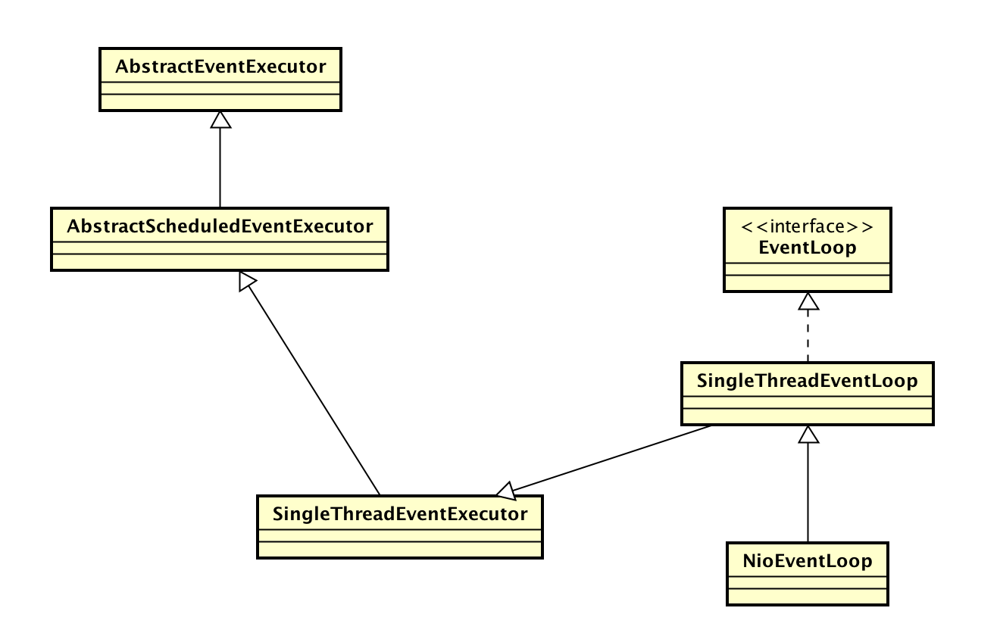
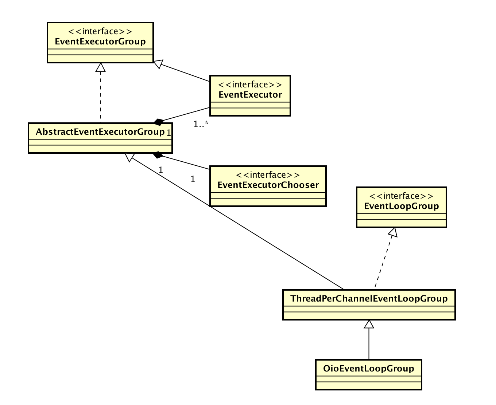

## 0. EventLoopGroup

Netty 的调度模块称为 EventLoopGroup，默认提供了 NioEventLoopGroup、OioEventLoopGroup 等多种实现。

我们首先通过<<Netty In Action>>中的两个配图对 EventLoopGroup 进行总体的认识：





简而言之，EventLoopGroup 包含一组 EventLoop，Channel 通过注册到 EventLoop 中执行操作。



Netty 的代码结构略微有点儿复杂，我们先通过类图对 EventLoop 有个基本认识。

1. Netty 的任务调度框架还是遵循了 java.util.concurrent 中 Executor 的接口
2. Netty 任务调度框架的实现在 io.netty.util.concurrent 包中，其接口是 EventExecutor 和 EventExecutorGroup。从命名可以看出任务调度是基于事件的。
3. io.netty.channel 包中 EventLoopGroup 和 EventLoop 基于 io.netty.util.concurrent 封装了 channel 执行的业务逻辑。

## 1. 从一个例子开始

```java
public final class EchoServer {

    static final boolean SSL = System.getProperty("ssl") != null;
    static final int PORT = Integer.parseInt(System.getProperty("port", "8007"));

    public static void main(String[] args) throws Exception {
        // Configure SSL.
        final SslContext sslCtx;
        if (SSL) {
            SelfSignedCertificate ssc = new SelfSignedCertificate();
            sslCtx = SslContextBuilder.forServer(ssc.certificate(), ssc.privateKey()).build();
        } else {
            sslCtx = null;
        }

        // Configure the server.
        EventLoopGroup bossGroup = new NioEventLoopGroup(1);
        EventLoopGroup workerGroup = new NioEventLoopGroup();
        final EchoServerHandler serverHandler = new EchoServerHandler();
        try {
            ServerBootstrap b = new ServerBootstrap();
            b.group(bossGroup, workerGroup)
             .channel(NioServerSocketChannel.class)
             .option(ChannelOption.SO_BACKLOG, 100)
             .handler(new LoggingHandler(LogLevel.INFO))
             .childHandler(new ChannelInitializer<SocketChannel>() {
                 @Override
                 public void initChannel(SocketChannel ch) throws Exception {
                     ChannelPipeline p = ch.pipeline();
                     if (sslCtx != null) {
                         p.addLast(sslCtx.newHandler(ch.alloc()));
                     }
                     //p.addLast(new LoggingHandler(LogLevel.INFO));
                     p.addLast(serverHandler);
                 }
             });

            // Start the server.
            ChannelFuture f = b.bind(PORT).sync();

            // Wait until the server socket is closed.
            f.channel().closeFuture().sync();
        } finally {
            // Shut down all event loops to terminate all threads.
            bossGroup.shutdownGracefully();
            workerGroup.shutdownGracefully();
        }
    }
}
```

我们从一个简单的 EchoServer 开始，追踪 NioEventLoopGroup 的初始化与使用。

## 2. NioEventLoopGroup 初始化



NioEventLoopGroup 初始化逻辑主要在 MultiThreadEventExecutorGroup 中。

```java
    protected MultithreadEventExecutorGroup(int nThreads, Executor executor,
                                            EventExecutorChooserFactory chooserFactory, Object... args) {
        if (nThreads <= 0) {
            throw new IllegalArgumentException(String.format("nThreads: %d (expected: > 0)", nThreads));
        }

        if (executor == null) {
            executor = new ThreadPerTaskExecutor(newDefaultThreadFactory());
        }

        children = new EventExecutor[nThreads];

        for (int i = 0; i < nThreads; i ++) {
            boolean success = false;
            try {
                children[i] = newChild(executor, args);
                success = true;
            } catch (Exception e) {
                // TODO: Think about if this is a good exception type
                throw new IllegalStateException("failed to create a child event loop", e);
            } finally {
                if (!success) {
                    for (int j = 0; j < i; j ++) {
                        children[j].shutdownGracefully();
                    }

                    for (int j = 0; j < i; j ++) {
                        EventExecutor e = children[j];
                        try {
                            while (!e.isTerminated()) {
                                e.awaitTermination(Integer.MAX_VALUE, TimeUnit.SECONDS);
                            }
                        } catch (InterruptedException interrupted) {
                            // Let the caller handle the interruption.
                            Thread.currentThread().interrupt();
                            break;
                        }
                    }
                }
            }
        }

        chooser = chooserFactory.newChooser(children);

        final FutureListener<Object> terminationListener = new FutureListener<Object>() {
            @Override
            public void operationComplete(Future<Object> future) throws Exception {
                if (terminatedChildren.incrementAndGet() == children.length) {
                    terminationFuture.setSuccess(null);
                }
            }
        };

        for (EventExecutor e: children) {
            e.terminationFuture().addListener(terminationListener);
        }

        Set<EventExecutor> childrenSet = new LinkedHashSet<EventExecutor>(children.length);
        Collections.addAll(childrenSet, children);
        readonlyChildren = Collections.unmodifiableSet(childrenSet);
    }
```

### a. children -- NioEventLoop

其中最关键的是 `children` 的初始化，其构建的逻辑包装在抽象方法 newChild 中。

对于 NioEventLoopGroup ，newChild 的具体实现：

```java
    @Override
    protected EventLoop newChild(Executor executor, Object... args) throws Exception {
        return new NioEventLoop(this, executor, (SelectorProvider) args[0],
            ((SelectStrategyFactory) args[1]).newSelectStrategy(), (RejectedExecutionHandler) args[2]);
    }
```

先看一下参数 executor，默认情况下是 ThreadPerTaskExecutor：

```java
public final class ThreadPerTaskExecutor implements Executor {
    private final ThreadFactory threadFactory;

    public ThreadPerTaskExecutor(ThreadFactory threadFactory) {
        if (threadFactory == null) {
            throw new NullPointerException("threadFactory");
        }
        this.threadFactory = threadFactory;
    }

    @Override
    public void execute(Runnable command) {
        threadFactory.newThread(command).start();
    }
}
```

也就是每个任务起一个单独的线程执行。

1. 参数 (SelectorProvider) args[0] 即为网络编程中的 Selector，这里暂且忽略。
2. 参数 ((SelectStrategyFactory) args[1]).newSelectStrategy() 用于控制上述 Selector 中选择循环的行为，这里也暂且忽略。
3. 参数 (RejectedExecutionHandler) args[2] 用于控制任务的拒绝策略，默认为抛出 RejectedExecutionException。



接着看 NioEventLoop 的构造方法，主要是网络编程中的 Selector 初始化，这里也暂且忽略，接着看父类中的构造方法。

1. SingleThreadEventLoop 中初始化了 tailTasks，也就是任务队列，默认为 LinkedBlockingQueue；
2. SingleThreadEventExecutor 中又初始化了一个任务队列 taskQueue；
3. SingleThreadEventExecutor 中的 addTaskWakesUp 默认为 false，用于标记添加任务是否会唤醒线程，具体的作用下面再分析。
4. AbstractEventExecutor 中的 parent 用于标记该 EventExecutor 属于哪个 EventExecutorGroup，按照继承关系也就是 EventLoop 属于哪个 EventLoopGroup。

### b. chooser -- EventExecutorChooser

还有 `chooser` 的初始化：

```java
    public EventExecutorChooser newChooser(EventExecutor[] executors) {
        if (isPowerOfTwo(executors.length)) {
            return new PowerOfTwoEventExecutorChooser(executors);
        } else {
            return new GenericEventExecutorChooser(executors);
        }
    }

    private static final class PowerOfTwoEventExecutorChooser implements EventExecutorChooser {
        private final AtomicInteger idx = new AtomicInteger();
        private final EventExecutor[] executors;

        PowerOfTwoEventExecutorChooser(EventExecutor[] executors) {
            this.executors = executors;
        }

        @Override
        public EventExecutor next() {
            return executors[idx.getAndIncrement() & executors.length - 1];
        }
    }
```

提供的 next() 方法用于从 `children` 中轮询选择 EventExecutor。

## 3. ServerBootstrap.bind

回过头来看 EchoServer 的代码，发现在 bind 方法中使用了 EventLoopGroup

```java
        ChannelFuture regFuture = config().group().register(channel);
```

从 config() 中取出的 group 是 `bossGroup`，调用了 register 方法注册 channel。（bossGroup 和 workerGroup 可以是一个，在 EchoServer 中是单独设置的）

具体实现在 MultithreadEventLoopGroup 中：

```java
    @Override
    public ChannelFuture register(Channel channel) {
        return next().register(channel);
    }
```

next 方法的具体实现在 MultithreadEventExecutorGroup 中：

```java
    @Override
    public EventExecutor next() {
        return chooser.next();
    }
```

也就是通过 `chooser` 从 `children` 中轮询选择一个 NioEventLoop。在 EchoServer 中设置的 bossGroup 线程数为 1，所以这里的 children 数量也是 1，选择的也就是初始化的那一个。

register 方法的实现在 SingleThreadEventLoop 中：

```
    @Override
    public ChannelFuture register(Channel channel) {
        return register(new DefaultChannelPromise(channel, this));
    }

    @Override
    public ChannelFuture register(final ChannelPromise promise) {
        ObjectUtil.checkNotNull(promise, "promise");
        promise.channel().unsafe().register(this, promise);
        return promise;
    }
```

继续跟 register 方法，在 AbstractChannel.AbstractUnsafe 中：

```java
        @Override
        public final void register(EventLoop eventLoop, final ChannelPromise promise) {
            if (eventLoop == null) {
                throw new NullPointerException("eventLoop");
            }
            if (isRegistered()) {
                promise.setFailure(new IllegalStateException("registered to an event loop already"));
                return;
            }
            if (!isCompatible(eventLoop)) {
                promise.setFailure(
                        new IllegalStateException("incompatible event loop type: " + eventLoop.getClass().getName()));
                return;
            }

            AbstractChannel.this.eventLoop = eventLoop;

            if (eventLoop.inEventLoop()) {
                register0(promise);
            } else {
                try {
                    eventLoop.execute(new Runnable() {
                        @Override
                        public void run() {
                            register0(promise);
                        }
                    });
                } catch (Throwable t) {
                    logger.warn(
                            "Force-closing a channel whose registration task was not accepted by an event loop: {}",
                            AbstractChannel.this, t);
                    closeForcibly();
                    closeFuture.setClosed();
                    safeSetFailure(promise, t);
                }
            }
        }
```

### a. inEventLoop

inEventLoop 方法用于判断当前执行线程是不是该 EventLoop 的线程。

### b. execute

将任务提交给 EventLoop 执行。

具体的实现在 SingleThreadEventExecutor 中：

```java
    @Override
    public void execute(Runnable task) {
        if (task == null) {
            throw new NullPointerException("task");
        }

        boolean inEventLoop = inEventLoop();
        addTask(task);
        if (!inEventLoop) {
            startThread();
            if (isShutdown() && removeTask(task)) {
                reject();
            }
        }

        if (!addTaskWakesUp && wakesUpForTask(task)) {
            wakeup(inEventLoop);
        }
    }
```

1. 将任务添加到 `taskQueue`，如果该 EventLoop 关闭了，或者队列满了，那么调用 rejectedExecutionHandler；
2. 如果调用线程不是该 EventLoop 的线程，那么尝试启动 EventLoop 线程；
3. addTaskWakesUp 默认为 false，如果该 task 不是 NonWakeupRunnable，那么尝试唤醒 EventLoop，也就是向 `taskQueue` 中添加一个 WAKEUP_TASK。

回过头来再详细看一下 startThread 方法：

```java
    private void startThread() {
        if (state == ST_NOT_STARTED) {
            if (STATE_UPDATER.compareAndSet(this, ST_NOT_STARTED, ST_STARTED)) {
                try {
                    doStartThread();
                } catch (Throwable cause) {
                    STATE_UPDATER.set(this, ST_NOT_STARTED);
                    PlatformDependent.throwException(cause);
                }
            }
        }
    }

    private void doStartThread() {
        assert thread == null;
        executor.execute(new Runnable() {
            @Override
            public void run() {
                thread = Thread.currentThread();
                if (interrupted) {
                    thread.interrupt();
                }

                boolean success = false;
                updateLastExecutionTime();
                try {
                    SingleThreadEventExecutor.this.run();
                    success = true;
                } catch (Throwable t) {
                    logger.warn("Unexpected exception from an event executor: ", t);
                } finally {
                    for (;;) {
                        int oldState = state;
                        if (oldState >= ST_SHUTTING_DOWN || STATE_UPDATER.compareAndSet(
                                SingleThreadEventExecutor.this, oldState, ST_SHUTTING_DOWN)) {
                            break;
                        }
                    }

                    // Check if confirmShutdown() was called at the end of the loop.
                    if (success && gracefulShutdownStartTime == 0) {
                        if (logger.isErrorEnabled()) {
                            logger.error("Buggy " + EventExecutor.class.getSimpleName() + " implementation; " +
                                    SingleThreadEventExecutor.class.getSimpleName() + ".confirmShutdown() must " +
                                    "be called before run() implementation terminates.");
                        }
                    }

                    try {
                        // Run all remaining tasks and shutdown hooks.
                        for (;;) {
                            if (confirmShutdown()) {
                                break;
                            }
                        }
                    } finally {
                        try {
                            cleanup();
                        } finally {
                            STATE_UPDATER.set(SingleThreadEventExecutor.this, ST_TERMINATED);
                            threadLock.release();
                            if (!taskQueue.isEmpty()) {
                                if (logger.isWarnEnabled()) {
                                    logger.warn("An event executor terminated with " +
                                            "non-empty task queue (" + taskQueue.size() + ')');
                                }
                            }

                            terminationFuture.setSuccess(null);
                        }
                    }
                }
            }
        });
    }
```

通过 CAS 操作 `state` 字段保证只启动一个线程，执行的主要逻辑是 SingleThreadEventExecutor.this.run()

```java
    @Override
    protected void run() {
        for (;;) {
            try {
                switch (selectStrategy.calculateStrategy(selectNowSupplier, hasTasks())) {
                    case SelectStrategy.CONTINUE:
                        continue;

                    case SelectStrategy.BUSY_WAIT:
                        // fall-through to SELECT since the busy-wait is not supported with NIO

                    case SelectStrategy.SELECT:
                        select(wakenUp.getAndSet(false));

                        // 'wakenUp.compareAndSet(false, true)' is always evaluated
                        // before calling 'selector.wakeup()' to reduce the wake-up
                        // overhead. (Selector.wakeup() is an expensive operation.)
                        //
                        // However, there is a race condition in this approach.
                        // The race condition is triggered when 'wakenUp' is set to
                        // true too early.
                        //
                        // 'wakenUp' is set to true too early if:
                        // 1) Selector is waken up between 'wakenUp.set(false)' and
                        //    'selector.select(...)'. (BAD)
                        // 2) Selector is waken up between 'selector.select(...)' and
                        //    'if (wakenUp.get()) { ... }'. (OK)
                        //
                        // In the first case, 'wakenUp' is set to true and the
                        // following 'selector.select(...)' will wake up immediately.
                        // Until 'wakenUp' is set to false again in the next round,
                        // 'wakenUp.compareAndSet(false, true)' will fail, and therefore
                        // any attempt to wake up the Selector will fail, too, causing
                        // the following 'selector.select(...)' call to block
                        // unnecessarily.
                        //
                        // To fix this problem, we wake up the selector again if wakenUp
                        // is true immediately after selector.select(...).
                        // It is inefficient in that it wakes up the selector for both
                        // the first case (BAD - wake-up required) and the second case
                        // (OK - no wake-up required).

                        if (wakenUp.get()) {
                            selector.wakeup();
                        }
                        // fall through
                    default:
                }

                cancelledKeys = 0;
                needsToSelectAgain = false;
                final int ioRatio = this.ioRatio;
                if (ioRatio == 100) {
                    try {
                        processSelectedKeys();
                    } finally {
                        // Ensure we always run tasks.
                        runAllTasks();
                    }
                } else {
                    final long ioStartTime = System.nanoTime();
                    try {
                        processSelectedKeys();
                    } finally {
                        // Ensure we always run tasks.
                        final long ioTime = System.nanoTime() - ioStartTime;
                        runAllTasks(ioTime * (100 - ioRatio) / ioRatio);
                    }
                }
            } catch (Throwable t) {
                handleLoopException(t);
            }
            // Always handle shutdown even if the loop processing threw an exception.
            try {
                if (isShuttingDown()) {
                    closeAll();
                    if (confirmShutdown()) {
                        return;
                    }
                }
            } catch (Throwable t) {
                handleLoopException(t);
            }
        }
    }
```

也就是执行 NIO 的逻辑，接着在 runAllTasks 方法中处理 `taskQueue` 和 `tailTasks`。

再回过头来看一下 `addTaskWakesUp`，由于 NioEventLoop 阻塞的地方是 select，所以添加任务无法立即唤醒线程，因此 addTaskWakesUp 为 false。

回到 AbstractChannel.AbstractUnsafe 中的 register 方法，线程启动之后就会开始处理提交的 register0 任务。

至于 bind 过程中 bossGroup 执行的其他任务，这里就暂且忽略了。

## 4. ServerBootstrapAcceptor.channelRead

bossGroup 执行的 Selector 收到 ACCEPT 事件之后，就会通过 pipeline 调用到 ServerBootstrapAcceptor 的 channelRead 方法。

```java
        @Override
        @SuppressWarnings("unchecked")
        public void channelRead(ChannelHandlerContext ctx, Object msg) {
            final Channel child = (Channel) msg;

            child.pipeline().addLast(childHandler);

            setChannelOptions(child, childOptions, logger);

            for (Entry<AttributeKey<?>, Object> e: childAttrs) {
                child.attr((AttributeKey<Object>) e.getKey()).set(e.getValue());
            }

            try {
                childGroup.register(child).addListener(new ChannelFutureListener() {
                    @Override
                    public void operationComplete(ChannelFuture future) throws Exception {
                        if (!future.isSuccess()) {
                            forceClose(child, future.cause());
                        }
                    }
                });
            } catch (Throwable t) {
                forceClose(child, t);
            }
        }
```

在该方法中传入的参数 msg 实际上是 NioSocketChannel，这里将会把 socket 读写和对应的 handler 处理注册到 `workerGroup` 中执行。

注册的流程跟上述 bossGroup 的注册流程是一样的。


## 5. OioEventLoopGroup

对照着 NioEventLoopGroup，再来看一下 OioEventLoopGroup



### a. newChild

关键的 newChild 方法的实现在 ThreadPerChannelEventLoopGroup 中：

```java
    /**
     * Creates a new {@link EventLoop}.  The default implementation creates a new {@link ThreadPerChannelEventLoop}.
     */
    protected EventLoop newChild(@SuppressWarnings("UnusedParameters") Object... args) throws Exception {
        return new ThreadPerChannelEventLoop(this);
    }
```

生成的是 ThreadPerChannelEventLoop，该类也是继承 SingleThreadEventLoop。

### b. register

```
    @Override
    public ChannelFuture register(Channel channel) {
        if (channel == null) {
            throw new NullPointerException("channel");
        }
        try {
            EventLoop l = nextChild();
            return l.register(new DefaultChannelPromise(channel, l));
        } catch (Throwable t) {
            return new FailedChannelFuture(channel, GlobalEventExecutor.INSTANCE, t);
        }
    }
```

注册 channel 的时候不是通过 chooser 选择，其原因是 children 不是在构造方法中生成好的。

看一下 nextChild 方法：

```
    private EventLoop nextChild() throws Exception {
        if (shuttingDown) {
            throw new RejectedExecutionException("shutting down");
        }

        EventLoop loop = idleChildren.poll();
        if (loop == null) {
            if (maxChannels > 0 && activeChildren.size() >= maxChannels) {
                throw tooManyChannels;
            }
            loop = newChild(childArgs);
            loop.terminationFuture().addListener(childTerminationListener);
        }
        activeChildren.add(loop);
        return loop;
    }
```

这里通过 `activeChildren` 和 `idleChildren` 两个集合动态管理 EventLoop。

### c. ThreadPerChannelEventLoop

ThreadPerChannelEventLoop 的 run 方法很简单纯粹，就是从队列中取任务，然后执行。

```java
    @Override
    protected void run() {
        for (;;) {
            Runnable task = takeTask();
            if (task != null) {
                task.run();
                updateLastExecutionTime();
            }

            Channel ch = this.ch;
            if (isShuttingDown()) {
                if (ch != null) {
                    ch.unsafe().close(ch.unsafe().voidPromise());
                }
                if (confirmShutdown()) {
                    break;
                }
            } else {
                if (ch != null) {
                    // Handle deregistration
                    if (!ch.isRegistered()) {
                        runAllTasks();
                        deregister();
                    }
                }
            }
        }
    }
```

由于阻塞的位置是 taskQueue.take()，所以 `addTaskWakesUp` 为 true。

## 6. AbstractScheduledEventExecutor

从类图的继承关系上来看，EventLoop 在 AbstractScheduledEventExecutor 中还支持定时任务。

其代码的核心是一个优先级队列：

```java
    PriorityQueue<ScheduledFutureTask<?>> scheduledTaskQueue() {
        if (scheduledTaskQueue == null) {
            scheduledTaskQueue = new DefaultPriorityQueue<ScheduledFutureTask<?>>(
                    SCHEDULED_FUTURE_TASK_COMPARATOR,
                    // Use same initial capacity as java.util.PriorityQueue
                    11);
        }
        return scheduledTaskQueue;
    }
```

将需要定时执行的任务添加到基于时间的优先级队列中：

```java
    <V> ScheduledFuture<V> schedule(final ScheduledFutureTask<V> task) {
        if (inEventLoop()) {
            scheduledTaskQueue().add(task);
        } else {
            execute(new Runnable() {
                @Override
                public void run() {
                    scheduledTaskQueue().add(task);
                }
            });
        }

        return task;
    }
```

在 SingleThreadEventExecutor 的事件循环中，将到达时间的任务 poll 出来，然后添加到任务队列等待执行。

```java
    private boolean fetchFromScheduledTaskQueue() {
        long nanoTime = AbstractScheduledEventExecutor.nanoTime();
        Runnable scheduledTask  = pollScheduledTask(nanoTime);
        while (scheduledTask != null) {
            if (!taskQueue.offer(scheduledTask)) {
                // No space left in the task queue add it back to the scheduledTaskQueue so we pick it up again.
                scheduledTaskQueue().add((ScheduledFutureTask<?>) scheduledTask);
                return false;
            }
            scheduledTask  = pollScheduledTask(nanoTime);
        }
        return true;
    }
```
